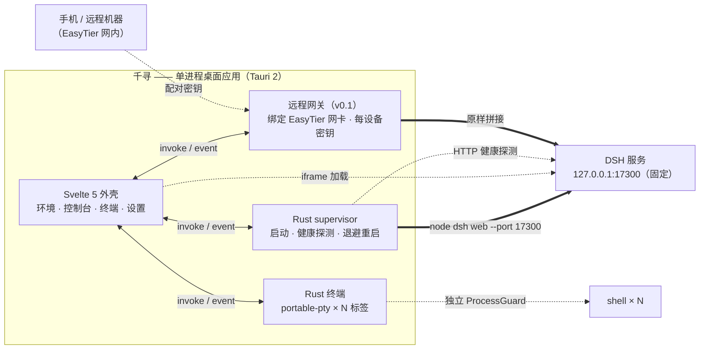

# 02 · 技术架构

状态：草案 v1（待确认）

## 1. 总体架构



工程上有两条底线，后续所有设计不得破坏：

1. **DSH 界面由 DSH 自己的服务提供**，千寻只负责进程托管与 iframe 承载；扩展 DSH 行为走 DSH 插件系统；
2. **进程回收交给内核**：DSH 与每个终端会话各在自己的 Job Object / 进程组里，强杀外壳也不留孤儿。

## 2. 技术栈

| 层                  | 选型                                                                                                                                                  | 说明                            |
| ------------------- | ----------------------------------------------------------------------------------------------------------------------------------------------------- | ------------------------------- |
| 桌面框架            | Tauri 2                                                                                                                                               | WebView2（Windows 优先）        |
| 前端                | Svelte 5（runes）+ Vite + TypeScript                                                                                                                  | 普通 SPA，不用 SvelteKit        |
| 样式                | Tailwind 4                                                                                                                                            | 设计 token 集中在 `lib/design/` |
| 图标                | @lucide/svelte                                                                                                                                        |                                 |
| 状态                | Svelte 5 runes（`$state`/`$derived`）                                                                                                                 | 不引入额外状态库                |
| 测试                | vitest（前端）· cargo test（Rust）                                                                                                                    |                                 |
| 终端                | @xterm/xterm 6 + fit/**webgl**                                                                                                                        | GPU 渲染保证性能                |
| PTY                 | portable-pty（Rust，wezterm 的 PTY 层）                                                                                                               | 自研集成（wezterm 同款方案）    |
| 截屏（v0.1）        | xcap（Rust）+ konva（标注画布）                                                                                                                       |                                 |
| 搜索（v0.1 已交付） | 文件名 fuzzy：`fff-search` · 内容 grep：`fff-grep`（同属 [fff](https://github.com/dmtrKovalenko/fff)，共享常驻索引，Ai 模式内置忽略 node_modules 等） |                                 |
| 移动壳（v0.1）      | Capacitor                                                                                                                                             | 包远程 URL，不做本地逻辑        |

## 3. 仓库结构

```
qianxun/
  src/                      # Svelte 前端
    lib/
      ipc/                  # contract.ts（IPC 合同唯一来源）+ invoke 封装
      design/               # 主题 token、基础样式
      utils/                # 纯函数工具（可测试）
    stores/                 # runes 状态模块，按域划分（harness/terminal/settings…）
    features/               # 功能域，域内自治（见编码规范 §2）
      env/      harness/    console/    terminal/    settings/
    components/             # 跨域通用 UI（Button/Dialog/Tabs/…）
    App.svelte
  src-tauri/
    src/
      main.rs  lib.rs
      settings.rs  paths.rs  error.rs  logging.rs
      tray.rs  window.rs  single_instance.rs
      node/                 # Node 检测与安装
      harness/              # supervisor / health / readiness / install
      search/               # fff-search + fff-grep 封装
      shots/                # 截屏捕获 / 热键 / Pin 窗管理
      terminal/             # PTY 会话管理
      remote/               # 网关
    crates/
      proc-guard/           # 进程树回收（移植）
      node-runtime/         # Node 探测（移植）
  docs/
```

规则：`features/*` 之间禁止互相 import，跨域复用下沉到 `components/` 或 `lib/`（详见编码规范）。

## 4. 子系统设计

### 4.1 设置系统

设置持久化在 `<应用数据目录>/settings.json`，带 `schemaVersion`，升级时做迁移。
Rust 侧为唯一读写者（原子写：临时文件 + rename），前端通过 IPC 读写。

```jsonc
{
  "schemaVersion": 1,
  "dsh": {
    "port": 17300, // 固定端口（ADR-002）；10000 为保留端口，校验时专门提示
    "allowRandomFallback": false, // 端口被占时是否允许换随机端口，默认禁止、显式报错
    "versionStrategy": "pinned", // pinned=安装验证过的精确版本 | existing=使用本机已有 dsh
    "autostart": true, // 随千寻启动自动拉起 DSH
    "home": "isolated", // isolated=应用数据目录下独立 DSH_HOME（ADR-009） | system=~/.dsh
  },
  "mirrors": {
    "nodeBinary": "auto", // auto=官方优先失败落 npmmirror | official | npmmirror
    "npmRegistry": "npmmirror", // official | npmmirror | 自定义 URL
  },
  "window": { "closeToTray": true, "startMinimized": false },
  "hotkeys": {
    // 全局快捷键（ADR-010）；注册失败=冲突，UI 显式提示
    "screenshot": "Alt+A",
  },
  "terminal": {
    "shell": "powershell", // powershell | cmd | 自定义可执行路径
    "fontFamily": "",
    "fontSize": 14,
    "scrollback": 10000,
    "theme": "follow",
  },
  "remote": {
    "enabled": false,
    "bindAddress": "", // 从本机网卡列表选择，EasyTier 网卡会出现在这里
    "port": 17400,
  },
}
```

### 4.2 DSH 托管（supervisor）

DSH 进程模型如下，**端口与 HOME 策略按 ADR-002/009 改造**：

1. **启动**：以 `node <prefix>/dsh web --port <settings.dsh.port>` 拉起，
   环境注入 `DSH_HOME=<千寻数据目录>/dsh-home`（`home: isolated` 时，ADR-009），
   进程进入 `proc-guard`（Windows Job Object，`KILL_ON_JOB_CLOSE`）；
2. **就绪确认**：仍解析就绪行。固定端口下解析结果用于**校验**（服务报告的端口必须等于配置端口），
   不一致视为异常并报错——防止"以为在 A 端口、实际在 B 端口"的错位；
3. **端口冲突**：绑定失败时**显式报错**，错误面板给出：占用进程提示、
   「更换端口并重启」「允许本次随机端口（需在设置里开 fallback）」两个动作；
   端口 10000 被外部实例占用属正常现状，提示文案专门说明而非报"未知占用"；
4. **健康探测**：每 10 秒对 `127.0.0.1:<port>` 发真实 HTTP 请求，连续 3 次无响应判定僵死，
   回收重启（含退避）；重启后 iframe 自动重连；
5. **停止/启动**：控制台提供手动启停；`autostart=false` 时启动千寻不拉起 DSH，只显示"已停止"；
6. **进程边界（ADR-011）**：停止/重启/回收**只作用于千寻自己 spawn 的进程树**
   （proc-guard 句柄在手者）；绝不按进程名、命令行或端口去杀任何非自有进程——
   与外部常驻 DSH 实例安全共存；
7. **接管模式**：端口已被一个健康的 DSH 占用时，提供「接管」——千寻只做探测与 iframe
   承载，不拥有进程、不提供启停（用于配合手动 `dsh` 开发调试场景）。

### 4.3 多标签终端（v0.1 已交付）

后端（Rust `terminal/`，portable-pty 0.9，全自研）：

- 每会话两线程：读泵（8KB 块 → `terminal://output`，lossy UTF-8）+ 退出监视
  （`child.wait` → **先 emit `terminal://exit` 再清理会话表**——conpty 上
  drop(master) 可能阻塞在读端关闭上，emit 前置保证 UI 收尾不受收尾慢影响）；
- 会话表 `TerminalState: Mutex<HashMap<id, Session>>`，`AtomicU64` 发号；
  正常退出时 shell 死 → conpty 关管道 → 读泵自然 EOF 退出；
  强杀标签（terminal_kill = drop master）在读泵上可能留下阻塞线程，
  随宿主进程退出回收（已知限制，记 ADR 待办）；
- **conpty 实战坑（集成测试固化）**：握手会发 `ESC[6n`（4 字节 DSR 查询），
  消费端必须回 `ESC[row;colR`，否则 cmd 系 shell 挂起等应答——生产路径由
  xterm 自动应答，验收测试显式回；测试收尾用 try_wait 轮询 + 不 join 读线程
  （ClosePseudoConsole ↔ reader 管道互等，强收必死锁）。真实回环实测 113ms。

前端（Svelte 5 + xterm 6）：

- **每个标签一个 PTY 会话 + 一个 xterm 实例**（TerminalPane 组件）；
  标签切换 CSS 隐藏保活（不销毁实例，回滚与进程状态保留）；
  关闭运行中标签需确认（terminal_kill → exit 事件收尾）；
- 渲染 **webgl addon**（GPU），初始化失败自动降级 DOM 渲染；
  fit addon + ResizeObserver → terminal_resize 回传 PTY；
  标题随 shell 的 OSC 序列更新（onTitleChange）；
- 设置项（settings.terminal，新建标签生效）：shell（auto = pwsh 优先/
  powershell/pwsh/cmd 显式可选）、字号（8–32）、回滚行数（100–100k）；
- 性能预算（验收标准，待真机人工跑）：`cat` 50MB 文本不卡 UI；
  粘贴 1MB 不丢字符；8 标签内存增量 < 400MB。

### 4.4 环境检测与安装（v0.1 已交付）

- **Node**：`node-runtime` crate 全盘探测（含 nvm/fnm/Volta 等不在 PATH 的安装），
  满足最低版本（22.19+）者取最新；未检测到 → 检测行即安装按钮；
  下载源按 `mirrors.nodeBinary`：`auto`（官方优先，失败落 npmmirror）/ 强制官方 / 强制 npmmirror，
  安装前核对 SHA-256，落在应用数据目录，不动 PATH；
- **DSH**：未检测到 → 检测行即安装按钮；**安装走 pnpm**（千寻自带 `pnpm@11.7.0`，
  先由 npm 落进 `pnpm-tool/` 幂等复用）：DSH 依赖树带 peer 链（如 cordis-plugin-group），
  npm 全新求解要么组合爆炸（React 18/19 peer 链）要么丢 peer，pnpm 的
  auto-install-peers 是唯一被验证可正确装出运行时的路线；registry 按
  `mirrors.npmRegistry`（默认 npmmirror，即淘宝源）；原生构建脚本
  （koffi/node-pty 等）经 `pnpm-workspace.yaml` 的 `allowBuilds` 白名单放行；
- **事务形态是「备份 → 直装 live → 校验 → 清理」**，不再有 staging：pnpm 的
  node_modules 是**绝对路径 junction**，装好的目录一旦整体 rename 全部断链；
  而备份里的 junction 指向 live 路径，还原 rename 回 live 恰好自洽。崩溃恢复
  从 live/backup/journal 的真实状态推导，无阶段字段可撒谎；
- 安装过程输出实时进日志控制台；失败给出可重试的错误，不半死不活。

### 4.5 远程网关（v0.1 已交付）

- **唯一跨网通道是 EasyTier 虚拟局域网**（ADR-003）：不做任何公网中转与端口映射；
- **全自研网关**（`remote/`，axum 0.8）：绑定地址从
  本机网卡列表选择（if-addrs 枚举，EasyTier 网卡按名识别置顶），端口可配置
  （默认 17400）；
- 安全模型：DSH 始终只绑回环；`/qx-gate?token=…` 唯一免鉴权入口
  （校验 256bit 设备 token → HttpOnly cookie → 302 /）；其余路径
  cookie/query 鉴权，未命中未吊销 token 一律 401；
  `remote.enabled=false`（默认）零监听（任务根本不启动）；
- 流量面：`/api/*` 与静态页经 reqwest 流式转发（SSE 响应逐块回写）；
  `/api/events.mux` / `/api/events.host` 两条 WS 下行帧级双向桥
  （axum ↔ tokio-tungstenite，帧类型逐字段换装）；
- 配对：设置页生成设备记录（可读 id + token）+ URL 二维码（前端 qrcode）；
  吊销 = token 标记失效 + 网关重建（点「应用」即时全断）；
- 生命周期：设置更新、DSH 就绪/停止事件均触发幂等 sync（配置没变则
  原地保留；DSH 未跑时网关照常监听，请求得到「上游不可达」提示页）；
- 手机侧 URL = `http://<Host 的 EasyTier IP>:17400/qx-gate?token=…`，
  扫码配对后 cookie 常驻，固定地址可用；EasyTier IP 变化只需重选绑定。

### 4.6 DSH 插件桥（v0.1 已交付）

`qx-bridge`：零依赖纯 ESM 插件（不走独立仓库/super-injector 生产线——
源内嵌千寻二进制，include_str! 落盘到
`<DSH_HOME>/profiles/web/node_modules/qx-bridge/`，profile 的
`cordis.patch.yml` 追加根 insert 条目；node 就地解析，无 junction、无构建）：

- **agent 工具**：note_search / note_read / note_write——直接读写笔记库，
  frontmatter 语义与 Rust 侧逐字一致；原生 JSON Schema 参数（register 端
  只验 output.schema，零依赖可行）；systemPrompt.section 教用法；
- **AI 整理**：webServer 注册 `POST /qx/notes/organize`（exact 路由 +
  CORS），服务端组 prompt → `llm.stream()`（provider 取第一个注册适配器，
  默认 deepseek-chat；text-delta 聚合，finish.error 冒泡）；
  千寻前端 fetch DSH origin 跨源调用（CSP connect-src 放行 127.0.0.1:*）；
  本期不做共享 token（回环 + 个人机器，移动端接入时再引入鉴权）；
- **部署器（Rust bridge/）**：deploy 幂等（文件覆盖 = 升级即随千寻走）、
  patch 三态文本级维护（`[]`→模板 / 已有条目→换 vault 行 / 其他→追加，
  单测固化）、status 三处事实核对（文件/条目/vault 一致）、启动自愈
  （patch 有条目但文件被 DSH 重装清掉 → 静默补齐）；
- **实测（2026-09-03，本机同源注入验证）**：fiber 激活、
  三工具进 agent 工具表与系统提示、OPTIONS 204、真实 deepseek-chat
  整理调用返回中文结果；已知边界——DSH 运行中部署需重启加载；
  organize 的 provider 选择在多适配器下取首个（DSH 只配一个即无感）。

### 4.7 移动端 Capacitor（v0.1 骨架）

- Capacitor 工程只做"壳"：加载网关 URL、全屏 WebView、安全区适配、深色跟随；
- Android 允许明文 HTTP 仅限 EasyTier 网段（`networkSecurityConfig` 限定 domain）；
- 不在移动端实现任何业务逻辑——业务都在 Host 的 DSH 与 bridge 插件里。

### 4.8 同步（v0.1 第一阶段）

- 个人数据（笔记库目录、截图目录）保持纯文件，第一优先走文件同步盘/git；
- DSH 侧选择性同步：`settings.yaml` 与 profiles 白名单（`.credentials.yaml` **永不明文同步**）；
- 如需实时同步，做 hub 形态的同步插件，各 Host 经 EasyTier 与 hub 收发——不需要独立 server 项目。

### 4.9 搜索（v0.1 已交付，两个独立页面）

左侧导航两个独立入口：**文件搜索页（找文件）**与**内容搜索页（搜内容）**——
用户明确要求分开，不共用一个页面的模式切换。

引擎选型落地：`fff-search = 0.10.6` + `fff-grep = 0.10.6`（MIT，同一 crate 家族，
共享同一份常驻索引——一次扫描同时喂两个页面）。已交付形态：

- **常驻索引**（Rust `search/`）：`FilePicker::new_with_shared_state` 以 `FFFMode::Ai`
  建后台扫描 + 文件 watcher 的常驻索引，挂在 AppState（`SearchState`：picker + 根目录 +
  generation + 取消令牌）。换根 = 重建索引（同根幂等）；扫描进度走 `search_status` 轮询
  （300ms，扫描结束自动停表），不做事件通道；
- **文件搜索页**：fuzzy 匹配（fff Ai 模式打分）、输入防抖 80ms、字节偏移区间高亮
  （Rust 侧给 UTF-8 字节偏移，前端 `sliceByByteOffsets` 换算字符下标）、匹配分数、
  在资源管理器中定位（`tauri-plugin-opener`，capabilities 显式授权）；
- **内容搜索页**：固定串/正则（`GrepMode`）、智能大小写、前后上下文行（0–10 可调）、
  按文件分组 + 每文件命中计数、行号对齐渲染、结果高亮、**取消令牌接力**
  （新搜索自动取消上一次，取消按钮走 `search_cancel`）、`nextFileOffset` 分页游标
  （大目录「继续搜索后续文件」续页，3s 时间预算/页）；
- **根目录历史**：`settings.search.rootHistory`（最近优先去重，上限 8，datalist 供选择）；
- fff 的 Ai 模式内置忽略规则（node_modules/.git/target 等）自动生效，无需配置排除目录。

**设计变更记录**（相对本节初版设计稿）：plain/regex 文件名三模式热切换、整词、
包含/排除 glob、文件预览窗格——fff 引擎不直接暴露这些旋钮或与常驻索引形态不匹配，
降级为后续打磨项（0.1.x，按需再评估换 query 模式或自研过滤层）。

**性能实测**（2026-09-03，`大目录索引与首屏性能` #[ignore] 测试，自造 500×200 树）：
10 万文件全量索引 **1.70s**（一次，之后增量），fuzzy 首屏（命中 14500 条）
**85.8ms**——验收线 1s 大幅达标。内容搜索吞吐与 rg 同数量级（fff 内部即 rg 引擎）。

### 4.10 截屏与快捷键管理（对齐微信，ADR-010）

**触发**：全局快捷键（默认 `Alt+A`，微信习惯），任何应用持有键盘时可用。
快捷键管理落在设置页：录制式输入框（按下即捕获）、保存时注册验证、
冲突（注册失败）显式提示并提供候选。

**流程**（Snipaste/微信式五步）：

1. **冻结屏幕**：xcap 先捕获全屏（各显示器各一张），立即弹全屏无边框置顶覆盖窗
   （每显示器一窗，透明背景显示冻结画面）——冻结感 = 后续操作与桌面实时变化解耦；
2. **区域选择**：十字光标 + 拖框选区（可随后拖边缘微调、拖内部移动），
   选区外暗化（半透明遮罩）、选区边框高亮、尺寸提示（W×H）；
3. **标注工具栏**（选区确定后浮现，自动避让屏幕边缘）：
   矩形 / 椭圆 / 箭头 / 画笔（自由绘制）/ 马赛克（像素化块，笔刷大小可调）/ 文字
   （点击定位、直接键入）/ 撤销 / 重做；颜色与线宽可调（微信默认集：红/黄/蓝/绿/黑/白）；
4. **产出**：复制到剪贴板（默认）/ 保存到截图目录（可配置，默认 图片库\千寻截屏，
   文件名 `qx-YYYYMMDD-HHmmss.png`）/ 贴图 Pin（无边框置顶小窗显示截图，
   可拖动、滚轮缩放、双击或 Esc 关闭）/ Esc 全程取消；
5. **多显示器**：当前支持主显示器全流程，副屏冻结显示 + 选区（标注/贴图同流程）；
   超出选区拖动到另一屏的场景记入后续演进。

**实现形态**（已交付，含与设计稿的差异）：

- 标注画布是**原生 Canvas 2D**（不用 konva）：标注模型是普通 Shape 数组
  （rect/ellipse/arrow/pen/mosaic/text），全量重绘 + 撤销/重做栈；马赛克 =
  底图缩到 1/14 再禁用平滑放大（块状像素），纯前端无 Rust 依赖；
- 覆盖窗是独立 Tauri window（`decorations:false, alwaysOnTop, skipTaskbar,
shadow:false`），每显示器一窗（xcap 各屏一张冻结帧，物理坐标/DPI 换算定位），
  承载同一 bundle 的 `#/overlay` hash 路由（main.ts 分流，不引路由库）；
  底图经 asset protocol（scope `$TEMP/qx-shots/**`）加载；
- 贴图 Pin 同理是独立小窗（`#/pin?path=…`），加载后按图片逻辑尺寸自适应
  （cap 屏 70%），drag-region 拖动、滚轮缩放、双击/Esc 关闭；
- 产出：复制走 `tauri-plugin-clipboard-manager`（PNG→RGBA→系统剪贴板）；
  保存到 `图片\千寻截屏\qx-YYYYMMDD-HHmmss.png`；贴图写临时 PNG 后开 Pin 窗；
  双击选区 = 复制（微信习惯），Esc 全程取消；
- 快捷键：`tauri-plugin-global-shortcut`（Rust 侧注册，handler 直调
  `start_session`：capture → 每屏覆盖窗，`AtomicBool` 会话锁防重入，窗口销毁事件
  解锁）；设置页录制式输入框（修饰键+普通键才算有效组合），先试注册再落设置，
  冲突显式报错（实测：微信本尊占用 Alt+A 时千寻显式 warn 不崩溃，换键即用）；
- 托盘「截图」菜单 = 鼠标路（与热键同一条 start_session 流水线）；
- **与设计稿的差异**：马赛克为拖框区域式（微信是笔刷沿途涂抹），笔刷式记入
  后续打磨；截图目录暂不可配置（默认固定）；多显示器每屏独立选区
  （跨屏拖选记入演进）。

## 5. IPC 合同

- 前端 `src/lib/ipc/contract.ts` 是**唯一合同来源**：命令名、入参、返回类型全部集中声明；
  前端禁止在任何其他位置直接调 `invoke`（编码规范 §7）；
- Rust 侧命令模块按域组织（`node::commands`、`harness::commands`、`terminal::commands`…），
  命令名 snake_case，与 contract.ts 一一对应；
- **一致性由测试锁死**：Rust 集成测试枚举全部已注册命令名，与 contract.ts 导出的命令清单做比对，
  不一致即 CI 失败（公共合同比对思路）；
- 事件命名：`<域>://<种类>`，如 `harness://status`、`harness://log`、`env://progress`、
  `terminal://output`、`terminal://exit`；payload 必须是可 JSON 序列化的扁平数据。

## 6. 关键决策记录（ADR）

| #   | 决策                                                          | 理由                                                              | 代价与缓解                                                      |
| --- | ------------------------------------------------------------- | ----------------------------------------------------------------- | --------------------------------------------------------------- |
| 001 | 前端用 Svelte 5，不保留 React                                 | 个人偏好；UI 本就计划大改，重写面小；bundle 更小                  | 一次性移植成本；无生态拦路虎                                    |
| 002 | **DSH 用固定可配置端口**，不用 `--port 0`                     | 远程 URL 稳定（EasyTier + 手机书签）；集成面可预测                | 端口冲突风险 → 显式报错 + 可选 fallback 开关                    |
| 003 | 跨网只走 EasyTier                                             | 已有现成环境；零公网暴露；免维护中转                              | 依赖 EasyTier 可用性；网关绑定地址需可重选                      |
| 004 | 保留 portable-pty + xterm 终端方案                            | 专业成熟（wezterm PTY 层 + GPU 渲染），方案已被验证               | 每标签 3 线程 → 标签数量级内可接受                              |
| 005 | 移动壳用 Capacitor，不用 Tauri Mobile                         | 场景是"包远程 URL"，Capacitor 更顺手                              | 无本地逻辑，依赖网关可用                                        |
| 006 | 笔记/个人数据 = 纯文件                                        | AI 直读直写、同步零成本、备份简单                                 | 检索需自建索引（搜索域复用 rg 引擎）                            |
| 007 | DSH 交互走 Host 插件 + 回环 HTTP                              | 复用 DSH 的模型/服务/凭证体系，不另起 server                      | 端口依赖 supervisor 读回的真实值；加共享 token                  |
| 008 | 参考成熟开源实现起步，随后代码完全自主演进                    | 托管/终端核心站在成熟实现上快速起步，此后按千寻自身需求自由重构   | 不再跟踪上游；移植 crate 纳入千寻自有代码体系                   |
| 009 | **DSH_HOME 隔离**：千寻托管的 DSH 用应用数据目录下的独立 HOME | 与外部常驻 DSH 实例（端口 10000）完全解耦，会话/存储/插件互不干扰 | 隔离 HOME 内插件/预设需单独维护；设置项可切换 system（带警告）  |
| 010 | 截屏交互**对齐微信**（Alt+A 触发、六种标注、贴图 Pin）        | 用户明确要求的功能基线，微信交互已被验证为肌肉记忆                | 实现面大（覆盖窗/热键/画布）；分步交付，先矩形/画笔/马赛克/文字 |
| 011 | 进程边界：**只管理千寻自己 spawn 的进程树**                   | 作者机器上有外部常驻 DSH 实例承载工作，误杀即事故                 | 放弃"按端口/名字回收"的粗暴手段；接管模式覆盖外部分实例场景     |
| 012 | 远程网关是 DSH 的**唯一远程暴露面**；配置变更走**指纹重建**   | DSH 永远只听回环；配对/吊销/换网卡换端口即时生效（v0.2）          | 网关重启 = 瞬断（个人场景可接受）；设备表热更新列为后续优化     |
| 013 | 同步一阶段范围：**vault 走 git，DSH 配置走 JSON 镜像**        | 纯文本可版本化；配置补丁可审计；手动触发避免半自动踩坑            | 不做冲突合并；DSH 侧只回读已登记字段（§4.8 patch 三态）         |
| 014 | 终端 kill 的**已知限制**：读取线程不 join，句柄随进程退出回收 | conpty 的 ClosePseudoConsole 与 reader 管道互等，强收必死锁       | 会话表先摘除再 kill；阻塞线程泄漏一次/会话，进程退出时统一回收  |

## 7. 风险与对策

| 风险                         | 对策                                                                       |
| ---------------------------- | -------------------------------------------------------------------------- |
| 固定端口被其他程序抢占       | 显式错误面板 + 一键换端口 + 可选 fallback；健康探测防止"占而不服务"        |
| 托管逻辑此后无上游可参照     | 关键不变量（就绪校验/进程边界/原子落盘）全部有测试锁死，重构时测试先行     |
| xterm/Svelte 集成踩坑        | xterm 是框架无关 API，`onMount` + effect 装卸；M2 第一周先做技术验证 spike |
| EasyTier IP 变化导致远程失效 | 绑定地址从网卡列表动态选择，设置页一键切换；配对密钥不受 IP 变化影响       |
| 代码质量随功能增长劣化       | 编码规范 + 质量门禁（见 03 文档）从 M0 起强制，先于功能存在                |
