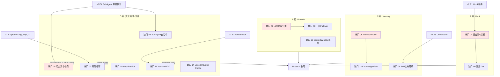

# 主设计: 14 缺口的架构整合

> 状态: 启动中 | 适用范围: 14 缺口整体技术架构 | 最后更新: 2026-06-11

## 1. 定位

千寻当前有 3 层架构基线:

```text
[基础设施层]  v2: HookRegistry + AgentMode + PermissionMode + SubAgent
                已有 10 个 crate 模块, 2180 行
[能力层]      14 缺口: 在 v2 之上叠加, 4338 行
[应用层]      Tauri Desktop + ACP stdio + TUI + WebSocket (未来)
                不在本设计范围
```

**本设计聚焦能力层**: 14 缺口怎么在 v2 之上**互相配合**, 怎么**避免重复**, 怎么**共享测试 / 配置 / 文档**。

### 1.1 实施时序决策 (重要)

**问题**: v2 还在演进, 14 缺口跟 v2 阶段如何排序?

**选项分析**:

| 方案 | 描述 | 优 | 劣 |
|---|---|---|---|
| A. 先 v2 后 14 缺口 | v2 E1-E8 全做完, 再起 14 缺口 | v2 稳定, 14 缺口容易叠 | 用户等很久, ROI 慢 |
| B. 边 v2 边 14 缺口 | 每个 v2 阶段同时叠对应缺口 | 渐进交付 | 容易冲突, 测试散 |
| **C. 14 缺口独立 (本文档选)** | **14 缺口按依赖自驱动, 跟 v2 解耦** | **可立即启动, 灵活** | **部分缺口要等 v2 锚点 (E1/E2/E4)** |

**裁定**: 选 C, **14 缺口优先按自身依赖链启动**; 只有**显式依赖 v2 锚点**的缺口等锚点 (如缺口 07 等 v2 E2)。缺口 02/04/06/08/09/10/12/13 这 8 个**不依赖 v2 任何锚点, 可立即启动**。

详细时间线见 [任务规划.md §5](./任务规划.md)。

## 2. 14 缺口的 4 类分组 (按功能域)

按"共享代码 / 共享测试 / 同步发布"原则, 14 缺口分 4 组:

### A 组 — Hook 扩展 (2 项, ~255 行)

| 缺口 | 主题 | 落点 |
|---|---|---|
| 01 | Hook 退出码 + 熔断 | `qianxun-core/src/hooks/registry.rs` |
| 09 | Hook 五层 Tier | `qianxun-core/src/hooks/tier.rs` (新) |

**共同点**: 都改 HookRegistry, 都引入新概念 (Error / Tier), 6 个 builtin hook 都要迁移。

**同步发布**: 2 个一起做, 一起测。**不能 01 完了不马上做 09**, 否则 01 引入的 Error 变体利用率低。

### B 组 — Provider 鲁棒性 (3 项, ~1135 行)

| 缺口 | 主题 | 落点 |
|---|---|---|
| 02 | LLM 错误分类 | `qianxun-core/src/provider/error.rs` (新) |
| 08 | Provider 三层 Failover | `qianxun-core/src/provider/failover.rs` (新) |
| 12 | Context Window 5 层 | `qianxun-core/src/provider/capabilities.rs` (新) |

**共同点**: 都改 Provider 层, 都引入新枚举 / 新抽象, 都跟"调用失败"或"调用参数"相关。

**同步发布**: 02 先做 (基础分类), 08 依赖 02 (层 1 决策用 02 分类), 12 独立可并行。

**依赖链**: 02 → 08, 12 独立

### C 组 — Memory 能力 (3 项, ~910 行)

| 缺口 | 主题 | 落点 |
|---|---|---|
| 04 | Skill 生命周期 | `qianxun-core/src/skills/lifecycle.rs` (新) |
| 06 | Memory Flush | `qianxun-core/src/agent/context/compact.rs` (改) |
| 13 | Knowledge Gate | `qianxun-memory/src/knowledge.rs` (新) |

**共同点**: 都跟"长期保留信息"相关, 都改 Memory 层。

**依赖链**: 06 (Flush 落盘) → 13 (Gate 决定能否 promote), 04 独立

### D 组 — 交互 / 编辑 / 验证 (6 项, ~2040 行)

| 缺口 | 主题 | 落点 |
|---|---|---|
| 03 | SubAgent 工具白名单 | `qianxun-core/src/subagent/mod.rs` (改) |
| 05 | 后台异步任务 | `qianxun-runtime/src/background_task.rs` (新) |
| 07 | 双层循环 | `qianxun-core/src/processing_loop/dual.rs` (新) |
| 10 | Hashline Edit | `qianxun-core/src/tools/builtin/hashline.rs` (新) |
| 11 | Verdict + BDD | `qianxun-core/src/verify/mod.rs` (新) |
| 14 | Session Queue 5 mode | `qianxun-runtime/src/queue.rs` (新) |

**共同点**: 都改 v2 核心循环 / 工具 / 队列, 涉及面广, 容易冲突。

**依赖链**:
- 03 + 05 跟 v2 E4 (SubAgent) 同步
- 07 依赖 v2 E2 (processing_loop_v2) 完成
- 11 跟 v2 E3 (reflect) 同步
- 10 跟 14 独立, 但都改 builtin tools / queue

**D 组最大风险**: 6 个缺口互相独立, 但都改 `processing_loop_v2`, 容易并发冲突。

**具体避免冲突方案**:
1. **逐缺口 PR**: 一个缺口 = 一个 PR, 不批量 (避免 6 个缺口 merge 冲突)
2. **接口锁定优先**: 先做 D 组公共接口 (`processing_loop/v2.rs` 抽出 trait), 后做实现
3. **顺序**: 03 → 05 (都等 v2 E4) → 07 (等 v2 E2) → 11 (跟 reflect) → 10 → 14
4. **测试隔离**: 每个缺口的集成测试用**独立 session_id**, 避免互相干扰
5. **冲突解决**: 6 个缺口都在 `processing_loop_v2` 加方法, 冲突时按缺口编号小的优先

**强烈建议 D 组按缺口逐个 PR, 不批量**。

## 3. 依赖图 (4 组内 / 组间)



**关键路径** (Critical Path):
1. 缺口 01 (Hook Error) — 其他 Hook 改之前必须先有
2. 缺口 02 (LLM 错误分类) — 缺口 08 依赖
3. 缺口 06 (Memory Flush) — 缺口 13 依赖
4. 缺口 05 (后台任务) — D 组最复杂, 决定桌面 UI 体验

**非关键路径** (可并行/后置):
- 04 (Skill 自学习) — 独立, 后置
- 12 (Context Window 5 层) — 独立, 可 P1.1 阶段任意时刻

## 4. 集成方案 (4 个集成点)

缺口不是孤岛, 实施时必须考虑**互相调用**。每个集成点列出**接口签名** (不只代码示例) + **mock 策略**。

### 集成点 1: 02 LLM 错误 → 08 Provider Failover

**接口契约**:

```rust
// 缺口 02 提供
pub enum LlmErrorKind { Auth, RateLimit, Overloaded, /* ... 15 种 */ }
pub enum RecoveryAction { Retry{...}, RotateProvider, CompressContext, FallbackModel, Abort }
pub fn decide_recovery(kind: LlmErrorKind, ctx: &CallContext) -> RecoveryAction;

// 缺口 08 调用
pub struct RetryProvider {
    retryable_kinds: HashSet<LlmErrorKind>,  // 来自 02 的 enum
}
```

**集成代码**:
```rust
match self.inner.call(req).await {
    Err(e) => {
        let kind = LlmErrorClassifier::classify(e.status, e.body, &e.transport);
        let action = decide_recovery(kind, &ctx);
        match action {
            RecoveryAction::Retry{..} => continue,
            RecoveryAction::RotateProvider => ctx.rotate_provider(),
            // ...
        }
    }
}
```

**实施顺序**: 必须 **02 先做完**, 08 才能引用 `LlmErrorKind`。
**Mock 策略**: 08 实施时, 02 还没做完 → 先建 `LlmErrorKind` 的 **stub enum** (只 4 变体), 02 实施时扩到 15 种。

### 集成点 2: 06 Memory Flush → 13 Knowledge Gate

**接口契约**:

```rust
// 缺口 06 提供 (flush 落盘后调 13)
pub async fn flush_durable_to_memory(&self) -> Result<Vec<KnowledgeItemId>>;

// 缺口 13 提供 (异步评估 promote)
pub fn evaluate_promotion(item_id: &str) -> Result<PromoteOutcome>;
pub fn promote_knowledge(db: &Database, req: PromoteRequest) -> Result<PromoteOutcome>;
```

**集成代码**:
```rust
// 缺口 06 flush 流程
let item_ids = self.flush_durable_to_memory().await?;
for id in item_ids {
    // 同步: save Draft; 异步: 触发 promote 评估
    tokio::spawn(async move {
        let _ = knowledge_lifecycle::evaluate_promotion(&id).await;
    });
}
```

**实施顺序**: 06 先做 (落盘 Draft), 13 后做 (Draft → Candidate → Promoted)。
**Mock 策略**: 06 实施时, 13 没做完 → `evaluate_promotion` 返 `PromoteOutcome::Noop` (永远 Draft)。

### 集成点 3: 11 Verdict → 03 白名单

**接口契约**:

```rust
// 缺口 03 提供
pub const DEFAULT_SUBAGENT_TOOLS: &[&str];  // 9 工具
pub enum ToolError { ..., Denied { tool: String, reason: String } }
// + SseEvent::ToolDenied { session_id, tool_name, reason }

// 缺口 11 提供
pub async fn verify_spec(spec: BddSpec) -> VerifyResult;
pub struct VerifyEvidence { command, exit_code, stdout, stderr }
```

**集成代码**:
```rust
// 缺口 11 verify_spec 跑时, 收集 sub-agent 的 ToolDenied 事件作为 evidence
let result = run_test_with_monitoring(spec).await;
if result.tool_denials.iter().any(|d| d.tool_name == "write_file") {
    return VerifyResult {
        verdict: Verdict::Fail,
        reason: "sub-agent 越权调用 write_file".into(),
        evidence: result.tool_denials.into_iter().map(VerifyEvidence::from).collect(),
    };
}
```

**实施顺序**: 03 先做 (单工具拒绝逻辑), 11 引用 `ToolDenied` SseEvent 流。
**Mock 策略**: 11 实施时, 03 没做完 → `VerifyEvidence` 先不收集 `ToolDenied`, 仅看 cargo test 输出。

### 集成点 4: 14 Queue → 07 双层循环

**接口契约**:

```rust
// 缺口 07 提供
pub struct DualLoop {
    user_input: mpsc::Receiver<UserMessage>,
    steer: mpsc::Receiver<SteerMessage>,
}
impl DualLoop {
    pub async fn inject_steer(&self, msg: SteerMessage) -> Result<()>;
    pub async fn inject_user_input(&self, msg: UserMessage) -> Result<()>;
}

// 缺口 14 提供
pub enum QueueMode { Followup, Collect, Steer, Interrupt, Speculative }
pub struct SessionQueue { ... }
```

**集成代码**:
```rust
// 缺口 14 Steer mode 调 07
QueueMode::Steer => {
    let steer = self.queue.pop_steer().await?;
    self.dual_loop.inject_steer(steer).await?;  // 调 07
}
```

**实施顺序**: 14 先做 (基础 queue), 07 重构时集成 14 的 Steer mode。
**Mock 策略**: 14 实施时, 07 没做完 → `inject_steer` 实现为 `unimplemented!()`, 14 单独测 queue 行为。

### 集成点的接口签名汇总

完整 14 缺口接口签名 (含上述 4 个集成点) 见 **[docs/设计/16_接口契约汇总.md](../../设计/16_接口契约汇总.md)**。

**接口不一致复检**: 14 缺口文档间有 7 处接口不一致, 已在 `16_接口契约汇总.md §5` 列出裁定, 实施者必须按裁定处理。

## 5. 跟 v2 阶段的精确对应

> **详细 v2 阶段定义见 [agent_loop_v2.md §7](../../10_事实源/架构/agent_loop_v2.md), 本节只标 14 缺口的触发条件**。

| v2 锚点 | 必须叠的 14 缺口 | 触发条件 |
|---|---|---|
| v2 E1 (Hook 抽象) | 01, 02, 09 | E1 启动**后**即可起缺口 02/09 (01 严格依赖 E1) |
| v2 E2 (processing_loop_v2) | 06, 07, 11, 14 | E2 启动**后**即可起缺口 06/14 (07/11 严格依赖 E2) |
| v2 E4 (SubAgent 数据模型) | 03, 05 | E4 启动**后**即可起缺口 03/05 |
| v2 E6 (Checkpoint) | 04 | E6 启动**后**起 |
| **无锚点 (独立)** | **08, 10, 12, 13** | **可立即启动** |

**关键观察**:
- **8 个缺口 (02/04/06/08/09/10/12/13) 无锚点依赖, 可立即启动** (Phase 0 准备 + Phase 1 P0 部分)
- **6 个缺口 (01/03/05/07/11/14) 有 v2 锚点**, 需等待, 但**等待期内可先建 stub 接口**
- 实施顺序综合考虑: 自身依赖 + v2 锚点 + ROI, 详见 [任务规划.md §5](./任务规划.md)

## 6. 实施入口 (AI agent 怎么读这堆文档)

新会话 AI 读顺序 (已写进 3 个 README):

```text
1. docs/README.md (总入口, 5 分钟)
2. docs/10_事实源/架构/agent_loop_v2.md (基础设施, 30 分钟)
3. docs/设计/00_总览.md (14 缺口概览, 10 分钟)
4. docs/20_工作项/2026-06-11_v2_缺口补齐_14项/主设计.md ← 本文 (5 分钟)
5. docs/20_工作项/2026-06-11_v2_缺口补齐_14项/任务规划.md (10 分钟)
6. 启动 Phase 0 准备
7. 按 Phase 1-3 顺序读对应缺口文档 (设计/NN_*.md)
8. 按 验收.md 验收
```

## 7. 不在本设计范围 (显式)

1. **v2 基础设施** — 已在 agent_loop_v2.md, 不动
2. **借鉴源完整移植** — 见 记录.md §借鉴源对比, 只取所需
3. **新外部依赖** — 14 缺口不引新 crate
4. **平台扩展** — 千寻只 desktop + ACP, 不扩
5. **新 agent 类型** — v2 已有 3 个 SessionMode + 双轴, 不再加
6. **WebSocket 接入** — v2 E8 范围, 不是 14 缺口
7. **Tauri UI 设计** — 跟缺口 05 后台任务 UI 联动, 但 UI 设计不在本工作项
