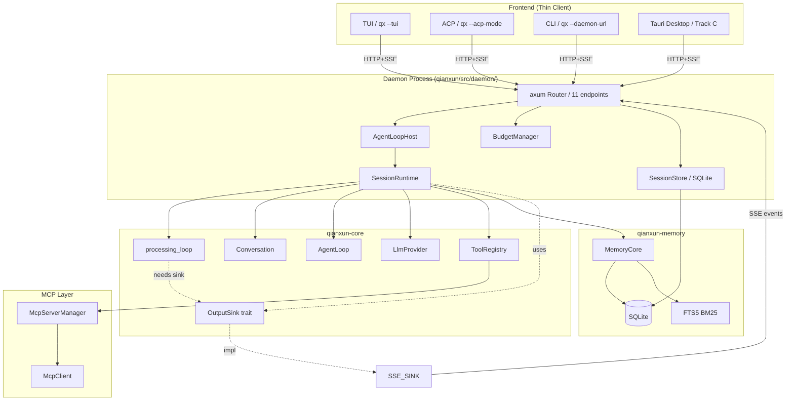
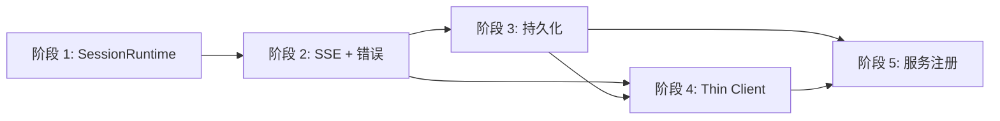

# 千寻 Daemon 子系统 — 详细设计 (Track A)

> 本文件是 `_shared-contract.md` §4 指定的 Track A 交付物, 在 `docs/daemon-design.md` v0.2 (骨架) 基础上做的**详细设计**. 与 shared-contract §3.1/§3.2 API 契约**严格一致**; 任何偏离都明确标注 "对 §3.X 的扩展".

## 目录

1. [概览](#1-概览)
2. [设计目标](#2-设计目标)
3. [架构](#3-架构)
4. [AgentLoopHost 重构 (核心)](#4-agentloophost-重构-核心)
5. [SSE 流式响应实现 (核心)](#5-sse-流式响应实现-核心)
6. [Session 持久化](#6-session-持久化)
7. [Thin Client 改造](#7-thin-client-改造)
8. [ToolPolicy 与安全边界](#8-toolpolicy-与安全边界)
9. [错误处理与重试](#9-错误处理与重试)
10. [systemd / Windows Service 注册](#10-systemd--windows-service-注册)
11. [健康检查与可观测性](#11-健康检查与可观测性)
12. [配置扩展](#12-配置扩展)
13. [迁移路径](#13-迁移路径)
14. [风险与开放问题](#14-风险与开放问题)
15. [Web Admin Console](#15-web-admin-console) — 详见 [`01b-daemon-web-console.md`](./01b-daemon-web-console.md)

> **Web Admin Console 详细规划已拆分到独立文件 `01b-daemon-web-console.md`**
> (2026-06-02 创建). 本文件仅保留与核心 daemon 设计的交叉引用, 详细
> 设计 (10 个面板 / 17 个新 endpoint / 3 sub-stage 拆分 / 构建集成 / 鉴权)
> 见独立文件. **§15 简要索引**:
>
> | 项 | 数值 | 见 |
> |---|---|---|
> | 面板数 | 10 (4 核心 + 6 次要) | 01b §3 |
> | 新 endpoint | 17 个 | 01b §4.2 |
> | 子 stage | 7a / 7b / 7c | 01b §5 |
> | 前端栈 | Svelte 5 + SvelteKit + Vite + Tailwind + shadcn-svelte (跟 Tauri 同栈) | 01b §2.3 |
> | 路径 | `qianxun/src/daemon/ui/` (新建) | 01b §2.3 |
> | 部署 | daemon 启动时 serve `dist/`, 单二进制自包含 | 01b §7 |

---

## 1. 概览

> **千寻 Daemon 是本机唯一持有 AgentLoop、API Key、Memory、Tools、Skills 的进程; TUI / ACP / CLI / 未来 Tauri 桌面都是它的薄前端.**

Daemon 监听 `127.0.0.1:23900`, 通过 HTTP + SSE 与前端通信, 承担"统一 Agent runtime"的职责. 本设计的核心命题是: **把 `qianxun-core/src/agent/engine.rs::processing_loop` 从 CLI 进程内嵌形态, 提升为 Daemon 进程内的 `Session` 长期状态, 通过 HTTP/SSE 与前端解耦**.

与 shared-contract §1/§2 关系:

- §1 决策中的 "**Daemon 唯一 Agent runtime**" 在本设计 §3 落实为进程边界; "**SQLite 复用 qianxun-memory**" 在 §6 落实为共享同一 SQLite 实例.
- §2 依赖关系中, Track A 是 Track B (VPS Server) 的强上游 — VPS 转发到 Daemon 的 prompt 通过本设计 §5 定义的 SSE 事件流, Track B 不需要再设计流协议.
- §3.1 REST endpoints 和 §3.2 SSE 事件 schema 是本设计 §5/§7 的硬性约束, 任何字段调整都在文档中标注.

---

## 2. 设计目标

### 2.1 核心理念

> **一个进程, 一种状态, 一份真相.**

| 目标 | 说明 | 现状 (Phase 3a) | 目标 (Phase 4a 完成后) |
|---|---|---|---|
| **统一 AgentLoop** | 所有 AgentLoop 状态在 Daemon 进程, CLI/ACP/Tauri 不持有对话 | CLI/ACP 内嵌 processing_loop | Daemon 独占 processing_loop + Conversation |
| **集中密钥管理** | 全部 API Key 在 Daemon 加密持有, 前端不接触 | 进程内明文 `providers.<name>.api_key` | keyring 加密, 启动时注入, 前端零知识 |
| **全局预算** | Token 用量跨会话统一追踪和限流 | 进程级, 重启清零 | 全局 AtomicU64 + SQLite 持久化, 跨重启 |
| **会话持久化** | Conversation 可从 SQLite 恢复 | 纯内存, 进程退出即丢 | 增量 snapshot + 启动恢复 |
| **多前端透明** | CLI/ACP/Tauri 共享同一 AgentLoop 实例 | 各持一份 | 经 HTTP/SSE 访问, 完全解耦 |
| **健康自愈** | systemd / Windows Service 管理 + 优雅关闭 | 仅 SIGINT | 完整 graceful shutdown 6 步, 见 §10 |
| **可观测性** | sessions 计数、provider 状态、MCP 状态、uptime | `/v1/system/health` 仅返回 `{"status":"ok"}` | 真实字段 + tracing span, 见 §11 |

### 2.2 非目标

- 多机分布式 AgentLoop (未来 Phase, 不在本文档)
- Daemon 集群 / 高可用 (单机单实例)
- 实时协作 (multi-user session sharing) — 与 Track C Tauri 桌面版的 "team session" 无关; Daemon 仅服务本机前端
- 跨用户认证 (假设仅 `127.0.0.1` 监听, 依赖网络层防护)

### 2.3 关键决策表

| 决策项 | 选择 | 理由 | 引用 |
|---|---|---|---|
| HTTP 框架 | **axum 0.8** | tokio 原生, tower 生态, 千寻已用 | `docs/daemon-design.md` §3.1 |
| 流协议 | **SSE** (Server-Sent Events) | 比 WebSocket 单向更简单, HTTP 兼容好, 浏览器天然支持 | shared-contract §1 |
| 并发模型 | **`Arc<RwLock<HashMap<...>>>` + per-session `Arc<Mutex<...>>`** | 读多写少 (按 session_id 查), 但 per-session 写密集 (LLM 流 + 工具) | §4.3 |
| Session 隔离 | 每个 `sess_xxx` 独立 `AgentLoop + Conversation` | 互不干扰, 一个出错不影响其他 | §4.2 |
| 持久化 | **SQLite** (同 `qianxun-memory` 实例) | 零运维, FTS5 已具备, 事务一致 | §6 |
| LLM Provider | `AnthropicCompatProvider` (deepseek-v4-flash / MiniMax-M3) 复用具 SDK | 已在 `qianxun-core` 稳定, 复用 `create_provider()` | §3.3 |
| 错误事件 | SSE 末帧 `error` + 4 种 `code` | shared-contract §3.2 已锁定 | §5.4 |
| 客户端断连 | `cancel_flag: Arc<AtomicBool>` + LLM stream drop | 最小侵入, processing_loop 已有此支持 | §5.3 |
| 限流 | `BudgetManager` 全局并发 + 日预算 | daemon-design §6 已有, 复用 | §9 |
| systemd 注册 | `~/.config/systemd/user/qx-daemon.service` (user-level) | 不需 root, 跟用户 desktop session | §10.1 |
| Windows Service | `windows-service` crate (0.7+) | 跨平台, 千寻目标平台之一 | §10.2 |

---

## 3. 架构

### 3.1 进程结构

```
┌──────────────────────────────────────────────────────────────────────┐
│  qx daemon (单进程, 单 tokio runtime)                                  │
│  pid 写到 ~/.qianxun/daemon.pid, stdout/stderr → 日志 (tracing)      │
│                                                                      │
│  ┌──────────────────────────────────────────────────────────────┐    │
│  │  HTTP Server (axum 0.8, 127.0.0.1:23900)                     │    │
│  │  ├─ MiddlewareStack (Trace, CORS, Timeout 30s)                │    │
│  │  ├─ /v1/system/*      health, status, shutdown, restart      │    │
│  │  ├─ /v1/chat/*        session CRUD, prompt (SSE), cancel     │    │
│  │  ├─ /v1/tools         list tools                              │    │
│  │  ├─ /v1/memory/*      search, sessions                        │    │
│  │  ├─ /v1/skills        list                                    │    │
│  │  ├─ /v1/mcp/servers   CRUD                                    │    │
│  │  ├─ /v1/config        get/put                                 │    │
│  │  ├─ /v1/llm/*         providers CRUD (keyring 后端)            │    │
│  │  ├─ /v1/projects      list (本地 + 远端 VPS 聚合)             │    │
│  │  ├─ /v1/teams         list (代理到 VPS, 远端权威)            │    │
│  │  └─ /_ui/*            Svelte 5 SPA 管理控制台 (Stage 7a+)   │    │
│  └──────────────────────────────────────────────────────────────┘    │
│                                                                      │
│  ┌──────────────────────────────────────────────────────────────┐    │
│  │  AgentLoopHost (核心)                                          │    │
│  │  ├─ sessions: Arc<RwLock<HashMap<SessionId, SessionRuntime>>> │    │
│  │  ├─ max_sessions: 10 (configurable)                           │    │
│  │  └─ reap_stale: 后台任务 (60s tick)                            │    │
│  │                                                                │    │
│  │  SessionRuntime (per-session, 见 §4.2 字段):                  │    │
│  │  ├─ agent: AgentLoop (turn_count, retry_count, accumulated)   │    │
│  │  ├─ conversation: Conversation (messages: Vec<Message>)      │    │
│  │  ├─ config: AgentConfig (per-session 可覆盖)                   │    │
│  │  ├─ cancel_flag: Arc<AtomicBool>                              │    │
│  │  ├─ tools: Arc<ToolRegistry>                                  │    │
│  │  ├─ memory: Arc<MemoryCore> (per-session view)                │    │
│  │  ├─ skills: Arc<SkillManager>                                 │    │
│  │  ├─ provider: Arc<dyn LlmProvider>                            │    │
│  │  ├─ workspace: PathBuf (文件操作相对路径)                      │    │
│  │  └─ status: SessionStatus { Idle/Busy/Cancelled/Paused }      │    │
│  └──────────────────────────────────────────────────────────────┘    │
│                                                                      │
│  ┌──────────────────────────────────────────────────────────────┐    │
│  │  LlmProviderPool (单实例或多 provider)                          │    │
│  │  ├─ active: Arc<dyn LlmProvider>  ← 来自 config.active_provider │    │
│  │  └─ registry: HashMap<String, Arc<dyn LlmProvider>>           │    │
│  │       (keyring 启动时注入, 运行时热更新 §5.5)                  │    │
│  └──────────────────────────────────────────────────────────────┘    │
│                                                                      │
│  ┌──────────────────────────────────────────────────────────────┐    │
│  │  ToolRegistry (单实例, Arc 共享给所有 SessionRuntime)          │    │
│  │  ├─ builtin: 8+ 工具 (read_text_file, write_text_file, ...    │    │
│  │  │      list_directory, search, grep, execute_command,        │    │
│  │  │      edit_file, skill_read)                                │    │
│  │  ├─ mcp: McpServerManager 持有的 N 个工具                     │    │
│  │  └─ skill: 通过 skill_read 间接访问, 不直接注册                │    │
│  └──────────────────────────────────────────────────────────────┘    │
│                                                                      │
│  ┌──────────────────────────────────────────────────────────────┐    │
│  │  MemoryCore (Arc<qianxun_memory::MemoryCore>)                  │    │
│  │  ├─ SQLite (qianxun-memory 已实现, 复用)                       │    │
│  │  ├─ FTS5 BM25                                                 │    │
│  │  └─ VectorIndex 骨架 (Phase 3a)                                │    │
│  └──────────────────────────────────────────────────────────────┘    │
│                                                                      │
│  ┌──────────────────────────────────────────────────────────────┐    │
│  │  SkillManager (单实例, Arc)                                    │    │
│  │  ├─ skills: HashMap<String, Skill>                             │    │
│  │  └─ file_watcher: notify-rs (skill 目录热重载)                │    │
│  └──────────────────────────────────────────────────────────────┘    │
│                                                                      │
│  ┌──────────────────────────────────────────────────────────────┐    │
│  │  McpServerManager (单实例, Arc)                                │    │
│  │  ├─ servers: HashMap<String, McpServerConfig>                 │    │
│  │  └─ clients: HashMap<String, Arc<McpClient>>                  │    │
│  └──────────────────────────────────────────────────────────────┘    │
│                                                                      │
│  ┌──────────────────────────────────────────────────────────────┐    │
│  │  BudgetManager (单实例, Arc)                                   │    │
│  │  ├─ daily_spent: AtomicU64 (重启从 SQLite 恢复)                │    │
│  │  ├─ concurrent_requests: AtomicU32 (默认上限 5)                │    │
│  │  └─ max_daily_cost: f64 (USD, 来自 config.budget)             │    │
│  └──────────────────────────────────────────────────────────────┘    │
│                                                                      │
│  ┌──────────────────────────────────────────────────────────────┐    │
│  │  VpsWsClient (可选, Arc)                                       │    │
│  │  ├─ 30s ping/pong 心跳                                        │    │
│  │  ├─ 自动重连 (1/2/4/8/16s 退避, 上限 60s)                     │    │
│  │  └─ 命令转发 (Track B 接入后启用)                              │    │
│  └──────────────────────────────────────────────────────────────┘    │
└──────────────────────────────────────────────────────────────────────┘
```

### 3.2 关键数据结构

```rust
// === qianxun/src/daemon/mod.rs ===

pub struct AppState {
    pub agent_host: AgentLoopHost,
    pub shutdown_tx: watch::Sender<()>,
    pub provider_pool: Arc<LlmProviderPool>,
    pub tool_registry: Arc<ToolRegistry>,
    pub memory: Arc<MemoryCore>,
    pub skills: Arc<SkillManager>,
    pub mcp: Arc<McpServerManager>,
    pub budget: Arc<BudgetManager>,
    pub vps_client: Option<Arc<VpsWsClient>>,
    pub config: Arc<ResolvedConfig>,
    pub session_store: Arc<SessionStore>,  // 见 §6
    pub started_at: Instant,                // 用于 uptime
}

// === qianxun/src/daemon/agent_host.rs (重构后) ===

pub struct AgentLoopHost {
    sessions: Arc<RwLock<HashMap<SessionId, Arc<SessionRuntime>>>>,
    max_sessions: usize,
    state: Arc<AppState>,                   // 新增: 引用共享子系统
    reap_handle: Option<JoinHandle<()>>,
}

pub struct SessionRuntime {
    pub id: SessionId,
    pub created_at: Instant,
    pub last_active: RwLock<Instant>,       // 改为 RwLock, 因 §4.3 决策
    pub status: RwLock<SessionStatus>,      // 改 RwLock
    pub cancel_flag: Arc<AtomicBool>,
    
    // === 核心状态 ===
    pub agent: Mutex<AgentLoop>,            // 重构: 之前不存在
    pub conversation: Mutex<Conversation>,  // 重构: 之前不存在
    
    // === 共享资源 (来自 AppState, Arc 引用) ===
    pub provider: Arc<dyn LlmProvider>,
    pub tools: Arc<ToolRegistry>,
    pub memory: Arc<MemoryCore>,
    pub skills: Arc<SkillManager>,
    pub workspace: PathBuf,                 // 来自 CreateSessionRequest.workspace
    pub config: AgentConfig,                // 来自 CreateSessionRequest 或全局
}

#[derive(Debug, Clone, Copy, PartialEq, Eq)]
pub enum SessionStatus {
    Idle,         // 空闲, 可接受新 prompt
    Busy,         // 正在处理 prompt (有活跃的 prompt task)
    Cancelled,    // 用户取消, 等待清理
    Paused,       // Daemon 即将关闭, session 暂停
}
```

### 3.3 模块依赖图 (Mermaid)



### 3.4 与现有代码的对应关系

| 现有文件 | 行数 | 现状 | 重构后位置 |
|---|---|---|---|
| `qianxun/src/daemon/mod.rs` | 36 | 持有 `agent_host` + `shutdown_tx` | 扩展为完整 `AppState`, 见 §3.2 |
| `qianxun/src/daemon/router.rs` | 157 | 11 路由, 9 个 stub | stub 全部接真实子系统, 见 §5 |
| `qianxun/src/daemon/agent_host.rs` | 73 | SessionHandle 无 AgentLoop/Conversation | 重构为 §4 的 SessionRuntime |
| `qianxun-core/src/agent/engine.rs` | 489 | `processing_loop::handle_user_message` (12 参) | **不修改**, 由 SessionRuntime 直接调用 |
| `qianxun-core/src/output.rs` | 19 | `OutputSink` trait (7 方法) | **不修改**, Daemon 端实现 `SseOutputSink`, 见 §5.2 |
| `qianxun-core/src/agent/conversation.rs` | 166 | `Conversation` 含 system_prompt + messages | **不修改**, Daemon 通过 `Mutex<Conversation>` 共享 |
| `qianxun/src/tui/mod.rs:941` | — | TUI 直接调 `handle_user_message` | 重构: 改 HTTP/SSE 客户端, 见 §7.1 |
| `qianxun/src/acp/prompt.rs:236` | — | ACP 直接调 `handle_user_message` | 重构: 改 HTTP/SSE 客户端, 见 §7.2 |

---

## 4. AgentLoopHost 重构 (核心)

### 4.1 现状问题

当前 `qianxun/src/daemon/agent_host.rs:14-18` 的 `SessionHandle` 只是一个空壳:

```rust
struct SessionHandle {
    id: SessionId,
    created_at: Instant,
    last_active: Instant,
}
```

没有 `AgentLoop`、没有 `Conversation`、没有 `provider`、没有 `tools`、没有 `cancel_flag`. 这导致 `qianxun/src/daemon/router.rs:147-157` 的 `prompt_handler` 只能返回一段静态文本 "Daemon ready":

```rust
let stream = tokio_stream::once(Ok(Event::default().data("{\"text\":\"Daemon ready\"}")));
```

### 4.2 重构后的 `SessionRuntime` (字段级伪代码)

```rust
// === qianxun/src/daemon/agent_host.rs (新增 SessionRuntime) ===

use std::sync::Arc;
use std::sync::atomic::{AtomicBool, AtomicU32, Ordering};
use std::sync::{Mutex, RwLock};
use std::time::Instant;
use std::path::PathBuf;

use qianxun_core::agent::conversation::Conversation;
use qianxun_core::agent::engine::AgentLoop;
use qianxun_core::config::AgentConfig;
use qianxun_core::provider::LlmProvider;
use qianxun_core::tools::ToolRegistry;
use qianxun_memory::MemoryCore;
use qianxun_core::skills::SkillManager;

pub type SessionId = String;

pub struct SessionRuntime {
    // === 身份 ===
    pub id: SessionId,
    pub created_at: Instant,
    
    // === 状态 (锁细化, 见 §4.3) ===
    pub status: RwLock<SessionStatus>,
    pub last_active: RwLock<Instant>,
    /// 当前 prompt task 的 JoinHandle, 用于 cancel + 等待
    pub active_prompt: Mutex<Option<PromptTaskHandle>>,
    
    // === 取消信号 (跨 task 共享) ===
    pub cancel_flag: Arc<AtomicBool>,
    
    // === AgentLoop 核心 (per-session 私有) ===
    /// 重构: 之前不存在. 每个 session 拥有独立的 AgentLoop 实例
    /// (turn_count, retry_count, accumulated_usage, compact_window)
    pub agent: Mutex<AgentLoop>,
    /// 重构: 之前不存在. 每个 session 拥有独立的 Conversation
    /// (system_prompt, messages, budget)
    pub conversation: Mutex<Conversation>,
    /// 每个 session 可有独立的 AgentConfig (从 CreateSessionRequest 覆盖)
    pub config: AgentConfig,
    
    // === 共享子系统 (Arc 引用自 AppState) ===
    pub provider: Arc<dyn LlmProvider>,
    pub tools: Arc<ToolRegistry>,
    pub memory: Arc<MemoryCore>,
    pub skills: Arc<SkillManager>,
    
    // === 工作目录 (来自 session 创建时的 workspace 字段) ===
    /// 文件读写工具相对此目录; 不存在则用 cwd
    pub workspace: PathBuf,
    
    // === 取消计数 (用于 SseOutputSink 关闭 SSE) ===
    pub sse_subscribers: Arc<AtomicU32>,
}

pub struct PromptTaskHandle {
    pub join: tokio::task::JoinHandle<()>,
    pub cancel_flag: Arc<AtomicBool>,
}

#[derive(Debug, Clone, Copy, PartialEq, Eq, serde::Serialize)]
#[serde(rename_all = "snake_case")]
pub enum SessionStatus {
    Idle,
    Busy,
    Cancelled,
    Paused,
}

impl SessionRuntime {
    /// 构造: 从 AppState 引用共享子系统, 复制 provider/tools/memory/skills
    pub fn new(
        id: SessionId,
        config: AgentConfig,
        workspace: PathBuf,
        state: &AppState,
    ) -> Self {
        let now = Instant::now();
        let provider = state.provider_pool.active();
        let conv = Conversation::new(None);
        let agent = AgentLoop::new(config.clone());
        Self {
            id,
            created_at: now,
            status: RwLock::new(SessionStatus::Idle),
            last_active: RwLock::new(now),
            active_prompt: Mutex::new(None),
            cancel_flag: Arc::new(AtomicBool::new(false)),
            agent: Mutex::new(agent),
            conversation: Mutex::new(conv),
            config,
            provider,
            tools: state.tool_registry.clone(),
            memory: state.memory.clone(),
            skills: state.skills.clone(),
            workspace,
            sse_subscribers: Arc::new(AtomicU32::new(0)),
        }
    }
    
    /// 取消当前 prompt (如果有).
    /// 通过设置 cancel_flag, processing_loop 会在下一轮 yield 时退出
    /// (见 `qianxun-core/src/agent/engine.rs:100` 的 cancel_flag 检查).
    pub fn cancel(&self) -> bool {
        let mut active = self.active_prompt.lock().unwrap();
        if let Some(handle) = active.take() {
            handle.cancel_flag.store(true, Ordering::SeqCst);
            self.cancel_flag.store(true, Ordering::SeqCst);
            // 不 await join — 客户端已断开, 异步清理
            true
        } else {
            false
        }
    }
    
    /// 设置状态
    pub fn set_status(&self, s: SessionStatus) {
        *self.status.write().unwrap() = s;
    }
}
```

### 4.3 并发安全分析

#### 4.3.1 锁选型矩阵

| 字段 | 锁类型 | 理由 | 访问频率 |
|---|---|---|---|
| `sessions: HashMap` | `Arc<RwLock<...>>` | 读多写少 — 客户端频繁查 session, 写只在 create/delete | 读 >> 写 |
| `SessionRuntime.status` | `RwLock<SessionStatus>` | 读远多于写 (status 查询用于 `/v1/chat/sessions`) | 读 >> 写 |
| `SessionRuntime.last_active` | `RwLock<Instant>` | 同上, 每次 prompt 完成更新一次 | 读 >> 写 |
| `SessionRuntime.active_prompt` | `Mutex<Option<...>>` | 写频繁, 持有时间短 | 写 ≈ 读 |
| `SessionRuntime.agent` | `Mutex<AgentLoop>` | **关键决策**: LLM 流处理时**独占**持有, 整个 turn 期间不允许并发 | 写 >> 读 |
| `SessionRuntime.conversation` | `Mutex<Conversation>` | 同上, turn 期间独占; 切换 turn 时短暂释放 | 写 >> 读 |

#### 4.3.2 为什么 agent/conversation 用 `Mutex` 而不是 `RwLock`

`AgentLoop` 和 `Conversation` 在 `processing_loop::handle_user_message` 期间被**反复读写**, 但**不是读多写少** — 是一次性的大量读写混合, 且要求**强一致性** (turn 期间不允许外部观察中间态).

如果用 `RwLock`, 多个并发 reader 会让外部看到"半个 turn 写入后的状态", 而 LLM 流的下一个事件可能与该状态矛盾. 用 `Mutex` 强制 turn 期间独占, 与 `processing_loop` 当前的单线程语义一致.

#### 4.3.3 死锁避免

潜在死锁路径:
- HTTP handler 持 `sessions.write()` → SessionRuntime 持 `agent.lock()` → ...
- 但 `sessions.write()` 只在 create/delete 期间持有, 且不调用 SessionRuntime 方法
- SessionRuntime 内部锁按固定顺序: `status → last_active → active_prompt → agent → conversation`, 不会循环

#### 4.3.4 spawn_blocking 的使用场景

| 操作 | 是否 spawn_blocking | 理由 |
|---|---|---|
| `agent.lock()` | ❌ | `Mutex<AgentLoop>` 的 lock 是 std Mutex, **不跨 await**, 不会阻塞 tokio worker |
| `conversation.lock()` | ❌ | 同上 |
| SQLite 读写 (MemoryCore, SessionStore) | ✅ | SQLite 是同步 API, 用 `tokio::task::spawn_blocking` 避免阻塞 tokio worker |
| LLM HTTP 请求 | ❌ | `reqwest` async, 走 tokio |
| 文件读写 (read_text_file 等) | ❌ (v1) / ✅ (v2) | v1 用 `tokio::fs`; v2 若 read 大文件改 spawn_blocking + `std::fs` |
| MCP 子进程 IPC | ❌ | stdio 是 tokio 异步包装 |

`MemoryCore` 已在 `qianxun-memory` 中提供 `async fn` 包装, 内部已使用 `spawn_blocking`. `SessionStore` 新增时也要遵循同样模式.

#### 4.3.5 `processing_loop` 跨 await 持锁的验证

```rust
// qianxun-core/src/agent/engine.rs:83-95
pub async fn handle_user_message(
    agent: &mut AgentLoop,           // ← &mut
    conversation: &mut Conversation, // ← &mut
    provider: &dyn LlmProvider,
    tools: &ToolRegistry,
    ...
) {
    // 整个函数执行期间, agent 和 conversation 都被独占借用
    // 不存在 &mut self 跨 await 的借用冲突 (因为它们是 &mut, 不是 &mut self)
}
```

调用方 `SessionRuntime::run_prompt` 会持锁:
```rust
let mut agent = self.agent.lock().unwrap();
let mut conv = self.conversation.lock().unwrap();
processing_loop::handle_user_message(&mut agent, &mut conv, ...).await;
// ↑ agent 和 conv 在这里被 &mut 借用, 跨 await 持锁
// std::sync::Mutex 的 guard 不是 Send, 需要 drop guard 前 await
```

**关键修正**: `std::sync::Mutex` 的 guard **不是 Send**, 跨 `.await` 持有会编译错误. 必须用 `tokio::sync::Mutex` 或在 await 前 drop guard.

**解决方案 A — 短锁模式** (推荐):
```rust
// 取出来, 完成后放回. 不跨 await 持锁.
let mut agent = self.agent.lock().unwrap().deref_mut();
// 但 processing_loop 是 async, 必须跨 await
// → 必须用 tokio::sync::Mutex
```

**解决方案 B — 用 `tokio::sync::Mutex`** (采纳):
```rust
use tokio::sync::Mutex;
pub struct SessionRuntime {
    pub agent: tokio::sync::Mutex<AgentLoop>,
    pub conversation: tokio::sync::Mutex<Conversation>,
    // 其他锁仍是 std::sync::Mutex / RwLock, 因为它们不跨 await
}

// 调用:
let mut agent = self.agent.lock().await;  // tokio mutex, await-friendly
let mut conv = self.conversation.lock().await;
processing_loop::handle_user_message(&mut *agent, &mut *conv, ...).await;
```

`tokio::sync::Mutex` 的取舍:
- 优点: 可跨 await
- 缺点: 调度开销比 `std::sync::Mutex` 略大; 死锁时不会 poison
- 决策: **agent 和 conversation 用 `tokio::sync::Mutex`**, 其余用 std 锁

### 4.4 max_sessions 限流策略

```rust
// === 在 AgentLoopHost::create_session 入口 ===

pub async fn create_session(
    &self,
    config: AgentConfig,
    workspace: PathBuf,
) -> Result<Arc<SessionRuntime>, DaemonError> {
    // 1. 检查 max_sessions
    {
        let sessions = self.sessions.read().await;
        if sessions.len() >= self.max_sessions {
            return Err(DaemonError::MaxSessionsReached {
                current: sessions.len(),
                max: self.max_sessions,
            });
        }
    }
    
    // 2. 检查全局并发 (BudgetManager)
    self.state.budget.try_acquire_concurrent()?;
    
    // 3. 创建 SessionRuntime
    let id = generate_session_id();
    let runtime = Arc::new(SessionRuntime::new(
        id.clone(),
        config,
        workspace,
        &self.state,
    ));
    
    // 4. 写入 sessions
    let mut sessions = self.sessions.write().await;
    // 二次检查 (避免与并发 create 竞争)
    if sessions.len() >= self.max_sessions {
        return Err(DaemonError::MaxSessionsReached {
            current: sessions.len(),
            max: self.max_sessions,
        });
    }
    sessions.insert(id.clone(), runtime.clone());
    drop(sessions);
    
    // 5. 持久化 session 元数据
    self.state.session_store
        .create(&id, &runtime.workspace, &runtime.config)
        .await?;
    
    // 6. (可选) 关联 project: 从 workspace 向上查找 .qianxun/
    // 如果找到, 把 session.project_id 设为对应的 project_id
    
    Ok(runtime)
}
```

**max_sessions 默认值**: 10. 配置项 `daemon.max_sessions`.

**溢出策略**: 返回 503 Service Unavailable + `Retry-After: 30`. 不排队 (避免占内存).

**为什么是 10**: 千寻是个人 AI 助手, 正常使用同一时刻活跃 session < 5. 10 是缓冲. 真正瓶颈是 `max_concurrent` (5), 不是 session 计数. 可调.

### 4.5 取消语义

```rust
// 客户端断连 → axum 自动取消 SSE 流的 future
// ↓
async fn prompt_handler(...) -> Sse<...> {
    let cancel_flag = runtime.cancel_flag.clone();
    let (tx, rx) = tokio::sync::mpsc::channel(64);
    
    // spawn 处理 task
    let runtime_clone = runtime.clone();
    let prompt_id = uuid::Uuid::new_v4().to_string();
    tokio::spawn(async move {
        runtime_clone.set_status(SessionStatus::Busy);
        let mut agent = runtime_clone.agent.lock().await;
        let mut conv = runtime_clone.conversation.lock().await;
        let sink = SseOutputSink { tx: tx.clone() };
        
        processing_loop::handle_user_message(
            &mut agent, &mut conv, &runtime_clone.provider,
            &runtime_clone.tools, runtime_clone.config.tool_filter(),
            &sink, &memory_ctx, &catalog, &injections, cancel_flag.clone(),
        ).await;
        
        // 持久化 Conversation 快照
        let snapshot = conv.clone();
        drop(conv);
        drop(agent);
        runtime_clone.state.session_store.snapshot(&runtime_clone.id, &snapshot).await.ok();
        runtime_clone.set_status(SessionStatus::Idle);
    });
    
    // Sse 包装 rx
    Sse::new(rx.map(|e| Ok(Event::default().data(serde_json::to_string(&e).unwrap()))))
}
```

**关键点**: 当客户端断连, axum 会 drop `Sse` future, 触发 `rx` 关闭. 处理 task 仍持有 `tx` clone, **不会立即取消** (LLM 流继续). 需要客户端断开检测机制, 见 §5.3.

---

## 5. SSE 流式响应实现 (核心)

### 5.1 12 个事件类型 — 完整发射逻辑

shared-contract §3.2 定义 12 个事件, 本节逐一标注**触发点** (processing_loop 的哪个状态) 和**字段来源**.

| # | 事件 | 触发点 (`processing_loop` 位置) | 字段来源 | 备注 |
|---|---|---|---|---|
| 1 | `message_start` | `handle_user_message` 入口 (engine.rs:95) | 来自 session 元数据 + provider cap | 每次用户消息开始 |
| 2 | `content_block_start` | 切换 block 类型时 (text → tool_use → thinking) | 当前 block 的 `index` 和 `block_type` | 一个 LLM 响应可包含多个 block |
| 3 | `text_delta` | `Ok(LlmStreamEvent::Text(text))` (engine.rs:263-266) | `text` 字段, 来自 provider stream | 文本增量化 |
| 4 | `thinking_delta` | `Ok(LlmStreamEvent::Thinking { text, .. })` (engine.rs:397-408) | `text` 字段 | thinking 块未结束时持续 emit |
| 5 | `tool_use_delta` | 暂不发射, 等完整 `ToolCall` 事件 (engine.rs:267-274) | `id` + `name` + `arguments_json` (增量) | 当前实现是批式而非流式, 见 §5.1.1 |
| 6 | `tool_use_complete` | `Ok(LlmStreamEvent::ToolCall { id, tool_name, arguments })` (engine.rs:267-274) | `id` + `name` + `arguments` (完整 JSON) | LLM 完成一次 tool call |
| 7 | `tool_result` | processing_loop 工具执行后 (engine.rs:336) | `tool_use_id` + `content` + `is_error` + `elapsed_ms` | Daemon 端生成 elapsed_ms |
| 8 | `content_block_stop` | 当前 block 结束 | `index` | 配对 `content_block_start` |
| 9 | `usage` | `Ok(LlmStreamEvent::UsageUpdate(usage))` (engine.rs:275-283) | `input_tokens` + `output_tokens` + `cache_*` | DeepSeek 增量, 见 §5.1.2 |
| 10 | `message_delta` | LLM 返回 `Stop` 事件 (engine.rs:284-285) | `stop_reason: end_turn / max_tokens / tool_use` | 每个 LLM 响应结束 |
| 11 | `message_stop` | `processing_loop` 函数返回前 (engine.rs:393 或 108) | 无字段 | 整个 turn 结束 |
| 12 | `error` | `sink.on_error` (engine.rs:238, 429) | `code` + `message` | 见 §5.4 错误分类 |

#### 5.1.1 `tool_use_delta` 当前实现说明

shared-contract §3.2 同时定义了 `tool_use_delta` (5) 和 `tool_use_complete` (6). 当前 `qianxun-core/src/provider/anthropic_compat.rs` 和 `deepseek.rs` 都只发射完整的 `LlmStreamEvent::ToolCall` (engine.rs:267-274), 不会拆分为多个 `ToolCall` 的 partial.

**当前实现**: 只发 `tool_use_complete` (事件 6), 跳过 `tool_use_delta` (事件 5). 这样客户端逻辑简单, 但延迟略高 (LLM 完整生成 arguments 后才通知).

**未来优化**: 拆 `AnthropicCompatProvider` 的 input_json_delta 流, 发射 `tool_use_delta` (事件 5), 客户端可显示"参数生成中..."状态. 对 §3.2 的扩展, 见 §5.7.

#### 5.1.2 `usage` 事件去重

DeepSeek 的 Anthropic 兼容 API 行为:
- `message_start` 事件包含初始 `input_tokens` (例如 500)
- `message_delta` 事件包含**累积的** `input_tokens` (例如 2000)

当前 `engine.rs:275-283` 把 `usage` 替换 (而不是累加) 到 `agent.accumulated_usage`. SSE 端应把**每次** `UsageUpdate` 都发射一次 `usage` 事件 — 客户端可以选择只看最后一个.

**SSE 端行为**: 每个 `LlmStreamEvent::UsageUpdate` 都发 `usage` 事件. 客户端 (TUI/Tauri) 聚合, 只更新 UI 上一次的 `usage` 显示. 不做去重.

### 5.2 `SseOutputSink` 实现

```rust
// === qianxun/src/daemon/sse_sink.rs (新增) ===

use async_trait::async_trait;
use qianxun_core::output::OutputSink;
use qianxun_core::provider::types::LlmStreamEvent;
use qianxun_core::types::{LlmError, StopReason, TokenUsage};
use serde::Serialize;
use tokio::sync::mpsc;
use std::sync::Arc;
use std::sync::atomic::{AtomicU32, Ordering};

#[derive(Serialize)]
#[serde(tag = "type", rename_all = "snake_case")]
pub enum SseEvent {
    MessageStart { session_id: String, model: String, max_tokens: u64 },
    ContentBlockStart { index: u32, block_type: String },
    TextDelta { index: u32, text: String },
    ThinkingDelta { index: u32, text: String },
    ToolUseDelta { index: u32, id: String, name: String, arguments_json: String },
    ToolUseComplete { index: u32, id: String, name: String, arguments: serde_json::Value },
    ToolResult { tool_use_id: String, content: String, is_error: bool, elapsed_ms: u64 },
    ContentBlockStop { index: u32 },
    Usage { input_tokens: u64, output_tokens: u64, cache_creation_input_tokens: u64, cache_read_input_tokens: u64 },
    MessageDelta { stop_reason: String },
    MessageStop,
    Error { code: String, message: String },
}

pub struct SseOutputSink {
    pub tx: mpsc::Sender<SseEvent>,
    pub session_id: String,
    pub model: String,
    pub max_tokens: u64,
    pub block_index: Arc<AtomicU32>,
    pub start_time: std::time::Instant,
    pub tool_start_time: std::time::Instant,
}

impl SseOutputSink {
    pub fn new(tx: mpsc::Sender<SseEvent>, session_id: String, model: String, max_tokens: u64) -> Self {
        Self {
            tx, session_id, model, max_tokens,
            block_index: Arc::new(AtomicU32::new(0)),
            start_time: std::time::Instant::now(),
            tool_start_time: std::time::Instant::now(),
        }
    }
    
    async fn emit(&self, event: SseEvent) {
        // 失败 = 客户端断连, 不报错 (SSE 流已关闭)
        let _ = self.tx.send(event).await;
    }
}

#[async_trait]
impl OutputSink for SseOutputSink {
    async fn on_text(&self, text: &str) {
        // 第一个 text 字节: 发射 content_block_start (block_type=text)
        // 注: 简化处理 — 总是发射. 客户端按 index 配对.
        let idx = self.block_index.load(Ordering::Relaxed);
        self.emit(SseEvent::ContentBlockStart { index: idx, block_type: "text".into() }).await;
        self.emit(SseEvent::TextDelta { index: idx, text: text.into() }).await;
        // 不在这里发 stop, 等 on_turn_finished 或下一个 block 切换时统一发
    }
    
    async fn on_thinking(&self, text: &str) {
        let idx = self.block_index.load(Ordering::Relaxed);
        // 注: 当前实现简化 — 假设 thinking 是单独的 block. 
        // 实际需要 on_text 之前/之后判断 block 类型切换.
        self.emit(SseEvent::ThinkingDelta { index: idx, text: text.into() }).await;
    }
    
    async fn on_thinking_flush(&self) {
        // 思考块结束, 发射 content_block_stop
        let idx = self.block_index.load(Ordering::Relaxed);
        self.emit(SseEvent::ContentBlockStop { index: idx }).await;
        self.block_index.store(idx + 1, Ordering::Relaxed);
    }
    
    async fn on_tool_call(&self, id: &str, name: &str, arguments: &serde_json::Value) {
        let idx = self.block_index.load(Ordering::Relaxed);
        self.emit(SseEvent::ContentBlockStart { index: idx, block_type: "tool_use".into() }).await;
        self.emit(SseEvent::ToolUseComplete {
            index: idx, id: id.into(), name: name.into(), arguments: arguments.clone(),
        }).await;
        self.emit(SseEvent::ContentBlockStop { index: idx }).await;
        self.block_index.store(idx + 1, Ordering::Relaxed);
        self.tool_start_time = std::time::Instant::now();
    }
    
    async fn on_token_usage(&self, usage: &TokenUsage) {
        self.emit(SseEvent::Usage {
            input_tokens: usage.input,
            output_tokens: usage.output,
            cache_creation_input_tokens: usage.cache_creation_input.unwrap_or(0),
            cache_read_input_tokens: usage.cache_read_input.unwrap_or(0),
        }).await;
    }
    
    async fn on_error(&self, error: &LlmError) {
        let (code, message) = classify_error(error);
        self.emit(SseEvent::Error { code, message }).await;
    }
    
    async fn on_turn_finished(&self, reason: &StopReason, _usage: &TokenUsage) {
        let stop_reason = match reason {
            StopReason::EndTurn => "end_turn",
            StopReason::MaxTokens => "max_tokens",
            StopReason::ToolUse => "tool_use",
            StopReason::StopSequence => "stop_sequence",
            StopReason::ContentFiltered => "content_filtered",
            StopReason::Cancelled => "cancelled",
            StopReason::Error => "error",
            StopReason::Unknown(_) => "unknown",
        };
        // 关闭最后一个未关闭的 block
        let idx = self.block_index.load(Ordering::Relaxed);
        self.emit(SseEvent::ContentBlockStop { index: idx }).await;
        self.emit(SseEvent::MessageDelta { stop_reason: stop_reason.into() }).await;
        self.emit(SseEvent::MessageStop).await;
    }
    
    async fn on_status(&self, status: &str) {
        // status 不属于 shared-contract §3.2 的 12 个事件
        // 暂时不通过 SSE 发射, 改用 tracing::info! 记录
        tracing::info!(session_id = %self.session_id, "status: {status}");
    }
}

/// 错误分类: shared-contract §3.2 定义 4 种 code
fn classify_error(e: &LlmError) -> (String, String) {
    use qianxun_core::types::LlmError::*;
    match e {
        NoApiKey { provider } => ("auth".into(), format!("API key not configured for {provider}")),
        AuthenticationError { provider, message } => ("auth".into(), format!("[{provider}] {message}")),
        RateLimitExceeded { provider, retry_after } => {
            let wait = retry_after.map(|d| d.as_secs()).unwrap_or(0);
            ("rate_limit".into(), format!("[{provider}] rate limit, retry after {wait}s"))
        }
        ApiError { provider, status, message } => {
            if *status >= 500 {
                ("api_error".into(), format!("[{provider}] {status} {message}"))
            } else if *status == 429 {
                ("rate_limit".into(), format!("[{provider}] {status} {message}"))
            } else {
                ("api_error".into(), format!("[{provider}] {status} {message}"))
            }
        }
        PromptTooLarge { tokens } => ("api_error".into(), format!("prompt too large: {tokens:?}")),
        StreamEnded => ("internal".into(), "stream ended unexpectedly".into()),
    }
}
```

### 5.3 客户端断开处理 (Stream Cancellation)

**问题**: 客户端 (TUI/Tauri) 关闭 SSE 连接, Daemon 端的 LLM 流仍在运行, 资源浪费.

**检测机制** (3 层):

1. **tx 发送失败**: `mpsc::Sender::send().await` 返回错误, 表明 rx 端已 drop. 见 `SseOutputSink::emit`.
2. **`active_prompt` task 监听 cancel_flag**: 客户端发 `POST /v1/chat/session/:id/cancel` 显式取消.
3. **HTTP 客户端断连**: axum 在 response future drop 时, 通过 `tokio::select!` 协作式取消.

**实现** (在 §4.5 的 `prompt_handler` 中):

```rust
async fn prompt_handler(
    State(state): State<Arc<AppState>>,
    Path(id): Path<String>,
) -> Result<Sse<impl Stream<Item = Result<Event, Infallible>>>, (StatusCode, String)> {
    let runtime = state.agent_host.get_session(&id).await
        .ok_or((StatusCode::NOT_FOUND, format!("Session {id} not found")))?;
    
    let (tx, rx) = mpsc::channel::<SseEvent>(64);  // 64 帧缓冲, 见 §5.6
    let cancel_flag = runtime.cancel_flag.clone();
    let runtime_clone = runtime.clone();
    
    // 启动处理 task
    let handle = tokio::spawn(async move {
        runtime_clone.set_status(SessionStatus::Busy);
        *runtime_clone.last_active.write().await = Instant::now();
        
        let mut agent = runtime_clone.agent.lock().await;
        let mut conv = runtime_clone.conversation.lock().await;
        let sink = SseOutputSink::new(tx.clone(), runtime_clone.id.clone(), 
                                       runtime_clone.config.model_name.clone(),
                                       runtime_clone.config.max_tokens.unwrap_or(16384));
        let filter = runtime_clone.config.mode.tool_filter();
        let memory_ctx = runtime_clone.memory.build_context("", 1000).await;
        let catalog = runtime_clone.skills.build_catalog_prompt();
        let injections = "";  // 简化, 实际按 user input 匹配
        
        processing_loop::handle_user_message(
            &mut *agent, &mut *conv,
            runtime_clone.provider.as_ref(),
            runtime_clone.tools.as_ref(),
            filter, &sink, &memory_ctx, &catalog, &injections, cancel_flag.clone(),
        ).await;
        
        // turn 完成, 持久化 conversation
        let snapshot = conv.clone();
        drop(conv);
        drop(agent);
        runtime_clone.state.session_store.snapshot(&runtime_clone.id, &snapshot).await
            .map_err(|e| tracing::error!("snapshot failed: {e}")).ok();
        runtime_clone.set_status(SessionStatus::Idle);
    });
    
    // 注册活跃 task
    *runtime.active_prompt.lock().await = Some(PromptTaskHandle {
        join: handle,
        cancel_flag: runtime.cancel_flag.clone(),
    });
    
    // SSE 包装: 客户端断连时, axum drop 这个 future → rx 关闭 → tx 发送失败
    let sse_stream = async_stream::stream! {
        let mut rx = rx;
        while let Some(event) = rx.recv().await {
            let json = serde_json::to_string(&event).unwrap_or_default();
            yield Ok::<_, Infallible>(Event::default().data(json));
        }
        // 客户端断连, 显式取消
        runtime.cancel_flag.store(true, std::sync::atomic::Ordering::SeqCst);
    };
    
    Ok(Sse::new(sse_stream))
}
```

**关键点**:
- `mpsc::channel(64)` 容量 64, 客户端慢消费时 backpressure (见 §5.6)
- SseOutputSink 的 `emit` 是 `tx.send().await`, 满时自动 await, 起到天然背压作用
- 客户端断连 → axum drop SSE future → rx.recv() 返回 None → 显式 cancel_flag = true → processing_loop 下一轮 yield 时退出 (engine.rs:100)
- processing_loop 退出后, snapshot 保存部分完成的 conversation

### 5.4 错误事件分类 (4 种 code)

shared-contract §3.2 第 12 个事件定义 `code: rate_limit | auth | api_error | internal`. `classify_error()` (见 §5.2) 把 7 种 `LlmError` 映射到 4 种 code:

| `LlmError` 变体 | SSE code | HTTP 状态 (REST 端) | 客户端建议 |
|---|---|---|---|
| `NoApiKey` | `auth` | 401 | 提示用户设置 API Key |
| `AuthenticationError` | `auth` | 401 | 同上 |
| `RateLimitExceeded` | `rate_limit` | 429 | 退避后重试 (retry_after 提示秒数) |
| `ApiError { status: 429 }` | `rate_limit` | 429 | 同上 |
| `ApiError { status: 5xx }` | `api_error` | 502 | 5 次后上报 |
| `ApiError { status: 4xx (非429) }` | `api_error` | 400 | 提示用户检查输入 |
| `PromptTooLarge` | `api_error` | 413 | 触发 conversation 压缩后重试 |
| `StreamEnded` | `internal` | 500 | 重试一次, 仍失败则上报 |
| 处理过程中的 panic / 其他 | `internal` | 500 | 收集日志上报 |

**Retry 策略**: 由 processing_loop 内部处理 (engine.rs:217-243), rate_limit 自动重试, 最多 `agent.config.max_retries` (默认 3). SSE 客户端**不需要**做重试 — Daemon 端处理完所有重试后才发 `error` 事件.

### 5.5 热切换 Provider (可选, Phase 4a 后)

设计原则: `LlmProviderPool` 持有 `Arc<RwLock<HashMap<String, Arc<dyn LlmProvider>>>>`. SessionRuntime 持的 `provider` 是**当前** active 的 Arc clone, 切换 active 不影响已开始的 prompt.

```rust
// 简化伪代码
pub struct LlmProviderPool {
    providers: Arc<RwLock<HashMap<String, Arc<dyn LlmProvider>>>>,
    active: Arc<RwLock<String>>,  // provider id
}

impl LlmProviderPool {
    pub fn active(&self) -> Arc<dyn LlmProvider> {
        let active = self.active.read().unwrap();
        self.providers.read().unwrap().get(&*active).cloned().unwrap()
    }
    
    pub async fn set_active(&self, new_id: String) -> Result<()> {
        // 1. 验证新 provider 配置 + key 在 keyring
        // 2. 切换 active
        *self.active.write().unwrap() = new_id;
        // 3. 新 session 走新 provider
        Ok(())
    }
}
```

新 session 创建时, `SessionRuntime::new` 调用 `provider_pool.active()` 拿**当时的** active provider. 已存在的 session **不切换**, 保证 turn 期间一致.

### 5.6 流量控制 (Backpressure)

**问题**: 客户端慢消费 (例如 TUI 滚动卡顿), Daemon 端 tx 不断堆积.

**当前方案**: `mpsc::channel(64)` 容量 64 帧. 满时 `tx.send().await` 阻塞, 直到客户端消费.

**风险**: 当客户端**完全停止消费** (TUI 进程挂起, 但 socket 仍开), 阻塞时间过长, LLM 流仍持续生成, 内存中堆积:
- 64 帧 × 每帧平均 1KB = 64KB, 加上 tx 队列的 allocation
- processing_loop 持 LLM stream, 不会因 tx 满而停止从 provider 读取
- 结果: provider 流事件丢失, 或 LLM 流速率被迫降低 (TCP 背压)

**长期方案** (Phase 4a 之后优化):
1. **心跳**: 每 N 秒发射 `ping:` SSE 注释帧, 客户端必须回 `data: ping`, 超时断开
2. **DropOnLag**: 切换到 `mpsc::channel(64)` + `try_send`, 满时直接 drop 旧帧, 记录 metric
3. **预读取限制**: LLM stream 在每次 `stream.next()` 后检查 `cancel_flag` (已有, 见 engine.rs:259)

**v1 采用方案**: 保持 `mpsc::channel(64)` + `await send()`, 信任客户端会消费. 监控 `sse_subscribers` 计数和 channel depth metric (见 §11).

### 5.7 对 §3.2 的扩展 / 偏离

| 项 | 偏离 | 理由 |
|---|---|---|
| `tool_use_delta` (事件 5) | 不发射, 等 `tool_use_complete` | 当前 provider 实现是批式, 见 §5.1.1 |
| `on_status` 状态消息 | 不通过 SSE 发射, 改 tracing | status 不属于契约 12 事件, 避免污染客户端解析 |
| `cache_creation_input_tokens` / `cache_read_input_tokens` | 始终为 0 | DeepSeek 不支持 cache_control, 见 `qianxun-core/src/types.rs:88` `supports_cache_control: false` |
| `image_input` | 当前实现不通过 SSE 透传 image block | Phase 4a 暂不支持 image input 到 LLM, 留 Phase 4b |

---

## 6. Session 持久化

### 6.1 为什么需要持久化

- **Daemon 重启恢复**: 用户期望 "Daemon 进程退出后, session 不丢, 重新连上能继续"
- **优雅关闭**: 关闭前快照所有活跃 session, 启动时恢复
- **跨设备**: 同一 session 可能在不同前端继续 (TUI 关闭, Tauri 打开, 通过 `session_id`)

### 6.2 三张表设计

**命名约定**: `sessions_v2_` 前缀, 不与 `qianxun-memory` 的 `sessions` 表冲突 (`qianxun-memory/src/db.rs` 中的表).

```sql
-- === 1. session 元数据表 ===
CREATE TABLE IF NOT EXISTS sessions_v2_meta (
    session_id       TEXT PRIMARY KEY,             -- "sess_20260601_220000_123456"
    workspace_path   TEXT NOT NULL,                -- 用户在创建时指定的 workspace
    project_root     TEXT,                          -- 解析出的 project_root (.qianxun/ 所在目录)
    active_provider  TEXT NOT NULL,                 -- "deepseek" / "MiniMax"
    model            TEXT NOT NULL,                 -- "deepseek-v4-flash"
    agent_config     TEXT NOT NULL,                 -- JSON 序列化的 AgentConfig
    status           TEXT NOT NULL DEFAULT 'idle', -- 'idle' | 'busy' | 'paused'
    created_at       INTEGER NOT NULL,              -- unix timestamp
    last_active_at   INTEGER NOT NULL,
    persisted_to     INTEGER NOT NULL,              -- 指向 conversation_snapshots 的 version
    metadata         TEXT                           -- JSON, 预留扩展 (project_id, title 等)
);

CREATE INDEX IF NOT EXISTS idx_sessions_v2_last_active ON sessions_v2_meta(last_active_at DESC);
CREATE INDEX IF NOT EXISTS idx_sessions_v2_project ON sessions_v2_meta(project_root);

-- === 2. conversation 快照表 (增量) ===
CREATE TABLE IF NOT EXISTS sessions_v2_snapshots (
    session_id       TEXT NOT NULL,
    version          INTEGER NOT NULL,              -- 自增, 每次完整 snapshot +1
    message_count    INTEGER NOT NULL,              -- 本次快照包含的 message 数
    system_prompt    TEXT,                          -- 可选, 通常与首次一致
    conversation_json TEXT NOT NULL,                -- 完整 JSON, 增量: 仅存追加的部分 (Phase 4b 优化)
    token_usage_json TEXT NOT NULL,                 -- 当前累计 usage
    created_at       INTEGER NOT NULL,
    PRIMARY KEY (session_id, version),
    FOREIGN KEY (session_id) REFERENCES sessions_v2_meta(session_id) ON DELETE CASCADE
);

CREATE INDEX IF NOT EXISTS idx_snapshots_v2_session_created 
    ON sessions_v2_snapshots(session_id, created_at DESC);

-- === 3. 事件日志表 (审计 + 恢复) ===
CREATE TABLE IF NOT EXISTS sessions_v2_events (
    event_id         INTEGER PRIMARY KEY AUTOINCREMENT,
    session_id       TEXT NOT NULL,
    seq              INTEGER NOT NULL,              -- session 内单调递增
    event_type       TEXT NOT NULL,                 -- "user_message" | "assistant_text" | "tool_call" | "tool_result" | ...
    event_json       TEXT NOT NULL,                 -- 完整事件
    timestamp        INTEGER NOT NULL,
    FOREIGN KEY (session_id) REFERENCES sessions_v2_meta(session_id) ON DELETE CASCADE
);

CREATE INDEX IF NOT EXISTS idx_events_v2_session_seq 
    ON sessions_v2_events(session_id, seq);
```

### 6.3 序列化策略

#### 6.3.1 三层保存策略

| 时机 | 写 meta | 写 snapshot | 写 event | 频率 |
|---|---|---|---|---|
| **Session 创建** | ✅ | ✅ (v=1, system_prompt only) | ❌ | 1 次/创建 |
| **每个 turn 结束** | ✅ (更新 last_active) | ✅ (新 version) | ✅ (整个 turn 的事件) | ~1 次/turn |
| **每 30 秒** (活跃 session) | ✅ | ✅ (heartbeat snapshot) | ❌ | 2 次/分钟 |
| **优雅关闭** | ✅ (status=paused) | ✅ (最终) | ✅ (未落盘的事件) | 1 次/关闭 |
| **Daemon 崩溃** | ❌ | ❌ | ❌ | — |

**决策**: 每个 turn 结束后完整 snapshot (而不是真增量), 简化恢复逻辑. conversation < 1MB 时增量优化收益小, 见 §6.3.3.

#### 6.3.2 完整 snapshot vs 增量

**v1 — 完整 snapshot** (Phase 4a 实施):

```rust
// SessionStore::snapshot
pub async fn snapshot(
    &self, 
    session_id: &str, 
    conv: &Conversation,
    usage: &TokenUsage,
) -> Result<u64, SessionStoreError> {
    let version = self.next_version(session_id).await?;
    let json = serde_json::to_string(conv)?;
    let usage_json = serde_json::to_string(usage)?;
    
    sqlx::query("INSERT INTO sessions_v2_snapshots ...")
        .bind(session_id).bind(version)
        .bind(conv.messages().len() as i64)
        .bind(conv.system_prompt())
        .bind(json).bind(usage_json)
        .bind(Utc::now().timestamp())
        .execute(&self.pool).await?;
    
    sqlx::query("UPDATE sessions_v2_meta SET persisted_to = ?, last_active_at = ?")
        .bind(version).bind(Utc::now().timestamp())
        .execute(&self.pool).await?;
    
    Ok(version)
}
```

**v2 — 增量 snapshot** (Phase 4b 优化):

```rust
// 只存最后 snapshot 之后新增的 messages
// 恢复时: load latest snapshot + replay events since
pub async fn snapshot_incremental(
    &self, session_id: &str, 
    new_messages: &[Message],  // 增量
) -> Result<u64, SessionStoreError> { ... }
```

#### 6.3.3 `Conversation` 序列化

`qianxun-core/src/agent/conversation.rs` 已有 `save_to(path)` 方法 (line 127-139), 用 JSONL 格式. Daemon 端 SessionStore 复用, 改用 SQLite BLOB 存储:

```rust
let jsonl = serde_json::to_string(conv)?;  // 与 save_to 同样的逻辑
// 单行 JSON: {"type":"system","prompt":"..."} + messages
// 整行存进 conversation_json 字段
```

**为什么不直接用 JSONL 多行**: SQLite TEXT 字段单值, 一次性 `serde_json::to_string(conv)` 更简单, 性能可接受 (conversation < 100KB 常见).

### 6.4 启动恢复流程

```
Daemon 启动
  │
  ├─ 1. 打开 SQLite (qianxun-memory 同一文件 ~/.qianxun/qianxun.db)
  │
  ├─ 2. SessionStore::init()
  │     ├─ CREATE TABLE IF NOT EXISTS (3 张表)
  │     └─ 读取所有 sessions_v2_meta 行
  │
  ├─ 3. 对每个 status='paused' 的 session:
  │     ├─ 加载最新 snapshot (按 version 倒序 LIMIT 1)
  │     ├─ 重建 SessionRuntime (从 snapshot 还原 Conversation)
  │     ├─ 写入 in-memory sessions HashMap
  │     └─ status 从 'paused' 改为 'idle'
  │
  ├─ 4. 对每个 status='busy' 的 session:
  │     ├─ Daemon 崩溃前未完成 turn
  │     ├─ 加载 snapshot, 但标记为 'cancelled'
  │     └─ 客户端重连时收到 "turn interrupted by daemon restart" 提示
  │
  └─ 5. 启动 HTTP server, /v1/chat/sessions 列出恢复的 session
```

**`/v1/chat/sessions` 响应示例**:

```json
[
  { "session_id": "sess_...", "status": "idle", "model": "deepseek-v4-flash", 
    "created_at": "2026-06-01T22:00:00Z", "last_active_at": "2026-06-01T22:30:00Z",
    "workspace": "E:/git/maxu/qianxun", "project_root": "E:/git/maxu/qianxun" },
  ...
]
```

### 6.5 与 qianxun-memory 共存

`qianxun-memory` (`qianxun-memory/src/db.rs`) 已有 `sessions` / `memories` / `observations` 等表. SessionStore 复用同一 SQLite 文件, 通过表名前缀 (`sessions_v2_*`) 隔离.

**共用一个连接池 vs 多连接**:
- 决策: **共用一个 SqlitePool** (Phase 4a), 简单且 WAL 模式支持并发读
- 风险: SessionStore 写多, MemoryCore 写少, 互相影响 — 监控 wait time
- 优化: Phase 4b 拆 `:memory:?cache=shared` 或单独 db 文件

### 6.6 snapshot 保留策略

- 只保留每个 session 的**最新** snapshot, 旧 snapshot 在写入新时 `DELETE WHERE version < new_version`
- 限制: 最多保留 5 个旧 snapshot (审计可回放), 7 天后 GC
- Phase 4a 简化: 只保留最新 1 个, 旧直接删

---

## 7. Thin Client 改造

### 7.1 TUI 改 Thin Client

**当前**: `qianxun/src/tui/mod.rs:197` 直接 `qianxun_core::provider::create_provider(...)`, 进程内嵌 LLM Provider. `qianxun/src/tui/mod.rs:941` 直接调 `processing_loop::handle_user_message(...)`.

**目标**: TUI 启动时检测 daemon URL, 默认走 HTTP+SSE; `--standalone` 保留旧行为 (内嵌).

#### 7.1.1 启动模式选择

```rust
// === qianxun/src/main.rs (扩展) ===

#[derive(Parser)]
struct Cli {
    // 已有: --daemon, --port, --daemon-url, --acp-mode
    // 新增:
    /// 强制内嵌模式 (不连接 daemon, Phase 3 兼容)
    #[arg(long)]
    standalone: bool,
    /// TUI 模式 (Phase 4a 之后默认)
    #[arg(long)]
    tui: bool,
}

// 启动流程
if cli.daemon {
    daemon::run(cli.port).await?;
    return Ok(());
}

if cli.standalone {
    // Phase 3 行为: 进程内嵌 AgentLoop
    return run_standalone_tui(&resolved, project_root).await;
}

if let Some(ref url) = cli.daemon_url {
    // 已有: 薄客户端 CLI
    return run_thin_client(url).await;
}

if cli.acp_mode {
    // 改: 检测 daemon, 有则走 thin client, 无则内嵌
    if let Some(url) = detect_local_daemon().await {
        return run_thin_acp(&url).await;
    } else if cli.standalone {
        return run_standalone_acp(&resolved).await;
    } else {
        eprintln!("错误: ACP 模式需要本地 Daemon (尝试 `qx daemon` 或 `qx --standalone --acp-mode`)");
        std::process::exit(1);
    }
}

// 默认: TUI 模式, thin client
if cli.tui || is_tty() {
    if let Some(url) = detect_local_daemon().await {
        return run_thin_tui(&url).await;
    } else {
        // Daemon 未启动, 询问用户是否自动启动
        if prompt_yes_no("未检测到本地 Daemon, 是否启动?")? {
            spawn_daemon_background(cli.port).await?;
            tokio::time::sleep(Duration::from_millis(500)).await;
            if let Some(url) = detect_local_daemon().await {
                return run_thin_tui(&url).await;
            }
        }
        if cli.standalone {
            return run_standalone_tui(&resolved, project_root).await;
        }
        std::process::exit(1);
    }
}
```

#### 7.1.2 薄 TUI 客户端

```rust
// === qianxun/src/tui/thin_client.rs (新增) ===

pub struct ThinTuiClient {
    daemon_url: String,
    http: reqwest::Client,
    session_id: String,
    cancel_flag: Arc<AtomicBool>,
}

impl ThinTuiClient {
    pub async fn connect(daemon_url: &str) -> Result<Self> {
        let http = reqwest::Client::builder()
            .timeout(Duration::from_secs(30))
            .build()?;
        
        // 1. health check
        let health: serde_json::Value = http.get(format!("{daemon_url}/v1/system/health"))
            .send().await?.json().await?;
        if health["status"] != "ok" {
            anyhow::bail!("Daemon unhealthy: {health:?}");
        }
        
        // 2. 创建 session
        let resp: serde_json::Value = http.post(format!("{daemon_url}/v1/chat/session"))
            .json(&serde_json::json!({ "workspace": std::env::current_dir()? }))
            .send().await?.json().await?;
        let session_id = resp["session_id"].as_str().unwrap().to_string();
        
        Ok(Self {
            daemon_url: daemon_url.into(),
            http, session_id,
            cancel_flag: Arc::new(AtomicBool::new(false)),
        })
    }
    
    /// 发送 prompt, 返回 SSE 事件流
    pub async fn send_prompt(&self, text: &str) -> Result<impl Stream<Item = SseEvent>> {
        let url = format!("{}/v1/chat/session/{}/prompt", self.daemon_url, self.session_id);
        let body = serde_json::json!({
            "messages": [{ "role": "user", "content": text }],
        });
        let resp = self.http.post(&url).json(&body).send().await?;
        let byte_stream = resp.bytes_stream();
        Ok(parse_sse(byte_stream))  // 复用 eventsource-stream crate
    }
    
    /// 取消当前 prompt
    pub async fn cancel(&self) -> Result<()> {
        let url = format!("{}/v1/chat/session/{}/cancel", self.daemon_url, self.session_id);
        self.http.post(&url).send().await?;
        Ok(())
    }
}
```

**UI 渲染**:
- TUI 的 `drain_agent_events` 改为消费 `ThinTuiClient::send_prompt` 返回的 `Stream<SseEvent>`
- 事件 → UI 消息: `TextDelta` → `UiMessage::assistant(text)`, `ToolResult` → `UiMessage::tool(...)`
- 与当前 TUI 的 `AgentEvent` 流式体验一致, 但实际数据来源是 Daemon 进程

#### 7.1.3 SSE 客户端解析

```toml
# qianxun/Cargo.toml 新增
eventsource-stream = "0.2"
```

```rust
use eventsource_stream::Eventsource;
use futures::StreamExt;

fn parse_sse(byte_stream: impl Stream<Item = reqwest::Result<Bytes>>) 
    -> impl Stream<Item = SseEvent> {
    byte_stream
        .eventsource()  // SSE → Event<Item = String>
        .map(|evt| {
            let evt = evt?;
            serde_json::from_str::<SseEvent>(evt.data)
                .map_err(|e| anyhow::anyhow!("SSE parse: {e}"))
        })
        .filter_map(|r| async move { r.ok() })
}
```

### 7.2 ACP 改 Thin Client

**当前**: `qianxun/src/acp/prompt.rs:228-236` 直接 `provider.clone()` + `processing_loop::handle_user_message(...)`. `qianxun/src/acp/server.rs:19` `provider: Box<dyn LlmProvider>` 注入.

**目标**: `qx acp` 进程只做 ACP 协议解析 + HTTP/SSE 转发, 不持有 provider.

```rust
// === qianxun/src/acp/server.rs (改造) ===

pub async fn run_acp_server_thin(
    daemon_url: String,
) -> anyhow::Result<()> {
    use qianxun_core::provider::LlmProvider;  // 不再需要
    
    let client = reqwest::Client::new();
    let transport = AcpTransport::stdio();
    let mut handler = AcpRequestHandlerThin::new(transport, client, daemon_url);
    handler.run().await
}

// 保留旧 run_acp_server 以便 --standalone 模式
pub async fn run_acp_server_standalone(
    provider: Box<dyn LlmProvider>,
    agent_config: AgentConfig,
    compaction: Option<ResolvedCompactionConfig>,
    max_input_tokens: Option<u64>,
    max_output_tokens: Option<u64>,
) -> anyhow::Result<()> { ... }
```

**协议转换**: `AcpRequestHandlerThin` 收到 Zed 的 `prompt` 请求 → POST `/v1/chat/session` → POST `/v1/chat/session/:id/prompt` (SSE) → 把 SSE 事件映射到 ACP `session/update` 通知.

事件映射:

| SSE 事件 | ACP 通知 |
|---|---|
| `message_start` | (不通知, 仅元数据) |
| `content_block_start` + `TextDelta` | `agent_message_chunk` (累积) |
| `content_block_start` + `ThinkingDelta` | `agent_thought_chunk` (累积) |
| `tool_use_complete` | `tool_call` (id, name, arguments) |
| `tool_result` | `tool_call_update` (tool_use_id, content, is_error) |
| `content_block_stop` | (不通知) |
| `usage` | (不通知, 仅记 metric) |
| `message_delta` | (不通知) |
| `message_stop` | `turn_finished` (reason) |
| `error` | `error` (code, message) |

**Zed 兼容性**: ACP 协议本身在 Zed 端不感知 Daemon, 它只看到 "千寻 (薄代理)". 行为一致.

### 7.3 CLI 薄客户端模式 (已存在)

`qianxun/src/main.rs:262-321` 的 `run_thin_client(daemon_url)` 已实现. **Phase 4a 改造点**:

1. **SSE 解析**: 当前 `run_thin_client` (main.rs:311-319) 只读取 response text, **不解析 SSE**. 需要改为 `parse_sse` 消费事件流
2. **事件格式**: 当前 CLI 假设 response 是纯文本, 实际是 SSE `data: {...}\n\n` 格式
3. **流式输出**: 改为实时输出 `TextDelta`, 不再等整个 response
4. **新增 `cancel` 命令**: `/cancel` Ctrl-C 处理, POST `/v1/chat/session/:id/cancel`
5. **新增 `resume` 支持**: `--resume` 列出 paused session, 选一个继续

```rust
// === 改造后 ===
async fn run_thin_client(daemon_url: &str) -> anyhow::Result<()> {
    let client = ...;
    let session_id = create_session(&client, daemon_url).await?;
    let mut current_prompt: Option<Pin<Box<dyn Stream<Item = SseEvent>>>> = None;
    
    loop {
        // 1. 读 stdin
        let input = read_stdin()?;
        match input.as_str() {
            "/quit" | "/exit" => break,
            "/cancel" => { client.post(format!("{daemon_url}/v1/chat/session/{session_id}/cancel"))
                .send().await?; current_prompt = None; continue; }
            "/sessions" => { list_sessions(&client, daemon_url).await?; continue; }
            _ => {}
        }
        
        // 2. 发送 prompt
        let stream = send_prompt(&client, daemon_url, &session_id, &input).await?;
        current_prompt = Some(Box::pin(stream));
        
        // 3. 消费事件
        if let Some(s) = current_prompt.as_mut() {
            while let Some(event) = s.next().await {
                match event {
                    SseEvent::TextDelta { text, .. } => print!("{text}"),
                    SseEvent::MessageStop => println!(),
                    SseEvent::Error { code, message } => eprintln!("[error {code}] {message}"),
                    _ => {}
                }
            }
            current_prompt = None;
        }
    }
    Ok(())
}
```

### 7.4 健康检查 + 自动重连

**`detect_local_daemon()` 流程**:

```rust
async fn detect_local_daemon() -> Option<String> {
    // 1. 检查 env var QIANXUN_DAEMON_URL
    if let Ok(url) = std::env::var("QIANXUN_DAEMON_URL") {
        return Some(url);
    }
    
    // 2. 检查 ~/.qianxun/daemon.url (启动时写入)
    if let Ok(url) = std::fs::read_to_string(qianxun_dir()?.join("daemon.url")) {
        let url = url.trim();
        // 3. 验证健康
        let client = reqwest::Client::builder()
            .timeout(Duration::from_millis(500)).build().ok()?;
        if client.get(format!("{url}/v1/system/health"))
            .send().await.ok()
            .map(|r| r.status().is_success())
            .unwrap_or(false) 
        {
            return Some(url.into());
        }
    }
    
    // 4. 默认探测
    let default_url = "http://127.0.0.1:23900";
    if is_daemon_healthy(default_url).await {
        return Some(default_url.into());
    }
    None
}
```

**自动重连** (运行中 daemon 崩溃):

```rust
// TUI / ACP / CLI 客户端
pub struct ResilientDaemonClient {
    primary_url: String,
    http: reqwest::Client,
    state: Arc<ClientState>,
}

enum ClientState {
    Connected,
    Disconnected { since: Instant, retry_count: u32 },
}

impl ResilientDaemonClient {
    pub async fn request_with_retry(&self, ...) -> Result<Response> {
        let mut backoff = Duration::from_millis(100);
        loop {
            match self.try_request(...).await {
                Ok(r) => return Ok(r),
                Err(e) if e.is_connect() => {
                    // 等待 + 重试, 上限 5s
                    tokio::time::sleep(backoff).await;
                    backoff = (backoff * 2).min(Duration::from_secs(5));
                    tracing::warn!("daemon disconnected, retrying...");
                }
                Err(e) => return Err(e),
            }
        }
    }
}
```

**重连后 session 状态**: Daemon 崩溃后, session 持久化到 SQLite. 重启后 status=paused 改 idle. 客户端**自动重连 + 复用同一 session_id** (因为 TUI 的 session_id 是 long-lived 标识).

---

## 8. ToolPolicy 与安全边界

### 8.1 当前现状

`qianxun-core/src/tools/mod.rs:14-22` 定义 `ToolCategory`:

```rust
pub enum ToolCategory {
    Read,      // 读文件
    Write,     // 写文件 / 编辑
    Search,    // 搜索
    Terminal,  // 执行命令
    Network,   // 网络 (MCP)
    Think,     // 无副作用
}
```

`ToolCategoryFilter` (mod.rs:25-62) 已有 `all()` / `read_only()`, 由 `Mode` (Auto / Plan) 驱动 (`qianxun-core/src/types.rs:236-249`).

**缺口**: 没有**workspace 边界**, builtin 工具 (read_text_file, write_text_file, execute_command) 可访问**任意路径**, 无沙箱.

### 8.2 Workspace 边界

**设计原则**: session 创建时指定 `workspace: PathBuf`, 所有文件操作**相对** workspace 解析, 不允许逃逸.

```rust
// === qianxun-core/src/tools/workspace_guard.rs (新增) ===

use std::path::{Path, PathBuf};

pub struct WorkspaceGuard {
    root: PathBuf,  // 规范化后的绝对路径
}

impl WorkspaceGuard {
    pub fn new(root: PathBuf) -> Self {
        let canonical = std::fs::canonicalize(&root).unwrap_or(root);
        Self { root: canonical }
    }
    
    /// 解析相对路径, 确保不逃逸 root
    pub fn resolve(&self, relative: &str) -> Result<PathBuf, ToolError> {
        let candidate = self.root.join(relative);
        let canonical = std::fs::canonicalize(&candidate)
            .or_else(|_| {
                // 文件不存在, 父目录规范化
                if let Some(parent) = candidate.parent() {
                    std::fs::canonicalize(parent).map(|p| p.join(candidate.file_name().unwrap()))
                } else {
                    Err(std::io::Error::new(std::io::ErrorKind::NotFound, "parent not found"))
                }
            })?;
        
        if !canonical.starts_with(&self.root) {
            return Err(ToolError::ExecutionFailed(
                format!("path '{relative}' escapes workspace {}", self.root.display())
            ));
        }
        Ok(canonical)
    }
}
```

**集成到 builtin 工具**: `read_text_file` / `write_text_file` / `list_directory` / `search` 接受 `workspace: &WorkspaceGuard` 构造参数, 调用前 `workspace.resolve(path)`.

**`execute_command` 例外**: 命令执行天然无 workspace 概念. 单独约束, 见 §8.4.

### 8.3 Tool Risk Level + 审批

| 风险等级 | 工具示例 | 默认行为 | 可配置 |
|---|---|---|---|
| **R0 (read-only)** | `read_text_file`, `search`, `grep`, `list_directory`, `skill_read` | 总是允许 | 不可禁用 |
| **R1 (low write)** | `write_text_file` (新文件), `edit_file` | 允许, 仅记 audit log | `tool_policy.write_require_approval` |
| **R2 (high write)** | `write_text_file` (覆盖大文件 >1MB), 删除文件 | 需用户审批 | 默认 `true` |
| **R3 (terminal)** | `execute_command` | 需用户审批, 白名单 | `tool_policy.terminal_whitelist` |
| **R4 (network)** | 任意 MCP Network 工具 | 需用户审批, 默认禁用 | `tool_policy.mcp_network_enabled` |

**审批流程** (Daemon 端):

```rust
// === qianxun/src/daemon/approval.rs (新增) ===

pub enum ApprovalRequest {
    FileWrite { path: PathBuf, content_hash: String, size_bytes: u64 },
    CommandExec { command: String, args: Vec<String> },
    NetworkCall { tool: String, url: Option<String> },
}

pub enum ApprovalResponse {
    Approved { remember: bool },
    Denied { reason: String },
    Timeout,
}

pub async fn request_approval(
    req: ApprovalRequest,
    timeout: Duration,
    sink: &mut SseOutputSink,
) -> Result<ApprovalResponse> {
    // 1. 发送 approval_request SSE 事件
    let req_id = uuid::Uuid::new_v4().to_string();
    sink.emit(SseEvent::ApprovalRequest {
        request_id: req_id.clone(),
        kind: req.into(),
    }).await;
    
    // 2. 等客户端响应 (POST /v1/chat/session/:id/approval)
    let (tx, rx) = tokio::sync::oneshot::channel();
    state.pending_approvals.lock().await.insert(req_id.clone(), tx);
    
    match tokio::time::timeout(timeout, rx).await {
        Ok(Ok(resp)) => Ok(resp),
        Ok(Err(_)) => Err(DaemonError::Internal("approval channel closed".into())),
        Err(_) => Ok(ApprovalResponse::Timeout),
    }
}
```

**SSE 事件扩展** (对 §3.2 的扩展, 标注):

```json
// 13. approval_request (扩展 §3.2)
{
  "type": "approval_request",
  "request_id": "apr_...",
  "kind": "file_write" | "command_exec" | "network_call",
  "details": { /* 工具特定字段 */ }
}
```

**REST 端点扩展** (对 §3.1 的扩展, 标注):

```
POST /v1/chat/session/:id/approval
Body: { "request_id": "apr_...", "response": "approved" | "denied", "reason": "..." }
```

**客户端断连时**: 审批超时 (默认 60s, 配置 `tool_policy.approval_timeout_sec`), 工具调用失败.

### 8.4 execute_command 沙箱

平台差异大, Phase 4a 暂不实施完整沙箱, 用以下折中:

| 平台 | Phase 4a 方案 | Phase 4b 升级 |
|---|---|---|
| Windows | `cmd.exe /C <command>`, 无沙箱, 记 audit | AppContainer / Job Object |
| macOS | `/bin/sh -c <command>`, 无沙箱, 记 audit | sandbox-exec profile |
| Linux | `/bin/sh -c <command>`, 无沙箱, 记 audit | bubblewrap / landlock |

**白名单 (Phase 4a)**:

```json
{
  "tool_policy": {
    "terminal_whitelist": [
      "git", "cargo", "npm", "yarn", "pnpm", "rustc", "python", "python3",
      "node", "go", "make", "ls", "cat", "grep", "find"
    ]
  }
}
```

非白名单命令 → 自动提升为 R3 + 审批.

### 8.5 MCP 工具 capabilities 校验

`qianxun-core/src/mcp/server_manager.rs` 启动 MCP 子进程时, 拉取其 `tools/list` 响应. 每工具携带 `inputSchema` (JSON Schema).

**校验流程**:

```
MCP 启动 → tools/list 响应
  ↓
对每个 tool:
  ├─ 校验 name 唯一性 (与 builtin / 已注册 MCP 不冲突)
  ├─ 校验 input_schema 是合法 JSON Schema (DRAFT 7)
  ├─ 推断 category: 默认 Network, 但若 schema 包含 "file_path" 字段 → Read/Write
  ├─ 注册到 ToolRegistry, 标注 source: "mcp"
  └─ 触发 approval_request (R4 = Network, 需用户确认)
```

**运行时校验**: `execute_async_with_filter` 已实现 (tools/mod.rs:252-267), Daemon 端调用同路径.

### 8.6 ToolPolicy 配置

```json
{
  "tool_policy": {
    "write_require_approval": false,
    "terminal_whitelist": ["git", "cargo", "..."],
    "terminal_denylist": ["rm -rf /", "dd if=", ":(){:|:&};:"],
    "mcp_network_enabled": true,
    "approval_timeout_sec": 60
  }
}
```

Daemon 启动时读取, 注入 `AppState.tool_policy: Arc<ToolPolicy>`. session 创建时复制一份 (per-session 可覆盖).

---

## 9. 错误处理与重试

### 9.1 Provider 错误分类

`qianxun-core/src/types.rs:7-32` 已定义 6 种 `LlmError`. 分类为可重试 / 不可重试:

| 错误 | 可重试? | 退避 | 上限 |
|---|---|---|---|
| `NoApiKey` | ❌ | — | — |
| `AuthenticationError` | ❌ | — | — |
| `RateLimitExceeded` | ✅ | `retry_after` (服务端返回) | 3 次 |
| `ApiError { status: 5xx }` | ✅ | exponential + jitter | 3 次 |
| `ApiError { status: 429 }` | ✅ | exponential + jitter | 3 次 |
| `ApiError { status: 4xx (非 429) }` | ❌ | — | — |
| `PromptTooLarge` | ❌ (触发 conversation 压缩后由调用方重试) | — | — |
| `StreamEnded` | ✅ | exponential | 2 次 |
| 其他 (panic 等) | ❌ | — | — |

### 9.2 退避策略

`processing_loop::handle_user_message` (engine.rs:217-243) 已有 rate_limit 重试 (用 `retry_after`), 但**不完整** (5xx / 429 没重试).

**改造**:

```rust
// === qianxun-core/src/agent/engine.rs (扩展) ===

let mut stream = loop {
    match provider.stream_completion(request.clone()).await {
        Ok(s) => break s,
        Err(e) => {
            let should_retry = matches!(&e,
                LlmError::RateLimitExceeded { .. }
                | LlmError::StreamEnded
                | LlmError::ApiError { status, .. } if *status >= 500 || *status == 429
            );
            
            if !should_retry || agent.retry_count >= agent.config.max_retries {
                tracing::error!("LLM stream start failed (no retry): {e}");
                sink.on_error(&e).await;
                agent.state = AgentState::Error(e.to_string());
                return;
            }
            
            agent.retry_count += 1;
            
            // 计算 wait: rate_limit 用 retry_after, 其他用 exponential + jitter
            let wait = if let LlmError::RateLimitExceeded { retry_after, .. } = &e {
                retry_after.unwrap_or(Duration::from_secs(5))
            } else {
                let base = 1u64 << agent.retry_count.min(6);  // 2, 4, 8, 16, 32, 64, 128s
                // 抖动 (0..base/2), 避免雪崩; 无需额外依赖, 用 sys time 哈希即可
                let jitter = (std::time::SystemTime::now()
                    .duration_since(std::time::UNIX_EPOCH)
                    .map(|d| d.subsec_nanos() as u64)
                    .unwrap_or(0)) % (base / 2 + 1);
                Duration::from_secs(base + jitter)
            };
            
            sink.on_status(&format!(
                "Provider 错误，{}s 后重试 ({}/{})",
                wait.as_secs(), agent.retry_count, agent.config.max_retries
            )).await;
            tokio::time::sleep(wait).await;
        }
    }
};
```

**对 §3.2 的影响**: `retry` 期间不发 SSE 事件, 客户端在 `message_start` 之前, 看到 `on_status` (不通过 SSE 发射, 见 §5.2). 失败最终发 `error` 事件.

### 9.3 Circuit Breaker

`qianxun-core/src/agent/context/window.rs:138-145` 已有**压缩熔断器**:

```rust
pub fn record_failure(&mut self) -> bool {
    self.circuit_breaker_remaining = self.circuit_breaker_remaining.saturating_sub(1);
    self.circuit_breaker_remaining == 0
}
```

**本设计扩展**: LLM Provider 级别的 circuit breaker, 防止 Provider 持续不可达时反复重试浪费资源.

```rust
// === qianxun-core/src/provider/circuit_breaker.rs (新增) ===

use std::sync::Arc;
use std::sync::atomic::{AtomicU32, AtomicU64, Ordering};
use std::time::{Duration, Instant};

pub struct CircuitBreaker {
    state: Arc<AtomicU8>,  // 0=closed, 1=open, 2=half_open
    failure_count: Arc<AtomicU32>,
    last_failure: Arc<RwLock<Option<Instant>>>,
    threshold: u32,           // 5 次失败打开
    cooldown: Duration,       // 30s 后半开
}

impl CircuitBreaker {
    pub fn call<F, T, E>(&self, f: F) -> Result<T, CircuitError<E>> {
        let state = self.state.load(Ordering::Acquire);
        if state == 1 {
            // Open — 检查 cooldown
            if let Some(last) = *self.last_failure.read().unwrap() {
                if last.elapsed() < self.cooldown {
                    return Err(CircuitError::Open);
                }
            }
            self.state.store(2, Ordering::Release);  // half_open
        }
        
        match f() {
            Ok(v) => {
                if state == 2 {
                    self.state.store(0, Ordering::Release);  // 恢复 closed
                }
                self.failure_count.store(0, Ordering::Release);
                Ok(v)
            }
            Err(e) => {
                let count = self.failure_count.fetch_add(1, Ordering::AcqRel) + 1;
                if count >= self.threshold {
                    self.state.store(1, Ordering::Release);
                    *self.last_failure.write().unwrap() = Some(Instant::now());
                }
                Err(CircuitError::Inner(e))
            }
        }
    }
}
```

**应用位置**: `LlmProviderPool` 持有 `Arc<CircuitBreaker>`, 所有 `stream_completion` 调用前包一层. Open 状态时, 立即返回 `LlmError::ApiError { status: 503, message: "circuit breaker open" }`, 客户端发 `error` SSE 事件.

### 9.4 客户端断连 → server-side cleanup

`processing_loop` 已经在每轮 await 后检查 `cancel_flag` (engine.rs:259-261). 客户端断连时:

```
SSE 客户端断开
  ↓
axum drop Sse future → rx 关闭
  ↓
prompt_handler 显式 cancel_flag.store(true) (见 §5.3)
  ↓
processing_loop 下一轮 await 后检查 cancel_flag (engine.rs:259)
  ↓
跳出内层 stream loop, 跳出外层 turn loop
  ↓
返回到 prompt task: drop(agent), drop(conv), 持久化 snapshot, set_status(Idle)
```

**资源清理清单** (cancel 后):
- LLM stream 持有: stream 被 `next()` poll 0 次, 但 futures::Stream 实现是 lazy 的, drop 时清理
- 工具执行: processing_loop 串行执行工具 (engine.rs:316-345), 不会有"半完成"工具
- SSE tx: task 退出后 tx drop, rx 端 (已断) 自动收尾
- Memory: 已经在 `processing_loop` 中观察, 无需额外清理

### 9.5 Panic 恢复

每个 prompt task 用 `tokio::spawn`, panic 时 tokio 默认不传播. 加 `JoinHandle::is_panicked()` 检查 + tracing error.

```rust
let join = tokio::spawn(async move { ... }).await;
if join.is_err() {
    tracing::error!("prompt task panicked");
    runtime.set_status(SessionStatus::Cancelled);
    sink.emit(SseEvent::Error { code: "internal".into(), message: "task panicked".into() }).await;
}
```

`tokio::spawn` 默认 panic 不会导致 Daemon 崩溃, 但会打印 backtrace 到 stderr. 加 `RUST_BACKTRACE=1` (默认 in debug, 显式 in release).

---

## 10. systemd / Windows Service 注册

### 10.1 Linux (systemd --user)

```
~/.config/systemd/user/qx-daemon.service
```

**完整 unit file**:

```ini
[Unit]
Description=Qianxun Daemon - Personal AI Assistant
Documentation=https://github.com/qianxun/qianxun
After=network-online.target
Wants=network-online.target

[Service]
Type=simple
# %h = $HOME, ExecStart 必须绝对路径
ExecStart=%h/.cargo/bin/qx daemon --port 23900
Restart=on-failure
RestartSec=5
# 优雅关闭: systemd 发 SIGTERM, Daemon 6 步关闭 (见 §11.5)
KillMode=mixed
KillSignal=SIGTERM
TimeoutStopSec=30

# 环境
Environment=RUST_LOG=info
Environment=QIANXUN_HOME=%h/.qianxun

# 资源限制 (防止 OOM)
MemoryMax=2G
CPUQuota=200%

# 日志
StandardOutput=journal
StandardError=journal
SyslogIdentifier=qx-daemon

[Install]
WantedBy=default.target
```

**安装命令** (`qx daemon install`):

```rust
// === qianxun/src/daemon/service.rs (新增) ===

pub fn install_linux_service(exec_path: &Path) -> Result<()> {
    let home = std::env::var("HOME")?;
    let unit_path = format!("{home}/.config/systemd/user/qx-daemon.service");
    std::fs::create_dir_all(format!("{home}/.config/systemd/user"))?;
    std::fs::write(&unit_path, UNIT_TEMPLATE)?;
    
    // 启用 + 启动
    let _ = std::process::Command::new("systemctl")
        .args(["--user", "daemon-reload"]).output()?;
    let _ = std::process::Command::new("systemctl")
        .args(["--user", "enable", "--now", "qx-daemon"]).output()?;
    Ok(())
}
```

**日志查询**:

```bash
journalctl --user -u qx-daemon -f
```

**Phase 4a 范围**: 实施 install/uninstall 两条命令, 文档示例. 不实施 service crate 自动启用 (依赖 systemctl).

### 10.2 Windows (Windows Service)

使用 `windows-service` crate 0.7+, 模式与 Linux 类似但 API 不同.

```rust
// === qianxun/src/daemon/service.rs (Windows 分支) ===

#[cfg(windows)]
use windows_service::{
    service::{ServiceAccess, ServiceErrorControl, ServiceStartType, ServiceType},
    service_manager::{ServiceManager, ServiceManagerAccess},
};

#[cfg(windows)]
pub fn install_windows_service(exec_path: &Path) -> Result<()> {
    let manager = ServiceManager::new(
        None,
        ServiceManagerAccess::CONNECT | ServiceManagerAccess::CREATE_SERVICE,
    )?;
    
    let display_name = "Qianxun Daemon - Personal AI Assistant";
    let service = manager.create_service(
        &ServiceInfo {
            name: "QianxunDaemon".into(),
            display_name: display_name.into(),
            service_type: ServiceType::OWN_PROCESS,
            start_type: ServiceStartType::AutoStart,
            error_control: ServiceErrorControl::Normal,
            executable_path: exec_path.to_path_buf(),
            launch_arguments: vec!["daemon".into()],
            dependencies: vec![],
            account_name: None,
            account_password: None,
        },
        ServiceAccess::CHANGE_CONFIG | ServiceAccess::START,
    )?;
    
    service.start(&[/* args */])?;
    Ok(())
}
```

**Daemon 在 Service 模式下需要实现 `service_main` 入口**, 这与 `tokio::main` 不同. 通常做法:

```rust
fn main() -> Result<()> {
    if is_service_mode() {
        // 注册 service_main, 阻塞, 由 SCM 调度停止
        windows_service::service_dispatcher::start(
            "QianxunDaemon",
            ffi_service_main,
        )?;
    } else {
        // 正常启动
        let cli = Cli::parse();
        if cli.daemon { daemon::run(cli.port).await? }
    }
    Ok(())
}

fn ffi_service_main(_args: Vec<OsString>) {
    // 在 SCM 启动的线程中跑 tokio runtime
    tokio::runtime::Runtime::new()?.block_on(async {
        daemon::run(23900).await
    })?;
}
```

**Phase 4a 范围**: 实现基础 install/uninstall. 不实施完整 service_main dispatcher (复杂, 留 Phase 4b).

### 10.3 macOS (launchd)

macOS 用户的 Daemon 通常通过 launchd 管理. Phase 4a 暂不实施, 留 Phase 4b.

参考: `~/Library/LaunchAgents/com.qianxun.daemon.plist`.

### 10.4 install / uninstall / status 命令

```bash
qx daemon install       # 写 unit / 注册 service, 启用并启动
qx daemon uninstall     # 停止 + 删除 unit / service
qx daemon status        # 打印 systemd 状态或 Service 状态
qx daemon logs          # journalctl / Windows Event Log tail
```

实现位置: `qianxun/src/daemon/service.rs` (单文件, 平台分支).

### 10.5 优雅关闭 6 步 (与 daemon-design §7 一致)

```
SIGTERM (systemd) / Ctrl-C (foreground) / Service stop (Windows)
  │
  ├─ 1. HTTP Server 停止接受新连接 (axum graceful_shutdown, 30s 超时)
  │
  ├─ 2. 通知所有活跃 session:
  │     ├─ SSE 连接发送 shutdown 事件 (扩展 §3.2, type=shutdown)
  │     ├─ 等待正在执行的 tool 完成 (最多 5s)
  │     └─ cancel_flag 设为 true, processing_loop 退出
  │
  ├─ 3. 持久化所有 active session:
  │     ├─ Conversation → SQLite (snapshot)
  │     ├─ status 改为 'paused'
  │     └─ 释放 cancel_flag
  │
  ├─ 4. 关闭 MCP 子进程:
  │     ├─ 发送 SIGTERM (Unix) / TerminateProcess (Windows)
  │     └─ 等待 3s → SIGKILL (Unix) / 强制 (Windows)
  │
  ├─ 5. 关闭 MemoryCore:
  │     ├─ SQLite checkpoint (WAL → main)
  │     └─ 关闭连接池
  │
  └─ 6. exit 0
```

实现: 在 `daemon::run` 中, 监听 `shutdown_rx.changed()`, 触发关闭序列.

```rust
// === qianxun/src/daemon/mod.rs (扩展) ===
pub async fn run(port: u16) -> anyhow::Result<()> {
    let state = Arc::new(AppState::new(port).await?);
    
    let listener = tokio::net::TcpListener::bind(format!("127.0.0.1:{port}")).await?;
    
    let server = axum::serve(listener, router::build_router(state.clone()))
        .with_graceful_shutdown(async move {
            state.shutdown_tx.subscribe().changed().await.ok();
        });
    
    // 关闭序列在另一个 task, 等待 server 结束
    let shutdown_state = state.clone();
    let server_handle = tokio::spawn(async move {
        if let Err(e) = server.await {
            tracing::error!("server error: {e}");
        }
        shutdown_state.graceful_shutdown().await;
    });
    
    // 监听系统信号
    tokio::select! {
        _ = tokio::signal::ctrl_c() => tracing::info!("Ctrl-C received"),
        _ = wait_for_sigterm() => tracing::info!("SIGTERM received"),
        _ = state.shutdown_tx.subscribe().changed() => tracing::info!("shutdown via API"),
    }
    state.shutdown_tx.send(()).ok();
    server_handle.await?;
    
    Ok(())
}

impl AppState {
    async fn graceful_shutdown(&self) {
        tracing::info!("step 1: HTTP server already stopped");
        // step 2: 通知活跃 session
        for (id, runtime) in self.agent_host.sessions.read().await.iter() {
            tracing::info!("cancelling session {id}");
            runtime.cancel_flag.store(true, std::sync::atomic::Ordering::SeqCst);
        }
        // step 3: 持久化
        // ... (遍历 sessions, snapshot)
        // step 4: MCP 关闭
        self.tool_registry.shutdown_all().await;
        // step 5: MemoryCore
        // ... (关闭连接池)
        tracing::info!("graceful shutdown complete");
    }
}
```

---

## 11. 健康检查与可观测性

### 11.1 `/v1/system/health` 真实字段

shared-contract §3.1 仅 `GET /v1/system/health`. 当前实现 (router.rs:53-55) 返回 `{"status":"ok"}`. 扩展:

```json
{
  "status": "ok",                  // "ok" | "degraded" | "down"
  "version": "0.4.0",
  "uptime_seconds": 12345,
  "started_at": "2026-06-01T10:00:00Z",
  "build": { "rustc": "...", "commit": "..." }
}
```

**不健康判定**: 任一关键子系统 unhealthy → `"degraded"`. 所有 unhealthy → `"down"`.

```rust
async fn health_handler(State(state): State<Arc<AppState>>) -> Json<HealthResponse> {
    let uptime = state.started_at.elapsed().as_secs();
    let status = if state.memory.is_healthy() && state.provider_pool.is_healthy() {
        "ok"
    } else {
        "degraded"
    };
    Json(HealthResponse {
        status, uptime_seconds: uptime,
        version: env!("CARGO_PKG_VERSION").into(),
        started_at: state.started_at_iso.clone(),
    })
}
```

**HTTP status code**: 健康 = 200, degraded = 200 (load balancer 仍路由), down = 503.

### 11.2 `/v1/system/status` 扩展

```json
{
  "status": "ok",
  "version": "0.4.0",
  "uptime_seconds": 12345,
  
  "sessions": {
    "total": 8,
    "active": 2,             // 正在处理 prompt
    "idle": 5,
    "paused": 1,
    "max": 10
  },
  
  "providers": {
    "active": "deepseek",
    "deepseek": { "healthy": true, "last_check": "...", "circuit_breaker": "closed" },
    "MiniMax": { "healthy": false, "last_error": "..." }
  },
  
  "mcp": {
    "servers": { "filesystem": { "status": "running", "tools": 5 }, "github": { "status": "stopped" } }
  },
  
  "tools": {
    "builtin_count": 8,
    "mcp_count": 12,
    "skill_count": 4
  },
  
  "memory": {
    "observations": 1234,
    "memories": 56,
    "fts5_indexed": true,
    "db_size_bytes": 12345678
  },
  
  "budget": {
    "daily_spent_usd": 0.42,
    "daily_limit_usd": 1.0,
    "concurrent_in_flight": 1,
    "concurrent_max": 5
  }
}
```

实现: 聚合 `AppState` 各子系统状态, 一次返回.

### 11.3 关键 tracing Span

```rust
// === 每个 HTTP 请求 ===
#[tracing::instrument(
    name = "http_request",
    skip(state),
    fields(http.method, http.target, http.status_code, session.id)
)]
async fn prompt_handler(
    State(state): State<Arc<AppState>>,
    Path(id): Path<String>,
    ...
) -> Result<...> {
    tracing::Span::current().record("session.id", &id);
    ...
}

// === 每个 LLM stream 一次 ===
#[tracing::instrument(
    name = "llm_request",
    fields(llm.model, llm.message_count, llm.tool_count, llm.elapsed_ms, llm.input_tokens, llm.output_tokens)
)]
async fn call_llm_with_retry(provider, request) -> Stream { ... }

// === 每个 tool 执行一次 ===
#[tracing::instrument(
    name = "tool_execute",
    fields(tool.name, tool.elapsed_ms, tool.is_error)
)]
async fn execute_tool(name, args) -> ToolOutput { ... }
```

**结构化日志** (JSON 格式, 配合 journald / Loki / Datadog):

```rust
tracing_subscriber::fmt()
    .json()
    .with_current_span(true)
    .with_span_list(false)
    .init();
```

**示例日志**:

```json
{"timestamp":"2026-06-01T22:00:00.123Z","level":"INFO","span":{"name":"http_request","session.id":"sess_xxx"},"target":"daemon::router","message":"prompt started"}
{"timestamp":"...","level":"INFO","span":{"name":"llm_request","llm.model":"deepseek-v4-flash","llm.elapsed_ms":1234,"llm.input_tokens":5000,"llm.output_tokens":234},"message":"stream completed"}
{"timestamp":"...","level":"INFO","span":{"name":"tool_execute","tool.name":"read_text_file","tool.elapsed_ms":12,"tool.is_error":false},"message":"ok"}
```

### 11.4 关键 Metric

Phase 4a 不引入 metrics crate (避免依赖膨胀), 用 `tracing` + 周期 dump 到日志:

| Metric | 来源 | 频率 |
|---|---|---|
| `sessions.total` | `AppState.agent_host.sessions.len()` | 30s |
| `sessions.active` | filter by `status == Busy` | 30s |
| `prompts.total` | counter in `AppState` | 实时累加 |
| `prompts.failed` | counter on error | 实时 |
| `tokens.input/output` | per-prompt 累计 | 实时 |
| `mcp.clients.running` | `ToolRegistry.mcp_client_count()` | 30s |
| `provider.circuit_breaker` | `CircuitBreaker.state` | 30s |

未来 Phase 4b: 引入 `metrics-exporter-prometheus`, 暴露 `/v1/metrics`.

### 11.5 健康自愈 (Healthcheck)

systemd / k8s 调用 `/v1/system/health`, 失败时 restart. 配合:

```ini
# unit file
Restart=on-failure
RestartSec=5
StartLimitBurst=3
StartLimitIntervalSec=60
```

3 次失败后 60s 内不再 restart. Daemon 自身需保证: panic 后 systemd 重启, 不会数据损坏 (snapshot 已写, 部分 prompt 重启后会取消, 客户端收到"interrupted"提示).

---

## 12. 配置扩展

### 12.1 `~/.qianxun/config.json` daemon section 新字段

当前配置 `qianxun-core/src/config.rs:13-21` 的 `Config` struct 仅含 `active_provider`, `providers`, `agent`, `budget`, `compaction`. 扩展:

```rust
// === qianxun-core/src/config.rs (扩展) ===
#[derive(Debug, Deserialize, Default)]
#[serde(default)]
pub struct Config {
    pub active_provider: Option<String>,
    pub providers: Option<HashMap<String, ProviderConfig>>,
    pub agent: Option<AgentDefaults>,
    pub budget: Option<BudgetConfig>,
    pub compaction: Option<CompactionConfig>,
    
    // === 新增 ===
    pub daemon: Option<DaemonConfig>,
    pub tool_policy: Option<ToolPolicyConfig>,
    pub memory: Option<MemoryConfig>,        // 来自 qianxun-memory
    pub mcp_servers: Option<Vec<McpConfig>>, // 来自 mcp-design
    pub skills: Option<SkillsConfig>,        // 来自 skills-design
}

#[derive(Debug, Deserialize, Default)]
#[serde(default)]
pub struct DaemonConfig {
    pub host: Option<String>,                  // 默认 "127.0.0.1"
    pub port: Option<u16>,                     // 默认 23900
    pub max_sessions: Option<usize>,           // 默认 10
    pub session_timeout_min: Option<u64>,      // 默认 60
    pub max_concurrent_requests: Option<u32>,  // 默认 5 (BudgetManager)
    pub max_daily_cost_usd: Option<f64>,       // 默认 1.0
    pub access_token: Option<String>,          // 自动生成 UUID, CLI 自动读取 ~/.qianxun/daemon.token
    pub persistence: Option<PersistenceConfig>,
    pub vps: Option<VpsConfig>,
}

#[derive(Debug, Deserialize, Default)]
#[serde(default)]
pub struct PersistenceConfig {
    pub enabled: Option<bool>,                 // 默认 true
    pub snapshot_per_turn: Option<bool>,       // 默认 true
    pub snapshot_interval_sec: Option<u64>,    // 默认 30
    pub keep_old_snapshots: Option<u32>,       // 默认 5
}

#[derive(Debug, Deserialize, Default)]
#[serde(default)]
pub struct VpsConfig {
    pub enabled: Option<bool>,                 // 默认 false
    pub url: Option<String>,                   // "wss://vps.example.com/ws"
    pub device_token: Option<String>,          // 来自 ~/.qianxun/vps.token
    pub heartbeat_interval_sec: Option<u64>,   // 默认 30
}

#[derive(Debug, Deserialize, Default)]
#[serde(default)]
pub struct ToolPolicyConfig {
    pub write_require_approval: Option<bool>,
    pub terminal_whitelist: Option<Vec<String>>,
    pub terminal_denylist: Option<Vec<String>>,
    pub mcp_network_enabled: Option<bool>,
    pub approval_timeout_sec: Option<u64>,
    pub workspace_strict: Option<bool>,        // 默认 true, 启用 §8.2
}
```

### 12.2 完整 config.json 示例 (daemon 部分)

```jsonc
{
  "active_provider": "deepseek",
  "providers": {
    "deepseek": {
      "model": "deepseek-v4-flash",
      "base_url": "https://api.deepseek.com/anthropic"
      // api_key 来自 keyring, 不写在 config 中
    },
    "MiniMax": {
      "model": "MiniMax-M3",
      "base_url": "https://api.minimaxi.com/anthropic"
    }
  },
  
  "daemon": {
    "host": "127.0.0.1",
    "port": 23900,
    "max_sessions": 10,
    "session_timeout_min": 60,
    "max_concurrent_requests": 5,
    "max_daily_cost_usd": 1.0,
    "persistence": {
      "enabled": true,
      "snapshot_per_turn": true,
      "snapshot_interval_sec": 30,
      "keep_old_snapshots": 5
    },
    "vps": {
      "enabled": false,
      "url": null,
      "heartbeat_interval_sec": 30
    }
  },
  
  "tool_policy": {
    "write_require_approval": false,
    "terminal_whitelist": ["git", "cargo", "npm", "python", "node"],
    "mcp_network_enabled": true,
    "approval_timeout_sec": 60,
    "workspace_strict": true
  },
  
  "agent": {
    "max_turns": 50,
    "max_retries": 3
  },
  
  "budget": {
    "max_input_tokens": 100000,
    "max_output_tokens": 16384
  },
  
  "compaction": {
    "enabled": true,
    "model_window": 1000000,
    "circuit_breaker_limit": 3
  }
}
```

### 12.3 `--daemon` CLI flag 增强

`qianxun/src/main.rs:68-83` 当前 `--daemon`, `--port`, `--daemon-url`. 增强:

```rust
#[arg(long)]
daemon: bool,

/// 主机绑定地址 (默认 127.0.0.1, --public 可改 0.0.0.0, 不推荐)
#[arg(long, default_value = "127.0.0.1")]
daemon_host: String,

#[arg(long, default_value_t = 23900)]
port: u16,

/// 绑定到 0.0.0.0 (暴露给网络, 仅 VPS / dev 场景)
#[arg(long)]
public: bool,

/// 注册 systemd / Windows Service
#[arg(long)]
install_service: bool,

/// 卸载服务
#[arg(long)]
uninstall_service: bool,

/// 查看服务状态
#[arg(long)]
service_status: bool,
```

启动判断:

```rust
if cli.install_service { daemon::service::install()?; return Ok(()); }
if cli.uninstall_service { daemon::service::uninstall()?; return Ok(()); }
if cli.service_status { daemon::service::status()?; return Ok(()); }

if cli.daemon {
    let host = if cli.public { "0.0.0.0" } else { &cli.daemon_host };
    daemon::run(host, cli.port).await?;
    return Ok(());
}
```

### 12.4 密钥管理 (keyring 集成)

Daemon 启动时按需注入 API key, **不**写入 config.json:

```rust
// === qianxun/src/daemon/keyring.rs (新增) ===

use keyring::Entry;

const SERVICE: &str = "qianxun";

pub fn get_api_key(provider: &str) -> Result<Option<String>> {
    let key = format!("{}_api_key", provider);
    let entry = Entry::new(SERVICE, &key)?;
    match entry.get_password() {
        Ok(p) => Ok(Some(p)),
        Err(keyring::Error::NoEntry) => Ok(None),
        Err(e) => Err(e.into()),
    }
}

pub fn set_api_key(provider: &str, value: &str) -> Result<()> {
    let key = format!("{}_api_key", provider);
    let entry = Entry::new(SERVICE, &key)?;
    entry.set_password(value)?;
    Ok(())
}
```

**REST 端点** (扩展 §3.1):

```
PUT /v1/llm/providers/:name/key
Body: { "api_key": "sk-..." }
```

Daemon 收到后:
1. 验证 (调 `/models` 端点)
2. 通过验证 → `keyring.set_api_key(name, key)`
3. 失败 → 400, 错误信息

**新增 env var fallback**: `keyring` 不可用 (Linux 无 libsecret) 时, 退回到 env var (与 Phase 3 行为一致).

### 12.5 CLI 配套

```bash
qx daemon config show                    # 打印当前 resolved config
qx daemon config set-provider-key deepseek sk-xxxx
qx daemon config unset-provider-key deepseek
qx daemon config set daemon.max_sessions 20
qx daemon config get daemon.port
```

实现: 读写 `~/.qianxun/config.json`, 不重启 Daemon 即时生效的字段用 `PUT /v1/config` REST 端点.

---

## 13. 迁移路径

从当前 Phase 3a 骨架到 Phase 4a 目标, 分 **4 个子阶段**, 每个阶段**可独立验收**, **不破坏已工作部分**.

### 13.1 阶段 1: AgentLoopHost 持真实 Session (5 天)

**目标**: `SessionRuntime` 完整, session 创建后能用, prompt handler 接 processing_loop.

**任务清单**:

1. 在 `qianxun/src/daemon/agent_host.rs` 中新增 `SessionRuntime` (见 §4.2 伪代码)
2. 修改 `AgentLoopHost` 用 `Arc<SessionRuntime>`, 加 `state: Arc<AppState>` 引用
3. 扩展 `AppState` 持有 `provider_pool`, `tool_registry`, `memory`, `skills`, `config`
4. `create_session` 接收 `AgentConfig` + `workspace`, 构造 `SessionRuntime`
5. `delete_session` 清理 (snapshot 状态写 'paused', 不立即删)
6. `prompt_handler` 改造:
   - 加 `axum::Json` body 解析 `PromptRequest { messages, ... }`
   - 加 `Path<String>` 拿 session_id
   - `tokio::spawn` 调 `processing_loop::handle_user_message`, 用 `SseOutputSink`
   - 返回 `Sse<impl Stream<Item = Result<Event, Infallible>>>`
7. `cancel_session` handler 调 `runtime.cancel()`
8. 实现 `SseOutputSink` (qianxun/src/daemon/sse_sink.rs)
9. **不在本阶段**: 持久化, 限流, 审批

**验收标准**:
- ✅ `curl -X POST http://127.0.0.1:23900/v1/chat/session` → 200 `{session_id}`
- ✅ `curl -X POST http://127.0.0.1:23900/v1/chat/session/sess_xxx/prompt -d '{"messages":[...]}'` → SSE 流, 收到 `message_start` → `text_delta` → `message_stop`
- ✅ `curl -X POST http://127.0.0.1:23900/v1/chat/session/sess_xxx/cancel` → 200, 处理中 prompt 中断
- ✅ 多 session 并发: 创建 2 个 session, 各发 prompt, 互不干扰
- ✅ Daemon 进程崩溃后, 内存 session 丢失 (本阶段不持久化, 符合预期)
- ✅ `cargo test` 现有测试全部通过 (CLI 模式不受影响)

**回滚**: `git revert` 阶段 1 commit, CLI 模式继续工作.

### 13.2 阶段 2: 完善 SSE 事件 + 错误处理 (3 天)

**目标**: 12 个 SSE 事件全部正确发射, 错误分类按 §5.4.

**任务清单**:

1. 完整实现 `SseOutputSink` 的 12 事件映射 (见 §5.2)
2. `classify_error` 函数 (qianxun/src/daemon/error_classify.rs)
3. `processing_loop` 改造: 5xx / 429 重试, 退避 + jitter (见 §9.2)
4. `CircuitBreaker` 接入 `LlmProviderPool` (见 §9.3)
5. panic 恢复 (见 §9.5)
6. SSE 心跳: 每 30s 发 `:\n\n` 注释帧 (保活)
7. SSE 客户端断连检测 (见 §5.3 完整实现)

**验收标准**:
- ✅ DeepSeek 返回 429 → 客户端在 SSE 流中看到 `error { code: "rate_limit", message: "retry after 5s" }`
- ✅ Daemon 内部 panic → SSE 流发 `error { code: "internal" }`, session 状态改为 Cancelled
- ✅ 客户端关闭 curl → Daemon 端 processing_loop 3s 内退出
- ✅ CircuitBreaker: 模拟 5 次连续 5xx → 第 6 次请求立即返回 circuit open
- ✅ SSE 心跳: 客户端 idle 60s, 仍保持连接

### 13.3 阶段 3: Session 持久化 (4 天)

**目标**: Session 状态 + Conversation 可持久化, 重启后恢复.

**任务清单**:

1. `SessionStore` (qianxun/src/daemon/session_store.rs), 3 张表 schema (见 §6.2)
2. `snapshot` / `load` / `delete` 方法
3. `SessionRuntime::new` 不再每次重建空 conversation, 而是从 store 加载
4. 启动恢复流程 (见 §6.4)
5. 优雅关闭时全量 snapshot (见 §10.5 step 3)
6. 定期 snapshot (heartbeat, 默认 30s)
7. `GET /v1/chat/sessions` 列表端点 (新, 不在 shared-contract §3.1, 标注扩展)

**验收标准**:
- ✅ 创建 session, 发 prompt, 收到 message_stop 后, SQLite 有 1 行 snapshot
- ✅ Daemon 进程 SIGTERM → 重启 → session 列表中状态为 idle, conversation 内容完整
- ✅ Daemon 进程 SIGKILL -9 → 重启 → 启动 turn 中断, 客户端重连后看到 "interrupted"
- ✅ SQLite 文件大小: 100 session × 10 turn 平均 = < 50MB
- ✅ 启动恢复 < 1s (100 session)

**对 §3.1 的扩展**: 新增 `GET /v1/chat/sessions`, 见 §6.4 响应示例.

### 13.4 阶段 4: TUI / ACP 改 Thin Client (5 天)

**目标**: TUI 和 ACP 不再内嵌 AgentLoop, 默认走 HTTP+SSE.

**任务清单**:

1. `qianxun/src/tui/thin_client.rs` (新增, 见 §7.1.2)
2. `qianxun/src/tui/mod.rs` 改造: 启动时检测 daemon, 选 thin/standalone
3. `qianxun/src/acp/server.rs` 拆 `run_acp_server_thin` / `run_acp_server_standalone`
4. `qianxun/src/acp/handler.rs` 改造: 注入 `reqwest::Client` 而非 `provider`
5. SSE → ACP 事件映射 (见 §7.2 表)
6. `qianxun/src/main.rs:262` `run_thin_client` 升级 (SSE 解析, 流式输出)
7. `--standalone` flag 保留旧行为
8. `--acp-mode` 默认 thin, `--standalone --acp-mode` 旧行为
9. `detect_local_daemon()` 公共函数
10. `spawn_daemon_background()` 辅助 (用户确认后自动启动)
11. 健康检查 + 自动重连 (`ResilientDaemonClient`)

**验收标准**:
- ✅ 不带任何 flag, TUI 默认启动 → 提示 "未检测到 Daemon, 是否启动?" → 启动后进入 thin TUI
- ✅ 显式 `qx --standalone` → 旧行为, 内嵌 LLM, 无 Daemon
- ✅ 显式 `qx --daemon-url http://...` → 薄客户端
- ✅ TUI 中发 prompt → Daemon 进程处理 → SSE 流回到 TUI → UI 实时显示
- ✅ TUI 中 Ctrl-C 中断 → `POST /cancel` 发出 → LLM 流停止
- ✅ Daemon 进程手动 kill → TUI 提示 "Daemon disconnected, reconnecting..." → 5s 内自动重连
- ✅ ACP 模式: Zed 启动, 发 prompt, 行为与原 Phase 3 一致 (但底层走 HTTP)
- ✅ TUI 的 `cargo run -- --standalone` 仍可独立工作

**保留期**: `--standalone` 永久保留, 但每次启动打印 warning "standalone mode is deprecated, use daemon".

### 13.5 阶段 5 (后续): systemd / ToolPolicy / 增强 (3 周)

不在本设计强制要求, 列出作为后续路线:

- systemd / Windows Service 注册 (见 §10)
- WorkspaceGuard + 审批流 (见 §8)
- keyring 集成 (见 §12.4)
- VPS WS Client (Track B 上游)
- Tauri 桌面客户端 (Track C 上游)

### 13.6 阶段依赖图



每个阶段独立可发版, 不阻塞后续. 阶段 1-3 完成后, 内部用户 (CLI) 即可用上. 阶段 4 后, TUI/ACP 体验统一.

---

## 14. 风险与开放问题

### 14.1 风险清单

| # | 风险 | 影响 | 缓解 |
|---|---|---|---|
| **R1** | `processing_loop` 跨 await 持 `MutexGuard` 编译失败 (Send bound) | Daemon 无法启动 | 用 `tokio::sync::Mutex` 替代 `std::sync::Mutex`, 见 §4.3.5 |
| **R2** | SSE 客户端慢消费 → tx 满 → LLM 流被 backpressure 拖慢 | UI 卡顿 | v1 信任客户端; v2 加 `try_send` + drop old + metric |
| **R3** | SQLite 写并发: SessionStore + MemoryCore + 元数据表, 锁竞争 | snapshot 慢 | 共用连接池, WAL 模式, 监控 wait time |
| **R4** | Daemon 进程崩溃时, in-flight LLM 请求丢失 | 客户端重连看到 turn interrupted | snapshot 至少每个 turn 一次, 崩溃时最多丢 1 个 turn 的输出 |
| **R5** | keyring 在 Linux 无 libsecret 时不可用, 启动失败 | 用户无法启动 | 显式 fallback 到 env var, 启动时 warning |
| **R6** | `tokio::sync::Mutex` 在高度并发时调度开销 | 性能略低于 std | 仅 agent/conversation 用, 锁粒度细 |
| **R7** | Conversation 序列化大 (10MB+) 阻塞 SQLite 写 | snapshot 慢 | Phase 4b 改增量 snapshot, 拆 :memory:?cache=shared |
| **R8** | `prompt_handler` 长生命周期 + LLM 流, 单 session 长时间占用 agent 锁 | 该 session 不能并发处理多 prompt (v1 设计如此) | 决策: session 内串行 (v1); 拆多 task (v2) |
| **R9** | 客户端断连检测依赖 axum Sse 流的 drop, 但某些 HTTP 代理 (nginx) 不立即关连接 | 资源占用几分钟 | 30s 心跳 + 60s 超时, 见 §5.6 v2 |
| **R10** | Token usage 累积不重置, 跨 turn 累加导致 context 估算偏高 | conversation 压缩触发延迟 | 已用 `usage.input - prefill` 计算增长, 见 `AutoCompactWindow::usage_ratio` |

### 14.2 开放问题

#### OQ-1: Daemon 启动时, 是否需要 acquire 单例锁 (防止多实例同时启动)?

**问题**: 用户误启动两个 `qx daemon` 实例, 第二个 bind 失败.

**方案 A**: bind 失败时退出, 提示 "Daemon already running on port 23900"
**方案 B**: 写 PID file + flock, 第二个发现 PID 存在则拒绝
**方案 C**: 多个实例共享 SQLite + 自动选主, 复杂

**当前决策**: A (最简单), 依赖端口冲突. 不引入 PID file. 升级空间: 未来加 PID file.

#### OQ-2: Session 是否支持 fork (从已有 session 派生新 session)?

**问题**: Zed 的 "duplicate session" 行为: 复制已有 conversation 作为新 session 起点.

**方案 A**: v1 不支持, 用户手动复制
**方案 B**: `POST /v1/chat/session/from/:id` 新端点, 复制 conversation.messages 到新 session
**方案 C**: 通过 `Clone` 端点

**当前决策**: B, 留 Phase 4a+. 实现简单, 复用 `POST /v1/chat/session` + optional `clone_from` 字段.

#### OQ-3: Token 预算是否按 session 独立 vs 全局?

**问题**: 当前 `BudgetManager` 是全局 (进程级). 用户期望 "每个 session 独立预算" 隔离.

**方案 A**: 全局, 简单
**方案 B**: per-session, 复杂, 但更公平

**当前决策**: A (Phase 4a). Phase 4b 加 per-session 预算配置.

#### OQ-4: MemoryCore 是否 per-session 还是全局共享?

**问题**: 多 session 共享 memory, 还是每个 session 独立记忆空间?

**当前决策**: 全局共享 (Phase 4a). 符合 shared-contract §2 描述 "MemoryCore 链接 qianxun-memory". Per-session 隔离破坏"跨 session 记忆互通"价值.

#### OQ-5: WebSocket 是否要支持 (不只是 SSE)?

**问题**: 客户端 (Tauri) 可能更倾向 WebSocket (双向), 不只是 SSE (单向).

**方案 A**: 只 SSE, 简单
**方案 B**: SSE 为主, `/v1/chat/ws` 端点提供 WebSocket 选项
**方案 C**: 客户端需要时, 通过 WebSocket 桥接 SSE

**当前决策**: A (Phase 4a). 共享契约 §1 已锁 SSE. WebSocket 留给 Track B (VPS Server).

#### OQ-6: 一个 session 内能否并发多个 prompt?

**问题**: 当前设计 session 内串行 (turn_count 单调递增). 多 prompt 并发需要拆 sub-session.

**方案 A**: session 内串行 (v1)
**方案 B**: session 内允许 "branches" 概念, 每个 prompt 派生一个 branch

**当前决策**: A. 与 §4.2 锁选型决策一致. Branch 概念是 Phase 4b 之后特性.

#### OQ-7: 是否支持 stream tool_use_delta (拆 provider 的 input_json_delta)?

**问题**: shared-contract §3.2 定义事件 5 (tool_use_delta), 当前实现是批式 (见 §5.1.1).

**当前决策**: Phase 4a 不实施. Phase 4b 拆 `AnthropicCompatProvider`. 对 §3.2 的偏离已标注.

#### OQ-8: Daemon 是否需要支持 remote access (绑定 0.0.0.0 + token auth)?

**问题**: VPS Server (Track B) 场景, Daemon 可能被远程访问.

**当前决策**: Phase 4a 仅 127.0.0.1, 不支持. Phase 4b 评估:
- 加 token auth (Header `Authorization: Bearer <token>`)
- 加 TLS (rustls)
- 加 IP allowlist

依赖 VPS Server 进展, 留 Track B 驱动.

#### OQ-9: Provider 池是否支持一个 session 内多 provider 混用 (e.g. main 用 deepseek, thinking 用 MiniMax)?

**当前决策**: 不支持, 单一 session 单一 active provider. Provider 切换必须新建 session.

### 14.3 决策回顾表

| 决策 | 选择 | 决策时间 | 责任人 |
|---|---|---|---|
| Session 持久化方案 | SQLite + 完整 snapshot (v1) | 2026-06-01 | Track A |
| 并发模型 | `Arc<RwLock<HashMap>>` + per-session `tokio::Mutex` | 2026-06-01 | Track A |
| API Key 存储 | keyring (env var fallback) | 2026-06-01 | Track A |
| 流式协议 | SSE (WebSocket 留给 Track B) | 2026-06-01 | Track A + Mavis |
| WorkspaceGuard 强制 | 是 (默认开启) | 2026-06-01 | Track A |
| 客户端断连检测 | 30s 心跳 + 60s 超时 (v2 优化) | 2026-06-01 | Track A |
| 增量 snapshot | Phase 4a 完整, Phase 4b 增量 | 2026-06-01 | Track A |
| Session 内多 prompt | 不支持 (Phase 4a) | 2026-06-01 | Track A |
| Web UI 静态文件 | **Stage 7 拆 7a/7b/7c 实施** (Svelte 5 + Tailwind + shadcn-svelte) | 2026-06-02 | Track A + A' |
| systemd / Service | Phase 4a 仅 install/uninstall, 完整 dispatcher 留 4b | 2026-06-01 | Track A |

---

## 15. Web Admin Console (Phase 4b 前置)

> **2026-06-02 更新**: Web Admin Console 不再是 Phase 4b 的 "暂不实施"
> 项, **提前到 Stage 7 实施**. 详细设计见独立文件
> [`01b-daemon-web-console.md`](./01b-daemon-web-console.md), 本节只保留
> 跟 daemon 核心的交叉引用.

### 15.1 一句话定位

**Web Console 是 daemon 自带的 Svelte 5 SPA 管理面板** —
浏览器访问 `http://127.0.0.1:23900/ui/` 即用, 管理 LLM / Skills / MCP /
Tools / Memory / Sessions / Config / System 8 大模块, 跟 Tauri 桌面端的
"用户面" 角色不同. **不替换** VPS 控制台, 只管**本机 daemon**.

### 15.2 daemon 侧需要补的能力

详见 `01b-daemon-web-console.md` §4.2, 摘录 17 个新 endpoint:

| 类别 | 新 endpoint | 数量 |
|---|---|---|
| 静态文件 | `/_ui/*` (SPA + fallback) | 1 |
| LLM 管理 | `/v1/llm/providers*` (CRUD + activate + test) | 8 |
| Skills | `/v1/skills` (POST 重载) + `/v1/skills/{name}/toggle` | 2 |
| MCP | `/v1/mcp/servers/{id}` (DELETE) + `/v1/mcp/servers/{id}/test` | 2 |
| Tools | `/v1/tools/{name}/invoke` (试用) | 1 |
| Sessions | list / cancel / pause | 3 |
| Config | PUT (含 hot-reload) | 1 |
| Memory | DELETE (observation + session) | 2 |
| System | metrics + logs | 2 |
| **合计** | | **17** |

### 15.3 Stage 拆分

| Stage | 范围 | Rust 行数估 | Svelte 行数估 | 30 min cap |
|---|---|---|---|---|
| **7a** | 架构 (静态文件 serve) + 4 核心面板 (LLM/Skills/MCP/Tools) | ~1500 | ~1500 | 紧 (上限) |
| **7b** | 4 次要面板 (Memory/Sessions/Config/System) + 主题 + i18n 起步 | ~800 | ~1200 | 宽松 |
| **7c** | Settings + Chat (次要) + 移动端响应式 | ~200 | ~1500 | 紧 (可能拆 7d) |

每个 Stage 走跟 Stage 6a/6b/6c 同样的 30 min cap plan 模板, 3 worker 并行.

### 15.4 跟现有架构的关系

| 现有 | Web Console 接入点 |
|---|---|
| `qianxun/src/daemon/router.rs` | 加 `/.nest_service("/ui", ServeDir::new(ui_dist).fallback(...))` |
| `qianxun/src/daemon/mod.rs` | 加 `--ui-dist <path>` CLI flag + `QIANXUN_UI_DIST` env var |
| `qianxun-core/src/provider/` | 不变 (LLM 抽象已就绪) |
| `qianxun-core/src/skills/` | 加 toggle 字段 (写 config / memory) |
| `qianxun-core/src/tools/` | 加 `invoke(name, args)` 方法 (无 LLM 直调, 测试用) |
| `qianxun-core/src/mcp/` | 加 delete / test 方法 |
| `qianxun-core/src/memory/` | 加 delete observation / session |
| `qianxun/src/daemon/auth.rs` (新) | 复用现有 JWT, 加 admin 角色 + 密码登录 (Stage 7b+) |

---

## 附录 A: 与其他 Track 的接口

### A.1 上游 — Track B (VPS Server)

- WebSocket 协议: shared-contract §3.3, Track B 实施
- Daemon 端: `/v1/vps/connect` 端点, 接受 VPS 转发请求 (Phase 4a 后)
- API Key 校验: 复用 daemon `/v1/llm/providers/:name/key` 端点

### A.2 上游 — Track C (Tauri 桌面)

- HTTP + SSE 客户端: 本设计 §5 12 事件
- 项目 / 团队数据: shared-contract §6, Track C 定义, Track B 持久化
- Daemon 端仅 `/v1/projects`, `/v1/teams` 两个只读端点 (从 memory 表 JOIN)

### A.3 下游 — `qianxun-core` / `qianxun-memory` / `qianxun-skills` / `qianxun-mcp`

- `qianxun-core`: 不修改 (output.rs / engine.rs / conversation.rs 全部不变, 仅 Daemon 端实现 OutputSink)
- `qianxun-memory`: SessionStore 复用 SQLite 文件, 表名加前缀 `sessions_v2_`, 不修改 memory 库
- `qianxun-skills`: SkillManager 注入 AppState, Daemon 端通过 Arc 引用
- `qianxun-mcp`: McpServerManager 注入 AppState, ToolRegistry 包装其工具

## 附录 B: 验收测试矩阵

| 类别 | 测试 | 命令 | 期望 |
|---|---|---|---|
| **构建** | 编译 | `cargo build` | 0 error |
| **Lint** | clippy | `cargo clippy --all` | 0 warning |
| **单元** | SessionRuntime | `cargo test -p qianxun agent_host` | 通过 |
| **单元** | SseOutputSink | `cargo test -p qianxun sse_sink` | 通过 |
| **单元** | WorkspaceGuard | `cargo test -p qianxun-core workspace_guard` | 通过 |
| **集成** | HTTP health | `curl /v1/system/health` | 200 + JSON |
| **集成** | Session 创建+prompt | `curl /v1/chat/session` + `/prompt` | SSE 12 事件 |
| **集成** | 并发 2 session | 同时 2 个 curl | 互不干扰 |
| **集成** | 持久化 | 1 turn → kill → restart → list | session 状态 idle |
| **集成** | 客户端断连 | 启动 curl → 立即 close | Daemon 端 5s 内退出 |
| **集成** | Thin TUI | `qx --tui` 启动 | 自动检测 daemon |
| **集成** | Thin ACP | `qx --acp-mode` 启动 | 通过 daemon 转发 |
| **回归** | CLI standalone | `qx --standalone` | 内嵌行为不变 |
| **回归** | 现有测试 | `cargo test --all` | 全部通过 |
| **性能** | 100 session 恢复 | 启动 + 100 paused | < 1s |
| **压力** | 5 并发 prompt | `xargs -P 5 curl` | 5s 内完成, 无 panic |
| **安全** | workspace 逃逸 | tool read ../../../etc/passwd | 工具报错拒绝 |
| **安全** | approval 流程 | tool execute_command 非白名单 | 等待 approval |

## 附录 C: 文件清单 (本设计涉及)

| 文件 | 行数 (现状) | 状态 |
|---|---|---|
| `docs/30_子项目规划/01-daemon.md` | — | 本文档 |
| `qianxun/src/daemon/mod.rs` | 36 | 扩展 (AppState 字段) |
| `qianxun/src/daemon/router.rs` | 157 | 重写 (handler 接真实 subsystem) |
| `qianxun/src/daemon/agent_host.rs` | 73 | 重构 (SessionRuntime) |
| `qianxun/src/daemon/sse_sink.rs` | — | 新增 (SseOutputSink) |
| `qianxun/src/daemon/session_store.rs` | — | 新增 (SessionStore + 3 表) |
| `qianxun/src/daemon/budget.rs` | — | 新增 (BudgetManager) |
| `qianxun/src/daemon/keyring.rs` | — | 新增 (keyring 集成) |
| `qianxun/src/daemon/service.rs` | — | 新增 (systemd / Windows Service) |
| `qianxun/src/daemon/error_classify.rs` | — | 新增 (classify_error) |
| `qianxun/src/daemon/approval.rs` | — | 新增 (审批流) |
| `qianxun/src/daemon/provider_pool.rs` | — | 新增 (LlmProviderPool) |
| `qianxun/src/daemon/vps_client.rs` | — | 新增 (VPS WS Client) |
| `qianxun/src/main.rs` | 322 | 扩展 (--tui, --standalone, --public, service flags) |
| `qianxun/src/tui/mod.rs` | 1713 | 改造 (thin client 路径) |
| `qianxun/src/tui/thin_client.rs` | — | 新增 (ThinTuiClient) |
| `qianxun/src/acp/server.rs` | — | 改造 (thin + standalone 双模式) |
| `qianxun/src/acp/handler.rs` | — | 改造 (注入 reqwest::Client) |
| `qianxun-core/src/agent/engine.rs` | 489 | 改造 (5xx/429 重试) |
| `qianxun-core/src/provider/circuit_breaker.rs` | — | 新增 |
| `qianxun-core/src/tools/workspace_guard.rs` | — | 新增 |
| `qianxun-core/src/config.rs` | 455 | 扩展 (DaemonConfig, ToolPolicyConfig) |

**预计代码增量**: 阶段 1-3 + 5 共 ~3500 行 Rust, 阶段 4 ~800 行 (thin client).

## 附录 D: 引用文件

- `_shared-contract.md` §1, §2, §3, §4, §5, §6, §7
- `docs/daemon-design.md` v0.2 (骨架)
- `docs/architecture.md`
- `docs/10_事实源/daemon-state.md`
- `docs/10_事实源/memory-state.md`
- `docs/memory-design.md`
- `docs/mcp-design.md`
- `docs/skills-design.md`
- `qianxun-core/src/agent/engine.rs` (processing_loop)
- `qianxun-core/src/agent/conversation.rs`
- `qianxun-core/src/output.rs`
- `qianxun-core/src/types.rs`
- `qianxun-core/src/provider/mod.rs`
- `qianxun-core/src/provider/types.rs`
- `qianxun-core/src/tools/mod.rs`
- `qianxun-core/src/config.rs`
- `qianxun-core/src/workspace.rs`
- `qianxun-core/src/agent/context/window.rs`
- `qianxun-core/src/agent/context/compact.rs`
- `qianxun/src/daemon/mod.rs`
- `qianxun/src/daemon/router.rs`
- `qianxun/src/daemon/agent_host.rs`
- `qianxun/src/main.rs`
- `qianxun/src/tui/mod.rs`
- `qianxun/src/acp/*.rs`

---

**文档结束** — Track A 详细设计 v1.0
