# 千寻 VPS Server 详细设计

> 本文档是 `docs/vps-server-design.md` v0.2 (645 行骨架) 的**完整重写**, 基于:
> - 共享契约: `docs/30_子项目规划/_shared-contract.md` §3.3 (WS 协议) + §6 (Team 模型)
> - Track A 规划: `docs/30_子项目规划/01-daemon.md` (Daemon 侧 WS Client 配合)
> - 现有代码: `qianxun/src/server/mod.rs` (81 行, 5 REST) + `qianxun/src/server/auth.rs` (143 行, JWT/auth 占位)

## 目录

- [1. 概览](#1-概览)
- [2. 设计目标](#2-设计目标)
- [3. 架构](#3-架构)
- [4. 用户与认证](#4-用户与认证)
- [5. Device 授权流程](#5-device-授权流程)
- [6. WebSocket Hub](#6-websocket-hub)
- [7. Team 模型](#7-team-模型)
- [8. 节点发现](#8-节点发现)
- [9. 命令中转](#9-命令中转)
- [10. Docker 部署](#10-docker-部署)
- [11. API 契约](#11-api-契约)
- [12. 迁移路径](#12-迁移路径)
- [13. 风险与开放问题](#13-风险与开放问题)
- [附录 A. 完整 DDL](#附录-a-完整-ddl)

---

## 1. 概览

> **VPS Server 是千寻多设备互联的控制面, 不是数据面 —— 它不存代码、不存记忆、不调 LLM.**

千寻 VPS Server (简称 `qxvps`, 监听 `0.0.0.0:23901`) 是一个**轻量级控制面服务**, 部署在公网可达的 VPS 上, 提供三个核心能力:

1. **用户与设备管理** — 用户注册/登录、OAuth 式设备授权 (类似 GitHub CLI Device Flow)
2. **节点发现** — 所有开发机的 Daemon 通过 WebSocket 注册到 VPS, App/Web 端可"看"到所有节点
3. **命令中转** — App 通过 VPS 向指定节点的 Daemon 发送 prompt, 流式响应双向回传

**VPS 做 vs 不做**:

| VPS 做 ✅ | VPS 不做 ❌ |
|---|---|
| 用户账号/密码 (JWT 签发) | 存任何项目代码 |
| 设备 token 颁发/吊销 | 存任何 Agent 记忆 |
| WebSocket Hub (双向消息路由) | 调用任何 LLM API |
| Team/Project 元数据持久化 | 执行任何文件 I/O |
| 节点在线状态 (in-memory map) | 存储对话历史 / prompt 内容 |
| 限流 / 配额统计 | 跑 AgentLoop |

> **设计哲学**: VPS 是"邮局" —— 知道谁(用户)要寄给谁(node)、信封要不要封(token 验证)、
> 是否超重(限流), 但**不读信的内容**. 信的内容(prompt + 流式事件)始终在 App 与 Daemon 之间流动.

### 1.1 与现有代码的扩展关系

| 文件 | 当前状态 | 本文目标 |
|---|---|---|
| `qianxun/src/server/mod.rs` | 81 行, 5 REST 路由 | 扩展为 ~150 行, 加 `/ws` 升级路由, init_db 升级到 schema v3 |
| `qianxun/src/server/auth.rs` | 143 行, JWT/auth 占位 | 拆分为 `auth.rs` + `device.rs` + `users.rs`, 接入 argon2 |
| `qianxun/src/server/ws_hub.rs` | **不存在** | **新建** (核心, ~400 行) |
| `qianxun/src/server/teams.rs` | **不存在** | **新建** (Team CRUD, ~250 行) |
| `qianxun/src/server/nodes.rs` | **不存在** | **新建** (Node Registry, ~150 行) |
| `qianxun/src/server/admin.rs` | **不存在** | **新建** (CLI 子命令, ~120 行) |

### 1.2 一句话定位

> **VPS Server = 控制面 (auth + registry + hub) + 极小持久层 (SQLite) + Web UI.**

---

## 2. 设计目标

### 2.1 核心理念

| 目标 | 说明 | 验收标准 |
|---|---|---|
| **极简部署** | 1 核 + 512MB + Docker 即可启动 | Docker image < 80MB, 启动 < 3s |
| **零数据落地** | VPS 不存项目代码、记忆、对话历史 | 关闭 VPS 后, 所有 Daemon 端数据完整保留 |
| **OAuth 风格授权** | 设备授权流程类似 GitHub CLI / GitLab CLI | Dev 机无需手输 token, 用户在 Web 一次点击完成 |
| **可观测控制面** | 所有连接、消息路由、限流事件都有 trace | `tracing` 输出含 `request_id`, 可在 Loki/Grafana 聚合 |
| **优雅降级** | VPS 不可达时, Daemon 本地 AgentLoop 照常工作 | 由 Track A 保证, VPS 不参与 |
| **小团队规模** | 单实例支持 ≤ 100 节点、≤ 50 并发用户 | 性能压测见 §6.7 |

### 2.2 非目标

- ❌ 多 VPS 实例 / 集群 (个人/小团队场景, 单实例足够)
- ❌ 跨 VPS 联邦 (一个用户的所有节点注册到同一 VPS)
- ❌ 端到端加密 (E2EE) (VPS 是 TLS termination 点)
- ❌ 审计日志持久化 (走 `tracing` 到 stdout, 由部署者接 Loki/CloudWatch)
- ❌ LDAP / SAML / OIDC 外部 IdP (Phase 5+ 评估)

### 2.3 设计原则

1. **状态最小化** — VPS 唯一持久化的是"谁 + 谁的设备 + 谁属于哪个 team", 其余全在内存
2. **重连幂等** — WS 断线重连不丢消息(本地环形缓冲 256 条), 但**不保证严格顺序**
3. **失败快速** — 任何错误响应 < 100ms 返回, 不阻塞连接池
4. **JWT 无状态** — `access_token` 自包含, `refresh_token` 才查 DB
5. **资源硬上限** — 连接数 / 消息速率 / DB 大小全部设硬上限, 触发即拒绝

---

## 3. 架构

### 3.1 部署拓扑 (Mermaid)

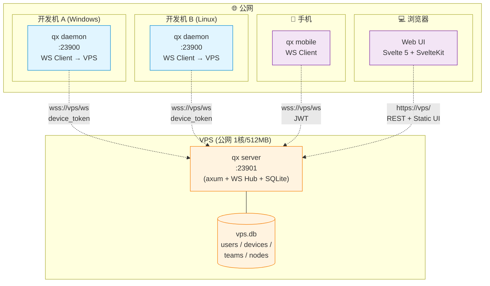

**关键路径**:
- Dev 机 (Daemon) → VPS: **双向 WS**, 30s 心跳, 设备 token 认证
- 手机 (qx mobile) → VPS: **双向 WS**, JWT 认证, 接收推送
- 浏览器 (Web UI) → VPS: **REST + 静态文件** (`/_ui/*`), JWT 存 localStorage
- Dev 机本地 (Daemon 自己的 Web UI) → Daemon: `127.0.0.1:23900` (**不走 VPS**, 直接访问)

### 3.2 VPS 进程结构

```
┌────────────────────────────────────────────────────────────────────────┐
│  qx server (single binary, 端口 23901)                                 │
│                                                                        │
│  ┌─ HTTP Layer (axum 0.8) ──────────────────────────────────────────┐  │
│  │  ├─ Public: /api/health, /api/auth/*, /api/device/*             │  │
│  │  ├─ User (JWT):   /api/me, /api/me/devices, /api/me/teams       │  │
│  │  ├─ Team:         /api/teams/*, /api/projects/*                 │  │
│  │  ├─ Admin:        /api/admin/*                                  │  │
│  │  ├─ Static:       /_ui/* (Svelte 5 build)                       │  │
│  │  └─ WebSocket:    GET /ws?token=... (升级)                      │  │
│  │  Middleware: TraceLayer + Timeout + RateLimit + Cors            │  │
│  └────────────────────────────────────────────────────────────────┘  │
│                                                                        │
│  ┌─ WebSocket Hub (server/ws_hub.rs) ──────────────────────────────┐   │
│  │  ├─ ConnectionRegistry (DashMap<NodeId, DaemonConn>)           │   │
│  │  ├─ ConnectionRegistry (DashMap<UserId, Vec<AppConn>>)         │   │
│  │  ├─ HeartbeatManager (30s ping, 90s timeout)                   │   │
│  │  ├─ MessageRouter (app → node, node → app fanout)              │   │
│  │  ├─ CommandForwarder (request_id 关联, 限流, 超时)             │   │
│  │  └─ NodeStatusBroadcaster (online/offline → 所有 App)          │   │
│  └────────────────────────────────────────────────────────────────┘   │
│                                                                        │
│  ┌─ Persistence Layer (rusqlite + bundled SQLite) ─────────────────┐  │
│  │  Schema v3 (见附录 A, 11 张表)                                  │  │
│  │  UserRepository / DeviceRepository / AuthCodeRepository         │  │
│  │  TeamRepository / NodeRepository / SessionRepository            │  │
│  └────────────────────────────────────────────────────────────────┘  │
│                                                                        │
│  ┌─ Auth / Crypto Module ───────────────────────────────────────────┐  │
│  │  Argon2id (password) / JWT HS256 / SHA256 (device_token hash)   │  │
│  └────────────────────────────────────────────────────────────────┘  │
└────────────────────────────────────────────────────────────────────────┘
```

### 3.3 与 Daemon 的关系 (Track A)

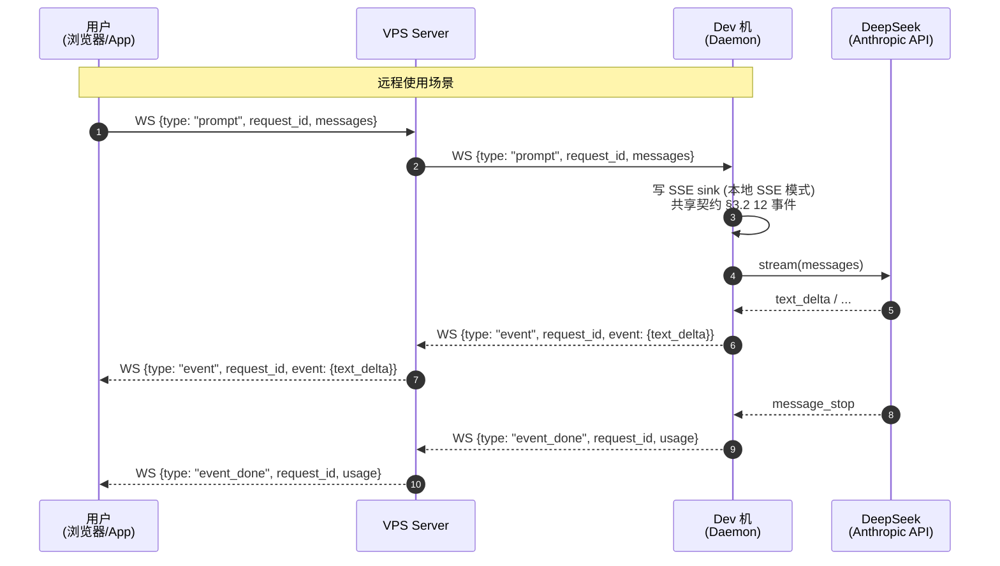

**关键不变量**:
- VPS 不知道 LLM 存在 — 它只看到 `{type: "prompt", messages: [...]}` 进, 看到 `{type: "event", event: ...}` 出
- Daemon 是 LLM 的客户, 拥有 API Key; VPS 没有
- 流式事件不缓存: VPS 只做"信封中转", 不在 SQLite 里写任何 prompt/response
- Daemon 端实际通过本地 SSE (Track A 决定) 与 AgentLoop 通信, **WS 是 VPS↔Daemon 的外层协议**

### 3.4 与 Tauri 桌面的关系 (Track C)

| 组件 | Tauri 桌面 | VPS Web | 区别 |
|---|---|---|---|
| 后端 | 本地 Daemon (`127.0.0.1:23900`) | VPS (公网) | Tauri 不走 VPS |
| 协议 | HTTP + SSE | WebSocket | Tauri 不需要 WS(无远控场景) |
| 认证 | 无 (localhost only) | JWT (用户登录) | Tauri 是单用户, VPS 是多用户 |
| 持久化 | Daemon SQLite | VPS SQLite (users/teams/nodes) | 数据互不重叠 |

**Tauri 是否连接 VPS?** — **可选**, 仅在"用手机控制桌面"场景需要 (Tauri 当 client, 像
手机 App 一样连 VPS).

---

## 4. 用户与认证

### 4.1 User 模型

```sql
-- 完整 DDL 见附录 A, 此处只展示核心字段
CREATE TABLE users (
    id              TEXT PRIMARY KEY,         -- "user_xxx" (uuid v4)
    email           TEXT NOT NULL UNIQUE,     -- 主标识
    display_name    TEXT NOT NULL,
    password_hash   TEXT NOT NULL,            -- argon2id hash
    role            TEXT NOT NULL DEFAULT 'developer',  -- 'owner'|'admin'|'developer'|'viewer'
    created_at      TEXT NOT NULL,            -- ISO 8601 UTC
    last_login_at   TEXT,
    disabled        INTEGER NOT NULL DEFAULT 0,  -- 软删除
    disabled_at     TEXT,
    disabled_reason TEXT
);
```

> **v0.2 升级**: 旧版用 `username` 字段, v1.0 改为 `email` (符合 OAuth 习惯). 数据迁移见 §12.6.

### 4.2 角色矩阵

| 角色 | 创建用户 | 创建 team | 邀请成员 | 查看节点 | 下发命令 | 设备授权 |
|---|---|---|---|---|---|---|
| `owner` | ✅ | ✅ | ✅ | ✅ (全部) | ✅ | ✅ |
| `admin` | ✅ | ✅ | ✅ | ✅ (全部) | ✅ | ✅ |
| `developer` | ❌ | ❌ | ❌ (只能加入) | 仅自己名下 | ✅ | ✅ |
| `viewer` | ❌ | ❌ | ❌ | 仅自己名下 | ❌ (只读) | ✅ |

**`disabled=1` 的用户**: 所有 JWT 立即失效 (VPS 启动时建立 in-memory `revoked` set, 见 §4.5).

### 4.3 JWT 设计

**双 Token 模型** (类似 OAuth 2.0):

| Token | 用途 | 有效期 | 存储 | 撤销机制 |
|---|---|---|---|---|
| `access_token` | 每次 REST/WS 请求携带 | **1 小时** | 浏览器 `localStorage`, 内存 (App) | 服务器 in-memory `revoked_jti` (TTL 1h) |
| `refresh_token` | 换新 access_token | **30 天** | `localStorage`, 设备加密 | DB 持久化, 旋转 (refresh 一次旧的即失效) |

**Claims (`access_token`)**:

```json
{
  "sub": "user_abc123",
  "email": "alice@example.com",
  "role": "developer",
  "teams": ["team_xxx", "team_yyy"],
  "iat": 1717228800,
  "exp": 1717232400,
  "jti": "jwt_xxx_uuid"
}
```

**Claims (`refresh_token`)**:

```json
{ "sub": "user_abc123", "type": "refresh", "iat": 1717228800, "exp": 1719830400, "jti": "refresh_xxx" }
```

**签名算法**: **HS256** (HMAC-SHA256), 密钥从环境变量 `QXVPS_JWT_SECRET` 读取 (≥ 256 bit).
> **为什么不用 RS256?** 单 VPS 实例, 不需要跨服务验证; HS256 性能更好, 密钥轮换通过"双 secret"
> 机制平滑过渡 (§4.5).

### 4.4 Argon2 密码哈希

```rust
// qianxun/src/server/auth.rs
use argon2::{Argon2, PasswordHash, PasswordHasher, PasswordVerifier};
use argon2::password_hash::{SaltString, rand_core::OsRng};

pub fn hash_password(password: &str) -> Result<String, AuthError> {
    // Argon2id 是 OWASP 推荐
    // 默认参数: m=19456 (19MB), t=2, p=1 → 1 核 VPS ~50ms
    let salt = SaltString::generate(&mut OsRng);
    let hash = Argon2::default()
        .hash_password(password.as_bytes(), &salt)
        .map_err(|e| AuthError::HashingFailed(e.to_string()))?
        .to_string();
    Ok(hash)
}

pub fn verify_password(password: &str, hash: &str) -> bool {
    let parsed = match PasswordHash::new(hash) { Ok(p) => p, Err(_) => return false };
    Argon2::default().verify_password(password.as_bytes(), &parsed).is_ok()
}
```

**Cargo.toml 依赖确认**:

```toml
# qianxun/Cargo.toml
[dependencies]
argon2 = { version = "0.5", features = ["std"] }
rand_core = { version = "0.6", features = ["std"] }  # OsRng
```

> **历史问题**: v0.2 注释提到"argon2 TODO: add when rand_core version conflict resolved".
> 解法: `argon2 = "0.5"` 配 `rand_core = "0.6"` + `rand_core::OsRng` (不引入完整 `rand` crate).
> 已在 `qianxun-memory` 用过同样模式, 无冲突. 验证命令: `cargo tree -p qianxun | grep -E "rand|argon2"`.

### 4.5 Session 失效流程

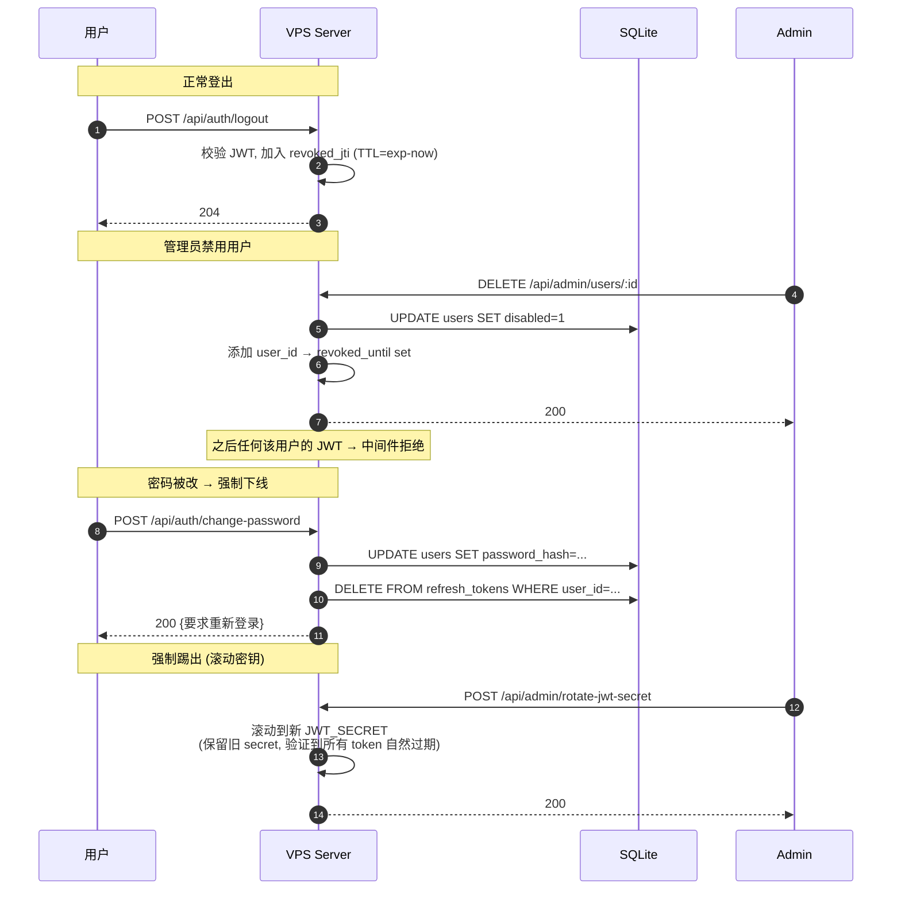

**关键实现** (`server/auth.rs::JwtVerifier`):

```rust
pub struct JwtVerifier {
    current_secret: Arc<Vec<u8>>,
    previous_secret: Option<Arc<Vec<u8>>>,  // 滚动期保留
    revoked_jti: Arc<DashMap<String, Instant>>,    // jti → 过期时间
    revoked_users: Arc<DashMap<String, Instant>>,  // user_id → 失效时间
}

impl JwtVerifier {
    pub fn verify(&self, token: &str) -> Result<Claims, AuthError> {
        // 1. 主密钥, 失败再试 previous_secret
        let claims = self.verify_with(token, &self.current_secret)
            .or_else(|_| self.previous_secret.as_ref()
                .ok_or(AuthError::InvalidToken)
                .and_then(|s| self.verify_with(token, s)))?;
        // 2. 检查 jti/user 撤销
        for (set, err) in [
            (&self.revoked_jti, AuthError::TokenRevoked),
            (&self.revoked_users, AuthError::UserDisabled),
        ] {
            if let Some(exp) = set.get(&claims.jti).or_else(|| set.get(&claims.sub)).value() {
                if Instant::now() < *exp { return Err(err); }
            }
        }
        Ok(claims)
    }
    
    async fn cleanup_loop(&self) {  // 1 分钟一次清理过期撤销
        let mut interval = tokio::time::interval(Duration::from_secs(60));
        loop {
            interval.tick().await;
            let now = Instant::now();
            self.revoked_jti.retain(|_, v| *v > now);
            self.revoked_users.retain(|_, v| *v > now);
        }
    }
}
```

### 4.6 限流

| 端点 | 限制 | 触发动作 |
|---|---|---|
| `POST /api/auth/login` | 10 次/分钟/IP | 429 Too Many Requests |
| `POST /api/auth/refresh` | 60 次/分钟/user | 429 |
| `POST /api/device/auth-code` | 30 次/小时/IP (防滥用) | 429 |
| `POST /api/admin/*` | 600 次/分钟/user | 429 |
| 其他 | 600 次/分钟/user | 429 |

**实现**: 进程内 `governor` crate (token bucket), 单 VPS 实例无跨节点限流需求.

---

## 5. Device 授权流程

### 5.1 完整序列图 (OAuth 2.0 Device Authorization Grant)

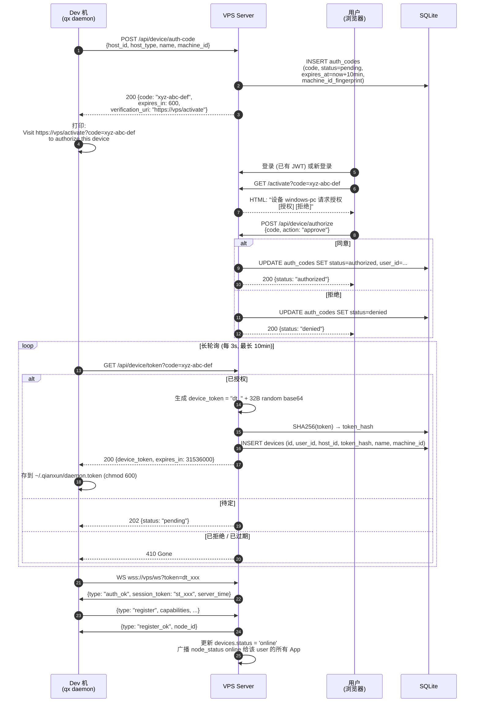

### 5.2 device_code 生命周期

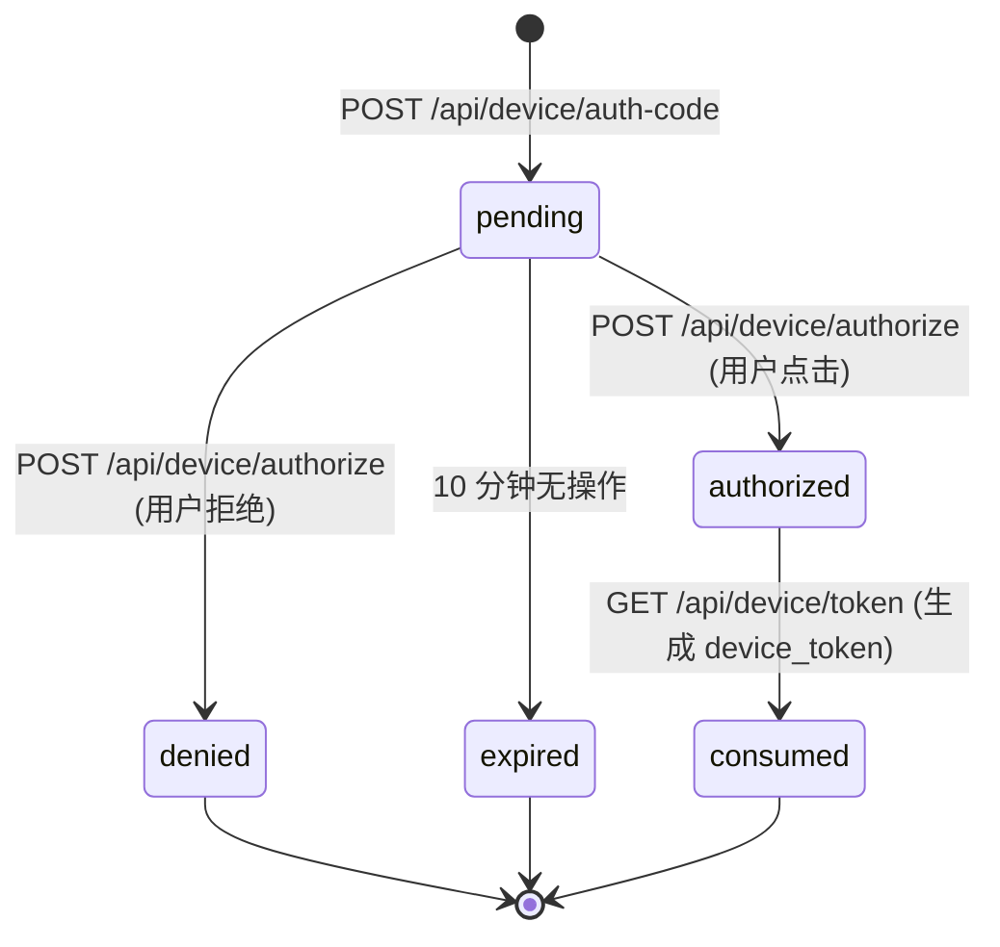

**关键不变量**:
- `code` 一次性, 消费后立即从内存 + DB 清除 (避免重放)
- 同一 `machine_id` 二次授权: 走"重新授权"流程, 旧 device 标 `disabled=1`, 新 device 创建
- 同 `host_id` 但不同 `machine_id` 尝试授权: **拒绝** (防 device_token 钓鱼)
- 用户拒绝 → 该 `host_id` 1 小时内不能再次请求授权

### 5.3 简化路径 (单用户单机)

```bash
# 管理员预先颁发 token, 写入 config
qx server admin create-device --user alice --name "办公台式" --host-id win-pc-01
# → device_token: dt_abc123
# 写入 Daemon 配置
echo '{"vps": {"server_url": "wss://vps.example.com:23901/ws", "device_token": "dt_abc123"}}' \
  > ~/.qianxun/config.json
# 启动 Daemon
qx daemon
# → 跳过授权流程, 直接 WS 连接
```

> **何时使用简化路径?**
> - 个人开发者, 只有一台机器: 没必要走 Web 授权
> - CI/CD 环境的无头 Daemon: 没有浏览器可点击
> - 团队内批量预置: 管理员生成 token, 分发给团队成员

### 5.4 失败恢复

| 失败场景 | VPS 行为 | Daemon 行为 |
|---|---|---|
| 用户 10 分钟内未操作 | auth_code 标 `expired` | 轮询到 410 Gone, 提示用户超时 |
| 用户拒绝 | auth_code 标 `denied` | 轮询到 410 Gone, 提示用户拒绝 |
| 网络中断, Daemon 没收到 token | VPS 仍保存 `consumed` 状态 (5 分钟) | 重连后 5 分钟内轮询仍返回 token |
| Daemon 丢失 token 文件 | 重新走授权流程 | 打印"需要重新授权" |
| Token 文件泄露 | 管理员吊销 | 用户在 Web UI 点击"取消授权" → `devices.disabled=1` |

---

## 6. WebSocket Hub

> **核心**: WebSocket Hub 是 VPS 的"神经系统" —— 所有 Daemon 注册、所有 App 推送、所有命令中转
> 都在此发生. 本节是本文档最重要的部分.

### 6.1 双连接管理

```rust
// qianxun/src/server/ws_hub.rs
use dashmap::DashMap;
use std::sync::Arc;
use tokio::sync::mpsc;

pub struct WsHub {
    // === Daemon 连接 (per node) ===
    pub daemons: DashMap<String, DaemonConn>,           // node_id → Daemon connection
    // === App 连接 (per user, 多端) ===
    pub apps: DashMap<String, Vec<AppConn>>,            // user_id → 该用户所有 App
    // === 共享资源 ===
    pub node_by_token: DashMap<String, String>,         // token_hash → node_id (O(1) 验证)
    pub pending_commands: DashMap<String, PendingCommand>,  // request_id → 等待回包
    pub hub_tx: mpsc::UnboundedSender<HubCommand>,      // 给 Hub 内部任务的下发通道
    // === 持久化引用 ===
    pub db: Arc<Mutex<rusqlite::Connection>>,
    pub jwt_verifier: Arc<JwtVerifier>,
    pub rate_limiter: Arc<RateLimiter>,
}

pub struct DaemonConn {
    pub node_id: String,                                // "node_xxx"
    pub user_id: String,                                // 设备主人
    pub device_id: String,                              // "dev_xxx"
    pub host_id: String,                                // "windows-pc-01"
    pub host_type: String,                              // "windows" | "linux" | "macos"
    pub name: String,
    pub capabilities: Vec<String>,                      // ["chat", "tools", "read_file"]
    pub status: NodeStatus,                             // Online | Busy | Away | Offline
    pub last_heartbeat: Instant,
    pub last_event_seq: u64,                            // 用于检测漏包
    pub outbound_tx: mpsc::UnboundedSender<WsMessage>,  // 写循环专用通道
    pub pending_outbox: VecDeque<WsMessage>,            // 未送达消息缓冲 (最多 256)
    pub rate_token: RateTokenBucket,                    // 每节点限流
}

pub struct AppConn {
    pub app_id: String,                                 // "app_xxx" (每次连接生成)
    pub user_id: String,
    pub device_info: AppDeviceInfo,                     // "iPhone 15" / "Chrome 120 on Mac"
    pub connected_at: Instant,
    pub last_pong: Instant,
    pub outbound_tx: mpsc::UnboundedSender<WsMessage>,
}

pub struct PendingCommand {
    pub request_id: String,
    pub from_user_id: String,                           // 谁发起
    pub from_app_id: String,                            // 哪个 App
    pub target_node_id: String,                         // 目标节点
    pub session_id: Option<String>,                     // 关联的 session
    pub started_at: Instant,
    pub timeout_at: Instant,                            // 60s 后超时
    pub cancel_tx: mpsc::UnboundedSender<()>,           // 取消信号
}
```

### 6.2 连接表设计 (内存 + SQLite 持久化)

**内存表** (热数据, 高频查询):
- `daemons: DashMap<node_id, DaemonConn>` — 当前在线的 Daemon
- `apps: DashMap<user_id, Vec<AppConn>>` — 当前在线的 App
- `node_by_token: DashMap<token_hash, node_id>` — WS 握手时 O(1) 验证
- `pending_commands: DashMap<request_id, PendingCommand>` — 进行中的命令

**SQLite 表** (冷数据, 启动恢复):
- `devices` — 设备元数据 + 持久状态 (见附录 A)
- `ws_connections` — 历史连接记录 (审计)
- `node_status_history` — 状态变更历史 (可查询过去 30 天)

**启动恢复流程** (`ws_hub.rs::WsHub::load_from_db`):

```rust
impl WsHub {
    pub async fn load_from_db(db: &Connection) -> Result<Self> {
        let hub = WsHub::new(db);
        // 1. 加载所有未禁用的 device, 填充 node_by_token (为重连加速)
        let mut stmt = db.prepare(
            "SELECT id, token_hash FROM devices WHERE disabled = 0"
        )?;
        let devices: Vec<(String, String)> = stmt
            .query_map([], |row| Ok((row.get(0)?, row.get(1)?)))?
            .filter_map(|r| r.ok())
            .collect();
        for (id, hash) in devices {
            hub.node_by_token.insert(hash, id);
        }
        // 2. 全部标 offline (启动时无连接)
        db.execute("UPDATE devices SET status = 'offline', last_seen = NULL WHERE status != 'offline'", [])?;
        Ok(hub)
    }
}
```

### 6.3 心跳机制

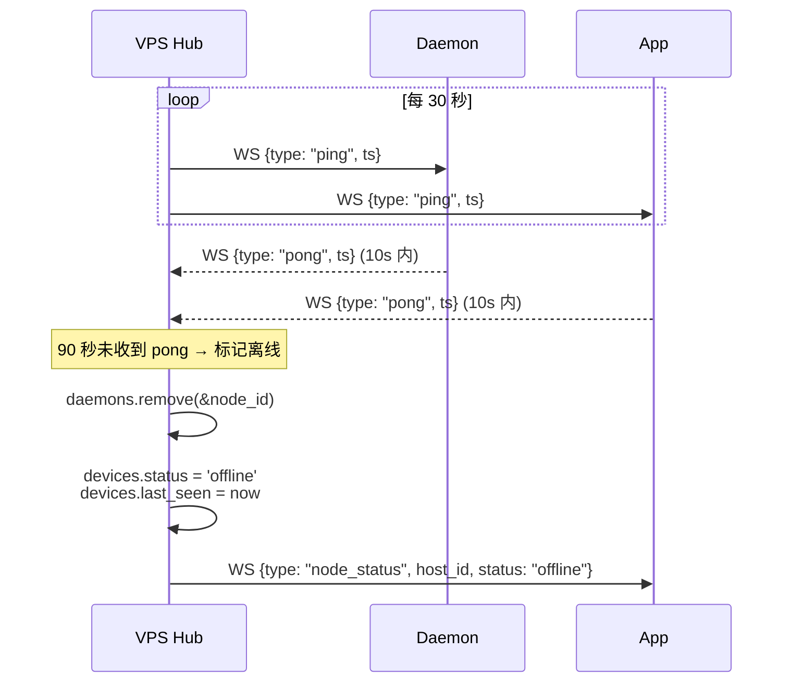

**实现** (`ws_hub.rs::HeartbeatManager`):

```rust
pub struct HeartbeatManager { ping_interval: Duration, pong_timeout: Duration }

impl HeartbeatManager {
    pub async fn run(self: Arc<Self>, hub: Arc<WsHub>) {
        let mut interval = tokio::time::interval(self.ping_interval);
        loop {
            interval.tick().await;
            self.ping_all(&hub).await;
            self.check_timeouts(&hub).await;
        }
    }
    
    async fn ping_all(&self, hub: &WsHub) {
        let now = Instant::now();
        for mut entry in hub.daemons.iter_mut() {
            let conn = entry.value_mut();
            let _ = conn.outbound_tx.send(WsMessage::Ping { ts: now.unix_timestamp() });
        }
    }
    
    async fn check_timeouts(&self, hub: &WsHub) {
        let now = Instant::now();
        let to_remove: Vec<String> = hub.daemons.iter()
            .filter(|e| now.duration_since(e.value().last_heartbeat) > self.pong_timeout)
            .map(|e| e.key().clone()).collect();
        for node_id in to_remove { hub.mark_offline(&node_id).await; }
    }
}
```

**双向 ping-pong 模式**: VPS 主动 ping, 客户端必须 pong. 客户端也可以主动 ping (VPS 收到
后立即回 pong, 不影响自己的定时 ping).

### 6.4 消息路由

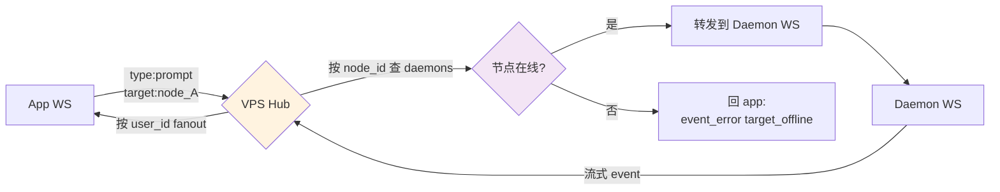

#### 6.4.1 完整消息类型处理表 (与 `_shared-contract.md` §3.3 一一对应)

> **强制约定**: 任何消息都必须包含 `request_id` (关联一次完整调用). 控制消息 (ping/pong/
> register) 可省略.

| 方向 | 消息类型 | 处理逻辑 (摘要) | 错误码 |
|---|---|---|---|
| **认证** ||||
| D→V | `auth` | 校验 `device_token` (SHA256 查表), 查 `devices` 拿 `user_id`/`device_id`, 分配 `node_id`, 启动 DaemonConn 写循环 | `invalid_token` / `expired` / `disabled` |
| V→D | `auth_ok` | `{session_token, server_time, server_version}` | — |
| V→D | `auth_error` | `{code, message}`, 关闭连接 | `invalid_token` / `expired` / `device_disabled` |
| **注册** ||||
| D→V | `register` | 存 `capabilities` 到内存, 持久化到 devices, 标记 `status='online'`, 广播 `node_status` 给该 user 的所有 App | — |
| V→D | `register_ok` / `register_error` | `{node_id}` / `{code}` | `version_too_old` / `capability_denied` |
| **心跳** ||||
| D→V | `heartbeat` | 更新 `last_heartbeat = now`, 推回 `heartbeat_ack` | — |
| V→D | `heartbeat_ack` / `ping` | 透传 `ts` / 客户端必须 10s 内回 `pong` | — |
| D→V | `pong` | 重置 `last_pong` | — |
| **命令中转** (核心) ||||
| A→V | `prompt` | 验证 user 权限 + 限流 (30/min) + 创建 `PendingCommand {request_id, timeout=now+60s}` + 转发到目标 Daemon | `rate_limited` / `target_offline` / `permission_denied` |
| V→D | `prompt` | 转发 A→V 的 prompt, 加 `stream_to_vps: true` | — |
| D→V | `event` | 查 `pending_commands[request_id]`, 更新 `last_event_seq`, fanout 给所有发起 App | `unknown_request_id` |
| V→A | `event` | 透传, 加 `request_id` | — |
| D→V | `event_done` | 删 `pending_commands[request_id]`, 写 audit log, fanout 给 App | — |
| V→A | `event_done` | 透传, 加 `usage` 字段 | — |
| D→V | `event_error` | 同 `event_done` + code/message | `internal` / `api_error` / `timeout` |
| V→A | `event_error` | 透传 | — |
| **取消** ||||
| A→V | `cancel` | 查 `pending_commands[request_id]`, 验证 user, 转发 `cancel` 到 Daemon, 5s 后强删 | — |
| V→D | `cancel` | 透传 | — |
| **状态** ||||
| V→A | `node_status` / `node_list` | VPS 主动推送 / 应答 App 查询 | — |
| A→V | `node_list` | 返回该 user 所有节点 (含 offline) | — |
| **错误** ||||
| V→* | `error` | `{code, message, request_id?}` codes: `auth_required` / `rate_limited` / `internal` / `protocol_error` | — |
| D→V | `error` | Daemon 上报错误 | — |

#### 6.4.2 消息 JSON 完整定义

**基于 shared-contract §3.3, 补全字段含义/约束, 扩展字段见 §11.4 扩展清单**:

```json
// === auth (Daemon → VPS) ===
{ "type": "auth", "device_token": "dt_xxxxxxxxxxxxxxxxxxxxxxxxxxxx", "machine_id": "sha256:abc...", "protocol_version": 1 }

// === auth_ok (VPS → Daemon) ===
// 与 shared-contract §3.3 一致: 返回 session_token (用于后续 register 心跳帧认证).
// 注意: node_id 在 register_ok 帧返回, 不在 auth_ok.
{ "type": "auth_ok", "session_token": "st_xxx", "server_time": "2026-06-01T22:00:00Z", "server_version": "0.3.0", "heartbeat_interval_ms": 30000 }

// === register (Daemon → VPS) ===
{ "type": "register", "device_id": "dev_xxx", "name": "办公台式", "host_type": "windows", "host_id": "windows-pc-01", "tags": ["workstation", "primary"], "capabilities": ["chat", "tools", "read_file", "write_file", "terminal"], "daemon_version": "0.3.0", "os": "windows-11-23H2", "cpu_cores": 16, "memory_mb": 32768 }

// === prompt (App → VPS → Daemon) ===
{ "type": "prompt", "request_id": "req_xxx", "session_id": "sess_xxx", "target_node_id": "node_xxx", "messages": [{"role": "user", "content": "..."}], "model": "deepseek-v4-flash", "max_tokens": 16384, "temperature": 0.0, "stream_to_vps": true, "tools_enabled": true, "attachments": [] }

// === event (Daemon → VPS → App) ===
{ "type": "event", "request_id": "req_xxx", "seq": 1, "event": { "type": "content_block_start", "index": 0, "block_type": "text" } }

// === event_done (Daemon → VPS → App) ===
{ "type": "event_done", "request_id": "req_xxx", "elapsed_ms": 12345, "usage": { "input_tokens": 1234, "output_tokens": 567, "cache_creation_input_tokens": 0, "cache_read_input_tokens": 0 }, "stop_reason": "end_turn" }

// === event_error (Daemon → VPS → App) ===
{ "type": "event_error", "request_id": "req_xxx", "code": "rate_limit" | "auth" | "api_error" | "internal" | "node_offline", "message": "...", "retry_after_ms": 60000 }

// === cancel (App → VPS → Daemon) ===
{ "type": "cancel", "request_id": "req_xxx" }

// === node_status (VPS → App) ===
{ "type": "node_status", "node_id": "node_xxx", "host_id": "windows-pc-01", "status": "online" | "offline" | "busy" | "away", "last_seen": "2026-06-01T22:00:00Z", "active_requests": 0 }
```

> **关键**: `event.event` 字段必须使用 `_shared-contract.md` §3.2 定义的 12 种 SSE 事件 schema
> (message_start, content_block_start, text_delta, ...). Track A 实施, Track B 转发, Track C 消费.

### 6.5 重连与缓冲

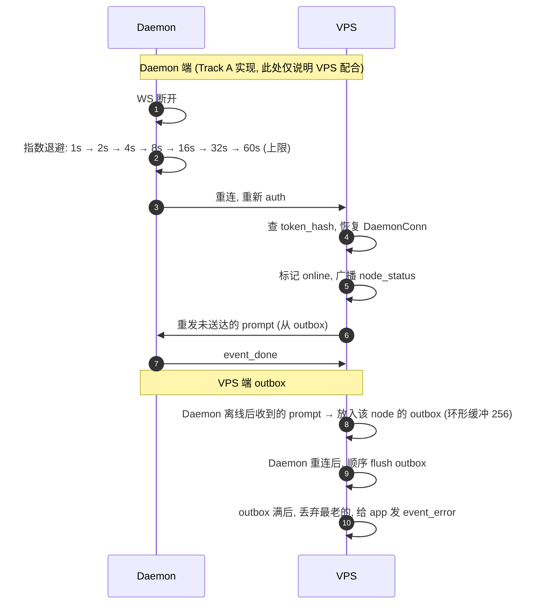

**VPS 端 outbox 实现** (`ws_hub.rs::Outbox`):

```rust
pub struct Outbox { capacity: usize, buffer: VecDeque<PendingOutbound> }
pub struct PendingOutbound { pub node_id: String, pub message: WsMessage, pub deadline: Instant }

impl Outbox {
    pub fn enqueue(&mut self, item: PendingOutbound) -> Result<(), OutboxError> {
        if Instant::now() > item.deadline { return Err(OutboxError::Expired); }
        if self.buffer.len() >= self.capacity {
            self.buffer.pop_front();
            metrics::OUTBOX_DROPPED.inc();
        }
        self.buffer.push_back(item);
        Ok(())
    }
    pub fn drain_for(&mut self, node_id: &str) -> Vec<WsMessage> {
        self.buffer.extract_if(.., |p| p.node_id == node_id).map(|p| p.message).collect()
    }
}
```

**重连幂等保证**:
- `request_id` 是 UUID v4, 客户端生成, 全链路唯一
- Daemon 重连后, 同一 `request_id` 的未完成命令: Daemon 决定是"重发"还是"丢弃" (看 LLM 状态)
- VPS 不假设任何幂等性, 只负责消息路由

### 6.6 限流策略

| 维度 | 限制 | 实现 |
|---|---|---|
| **连接数/用户** | 5 个 App 并发 | in-memory counter |
| **连接数/IP** | 10 个 WS 并发 | in-memory counter (防滥用) |
| **prompt/user/min** | 30 次 | token bucket (governor) |
| **prompt/node/min** | 60 次 | 单节点也限流 (防 LLM provider 限速) |
| **消息大小** | 1 MB / 条 | axum 默认 `DefaultBodyLimit` |
| **消息速率/连接** | 100 msg/s | leaky bucket |

**限流触发响应**:

```json
{ "type": "error", "code": "rate_limited", "message": "Too many requests, slow down", "retry_after_ms": 2000 }
```

### 6.7 性能压测目标

| 指标 | 目标 | 测试方法 |
|---|---|---|
| 并发 WS 连接 | 100 个 (50 Daemon + 50 App) | `websocat` + bash 脚本 |
| 消息吞吐 | 1000 msg/s 持续 | `wrk` + 自定义 WS 脚本 |
| P99 消息延迟 | < 50ms (同 VPS) | tracing span timing |
| 单 prompt 端到端 | < 10ms (VPS 内部) | tracing + metrics |
| 内存占用 | < 200MB (100 连接空闲) | `ps aux` |
| 启动时间 | < 3s (含 SQLite 打开) | time 命令 |

---

## 7. Team 模型

> **服务端权威**: Track B (本文档) 是 Team/Project/Session 元数据的服务端权威.
> Track C (Tauri 桌面) 是消费方, Track A (Daemon) 只读 `project_id`/`team_id` 关联.

### 7.1 数据模型 (与 `_shared-contract.md` §6 完全一致)

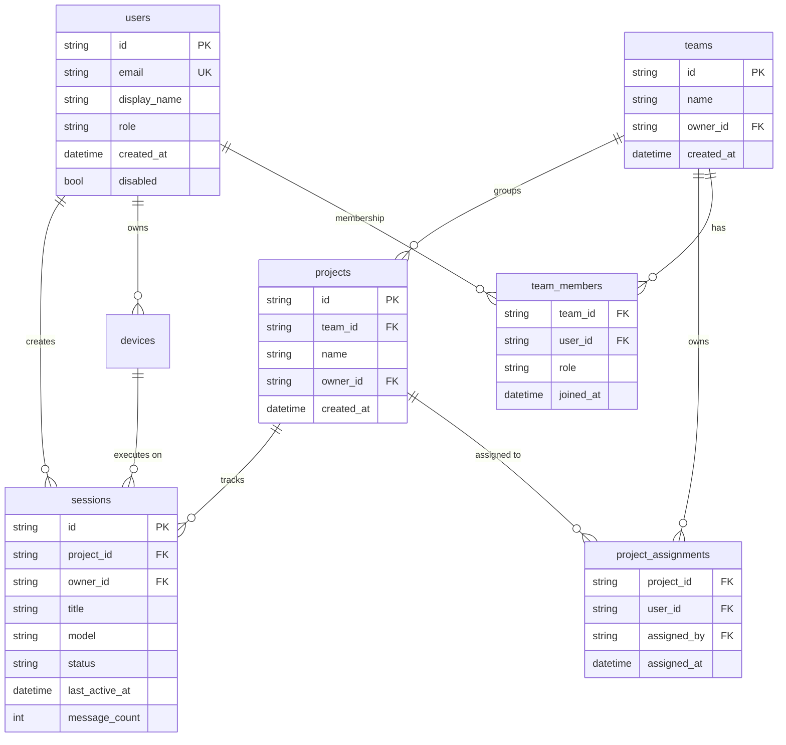

### 7.2 完整 DDL (核心 4 张表)

> **关键设计**: `team_members` ≠ `project_assignments` —— 团队成员**不自动**看到所有项目,
> 必须显式 `POST /api/projects/:id/assignments` 分配. 这是千寻的隐私边界: 个人项目可在同一
> team 但不被其他成员看到.

```sql
-- === teams ===
CREATE TABLE teams (
    id          TEXT PRIMARY KEY,         -- "team_xxx"
    name        TEXT NOT NULL,
    description TEXT,
    owner_id    TEXT NOT NULL REFERENCES users(id),
    created_at  TEXT NOT NULL,
    updated_at  TEXT NOT NULL
);
CREATE INDEX idx_teams_owner ON teams(owner_id);
CREATE UNIQUE INDEX idx_teams_name_per_owner ON teams(owner_id, name);

-- === team_members (membership 关系) ===
CREATE TABLE team_members (
    team_id        TEXT NOT NULL REFERENCES teams(id) ON DELETE CASCADE,
    user_id        TEXT NOT NULL REFERENCES users(id) ON DELETE CASCADE,
    role           TEXT NOT NULL DEFAULT 'developer',  -- 'owner'|'admin'|'developer'|'viewer'
    joined_at      TEXT NOT NULL,
    last_active_at TEXT,
    PRIMARY KEY (team_id, user_id)
);
CREATE INDEX idx_team_members_user ON team_members(user_id);
CREATE INDEX idx_team_members_role ON team_members(role);

-- === projects ===
CREATE TABLE projects (
    id              TEXT PRIMARY KEY,     -- "proj_xxx"
    team_id         TEXT NOT NULL REFERENCES teams(id) ON DELETE CASCADE,
    name            TEXT NOT NULL,
    path            TEXT NOT NULL,        -- 工作目录 (与 shared-contract §6 Project.path 对齐)
    description     TEXT,
    owner_id        TEXT NOT NULL REFERENCES users(id),
    primary_node_id TEXT,                 -- "node_xxx" (软引用)
    created_at      TEXT NOT NULL,
    updated_at      TEXT NOT NULL,
    archived        INTEGER NOT NULL DEFAULT 0,
    archived_at     TEXT
);
CREATE INDEX idx_projects_team ON projects(team_id);
CREATE INDEX idx_projects_owner ON projects(owner_id);
CREATE UNIQUE INDEX idx_projects_name_per_team ON projects(team_id, name) WHERE archived = 0;

-- === project_assignments (显式分配) ===
CREATE TABLE project_assignments (
    project_id   TEXT NOT NULL REFERENCES projects(id) ON DELETE CASCADE,
    user_id      TEXT NOT NULL REFERENCES users(id) ON DELETE CASCADE,
    role         TEXT NOT NULL DEFAULT 'developer',  -- 'editor'|'viewer'
    assigned_by  TEXT NOT NULL REFERENCES users(id),
    assigned_at  TEXT NOT NULL,
    PRIMARY KEY (project_id, user_id)
);
CREATE INDEX idx_project_assignments_user ON project_assignments(user_id);
```

**Sessions 表** (VPS 只存关联, 内容在 Daemon):

```sql
CREATE TABLE sessions (
    id              TEXT PRIMARY KEY,         -- "sess_xxx"
    project_id      TEXT NOT NULL REFERENCES projects(id) ON DELETE CASCADE,
    owner_id        TEXT NOT NULL REFERENCES users(id),
    title           TEXT NOT NULL,
    model           TEXT NOT NULL,
    status          TEXT NOT NULL DEFAULT 'active',  -- 'active'|'idle'|'archived'
    created_at      TEXT NOT NULL,
    last_active_at  TEXT NOT NULL,
    message_count   INTEGER NOT NULL DEFAULT 0,
    node_id         TEXT,                     -- 上次执行该 session 的节点 (软引用)
    -- messages[] 内容由 Daemon 持有, VPS 不存
    FOREIGN KEY (node_id) REFERENCES devices(node_id) ON DELETE SET NULL
);
CREATE INDEX idx_sessions_project ON sessions(project_id);
CREATE INDEX idx_sessions_owner ON sessions(owner_id);
CREATE INDEX idx_sessions_status ON sessions(status);
```

> **VPS vs Daemon 分工**: Session 的 `messages[]` 由 Track A 的 Daemon 持久化 (使用
> `qianxun-memory` 的 SQLite + FTS5), VPS 只存 `id/project_id/owner_id/title/model/status` 元数据
> 和最近活跃时间. 这样 App 列表页只查 VPS, 详情页按 `session_id` 转 Daemon.

### 7.3 CRUD Endpoints

| Method | Path | 角色 | 说明 |
|---|---|---|---|
| `GET` | `/api/me/teams` | user | 当前用户参与的所有 team |
| `POST` | `/api/teams` | admin | 创建 team, 初始 owner 是创建者 |
| `GET` | `/api/teams/:id` | team member | 详情 (含 members 列表) |
| `PATCH` | `/api/teams/:id` | team admin | 改名/描述 |
| `DELETE` | `/api/teams/:id` | team owner | 软删除 (30 天可恢复) |
| `POST` | `/api/teams/:id/members` | team admin | 邀请成员 (传 email) |
| `DELETE` | `/api/teams/:id/members/:user_id` | team admin | 移除成员 |
| `PATCH` | `/api/teams/:id/members/:user_id` | team admin | 修改成员角色 |
| `GET` | `/api/teams/:id/projects` | team member | 列出 team 下项目 |
| `POST` | `/api/teams/:id/projects` | team admin | 创建项目 |
| `GET` | `/api/projects/:id` | assigned | 详情 |
| `PATCH` | `/api/projects/:id` | assigned editor | 改名/描述/primary_node |
| `DELETE` | `/api/projects/:id` | assigned editor | 归档 (soft delete) |
| `POST` | `/api/projects/:id/assignments` | project editor | 分配成员 |
| `DELETE` | `/api/projects/:id/assignments/:user_id` | project editor | 取消分配 |
| `GET` | `/api/projects/:id/sessions` | assigned | 列出关联 session |
| `POST` | `/api/projects/:id/sessions` | assigned | 创建 session (即转发到 Daemon) |

### 7.4 权限校验 (服务端强制)

```rust
// server/teams.rs::AuthorizationLayer
pub struct TeamAuth { pub user_id: String }

impl TeamAuth {
    /// 检查 user 是否是 team 的成员
    pub async fn require_team_member(&self, db: &Connection, team_id: &str) 
        -> Result<TeamMemberRole, AuthError> 
    {
        let role: String = db.query_row(
            "SELECT role FROM team_members WHERE team_id = ?1 AND user_id = ?2",
            rusqlite::params![team_id, self.user_id], |row| row.get(0)
        ).map_err(|_| AuthError::NotTeamMember)?;
        Ok(TeamMemberRole::from_str(&role))
    }
    
    /// 检查 user 是否被分配到 project
    pub async fn require_project_access(&self, db: &Connection, project_id: &str) 
        -> Result<(), AuthError> 
    {
        let exists: bool = db.query_row(
            "SELECT 1 FROM project_assignments WHERE project_id = ?1 AND user_id = ?2 LIMIT 1",
            rusqlite::params![project_id, self.user_id], |_| Ok(true)
        ).optional()?.unwrap_or(false);
        if !exists { return Err(AuthError::ProjectNotAssigned); }
        Ok(())
    }
}

// 中间件: 所有 /api/teams/:id/* 路由
async fn require_team_membership(
    State(state): State<Arc<VpsState>>,
    Path(team_id): Path<String>,
    Extension(user): Extension<AuthUser>,
) -> Result<(), (StatusCode, String)> {
    let db = state.db.lock().unwrap();
    user.require_team_member(&db, &team_id).await
        .map_err(|e| (StatusCode::FORBIDDEN, e.to_string()))?;
    Ok(())
}
```

**权限矩阵** (服务端强制, 客户端无 override 权限):

| 操作 | team owner | team admin | team developer | project editor | project viewer |
|---|---|---|---|---|---|
| 查看 team 信息 | ✅ | ✅ | ✅ | ✅ | ✅ |
| 修改 team 信息 | ✅ | ✅ | ❌ | ❌ | ❌ |
| 添加 team 成员 | ✅ | ✅ | ❌ | ❌ | ❌ |
| 创建 project | ✅ | ✅ | ❌ | ❌ | ❌ |
| 查看 project 列表 | ✅ (全部) | ✅ (全部) | 仅 assigned | ✅ | ✅ |
| 修改 project | ✅ | ✅ | ❌ | ✅ | ❌ |
| 分配 project 成员 | ✅ | ✅ | ❌ | ✅ | ❌ |
| 创建 session | ✅ | ✅ | ❌ | ✅ | ❌ |
| 查看 session | ✅ | ✅ | 仅自己的 | ✅ | ✅ |
| 下发 prompt 到 session | ✅ | ✅ | 仅自己的 | ✅ | ❌ |

### 7.5 Track C 兼容性

Tauri 桌面 (`03-tauri-desktop.md`) 只消费元数据子集, **不**消费 `messages`/`path` 等运行时数据:

| 模型 | Tauri 使用 | Tauri 不使用 |
|---|---|---|
| Project | `id, name, description, team_id, owner_id` | `path` (Tauri 只看元数据) |
| Session | `id, project_id, title, status, model, message_count, last_active_at` | `messages[]` (Daemon 持有) |
| Team / TeamMember | 全部 | — |
| ProjectAssignment | 全部 (用于过滤可见项目) | — |

> Tauri 通过 `GET /api/me/teams?include=projects,sessions` 拉取. 详见 Track C 文档.

---

## 8. 节点发现

### 8.1 节点注册流程

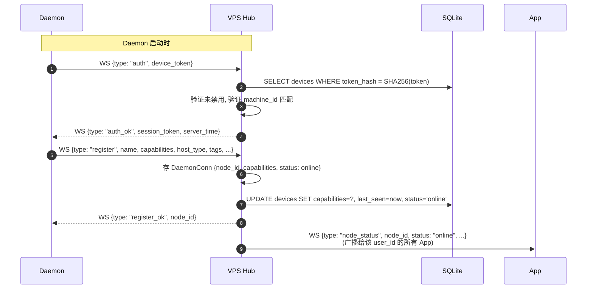

### 8.2 节点元数据

```sql
-- 节点信息存储在 devices 表, 加几个 VPS-only 字段
ALTER TABLE devices ADD COLUMN node_id TEXT UNIQUE;        -- "node_xxx" VPS 分配
ALTER TABLE devices ADD COLUMN tags TEXT NOT NULL DEFAULT '[]';   -- JSON array
ALTER TABLE devices ADD COLUMN os TEXT;
ALTER TABLE devices ADD COLUMN cpu_cores INTEGER;
ALTER TABLE devices ADD COLUMN memory_mb INTEGER;
ALTER TABLE devices ADD COLUMN daemon_version TEXT;

CREATE INDEX idx_devices_node_id ON devices(node_id);
```

### 8.3 Node Registry API

| Method | Path | 角色 | 说明 |
|---|---|---|---|
| `GET` | `/api/me/nodes` | user | 当前用户的所有节点 (含 offline) |
| `GET` | `/api/me/nodes/:id` | user | 单节点详情 |
| `PATCH` | `/api/me/nodes/:id` | user | 修改 name / tags |
| `DELETE` | `/api/me/nodes/:id` | user | 取消授权 (禁用 device) |
| `GET` | `/api/admin/nodes` | admin | 所有节点 (跨用户) |
| `DELETE` | `/api/admin/nodes/:id` | admin | 强制下线 (踢 WS 连接) |

**响应格式** (`GET /api/me/nodes`):

```json
{
  "nodes": [
    {
      "node_id": "node_xxx", "device_id": "dev_xxx", "name": "办公台式",
      "host_id": "windows-pc-01", "host_type": "windows",
      "tags": ["workstation", "primary"],
      "capabilities": ["chat", "tools", "read_file"],
      "status": "online", "last_seen": "2026-06-01T22:00:00Z",
      "connected_at": "2026-06-01T21:55:00Z",
      "daemon_version": "0.3.0", "os": "windows-11-23H2",
      "cpu_cores": 16, "memory_mb": 32768, "active_requests": 0
    }
  ],
  "online_count": 1, "total_count": 2
}
```

### 8.4 节点状态变更 (推送)

| 事件 | 触发时机 | 推送给 |
|---|---|---|
| `node_status: online` | Daemon auth + register 成功 | 该 user 的所有 App |
| `node_status: offline` | 90s 无心跳 / WS 主动断开 | 该 user 的所有 App |
| `node_status: busy` | active_requests > 3 | 该 user 的所有 App (可选) |
| `node_status: away` | 客户端主动标记 (Phase 5) | 该 user 的所有 App |

**实现** (`ws_hub.rs::NodeStatusBroadcaster`):

```rust
pub struct NodeStatusBroadcaster { hub: Arc<WsHub> }

impl NodeStatusBroadcaster {
    pub async fn broadcast_status_change(&self, node_id: &str, new_status: NodeStatus) {
        let daemon = match self.hub.daemons.get(node_id) {
            Some(d) => d.value().clone(), None => return,
        };
        let user_id = daemon.user_id.clone();
        let msg = WsMessage::NodeStatus {
            node_id: node_id.into(), host_id: daemon.host_id.clone(),
            status: new_status, last_seen: Utc::now().to_rfc3339(),
            active_requests: daemon.active_requests(),
        };
        if let Some(apps) = self.hub.apps.get(&user_id) {
            for app in apps.value().iter() {
                let _ = app.outbound_tx.send(msg.clone());
            }
        }
    }
}
```

### 8.5 离线节点的处理

**关键决策**: **节点 offline 时不删除**, 保留所有元数据.

**理由**:
- 历史会话: 用户能回看 "在 office-pc 上, 昨天我做了 X"
- 重新上线: 同一 device_id 自动重连, 不需要重新授权
- 审计: 知道这个 host_id 曾经被授权过

**离线后**:
- `devices.status = 'offline'`
- `devices.last_seen = <断开时间>`
- `node_by_token` 仍保留映射 (重连时直接验证)
- 任何发往该节点的 `prompt` → `event_error {code: "node_offline"}`

**90 天未上线清理**:
- 后台任务: 每天扫描 `last_seen < now - 90 days AND status = 'offline'`
- 标记 `disabled = 1`, 弹通知给用户: "节点 X 90 天未活动, 已自动禁用"

---

## 9. 命令中转

### 9.1 协议

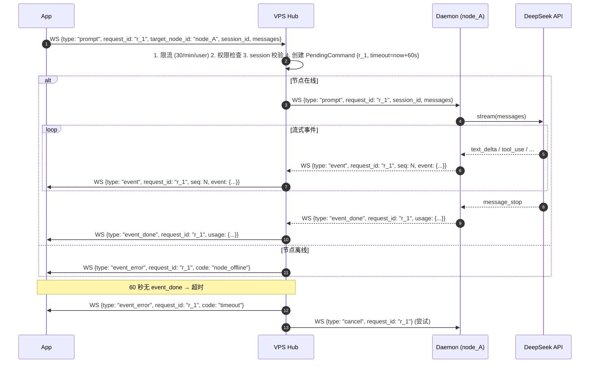

### 9.2 request_id 关联 (三方取消)

**唯一性**: `request_id` 由 App 生成 (UUID v4), 全链路唯一. 三方 (App, VPS, Daemon) 各自维护
`request_id → state` 映射, 任一方都能主动取消.

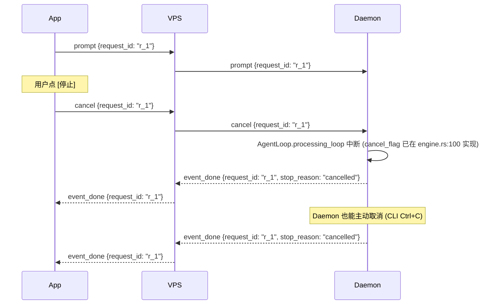

**VPS 端 cancel 状态机** (`ws_hub.rs::CommandForwarder`):

```rust
pub async fn forward_cancel(&self, request_id: &str) -> Result<(), CancelError> {
    let cmd = self.hub.pending_commands.remove(request_id)
        .ok_or(CancelError::UnknownRequest)?.1;
    if let Some(daemon) = self.hub.daemons.get(&cmd.target_node_id) {
        let _ = daemon.outbound_tx.send(WsMessage::Cancel { request_id: request_id.into() });
    }
    let msg = WsMessage::EventDone {
        request_id: request_id.into(), usage: None,
        stop_reason: Some("cancelled".into()),
    };
    if let Some(apps) = self.hub.apps.get(&cmd.from_user_id) {
        for app in apps.value().iter() { let _ = app.outbound_tx.send(msg.clone()); }
    }
    Ok(())
}
```

### 9.3 限流

| 维度 | 限制 | 配置 | 触发 |
|---|---|---|---|
| 每 user | 30 prompt/min | hardcoded (env 可覆盖) | `event_error {code: "rate_limited"}` |
| 每 node | 60 prompt/min | env `QXVPS_RATE_PROMPT_NODE` | 同上, status 503 给 app |
| 每 node 并发 | 5 active | env `QXVPS_MAX_CONCURRENT_PER_NODE` | 排队等待, 超过 30s 拒绝 |
| 单 prompt 消息数 | 100 条 | hardcoded | `event_error {code: "too_large"}` |
| 单 prompt 字节数 | 1 MB | hardcoded | 同上 |
| 单 session lifetime | 24h 无活动归档 | hardcoded | Daemon 端负责, VPS 只看 session_id |

### 9.4 超时

```rust
// server/ws_hub.rs::TimeoutWatcher
pub struct TimeoutWatcher { timeout: Duration }  // 默认 60s

impl TimeoutWatcher {
    pub async fn run(self: Arc<Self>, hub: Arc<WsHub>) {
        let mut interval = tokio::time::interval(Duration::from_secs(5));
        loop {
            interval.tick().await;
            let now = Instant::now();
            let timed_out: Vec<String> = hub.pending_commands.iter()
                .filter(|e| now > e.value().timeout_at).map(|e| e.key().clone()).collect();
            for rid in timed_out {
                if let Some((_, cmd)) = hub.pending_commands.remove(&rid) {
                    if let Some(apps) = hub.apps.get(&cmd.from_user_id) {
                        for app in apps.value().iter() {
                            let _ = app.outbound_tx.send(WsMessage::EventError {
                                request_id: rid.clone(), code: "timeout".into(),
                                message: format!("Request {} timed out after {:?}", rid, self.timeout),
                            });
                        }
                    }
                    if let Some(daemon) = hub.daemons.get(&cmd.target_node_id) {
                        let _ = daemon.outbound_tx.send(WsMessage::Cancel { request_id: rid.clone() });
                    }
                }
            }
        }
    }
}
```

**超时时长分层**:
- 默认 60s (普通 prompt)
- 可配置 (per session): 复杂任务 300s
- hard cap 600s (10 分钟, 防止恶意长任务)

### 9.5 取消 / 错误传播

| 错误来源 | App 看到的 code | 是否算"完成" |
|---|---|---|
| App 主动 cancel | `event_done {stop_reason: "cancelled"}` | ✅ |
| VPS 超时 (60s) | `event_error {code: "timeout"}` | ✅ |
| 节点离线 | `event_error {code: "node_offline"}` | ✅ |
| Daemon 内部错误 (LLM 4xx/5xx) | `event_error {code: "api_error" \| "internal"}` | ✅ |
| Daemon 重启 | `event_error {code: "node_offline"}` (5s 后) | ✅ |
| VPS 重启 | App 端超时, 重连后重发 | ❌ (App 决定) |

---

## 10. Docker 部署

### 10.1 Dockerfile

```dockerfile
# ===== Stage 1: Build =====
FROM rust:1.85-bookworm AS builder
WORKDIR /build

# 依赖层 (单独 COPY 以利用 Docker 缓存)
COPY Cargo.toml Cargo.lock ./
COPY qianxun/Cargo.toml qianxun/
COPY qianxun-core/Cargo.toml qianxun-core/
COPY qianxun-memory/Cargo.toml qianxun-memory/
RUN mkdir -p qianxun/src qianxun-core/src qianxun-memory/src && \
    echo "fn main(){}" > qianxun/src/main.rs && \
    echo "" > qianxun-core/src/lib.rs && \
    echo "" > qianxun-memory/src/lib.rs && \
    cargo build --release --bin qx && \
    rm -rf qianxun/src qianxun-core/src qianxun-memory/src

COPY . .
RUN cargo build --release --bin qx --features server

# ===== Stage 2: Runtime =====
FROM debian:bookworm-slim
RUN apt-get update && \
    apt-get install -y --no-install-recommends ca-certificates tini && \
    rm -rf /var/lib/apt/lists/*

# 非 root 用户
RUN useradd -r -u 1000 -m -d /home/qxvps -s /bin/bash qxvps
COPY --from=builder /build/target/release/qx /usr/local/bin/qx
RUN mkdir -p /var/lib/qxvps && chown -R qxvps:qxvps /var/lib/qxvps

USER qxvps
WORKDIR /home/qxvps
ENV QXVPS_DATA_DIR=/var/lib/qxvps
ENV QXVPS_PORT=23901
ENV QXVPS_HOST=0.0.0.0
ENV RUST_LOG=info,qx_server=debug

ENTRYPOINT ["/usr/bin/tini", "--"]
CMD ["qx", "server", "--port", "23901"]
EXPOSE 23901

HEALTHCHECK --interval=30s --timeout=3s --start-period=10s --retries=3 \
    CMD wget -qO- http://127.0.0.1:23901/api/health | grep -q '"ok"' || exit 1

LABEL org.opencontainers.image.title="qxvps" \
      org.opencontainers.image.description="Qianxun VPS Server (control plane)" \
      org.opencontainers.image.licenses="MIT"
```

**预期镜像大小**: ~75 MB (release binary ~15MB + debian-slim ~50MB + ca-certificates ~10MB)

### 10.2 docker-compose.yml

```yaml
version: "3.9"
services:
  qxvps:
    build:
      context: .
      dockerfile: docker/qxvps.Dockerfile
    image: qxvps:0.3.0
    container_name: qxvps
    restart: unless-stopped
    ports: ["23901:23901"]
    volumes: ["qxvps-data:/var/lib/qxvps"]
    environment:
      - QXVPS_JWT_SECRET=${QXVPS_JWT_SECRET:?set a 32-byte random secret}
      - QXVPS_PUBLIC_URL=https://vps.example.com
      - RUST_LOG=info,qx_server=debug
    deploy:
      resources:
        limits: { cpus: "1.0", memory: 512M }
        reservations: { cpus: "0.25", memory: 128M }
    healthcheck:
      test: ["CMD", "wget", "-qO-", "http://127.0.0.1:23901/api/health"]
      interval: 30s
      timeout: 3s
      retries: 3
      start_period: 10s
    logging:
      driver: json-file
      options: { max-size: "10m", max-file: "3" }
    networks: [qxvps-net]

  caddy:
    image: caddy:2
    container_name: qxvps-caddy
    restart: unless-stopped
    ports: ["80:80", "443:443"]
    volumes:
      - ./Caddyfile:/etc/caddy/Caddyfile:ro
      - caddy-data:/data
      - caddy-config:/config
    networks: [qxvps-net]
    depends_on: [qxvps]

volumes:
  qxvps-data:
  caddy-data:
  caddy-config:

networks:
  qxvps-net: { driver: bridge }
```

### 10.3 Caddyfile (生产环境 TLS)

```caddyfile
vps.example.com {
    reverse_proxy qxvps:23901 {
        header_up Host {host}
        header_up X-Real-IP {remote_host}
        header_up X-Forwarded-For {remote_host}
        header_up X-Forwarded-Proto {scheme}
        transport http {
            dial_timeout 5s
            response_header_timeout 30s
            read_timeout 600s
            write_timeout 600s
        }
    }
    encode zstd gzip
    header {
        Strict-Transport-Security "max-age=31536000; includeSubDomains"
        X-Content-Type-Options "nosniff"
        X-Frame-Options "DENY"
        Referrer-Policy "no-referrer"
        Content-Security-Policy "default-src 'self'; script-src 'self' 'unsafe-inline'; style-src 'self' 'unsafe-inline'"
    }
}
```

### 10.4 systemd (裸机部署备选)

```ini
# /etc/systemd/system/qxvps.service
[Unit]
Description=Qianxun VPS Server
After=network-online.target
Wants=network-online.target

[Service]
Type=simple
User=qxvps
Group=qxvps
WorkingDirectory=/var/lib/qxvps
ExecStart=/usr/local/bin/qx server --port 23901
Restart=on-failure
RestartSec=5s
# 资源 + 安全
LimitNOFILE=65536
MemoryMax=512M
CPUQuota=100%
NoNewPrivileges=true
PrivateTmp=true
ProtectSystem=strict
ProtectHome=true
ReadWritePaths=/var/lib/qxvps
Environment=QXVPS_DATA_DIR=/var/lib/qxvps
EnvironmentFile=-/etc/qxvps/qxvps.env

[Install]
WantedBy=multi-user.target
```

### 10.5 启动命令

```bash
# 最简启动 (单二进制)
qxvps --port 23901

# 完整启动 (生产)
QXVPS_JWT_SECRET=$(openssl rand -hex 32) \
QXVPS_DATA_DIR=/var/lib/qxvps \
qxvps --port 23901 --host 0.0.0.0

# 初始化管理员 (交互式)
qx server admin init
# → 提示输入 admin email + password
# → 写入 SQLite users 表, role=owner

# 后续添加用户
qx server admin create-user --email alice@example.com --role developer
# → 打印临时密码, 要求用户首次登录时改密
```

**资源硬限制**:
- 1 CPU 核 (CPUQuota=100%)
- 512MB 内存 (MemoryMax)
- 数据卷 `/var/lib/qxvps/data.sqlite` (或 `qxvps-data` Docker volume)

---

## 11. API 契约

### 11.1 端到端架构

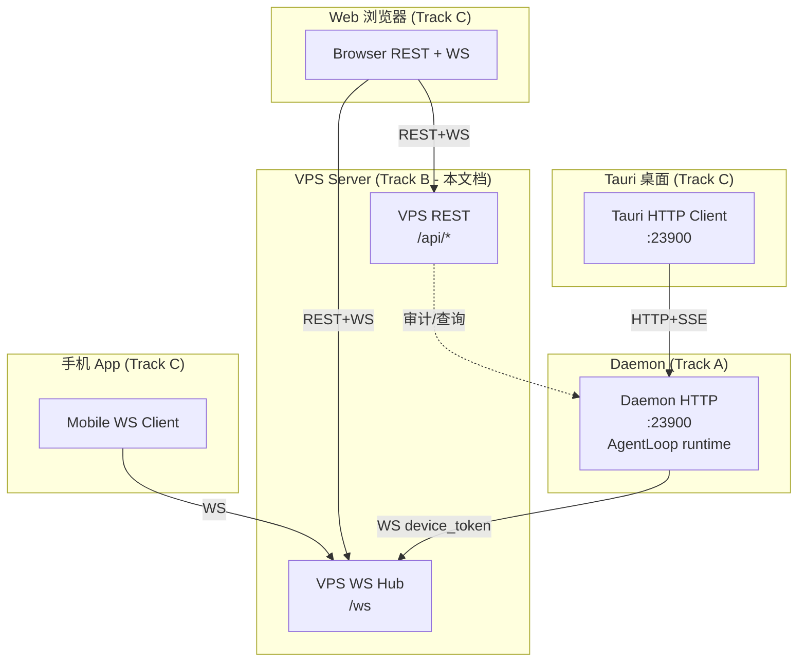

**关键规则**:
- Tauri 桌面 **不走 VPS** (本地直连 Daemon)
- 手机/浏览器 Web UI **走 VPS** (公网远控)
- Daemon 端是 AgentLoop runtime, VPS 端不重复

### 11.2 REST 端点完整列表

#### 11.2.1 公开端点 (无需认证)

| Method | Path | 说明 | 共享契约引用 |
|---|---|---|---|
| `GET` | `/api/health` | 健康检查 (返回 `{"status": "ok"}`) | — |
| `POST` | `/api/auth/login` | 邮箱+密码 → JWT | — |
| `POST` | `/api/auth/refresh` | refresh_token → 新 access_token | — |
| `POST` | `/api/auth/logout` | 撤销当前 access_token (jti 加入黑名单) | — |
| `POST` | `/api/device/auth-code` | Daemon 申请授权码 (无认证) | — |
| `POST` | `/api/device/authorize` | 用户在 Web 确认授权 (需 JWT) | — |
| `GET` | `/api/device/token?code=...` | Daemon 轮询 device_token (无认证) | — |

#### 11.2.2 用户端点 (JWT 认证)

| Method | Path | 角色 | 说明 |
|---|---|---|---|
| `GET` | `/api/me` | user | 当前用户信息 |
| `PATCH` | `/api/me` | user | 改 display_name / 密码 |
| `GET` | `/api/me/devices` | user | 我授权的设备列表 |
| `DELETE` | `/api/me/devices/:id` | user | 取消授权 |
| `GET` | `/api/me/nodes` | user | 我的节点 (含 offline) |
| `GET` | `/api/me/teams` | user | 我参与的 teams |

#### 11.2.3 Team/Project 端点 (JWT + membership 校验)

| Method | Path | 角色 | 说明 |
|---|---|---|---|
| `POST` | `/api/teams` | admin | 创建 team |
| `GET` | `/api/teams/:id` | team member | 详情 |
| `PATCH` | `/api/teams/:id` | team admin | 改名 |
| `DELETE` | `/api/teams/:id` | team owner | 归档 |
| `GET` | `/api/teams/:id/members` | team member | 成员列表 |
| `POST` | `/api/teams/:id/members` | team admin | 邀请 |
| `DELETE` | `/api/teams/:id/members/:user_id` | team admin | 移除 |
| `PATCH` | `/api/teams/:id/members/:user_id` | team admin | 改角色 |
| `GET` | `/api/teams/:id/projects` | team member | 项目列表 |
| `POST` | `/api/teams/:id/projects` | team admin | 创建项目 |
| `GET` | `/api/projects/:id` | assigned | 项目详情 |
| `PATCH` | `/api/projects/:id` | project editor | 改信息 |
| `DELETE` | `/api/projects/:id` | project editor | 归档 |
| `GET` | `/api/projects/:id/assignments` | project editor | 当前分配 |
| `POST` | `/api/projects/:id/assignments` | project editor | 分配成员 |
| `DELETE` | `/api/projects/:id/assignments/:user_id` | project editor | 取消分配 |
| `GET` | `/api/projects/:id/sessions` | assigned | session 列表 |
| `POST` | `/api/projects/:id/sessions` | assigned editor | 创建 session (起一个 prompt) |

#### 11.2.4 Admin 端点 (JWT + role=admin)

| Method | Path | 说明 |
|---|---|---|
| `GET` | `/api/admin/users` | 全部用户 |
| `POST` | `/api/admin/users` | 创建用户 |
| `GET` | `/api/admin/users/:id` | 单用户详情 |
| `PATCH` | `/api/admin/users/:id` | 改 role / 禁用 |
| `DELETE` | `/api/admin/users/:id` | 禁用 (软删) |
| `GET` | `/api/admin/nodes` | 全部节点 (跨用户) |
| `DELETE` | `/api/admin/nodes/:id` | 强制踢 WS |
| `POST` | `/api/admin/rotate-jwt-secret` | 滚动密钥 |

#### 11.2.5 静态资源

| Method | Path | 说明 |
|---|---|---|
| `GET` | `/_ui/*` | Svelte 5 构建产物 (login / authorize / dashboard) |
| `GET` | `/authorize?code=xxx` | 授权确认页 (HTML) |

### 11.3 WebSocket 端点

**单个端点, 复用同一升级路径**:

```
GET wss://vps.example.com:23901/ws?token=<device_token_or_jwt>
```

**Token 区分**:
- 以 `dt_` 开头 → device_token → Daemon 连接
- 以 `eyJ` 开头 (JWT 格式) → App 连接
- 都不匹配 → 401 close

**认证握手** (`server/ws_hub.rs::ws_upgrade`):

```rust
async fn ws_upgrade(
    State(state): State<Arc<VpsState>>,
    Query(params): Query<WsAuthQuery>,
    ws: WebSocketUpgrade,
) -> impl IntoResponse {
    let token = params.token;
    let result = if let Some(stripped) = token.strip_prefix("dt_") {
        verify_device_token(&state, stripped).await
    } else {
        verify_jwt(&state, &token).await
    };
    match result {
        Ok(auth) => {
            let (conn_type, user_id) = match auth {
                Auth::Device { user_id, .. } => (ConnType::Daemon, user_id),
                Auth::Jwt { claims } => (ConnType::App, claims.sub),
            };
            ws.on_upgrade(move |socket| handle_ws(socket, state, conn_type, user_id))
        }
        Err(e) => (StatusCode::UNAUTHORIZED, e.to_string()).into_response(),
    }
}
```

### 11.4 与 shared-contract 的一致性声明

> **声明**: 本节全部端点以 `_shared-contract.md` §3.1 (Daemon REST) + §3.2 (SSE 事件
> > schema) + §3.3 (WebSocket 消息) 为**基线**, 在基线之上**扩展**了以下字段/消息.
> > 所有扩展均按 `_shared-contract.md §5 规则 4` 在此声明. 若后续发现冲突, 以本文档 §11.3
> > WS 消息为准, 并在 Track A 协调评审中更新 `_shared-contract.md`.

**相对 shared-contract §3.3 的扩展清单** (本规划新增, 需要回归契约时纳入):

| 字段/消息 | 位置 | 用途 |
|---|---|---|
| `auth.protocol_version: u32` | §11.3 auth 帧 | 协议版本协商, 拒绝不兼容的旧 daemon |
| `register.host_type / host_id / os / cpu_cores / memory_mb` | §11.3 register 帧 | 节点元信息, 用于 UI 展示 + 调度决策 |
| `register.tags / capabilities` | §11.3 register 帧 | 标签化 + 能力声明, app 端可按 tag 过滤 |
| `register_ok.heartbeat_interval_ms` | §11.3 register_ok 帧 | 服务端可下调心跳 (负载高时) |
| `prompt.target_node_id` | §11.3 prompt 帧 | app 直接路由到指定 daemon, 无需 VPS 中转选择 |
| `prompt.model / max_tokens / temperature / tools_enabled` | §11.3 prompt 帧 | 透传参数, 不与 Daemon 端 config 冲突 |
| `prompt.attachments[]` | §11.3 prompt 帧 | 预留: 文件附件 (Phase 5 多模态) |
| `event.cancel / cancel_ack` (新增消息) | §11.3 §6.4.3 | app 可中途取消 stream |
| `event.ping / pong` (新增消息) | §11.3 §6.4.4 | 应用层心跳, 区别于 TCP keepalive |
| `event.node_status / node_list` (新增消息) | §11.3 §6.4.5 | app 主动查询节点状态 |

**Track A 需确认**: Daemon 在转发 `event` 消息时, `event` 字段必须使用 `_shared-contract.md` §3.2
定义的 12 种 SSE 事件 schema (上述扩展不涉及 `event` 字段的内层 SSE 事件类型). 本文 §6.4.2 已写明, 实施时不再允许扩展.

---

## 12. 迁移路径

### 12.1 4 阶段总览

| 阶段 | 任务 | 验收 | 估时 |
|---|---|---|---|
| **Phase 1: MVP** | 基础 auth + Device 授权 + 单 Daemon 单 App | 用户能在 Web 授权一台 Daemon, 从 App 下发一个 prompt 看到响应 | 1 周 |
| **Phase 2: 多连接** | 多 Daemon 并发 + 多 App 并发 + Team 基础 | 2 个用户, 3 个 Daemon, 5 个 App, Team 内可互相看到 | 1.5 周 |
| **Phase 3: 完善** | 完整 Team/Project/Assignment + Admin CLI + Docker | 完整 CRUD 全部端点, Docker 镜像 < 80MB, systemd unit 可用 | 1.5 周 |
| **Phase 4: 硬化** | 性能压测 + 安全审计 + 文档 + 限流 + 监控 | 通过 100 并发连接压测, 安全测试无 critical 问题 | 1 周 |
| **合计** | | | **5 周** |

### 12.2 Phase 1 (MVP) 详细

**任务清单**:
- [ ] schema v3 迁移到位 (users / devices / auth_codes / teams / team_members / project_assignments)
- [ ] argon2 接入, 替换 `password_hash` 占位
- [ ] JWT 完整实现 (access + refresh + jti 黑名单)
- [ ] 设备授权完整流程 (auth_code → authorize → token 轮询)
- [ ] WS Hub 基础: accept connection, auth, register, heartbeat
- [ ] WS Hub 路由: prompt → 转发 → event 流回
- [ ] `/api/me/nodes` + `/api/admin/users` 两个核心查询端点
- [ ] Docker 镜像可构建并启动
- [ ] E2E 测试脚本 (curl + websocat)

**验收命令**:

```bash
# 1. 启动 VPS
docker run -d -p 23901:23901 -e QXVPS_JWT_SECRET=$(openssl rand -hex 32) qxvps:0.3.0

# 2. 初始化 admin
docker exec -it qxvps qx server admin init
# → Email: admin@example.com
# → Password: ********

# 3. 启动 Daemon (开发机)
qx daemon --vps-url wss://localhost:23901/ws
# → Visit https://localhost:23901/authorize?code=xyz to authorize

# 4. 浏览器打开链接 → 登录 → 授权
# → Daemon 拿到 dt_xxx, 自动连上

# 5. 用 WebSocket 客户端测试
wscat -c "wss://localhost:23901/ws?token=$JWT"
> {"type": "node_list"}
< {"type": "node_list", "nodes": [...]}
> {"type": "prompt", "request_id": "r1", "target_node_id": "node_xxx", "messages": [{"role": "user", "content": "hi"}]}
< {"type": "event", "request_id": "r1", "event": {"type": "text_delta", "text": "Hello! ..."}}
< {"type": "event_done", "request_id": "r1", "usage": {...}}
```

### 12.3 Phase 2 (多连接)

**新增**:
- [ ] 完整 Team CRUD (4 张表全部接入)
- [ ] Project + Assignment CRUD
- [ ] 多 Daemon 并发 (100 连接压测)
- [ ] 重连幂等性测试 (断线 → 重连 → 续传)
- [ ] 节点状态广播 (online/offline → 所有 App)

**验收**:
- 50 个 Daemon 同时在线, 内存 < 200MB
- 模拟一个 Daemon 断网 5s → 重连, 期间收到的 3 个 prompt 全部按序执行
- 管理员可以给 team 添加 5 个成员, 分配 10 个项目

### 12.4 Phase 3 (完善)

**新增**:
- [ ] Admin CLI 子命令 (create-user / list-users / disable-user / reset-password)
- [ ] 完整 Web UI (Svelte 5: login / authorize / dashboard / admin)
- [ ] Docker Compose (含 Caddy 反代)
- [ ] 数据库备份脚本 (`qx server backup`)

**验收**:
- `docker-compose up` 一键启动全套
- Web UI 可登录、查看节点、查看 Team 项目
- Admin CLI 可远程管理 (通过本地 SQLite 桥接, 不走 HTTP)

### 12.5 Phase 4 (硬化)

**新增**:
- [ ] 限流 (governor crate) 全端点接入
- [ ] Prometheus metrics 暴露 `/metrics`
- [ ] 结构化日志 (JSON 格式, 含 request_id)
- [ ] 密码强度校验
- [ ] 设备 token 轮换 (定期强制)
- [ ] 备份恢复演练
- [ ] 渗透测试 (OWASP Top 10 覆盖)
- [ ] 完整 API 文档 (OpenAPI 3.1)
- [ ] 部署文档 (Terraform / Ansible 示例)

**验收**:
- 通过 `cargo audit` (无高危漏洞)
- 通过 `cargo clippy -- -D warnings`
- 100 并发连接压测, P99 延迟 < 50ms
- OpenAPI 文档自动生成, 部署到 `/api/docs`

### 12.6 旧版 (v0.2) 数据迁移

```rust
// server/migration.rs: v0 → v3 增量迁移
pub fn migrate_v0_to_v3(db: &Connection) -> Result<(), MigrationError> {
    let version = get_schema_version(db)?;
    if version >= 3 { return Ok(()); }
    if version < 1 {  // 加 email 字段
        db.execute_batch("ALTER TABLE users ADD COLUMN email TEXT;
                          UPDATE users SET email = username WHERE email IS NULL;
                          CREATE UNIQUE INDEX idx_users_email ON users(email);")?;
    }
    if version < 2 {  // 加 disabled_at
        db.execute_batch("ALTER TABLE users ADD COLUMN disabled_at TEXT;
                          ALTER TABLE users ADD COLUMN disabled_reason TEXT;")?;
    }
    if version < 3 {  // 新增 teams/members/projects/assignments 四表
        db.execute_batch(include_str!("migrations/v3.sql"))?;
    }
    db.execute("UPDATE schema_version SET version = 3, applied_at = ?1",
               [Utc::now().to_rfc3339()])?;
    Ok(())
}
```

---

## 13. 风险与开放问题

### 13.1 高优先级风险

#### R1. 跨 VPS 实例水平扩展 (单点故障)

**风险**: 当前设计是单 VPS 实例. 若 VPS 宕机, 所有"远程控制"能力失效 (Daemon 本地仍可用).

**影响**: 1 个用户用 = 1 VPS 宕机 = 失去手机控制能力, 但不影响本地开发.

**缓解**:
- **短期**: 文档建议使用 `restart: unless-stopped` (Docker) 或 `Restart=on-failure` (systemd)
- **中期**: Phase 5+ 评估多实例 + Redis pub/sub 同步节点状态
- **长期**: 支持 "无 VPS 模式" (Daemon 暴露公网 + 内置 device auth)

**当前决策**: **接受单点**, 文档明确"个人/小团队场景"假设.

#### R2. WS 消息顺序与可靠性

**风险**: 文档承诺"重连后未送达消息会重发", 但若 outbox 满 256 条, 老的就丢了.

**影响**: 用户在断网期间下了 300 个 prompt, 第一个重连成功时, 后 44 个能收到, 前 256 个丢了.

**缓解**:
- 256 条对个人/小团队已够 (按 30/min 限流, 256 = 8.5 分钟缓冲)
- 文档明确"不保证严格顺序", 客户端按 `request_id` 区分, 各自独立
- 监控 `metrics::OUTBOX_DROPPED`, 超过 1% 触发告警

**当前决策**: **接受丢失**, 监控告警.

#### R3. 客户端时钟漂移 (心跳误判)

**风险**: VPS 按 90s 无心跳判定离线. 若客户端时钟慢, 可能误判.

**影响**: 假离线 → 用户看到 "节点 offline" 但实际可用.

**缓解**: VPS 是时钟权威, 不信任客户端 ts; 心跳间隔 30s, 超时 90s = 3 次心跳, 容错足够.

**当前决策**: **不解决**, 心跳设计已考虑.

### 13.2 中优先级风险

#### R4. SQL 注入与数据泄漏

**风险**: SQLite 用 `rusqlite` prepared statements 默认安全. 但 JSON 字段 (`capabilities`, `tags`) 需要序列化/反序列化, 容易出错.

**影响**: 用户控制自己 data 没问题, 但 admin API 暴露了所有用户的 devices.

**缓解**:
- 全部用 `?1, ?2, ?3` 参数化查询 (代码审查 checklist)
- JSON 字段统一用 `serde_json::from_str` 验证 schema
- Admin endpoints 全部需要 `role=admin` 检查
- `devices.token_hash` 永不返回给前端 (只返回 `node_id` + `last_four`)

**当前决策**: **持续 review**, 在 Phase 4 加渗透测试.

#### R5. JWT 密钥泄露

**风险**: 密钥写在环境变量, 若 VPS 被入侵, 攻击者可签发任意 user 的 JWT.

**影响**: 完全控制 (读取所有用户数据, 冒充管理员).

**缓解**:
- 生产部署: 密钥从 secrets manager 读 (Vault, AWS Secrets Manager)
- 定期轮换 (管理员手动, 或自动 90 天)
- "强制踢出" 端点 (滚动密钥, 所有 token 失效)

**当前决策**: **接受手工管理**, 文档强烈建议外部 secrets manager.

### 13.3 开放问题 (需协调 Track A 确认)

| 编号 | 问题 | 影响 | 建议决策 |
|---|---|---|---|
| **Q1** | Daemon 端是否需要"忘记 VPS"模式 (纯本地)? | 影响 Daemon 启动流程 | 是, 与 `01-daemon.md` §10 一致 |
| **Q2** | App 端是否要支持"模拟某个 user 登录" (调试用)? | 影响 admin API | 暂不支持, 留 Phase 5 |
| **Q3** | Team 跨 VPS 共享? (用户 A 在 VPS1, 想加 VPS2 的用户 B) | 影响 Team 模型 | 不支持, 单 VPS 边界清晰 |
| **Q4** | 多设备 token 共享 (用户有两台 PC 同时连)? | 影响 devices 唯一性 | 支持, 用 `machine_id` 区分 |
| **Q5** | Project 是否需要"软删除"恢复? | 影响 DELETE 端点 | 是, 30 天内可 `POST /api/projects/:id/restore` |
| **Q6** | Session 列表是 VPS 持有还是 Daemon 持有? | 影响 sessions 表位置 | **Daemon 持有** messages, VPS 只存元数据 (见 §7.2) |
| **Q7** | 文件附件 (attachments) 怎么传? | 影响 prompt 消息 schema | Daemon 本地读路径, 不上传二进制 (VPS 不经手) |
| **Q8** | 跨设备 session 恢复? (在 PC A 开 session, 手机继续) | 影响 session 状态 | Daemon 持久化, VPS 只转发, **不在 VPS 缓存 session 内容** |

### 13.4 已关闭的问题

| 决策点 | 决策 | 文档位置 |
|---|---|---|
| 设备授权是否需要邮箱验证? | **否** (VPS 是个人部署, 信任管理员) | §5 |
| 是否需要"团队管理员"概念? | **是** (`team_members.role = 'admin'`) | §7 |
| Argon2 参数? | **default** (m=19MB, t=2, p=1) | §4.4 |
| JWT 算法? | **HS256** (单实例) | §4.3 |
| 单 VPS 还是多 VPS? | **单 VPS** (Phase 5 再考虑) | §3.4 |
| Stream 协议? | **WS** 在 VPS, **SSE** 在 Daemon (见 §3.3 + `01-daemon.md` §3.1) | §3.3, §6.4 |
| Session 持久化? | **Daemon** (`qianxun-memory`), VPS 只存元数据 | §7.2 |

---

## 附录 A. 完整 DDL

```sql
-- ============================================================
-- 千寻 VPS Server Schema v3
-- Created: 2026-06-01
-- Supersedes: schema v2 (vps-server-design.md v0.2)
-- ============================================================

CREATE TABLE IF NOT EXISTS schema_version (
    version    INTEGER NOT NULL PRIMARY KEY,
    applied_at TEXT    NOT NULL
);
INSERT OR REPLACE INTO schema_version VALUES (3, datetime('now'));

-- ===== Users =====
CREATE TABLE users (
    id               TEXT    PRIMARY KEY,
    email            TEXT    NOT NULL UNIQUE,
    display_name     TEXT    NOT NULL,
    password_hash    TEXT    NOT NULL,
    role             TEXT    NOT NULL DEFAULT 'developer',
    created_at       TEXT    NOT NULL,
    last_login_at    TEXT,
    disabled         INTEGER NOT NULL DEFAULT 0,
    disabled_at      TEXT,
    disabled_reason  TEXT
);
CREATE INDEX idx_users_role ON users(role);
CREATE INDEX idx_users_disabled ON users(disabled);

-- ===== Refresh tokens (rotation) =====
CREATE TABLE refresh_tokens (
    id          TEXT    PRIMARY KEY,
    user_id     TEXT    NOT NULL REFERENCES users(id) ON DELETE CASCADE,
    token_hash  TEXT    NOT NULL UNIQUE,
    created_at  TEXT    NOT NULL,
    expires_at  TEXT    NOT NULL,
    rotated_at  TEXT,
    revoked_at  TEXT,
    user_agent  TEXT,
    ip_address  TEXT
);
CREATE INDEX idx_refresh_tokens_user ON refresh_tokens(user_id);
CREATE INDEX idx_refresh_tokens_expires ON refresh_tokens(expires_at);

-- ===== Devices =====
CREATE TABLE devices (
    id              TEXT    PRIMARY KEY,
    user_id         TEXT    NOT NULL REFERENCES users(id) ON DELETE CASCADE,
    host_id         TEXT    NOT NULL,
    host_type       TEXT    NOT NULL DEFAULT 'unknown',
    machine_id      TEXT    NOT NULL,
    name            TEXT,
    token_hash      TEXT    NOT NULL UNIQUE,
    capabilities    TEXT    NOT NULL DEFAULT '[]',
    tags            TEXT    NOT NULL DEFAULT '[]',
    node_id         TEXT    UNIQUE,
    status          TEXT    NOT NULL DEFAULT 'offline',
    last_seen       TEXT,
    connected_at    TEXT,
    daemon_version  TEXT,
    os              TEXT,
    cpu_cores       INTEGER,
    memory_mb       INTEGER,
    disabled        INTEGER NOT NULL DEFAULT 0,
    disabled_at     TEXT,
    disabled_reason TEXT,
    created_at      TEXT    NOT NULL
);
CREATE INDEX idx_devices_user ON devices(user_id);
CREATE INDEX idx_devices_host ON devices(host_id);
CREATE INDEX idx_devices_node ON devices(node_id);
CREATE INDEX idx_devices_status ON devices(status);
CREATE UNIQUE INDEX idx_devices_host_user ON devices(user_id, host_id) WHERE disabled = 0;

-- ===== Auth codes (Device flow) =====
CREATE TABLE auth_codes (
    code         TEXT    PRIMARY KEY,
    device_id    TEXT    NOT NULL,
    user_id      TEXT,
    host_id      TEXT    NOT NULL,
    machine_id   TEXT    NOT NULL,
    fingerprint  TEXT    NOT NULL,
    expires_at   TEXT    NOT NULL,
    status       TEXT    NOT NULL DEFAULT 'pending',
    created_at   TEXT    NOT NULL,
    acted_at     TEXT,
    consumed_at  TEXT
);
CREATE INDEX idx_auth_codes_status ON auth_codes(status);
CREATE INDEX idx_auth_codes_expires ON auth_codes(expires_at);

-- ===== WS connections (历史) =====
CREATE TABLE ws_connections (
    id                TEXT    PRIMARY KEY,
    device_id         TEXT    REFERENCES devices(id) ON DELETE SET NULL,
    user_id           TEXT    REFERENCES users(id) ON DELETE SET NULL,
    conn_type         TEXT    NOT NULL,
    connected_at      TEXT    NOT NULL,
    disconnected_at   TEXT,
    disconnect_reason TEXT,
    client_info       TEXT
);
CREATE INDEX idx_ws_device ON ws_connections(device_id);
CREATE INDEX idx_ws_user ON ws_connections(user_id);
CREATE INDEX idx_ws_time ON ws_connections(connected_at);

-- ===== Teams =====
CREATE TABLE teams (
    id          TEXT    PRIMARY KEY,
    name        TEXT    NOT NULL,
    description TEXT,
    owner_id    TEXT    NOT NULL REFERENCES users(id),
    created_at  TEXT    NOT NULL,
    updated_at  TEXT    NOT NULL,
    archived    INTEGER NOT NULL DEFAULT 0,
    archived_at TEXT
);
CREATE INDEX idx_teams_owner ON teams(owner_id);
CREATE UNIQUE INDEX idx_teams_name_per_owner ON teams(owner_id, name) WHERE archived = 0;

-- ===== Team members =====
CREATE TABLE team_members (
    team_id        TEXT    NOT NULL REFERENCES teams(id) ON DELETE CASCADE,
    user_id        TEXT    NOT NULL REFERENCES users(id) ON DELETE CASCADE,
    role           TEXT    NOT NULL DEFAULT 'developer',
    joined_at      TEXT    NOT NULL,
    last_active_at TEXT,
    PRIMARY KEY (team_id, user_id)
);
CREATE INDEX idx_team_members_user ON team_members(user_id);
CREATE INDEX idx_team_members_role ON team_members(role);

-- ===== Projects =====
CREATE TABLE projects (
    id              TEXT    PRIMARY KEY,
    team_id         TEXT    NOT NULL REFERENCES teams(id) ON DELETE CASCADE,
    name            TEXT    NOT NULL,
    description     TEXT,
    owner_id        TEXT    NOT NULL REFERENCES users(id),
    primary_node_id TEXT,
    created_at      TEXT    NOT NULL,
    updated_at      TEXT    NOT NULL,
    archived        INTEGER NOT NULL DEFAULT 0,
    archived_at     TEXT
);
CREATE INDEX idx_projects_team ON projects(team_id);
CREATE INDEX idx_projects_owner ON projects(owner_id);
CREATE UNIQUE INDEX idx_projects_name_per_team ON projects(team_id, name) WHERE archived = 0;

-- ===== Project assignments =====
CREATE TABLE project_assignments (
    project_id  TEXT    NOT NULL REFERENCES projects(id) ON DELETE CASCADE,
    user_id     TEXT    NOT NULL REFERENCES users(id) ON DELETE CASCADE,
    role        TEXT    NOT NULL DEFAULT 'developer',
    assigned_by TEXT    NOT NULL REFERENCES users(id),
    assigned_at TEXT    NOT NULL,
    PRIMARY KEY (project_id, user_id)
);
CREATE INDEX idx_project_assignments_user ON project_assignments(user_id);

-- ===== Sessions (VPS 只存元数据, messages 由 Daemon 持有) =====
CREATE TABLE sessions (
    id              TEXT    PRIMARY KEY,
    project_id      TEXT    NOT NULL REFERENCES projects(id) ON DELETE CASCADE,
    owner_id        TEXT    NOT NULL REFERENCES users(id),
    title           TEXT    NOT NULL,
    model           TEXT    NOT NULL,
    status          TEXT    NOT NULL DEFAULT 'active',
    created_at      TEXT    NOT NULL,
    last_active_at  TEXT    NOT NULL,
    message_count   INTEGER NOT NULL DEFAULT 0,
    node_id         TEXT,
    FOREIGN KEY (node_id) REFERENCES devices(node_id) ON DELETE SET NULL
);
CREATE INDEX idx_sessions_project ON sessions(project_id);
CREATE INDEX idx_sessions_owner ON sessions(owner_id);
CREATE INDEX idx_sessions_status ON sessions(status);
CREATE INDEX idx_sessions_last_active ON sessions(last_active_at);

-- ===== Audit log (审计, 可选启用) =====
CREATE TABLE audit_log (
    id          TEXT    PRIMARY KEY,
    user_id     TEXT    REFERENCES users(id) ON DELETE SET NULL,
    action      TEXT    NOT NULL,
    target_type TEXT,
    target_id   TEXT,
    metadata    TEXT,
    ip_address  TEXT,
    user_agent  TEXT,
    created_at  TEXT    NOT NULL
);
CREATE INDEX idx_audit_user ON audit_log(user_id);
CREATE INDEX idx_audit_time ON audit_log(created_at);
CREATE INDEX idx_audit_action ON audit_log(action);
```

---

## 文档元信息

| 项 | 值 |
|---|---|
| **作者** | general agent (Mavis 多代理协调, 2026-06-01) |
| **配套文件** | `docs/30_子项目规划/_shared-contract.md` §3.3 + §6; `docs/30_子项目规划/01-daemon.md` (Track A) |
| **替代** | `docs/vps-server-design.md` v0.2 (645 行) |
| **实施预计** | 5 周 (Phase 1-4, 见 §12) |
| **风险数量** | 5 (3 高优先级 + 2 中优先级) + 8 开放问题 |
| **API 端点数** | REST 33 个 + WS 1 个升级端点 + 16 种 WS 消息 |
| **DB 表数** | 11 张 (含审计) |

**变更说明 (vs v0.2)**:
- v0.2 是骨架, 用户用 `username`, 本文改为 `email`
- v0.2 只设计了 `users` / `devices` / `auth_codes` 3 张表, 本文扩展到 11 张
- v0.2 的 WS 协议是 ad-hoc, 本文严格对齐 `_shared-contract.md` §3.3
- v0.2 未定义 Team/Project, 本文基于 §6 完整建模
- v0.2 没有 Docker, 本文给出完整 Dockerfile + compose
- v0.2 没有命令中转的限流/超时/重连细节, 本文细化到 4 阶段迁移
- v0.2 用 `args.role = "user"` 硬编码, 本文支持 `owner/admin/developer/viewer` 4 角色

---

*本文件结束. 实施前请确认 `_shared-contract.md` §3.3 与 §6 已稳定, 否则本文需同步更新.*
