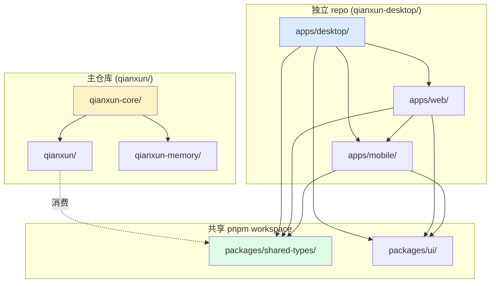
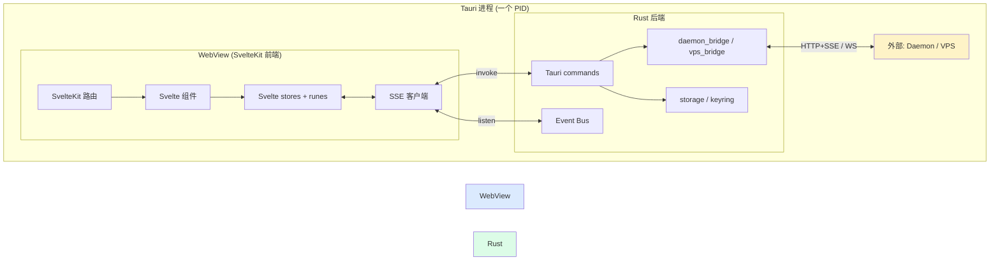
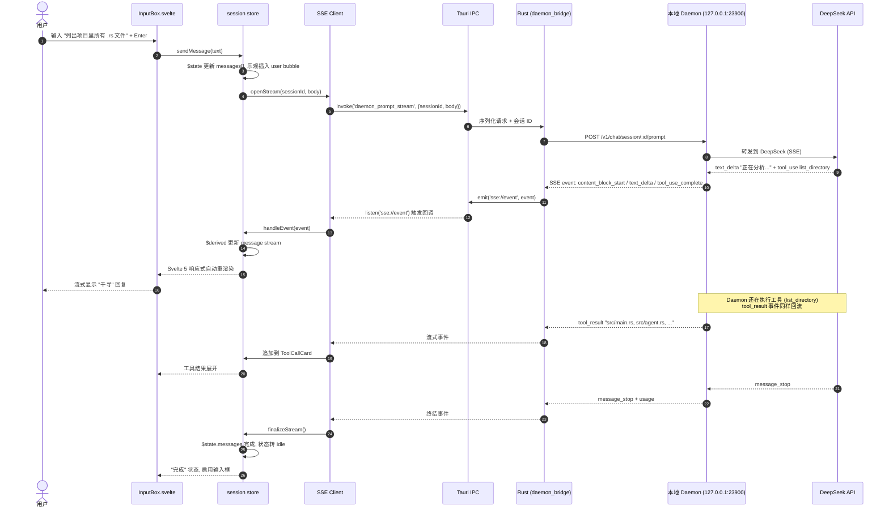
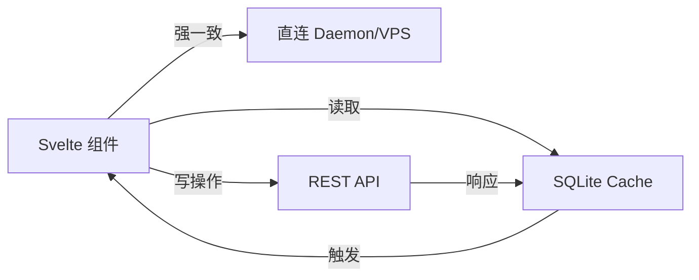
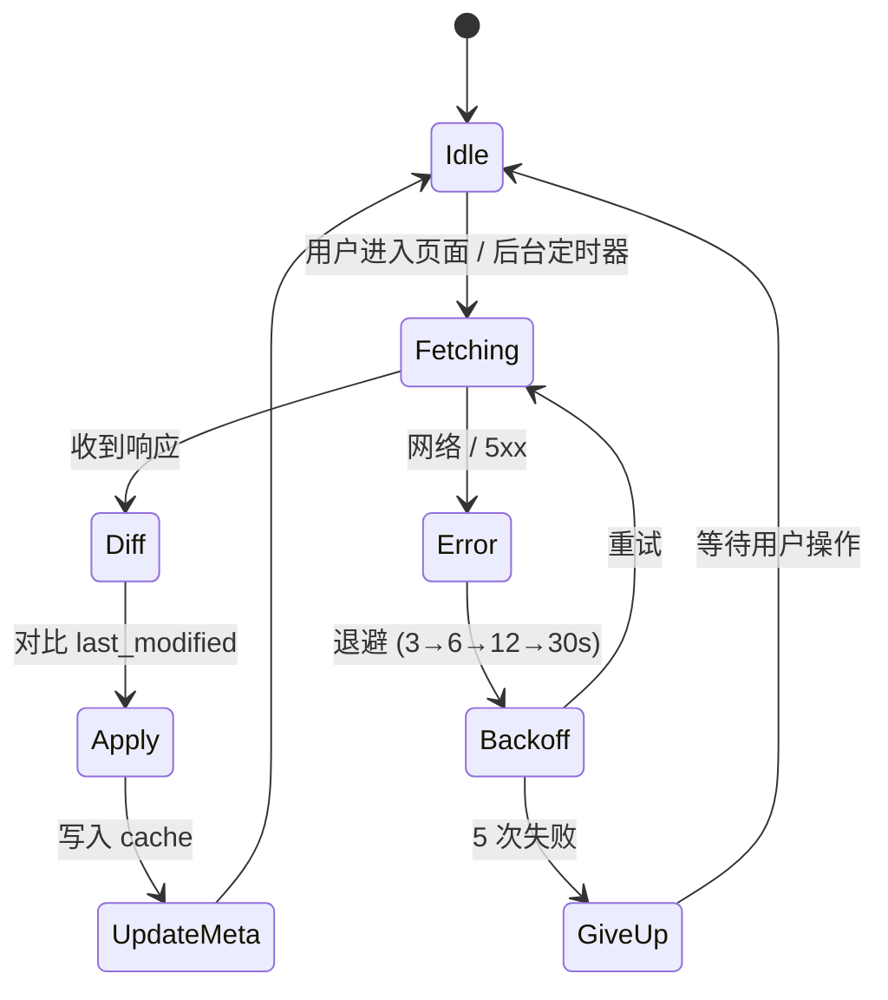
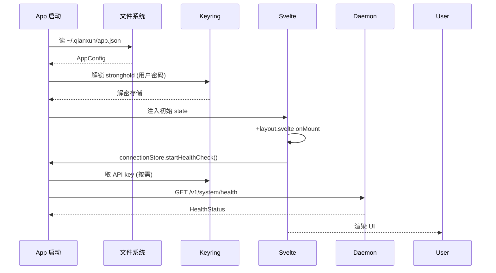
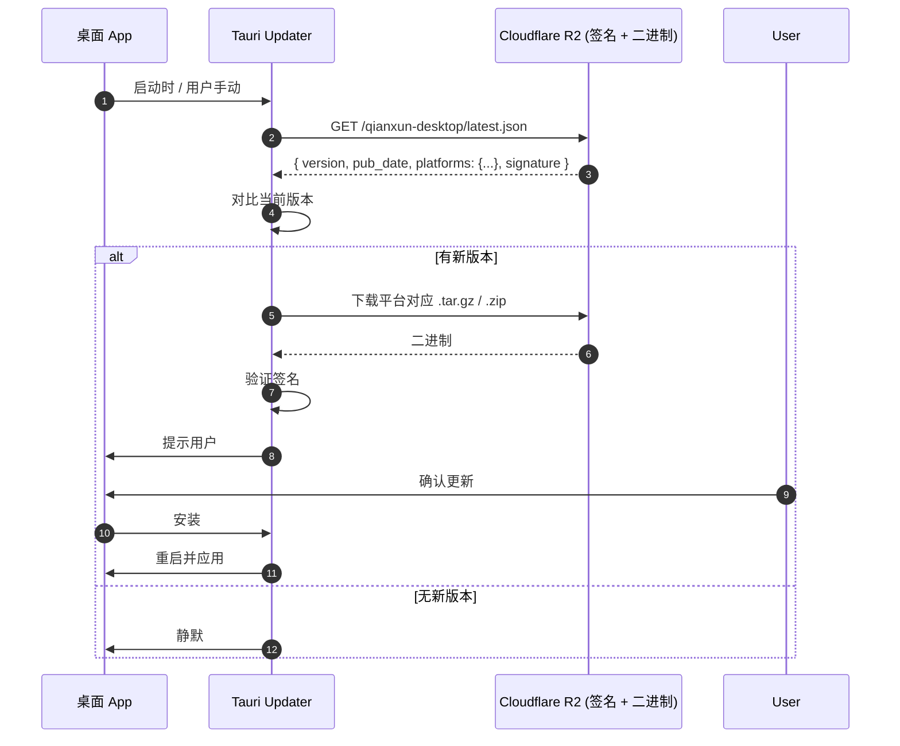

# 千寻 Tauri 桌面版 — 详细设计 (Track C)

> 本文是千寻 (Qianxun) 三子项目规划中的 Track C — 图形前端规划.
>
> 技术栈: **Svelte 5 (runes) + SvelteKit + Vite + Tailwind CSS + shadcn-svelte + Tauri 2.0 + TypeScript**
>
> 三端统一: 一份 `.svelte` 源码 → SvelteKit 编译 web → Tauri webview 嵌入桌面 → 移动 v2 复用.

## 目录

- [1. 概览](#1-概览)
- [2. 设计目标](#2-设计目标)
- [3. 架构](#3-架构)
- [4. 技术选型详细](#4-技术选型详细)
- [5. 数据模型](#5-数据模型)
- [6. UI 布局](#6-ui-布局)
- [7. Tauri IPC 契约](#7-tauri-ipc-契约)
- [8. SSE 客户端](#8-sse-客户端)
- [9. Team 管理 UI](#9-team-管理-ui)
- [10. 离线 / 降级](#10-离线--降级)
- [11. 配置与存储](#11-配置与存储)
- [12. 构建与发布](#12-构建与发布)
- [13. 测试策略](#13-测试策略)
- [14. 三端扩展路线](#14-三端扩展路线)
- [15. 风险与开放问题](#15-风险与开放问题)
- [附录 A: 文件清单](#附录-a-文件清单)
- [附录 B: 验收测试矩阵](#附录-b-验收测试矩阵)

---

## 1. 概览

**千寻的图形前端, 跨桌面 / 移动 / Web 三端, 一份源代码.**

Tauri 桌面版是千寻三大前端形态之一 (另两个: TUI `qianxun/src/tui/mod.rs:102` 与 ACP 协议 `qianxun/src/acp/`), 以 WebView + Rust 后端的形态提供完整的图形 UI. 它是**纯前端**项目, 不持有 Agent runtime, 通过 HTTP + SSE 消费本地 Daemon (`http://127.0.0.1:23900`) 或远程 VPS Server (`wss://vps.example/hub`), 详见 `_shared-contract.md:18-39` 的依赖拓扑.

| 维度 | 说明 |
|---|---|
| **目标平台** | macOS / Windows / Linux (P0); iOS / Android (P1); Web (P1) |
| **运行时** | Tauri 2.0 (Rust core + System WebView) |
| **UI 框架** | Svelte 5 (runes) + SvelteKit + Tailwind + shadcn-svelte |
| **后端调用** | HTTP (REST) + SSE (POST 流式) + WebSocket (VPS 转发) |
| **本地存储** | SQLite (Tauri sql plugin) 缓存项目/会话列表, OS keyring 存凭据 |
| **项目位置** | 独立 repo `qianxun-desktop/`, 通过 pnpm workspace 与主项目联动 |

---

## 2. 设计目标

### 2.1 核心理念

| 目标 | 描述 | 验收标准 |
|---|---|---|
| **三端统一** | 一份 `.svelte` 源码在桌面 / 移动 / Web 三端跑 | SvelteKit `pnpm build` 产物直接被 Tauri webview 加载; `pnpm build --target=web` 独立部署到 CDN; iOS/Android 通过 `tauri ios` / `tauri android` 复用同一份 |
| **零成本切换后端** | 用户在 UI 上一键切换本地 Daemon / 远程 VPS, 不需重启或重新登录 | 设置页切换 URL 后, 5s 内完成 health check + 列表刷新; 当前未完成任务完整保留 |
| **离线降级** | Daemon 不可达时不崩溃, 显示明确降级 UI | Daemon 断连时输入框可继续打字, 重连后自动发送; 不出现白屏 / 错误栈 |
| **与 TUI 平起平坐, UX 增强** | 不只是 "GUI 版 TUI", 而是充分利用图形能力 | 三栏布局; 富文本 (Markdown + 代码高亮 + Mermaid 渲染); 工具执行可视化 (进度条 / 展开折叠); 拖拽上传 / 粘贴图片 |
| **轻量** | 安装包 < 30 MB, 启动 < 2s | Tauri 2.0 默认 release 体积; 前端 bundle < 5MB (gzipped) |

### 2.2 非目标 (Phase 1)

- 高级权限流 (如 owner/admin 角色矩阵的 UI 控制) — 推迟到 P2
- 多模态输入 (语音 / 视频) — P2
- 协作 (多人同时编辑同一会话) — 超出范围
- 离线 LLM (本地 GGUF) — 留给后续 P3 探索

### 2.3 关键决策表

| 决策 | 选项 | 推荐 | 理由 |
|---|---|---|---|
| 项目位置 | monorepo 子目录 vs 独立 repo | **独立 repo `qianxun-desktop/`** | pnpm workspace 通过 `qianxun-shared-types` 共享类型; 主仓库继续聚焦 Rust core |
| 前端框架 | React / Vue / Svelte | **Svelte 5 (runes)** | 已锁; runes 模式比 React hooks 更适合响应式流式 UI |
| UI 组件库 | shadcn-svelte / Skeleton / Bits UI | **shadcn-svelte** | 源码复制, 无运行时依赖, 与 Tauri 2.0 体积友好 |
| IPC 风格 | invoke vs 自定义 HTTP | **Tauri `invoke` + `listen`** | Tauri 2.0 标配; 类型安全 (TS 自动生成) |
| 状态管理 | Svelte stores / Pinia / 自研 | **Svelte stores + runes** | 不引外部库; runes 已是 Svelte 5 推荐方式 |
| 流式协议 | WebSocket / SSE | **SSE (本地) + WebSocket (远程)** | 与 `_shared-contract.md:14-16` 一致; 本地 SSE 简单, 远程 WS 双向 |
| 本地缓存 | IndexedDB / SQLite / localStorage | **SQLite (Tauri sql plugin)** | 大数据集 (项目 / 会话) 性能远胜 IndexedDB; 与未来 desktop-only 关系型数据统一 |
| 主题 | 单一 / 多套 | **light / dark / system 三态** | shadcn-svelte 原生支持, 与系统跟随 |
| 包管理 | npm / yarn / pnpm | **pnpm** | workspace 友好, 体积小, monorepo 标配 |
| 部署 | S3 / Cloudflare R2 / GitHub Releases | **Cloudflare R2** | 零出口费, S3 兼容, 与 Tauri updater 集成简单 |

---

## 3. 架构

### 3.1 项目结构

推荐**独立 repo `qianxun-desktop/`** (理由见 §2.3 决策表), 通过 pnpm workspace 与主项目联动:



**文件树**:

```
qianxun-desktop/                          # 独立 repo
├── pnpm-workspace.yaml
├── package.json
├── tsconfig.base.json
├── apps/
│   ├── desktop/                          # Tauri 桌面端 (P0)
│   │   ├── src-tauri/
│   │   │   ├── Cargo.toml
│   │   │   ├── tauri.conf.json
│   │   │   ├── build.rs
│   │   │   └── src/
│   │   │       ├── main.rs               # Tauri 入口
│   │   │       ├── ipc/
│   │   │       │   ├── mod.rs
│   │   │       │   ├── daemon_bridge.rs  # 调用本地 Daemon HTTP
│   │   │       │   ├── vps_bridge.rs     # 调用 VPS WS/HTTP
│   │   │       │   ├── storage.rs        # SQLite + keyring
│   │   │       │   └── events.rs         # emit/listen 事件总线
│   │   │       └── commands/             # #[tauri::command] 列表
│   │   │           ├── daemon.rs
│   │   │           ├── vps.rs
│   │   │           ├── session.rs
│   │   │           ├── projects.rs
│   │   │           └── storage.rs
│   │   ├── src/                          # SvelteKit 前端
│   │   │   ├── app.html
│   │   │   ├── app.css
│   │   │   ├── lib/
│   │   │   │   ├── components/           # 复用组件
│   │   │   │   │   ├── ui/               # shadcn-svelte 复制
│   │   │   │   │   ├── layout/
│   │   │   │   │   │   ├── ThreeColumn.svelte
│   │   │   │   │   │   ├── Sidebar.svelte
│   │   │   │   │   │   ├── SessionList.svelte
│   │   │   │   │   │   ├── ChatView.svelte
│   │   │   │   │   │   └── MobileNav.svelte
│   │   │   │   │   ├── chat/
│   │   │   │   │   │   ├── MessageBubble.svelte
│   │   │   │   │   │   ├── ToolCallCard.svelte
│   │   │   │   │   │   ├── ThinkingBlock.svelte
│   │   │   │   │   │   ├── CodeBlock.svelte
│   │   │   │   │   │   └── InputBox.svelte
│   │   │   │   │   ├── team/
│   │   │   │   │   │   ├── TeamSwitcher.svelte
│   │   │   │   │   │   ├── MemberList.svelte
│   │   │   │   │   │   └── AssignmentManager.svelte
│   │   │   │   │   └── settings/
│   │   │   │   │       ├── ProviderForm.svelte
│   │   │   │   │       ├── DaemonUrlForm.svelte
│   │   │   │   │       └── ThemeSwitcher.svelte
│   │   │   │   ├── stores/               # Svelte stores + runes
│   │   │   │   │   ├── session.svelte.ts
│   │   │   │   │   ├── projects.svelte.ts
│   │   │   │   │   ├── teams.svelte.ts
│   │   │   │   │   ├── connection.svelte.ts
│   │   │   │   │   └── settings.svelte.ts
│   │   │   │   ├── sse/                  # SSE 客户端
│   │   │   │   │   ├── client.ts         # fetch + ReadableStream
│   │   │   │   │   ├── reconnect.ts      # 3→6→12→30s 退避
│   │   │   │   │   ├── events.ts         # 12 事件类型处理
│   │   │   │   │   └── polyfill.ts       # 开发用 EventSource polyfill
│   │   │   │   ├── ipc/                  # Tauri IPC 封装
│   │   │   │   │   ├── invoke.ts
│   │   │   │   │   └── listen.ts
│   │   │   │   ├── i18n/                 # svelte-i18n
│   │   │   │   │   ├── index.ts
│   │   │   │   │   ├── zh-CN.json
│   │   │   │   │   └── en.json
│   │   │   │   └── types/                # TS 类型 (与 §6 对齐)
│   │   │   │       ├── models.ts
│   │   │   │       ├── api.ts
│   │   │   │       └── ipc.ts
│   │   │   └── routes/                   # SvelteKit
│   │   │       ├── +layout.svelte        # 三栏根布局
│   │   │       ├── +layout.ts
│   │   │       ├── +page.svelte          # 默认进入会话视图
│   │   │       ├── settings/
│   │   │       │   └── +page.svelte
│   │   │       ├── teams/
│   │   │       │   ├── +page.svelte
│   │   │       │   └── [teamId]/
│   │   │       │       └── +page.svelte
│   │   │       └── projects/
│   │   │           ├── +page.svelte
│   │   │           └── [projectId]/
│   │   │               ├── +page.svelte
│   │   │               └── sessions/
│   │   │                   └── [sessionId]/
│   │   │                       └── +page.svelte
│   │   ├── static/
│   │   ├── svelte.config.js
│   │   ├── vite.config.ts
│   │   ├── tailwind.config.ts
│   │   ├── tsconfig.json
│   │   ├── components.json               # shadcn-svelte 配置
│   │   └── package.json
│   ├── web/                              # 独立 Web 部署 (P1)
│   │   ├── src/
│   │   ├── routes/
│   │   └── package.json                  # 共享 desktop 的 src/
│   └── mobile/                           # Tauri 2.0 mobile (P1)
│       ├── src/
│       └── tauri.conf.mobile.json
├── packages/
│   ├── shared-types/                     # 与 _shared-contract §6 对齐
│   │   ├── src/
│   │   │   ├── index.ts
│   │   │   ├── project.ts
│   │   │   ├── session.ts
│   │   │   ├── team.ts
│   │   │   └── sse-events.ts             # 12 事件 TS 类型
│   │   └── package.json
│   └── ui/                               # 纯展示组件
│       ├── src/
│       └── package.json
└── README.md
```

### 3.2 进程边界

Tauri 2.0 在同一个进程内分 Rust 后端 + WebView 前端, 通过 IPC 桥接:



**关键边界**:

| 边界 | 协议 | 方向 | 用途 |
|---|---|---|---|
| WebView ↔ Rust | Tauri IPC (`invoke` + `listen`) | 双向 | 调用本地能力 (keyring / SQLite / 文件系统) |
| Rust ↔ Daemon | HTTP + SSE | 双向 | 列表 / 详情 / 取消 (HTTP); 流式事件 (SSE) |
| Rust ↔ VPS | HTTP + WebSocket | 双向 | Team / Project / Member (HTTP); 命令转发 (WS) |
| WebView ↔ Daemon (直连) | HTTP + SSE | 双向 | **P1 优化**: WebView 直接 fetch Daemon, 减少 IPC 一次中转 (低延迟) |

> **P0 阶段 (推荐)**: WebView 永远不直连外部, 全部经 Rust 中转. 理由: 统一错误处理 / 重连 / 缓存策略; CORS / HTTPS 证书处理只在 Rust 层做一次. P1 评估 WebView 直连的延迟收益.

### 3.3 数据流图 (Mermaid)

**场景**: 用户在 Tauri 桌面里新建会话, 发送 "列出项目里所有 .rs 文件".



**回放 / 重连场景**: 客户端断网 → Rust 检测到 SSE 中断 → 后台重连 Daemon → 续传 `last_event_id` → 客户端补齐缺失事件 (Daemon 端需保留最近 30s 事件 buffer, 详见 01-daemon.md §5).

### 3.4 与 TUI 的关系

TUI (`qianxun/src/tui/mod.rs:102` `pub async fn run`) 当前是独立进程, 直连 AgentLoop. Phase 4a 后会改 thin client (详见 01-daemon.md §7.1).

| 维度 | TUI (终端) | Tauri 桌面 |
|---|---|---|
| 渲染 | ratatui + crossterm | SvelteKit + WebView |
| IPC | 函数调用 + mpsc channel | Tauri IPC + HTTP/SSE |
| 状态管理 | `App` struct + 脏标记 (`qianxun/src/tui/mod.rs:34-38`) | Svelte stores + runes ($state / $derived) |
| 事件分发 | `AgentEvent` enum (`qianxun/src/tui/mod.rs:1313-1331`) | Svelte event dispatcher + tauri::listen |
| 命令面板 | `CommandSpec` + `CommandPalette` (`qianxun/src/tui/mod.rs:41-100`) | Svelte 组件 `<CommandPalette>` + kbar (P2) |
| 消息渲染 | `render_one_message` + Line/Span (`qianxun/src/tui/mod.rs:1151-1194`) | `<MessageBubble>` + Markdown (marked + shiki) |
| 工具调用可视化 | 文本折叠 (10 行阈值, `qianxun/src/tui/mod.rs:1173-1186`) | `<ToolCallCard>` 可展开 + JSON viewer + elapsed time |
| 思考块 | `AgentEvent::Thinking` (`qianxun/src/tui/mod.rs:1316`) | `<ThinkingBlock>` 折叠 + 流式追加 |
| 增量行缓存 | `cached_lines: Vec<Vec<Line<'static>>>` (`qianxun/src/tui/mod.rs:155`) | 虚拟滚动 + 窗口化渲染 (无需自实现) |

**借鉴点** (TUI → Tauri):
- 脏标记 / 帧率控制: WebView 自动重渲染, 不需要手动优化, 但避免不必要的大列表重渲染
- 命令面板 → 快捷键 `Cmd/Ctrl+K` 唤起
- 工具输出超长时: TUI 写文件给路径 (`qianxun/src/tui/mod.rs:1197-1205`), Tauri 用 Dialog 弹窗展示或下载
- 模式切换 (`/mode plan | auto`): Tauri 用顶部 toggle + 图标

---

## 4. 技术选型详细

### 4.1 Svelte 5 runes 模式

Svelte 5 引入 runes 模式替代旧的 `$:` 响应式语法. 三大基础 rune:

#### 4.1.1 `$state` — 声明响应式状态

```typescript
// src/lib/stores/session.svelte.ts
import type { Session, Message } from '$lib/types/models';

class SessionStore {
  // 基础状态
  sessions = $state<Session[]>([]);
  activeSessionId = $state<string | null>(null);
  
  // 对象 / Map 状态
  activeSession = $state<Session | null>(null);
  messagesBySession = $state<Record<string, Message[]>>({});
  
  // $state.raw: 大型不需细粒度响应的对象 (避免深代理开销)
  messageBuffers = $state.raw<Record<string, string>>({});
  
  get activeMessages(): Message[] {
    return this.activeSessionId 
      ? (this.messagesBySession[this.activeSessionId] ?? [])
      : [];
  }
  
  get isStreaming(): boolean {
    return this.activeSession?.status === 'streaming';
  }
  
  setActive(id: string) {
    this.activeSessionId = id;
    // 触发派生更新
  }
  
  appendDelta(sessionId: string, delta: string) {
    // $state.raw 直接赋值, 不会触发深代理
    this.messageBuffers[sessionId] = (this.messageBuffers[sessionId] ?? '') + delta;
  }
}

export const sessionStore = new SessionStore();
```

#### 4.1.2 `$derived` — 派生值

```typescript
// src/lib/stores/connection.svelte.ts
//
// 状态机 (与 §7.1 HealthStatus.status / §7.2 daemon://state-changed / §10.1 UI 完全统一):
//   'offline'      — 从未连上 / 显式断开
//   'reconnecting' — 正在尝试 (UI 显示重试中)
//   'degraded'     — 已连但 health 异常 (如 health 端点返回 down)
//   'connected'    — 完全健康
class ConnectionStore {
  daemonUrl = $state<string>('http://127.0.0.1:23900');
  lastHealthCheck = $state<number>(0);
  /// 顶层 daemon state (4 态), 与 §10.1 UI 渲染模型对齐
  daemonState = $state<'offline' | 'reconnecting' | 'degraded' | 'connected'>('offline');
  /// 重试计数 (reconnecting 期间递增)
  attempt = $state<number>(0);

  // 派生: 是否显示降级 UI
  isDegraded = $derived(this.daemonState === 'degraded' || this.daemonState === 'offline');

  // 派生: 上次错误时间 (格式化)
  lastErrorDisplay = $derived.by(() => {
    if (!this.lastError) return '从未连接';
    const ago = Math.floor((Date.now() - this.lastError.ts) / 1000);
    return `${ago}s 前: ${this.lastError.message}`;
  });

  lastError = $state<{ ts: number; message: string } | null>(null);

  // 状态机方法 (与 §10.1 UI 调用一致)
  async startHealthCheck(): Promise<void> { /* 启动 10s 周期 health check */ }
  retry(): void { /* 立即重试, 不等下一个 tick */ }
}
```

#### 4.1.3 `$effect` — 副作用

```svelte
<!-- src/lib/components/chat/InputBox.svelte -->
<script lang="ts">
  import { sessionStore } from '$lib/stores/session.svelte';
  import { onMount } from 'svelte';
  
  let inputText = $state('');
  let textAreaEl = $state<HTMLTextAreaElement | null>(null);
  
  // 副作用 1: 会话切换时聚焦
  $effect(() => {
    if (sessionStore.activeSessionId) {
      textAreaEl?.focus();
    }
  });
  
  // 副作用 2: 主题切换时同步
  $effect(() => {
    const theme = settingsStore.theme;
    document.documentElement.classList.toggle('dark', theme === 'dark');
  });
  
  // 副作用 3: 组件销毁时取消未完成流
  onMount(() => {
    return () => {
      if (sessionStore.isStreaming) {
        invoke('daemon_cancel_prompt', { 
          sessionId: sessionStore.activeSessionId, 
          requestId: sessionStore.currentRequestId 
        });
      }
    };
  });
</script>

<textarea
  bind:this={textAreaEl}
  bind:value={inputText}
  disabled={sessionStore.isStreaming}
  onkeydown={(e) => {
    if (e.key === 'Enter' && !e.shiftKey) {
      e.preventDefault();
      sessionStore.sendMessage(inputText);
      inputText = '';
    }
  }}
></textarea>
```

#### 4.1.4 其他 rune 速查

| Rune | 用途 | 备注 |
|---|---|---|
| `$state` | 声明响应式 | 推荐用于类字段 (`.svelte.ts`) 或顶层变量 |
| `$state.raw` | 不可代理对象 | 性能优; 整体替换才触发更新 |
| `$derived` | 派生值 | 类似 `useMemo`, 自动追踪依赖 |
| `$derived.by(() => ...)` | 派生值 (函数体) | 复杂逻辑 |
| `$effect` | 副作用 | DOM 操作 / IPC / 订阅; 清理函数 `return () => ...` |
| `$effect.pre` | 副作用 (DOM 更新前) | 罕见, 主要用于测量 |
| `$props` | 组件 props | Svelte 5 替代 `export let` |
| `$bindable` | 可写 props | 用于 `bind:value` |
| `$inspect` | 开发调试 | 仅 dev 模式, 类似 console.log |
| `$host` | 自定义元素上下文 | 仅 `<svelte:options customElement>` |

### 4.2 shadcn-svelte 组件清单

shadcn-svelte 不是 npm 包, 而是 CLI 复制源码到 `src/lib/components/ui/`. 我们计划使用:

| 组件 | 用途 | 关键位置 |
|---|---|---|
| `Button` | 主交互 | 输入框右侧发送; 工具栏操作 |
| `Dialog` | 模态 | 确认 / 详情 / 设置编辑 |
| `Sheet` | 侧边抽屉 | 移动端项目列表 / 团队列表 |
| `Select` | 下拉选择 | Provider / 模型 / 团队切换 |
| `Tooltip` | 悬浮提示 | 工具栏图标说明 |
| `Toast` | 通知 | 错误 / 成功 / 进度 |
| `Tabs` | 标签页 | 设置页分组; 消息块切换 (回答/工具) |
| `ScrollArea` | 滚动 | 三栏列表 |
| `Separator` | 分隔 | 视觉分组 |
| `Badge` | 徽标 | 状态 (active/idle/streaming) |
| `Card` | 卡片 | 消息块; 工具调用; 团队成员 |
| `Input` / `Textarea` | 输入 | API key / 消息 / 命令 |
| `Switch` | 开关 | 主题 (light/dark/system) |
| `Slider` | 滑块 | thinking budget / 温度 |
| `Progress` | 进度 | 工具执行 / 上传 |
| `DropdownMenu` | 下拉菜单 | 用户头像 / 上下文菜单 |
| `Accordion` | 折叠 | 工具输出; 思考块 |
| `Avatar` | 头像 | 团队成员 |
| `Command` | 命令面板 | Cmd+K 唤起 |
| `Popover` | 弹出 | 详情; 帮助 |
| `Resizable` | 可调分隔 | 三栏宽度 |
| `Skeleton` | 骨架屏 | 加载占位 |

**初始化命令** (一次性, 写到 README):

```bash
# 全量引入
pnpm dlx shadcn-svelte@latest init
pnpm dlx shadcn-svelte@latest add button dialog sheet select tooltip toast \
  tabs scroll-area separator badge card input textarea switch slider \
  progress dropdown-menu accordion avatar command popover resizable skeleton
```

### 4.3 状态管理: Svelte stores + runes 组合

不引外部库 (Pinia/Redux/Zustand). 模式:

1. **全局状态** (跨组件): `.svelte.ts` 文件 + class + `$state`, 导出 `xxxStore` 单例
2. **页面局部状态**: `<script>` 内的 `$state`
3. **表单状态**: 普通 `let`, 不需响应式
4. **派生 / 计算**: `$derived` (避免 useMemo 风格 useState)
5. **副作用**: `$effect` (避免 useEffect 风格 onMount 黑洞)

示例: `settings.svelte.ts`

```typescript
import { persisted } from '$lib/stores/persisted.svelte';

export type Theme = 'light' | 'dark' | 'system';
export type Locale = 'zh-CN' | 'en';

class SettingsStore {
  theme = persisted<Theme>('app.theme', 'system');
  locale = persisted<Locale>('app.locale', 'zh-CN');
  fontSize = persisted<number>('app.fontSize', 14);
  sidebarWidth = persisted<number>('app.sidebarWidth', 240);
  
  reset() {
    this.theme = 'system';
    this.locale = 'zh-CN';
    // ... 全部重置
  }
}

export const settingsStore = new SettingsStore();
```

`persisted<T>` 工具 (基于 Tauri 的 `appConfigDir` 下的 JSON 文件):

```typescript
// src/lib/stores/persisted.svelte.ts
import { invoke } from '@tauri-apps/api/core';
import { browser } from '$app/environment';

const cache: Record<string, unknown> = {};
const ready: Record<string, Promise<void>> = {};

export function persisted<T>(key: string, defaultValue: T): { value: T } {
  if (!cache[key]) {
    cache[key] = defaultValue;
    if (browser) {
      ready[key] = invoke<unknown>('storage_get', { key })
        .then((v) => { if (v !== null) cache[key] = v as T; });
    }
  }
  
  return {
    get value() { return cache[key] as T; },
    set value(v: T) {
      cache[key] = v;
      if (browser) {
        invoke('storage_set', { key, value: v }).catch(console.error);
      }
    }
  };
}
```

### 4.4 路由: SvelteKit (file-based)

```
src/routes/
├── +layout.svelte              # 三栏根布局
├── +layout.ts                  # 全局初始化
├── +page.svelte                # 默认入口
├── settings/
│   └── +page.svelte
├── teams/
│   ├── +page.svelte
│   └── [teamId]/
│       ├── +page.svelte        # 团队详情 (成员列表)
│       └── +layout.svelte
├── projects/
│   ├── +page.svelte
│   └── [projectId]/
│       ├── +page.svelte        # 项目详情 (会话列表)
│       └── sessions/
│           ├── new/
│           │   └── +page.svelte    # 创建会话表单
│           └── [sessionId]/
│               └── +page.svelte    # 对话视图
└── error/
    └── +page.svelte
```

**`+layout.svelte` 关键代码**:

```svelte
<script lang="ts">
  import '../app.css';
  import { onMount } from 'svelte';
  import ThreeColumn from '$lib/components/layout/ThreeColumn.svelte';
  import { settingsStore } from '$lib/stores/settings.svelte';
  import { connectionStore } from '$lib/stores/connection.svelte';
  import { initI18n } from '$lib/i18n';
  
  let { children } = $props();
  
  onMount(async () => {
    await initI18n();
    connectionStore.startHealthCheck(); // 每 10s ping daemon
  });
</script>

<ThreeColumn>
  {@render children()}
</ThreeColumn>
```

### 4.5 IPC: Tauri `invoke` + `listen`

**Tauri 2.0** 风格:

```typescript
// src/lib/ipc/invoke.ts
import { invoke as tauriInvoke } from '@tauri-apps/api/core';

export async function invoke<T>(cmd: string, args?: Record<string, unknown>): Promise<T> {
  try {
    return await tauriInvoke<T>(cmd, args);
  } catch (e) {
    // 统一错误处理: 触发 toast
    console.error(`IPC ${cmd} failed:`, e);
    throw e;
  }
}
```

```typescript
// src/lib/ipc/listen.ts
import { listen as tauriListen, UnlistenFn } from '@tauri-apps/api/event';

export async function listen<T>(
  event: string,
  handler: (payload: T) => void
): Promise<UnlistenFn> {
  return tauriListen<T>(event, (e) => handler(e.payload));
}
```

**Rust 端 command 示例** (`src-tauri/src/commands/daemon.rs`):

```rust
use tauri::command;
use crate::ipc::daemon_bridge::DaemonBridge;

#[tauri::command]
pub async fn daemon_health(
    bridge: tauri::State<'_, DaemonBridge>,
) -> Result<HealthStatus, String> {
    bridge.health().await.map_err(|e| e.to_string())
}

#[tauri::command]
pub async fn daemon_list_sessions(
    project_id: Option<String>,
    bridge: tauri::State<'_, DaemonBridge>,
) -> Result<Vec<Session>, String> {
    bridge.list_sessions(project_id).await.map_err(|e| e.to_string())
}

#[tauri::command]
pub async fn daemon_prompt_stream(
    session_id: String,
    messages: Vec<Message>,
    app: tauri::AppHandle,
    bridge: tauri::State<'_, DaemonBridge>,
) -> Result<String, String> {  // 返回 request_id
    let request_id = bridge
        .start_prompt_stream(session_id, messages, move |event| {
            let _ = app.emit("sse://event", event);
        })
        .await
        .map_err(|e| e.to_string())?;
    Ok(request_id)
}
```

**自动生成 TypeScript 类型** (Tauri 2.0 配 `tauri-plugin-typegen` 或 `ts-rs`):

```bash
cargo install tauri-plugin-typegen
# 或
pnpm add -D ts-rs
```

### 4.6 国际化: svelte-i18n

```typescript
// src/lib/i18n/index.ts
import { addMessages, init, getLocaleFromNavigator } from 'svelte-i18n';
import zhCN from './zh-CN.json';
import en from './en.json';

addMessages('zh-CN', zhCN);
addMessages('en', en);

export function initI18n() {
  return init({
    fallbackLocale: 'zh-CN',
    initialLocale: getLocaleFromNavigator() ?? 'zh-CN',
  });
}
```

```svelte
<!-- 使用 -->
<script>
  import { t } from 'svelte-i18n';
</script>

<button>{$t('common.send')}</button>
```

**json 示例** (`src/lib/i18n/zh-CN.json`):

```json
{
  "common": {
    "send": "发送",
    "cancel": "取消",
    "retry": "重试",
    "loading": "加载中..."
  },
  "chat": {
    "placeholder": "输入消息, Enter 发送, Shift+Enter 换行",
    "thinking": "千寻正在思考...",
    "toolRunning": "正在执行 {name}",
    "errorOccurred": "出错了: {message}"
  },
  "settings": {
    "title": "设置",
    "provider": "LLM 提供商",
    "apiKey": "API 密钥",
    "daemonUrl": "Daemon 地址",
    "model": "模型"
  }
}
```

**P0 范围**: zh-CN + en 两个 locale; P1 增日语/法语等. 切换设置页实时生效 (监听 `settingsStore.locale` 变化).

### 4.7 主题: light / dark / system

shadcn-svelte 通过 Tailwind 的 `dark` class 实现. 三态切换:

```svelte
<!-- src/lib/components/settings/ThemeSwitcher.svelte -->
<script lang="ts">
  import { settingsStore } from '$lib/stores/settings.svelte';
  import { onMount } from 'svelte';
  
  let { theme = $bindable() } = $props();
  
  $effect(() => {
    const root = document.documentElement;
    const mq = window.matchMedia('(prefers-color-scheme: dark)');
    
    function apply() {
      const effective = theme === 'system' 
        ? (mq.matches ? 'dark' : 'light') 
        : theme;
      root.classList.toggle('dark', effective === 'dark');
    }
    
    apply();
    mq.addEventListener('change', apply);
    return () => mq.removeEventListener('change', apply);
  });
</script>

<select bind:value={theme}>
  <option value="light">浅色</option>
  <option value="dark">深色</option>
  <option value="system">跟随系统</option>
</select>
```

**Tailwind 配置** (`tailwind.config.ts`):

```typescript
export default {
  darkMode: 'class',
  content: ['./src/**/*.{html,js,svelte,ts}'],
  // ... shadcn-svelte preset
};
```

---

## 5. 数据模型

### 5.1 TypeScript 类型 (与 `_shared-contract.md:166-214` §6 完全一致)

```typescript
// src/lib/types/models.ts (实际从 packages/shared-types 导入)

// ISO 8601 UTC 时间戳
type ISODateString = string;

interface Project {
  id: string;                 // "proj_xxx"
  name: string;
  path: string;               // 工作目录
  description: string | null;
  created_at: ISODateString;
  team_id: string | null;     // 关联到 team
  owner_id: string;           // user_id
}

type SessionStatus = 'active' | 'idle' | 'archived';

interface Session {
  id: string;                 // "sess_xxx"
  project_id: string;
  title: string;
  model: string;
  status: SessionStatus;
  created_at: ISODateString;
  last_active_at: ISODateString;
  message_count: number;
  owner_id: string;
}

interface Team {
  id: string;                 // "team_xxx"
  name: string;
  created_at: ISODateString;
  members: TeamMember[];      // 初始 inline, 后续规范化
}

type TeamRole = 'owner' | 'admin' | 'developer' | 'viewer';

interface TeamMember {
  user_id: string;
  display_name: string;
  email: string | null;
  avatar_url: string | null;
  role: TeamRole;
  joined_at: ISODateString;
}

interface ProjectAssignment {
  team_id: string;
  project_id: string;
  member_ids: string[];       // 子集 of team.members
  assigned_at: ISODateString;
}

// ─── Track C 扩展: 与对话 / 消息相关 ───

type MessageRole = 'user' | 'assistant' | 'system' | 'tool';
type ContentBlockType = 'text' | 'thinking' | 'tool_use' | 'tool_result' | 'image';

interface ContentBlock {
  type: ContentBlockType;
  // text / thinking
  text?: string;
  // tool_use
  id?: string;                // "toolu_xxx"
  name?: string;              // "read_file"
  input?: Record<string, unknown>;
  // tool_result
  tool_use_id?: string;
  content?: string | ContentBlock[];
  is_error?: boolean;
  elapsed_ms?: number;
  // image
  source?: { type: 'base64' | 'url'; media_type: string; data: string };
}

interface Message {
  id: string;                 // "msg_xxx" (前端生成 uuid v4)
  session_id: string;
  role: MessageRole;
  content: ContentBlock[];
  model?: string;
  usage?: TokenUsage;
  stop_reason?: StopReason;
  created_at: ISODateString;
  // 客户端本地状态 (不持久化到 Daemon)
  streaming?: boolean;        // 是否正在流式接收
  error?: string;
}

interface TokenUsage {
  input: number;
  output: number;
  cache_creation_input?: number;
  cache_read_input?: number;
}

type StopReason = 
  | 'end_turn' 
  | 'max_tokens' 
  | 'stop_sequence' 
  | 'tool_use' 
  | 'content_filtered' 
  | 'cancelled' 
  | 'error'
  | 'unknown';
```

**与 `_shared-contract.md:166-214` Rust 定义逐字段对齐**, 转换规则:
- `DateTime<Utc>` → `ISODateString` (string)
- `Option<String>` → `string | null`
- `Vec<T>` → `T[]`
- `String` → `string`
- Rust `enum X` → TS `type X = '...'` (字符串字面量联合)

### 5.2 SQL/IndexedDB 缓存策略

#### 5.2.1 为什么用 SQLite 而非 IndexedDB

| 维度 | SQLite (Tauri sql plugin) | IndexedDB |
|---|---|---|
| 数据量 | 万级+ 无压力 | 千级后明显卡 |
| 查询 | 完整 SQL | 仅 key-value / 索引 |
| 关系 | JOIN | 手动反范式 |
| 体积 | 同等数据更小 | 冗余 |
| 备份 | 单一 .db 文件 | 复杂 (多 store) |
| 与 Rust 主程序共享 | 可以 (未来 desktop-only 数据) | 不可 |

**决定**: 用 Tauri 内置 `tauri-plugin-sql` (底层 rusqlite) 在 `appLocalDataDir` 创建 `qianxun-desktop-cache.db`.

#### 5.2.2 SQLite Schema

```sql
-- src-tauri/migrations/001_init.sql

-- 同步元数据
CREATE TABLE sync_meta (
  entity TEXT PRIMARY KEY,        -- 'projects' | 'sessions' | 'teams' | 'members'
  last_sync_at TEXT NOT NULL,     -- ISO 8601
  last_modified_after TEXT,        -- 上次同步时下游的最大 last_modified
  record_count INTEGER DEFAULT 0
);

-- 项目缓存
CREATE TABLE projects (
  id TEXT PRIMARY KEY,
  name TEXT NOT NULL,
  path TEXT NOT NULL,
  description TEXT,
  created_at TEXT NOT NULL,
  team_id TEXT,
  owner_id TEXT NOT NULL,
  -- 同步字段
  last_modified TEXT NOT NULL,    -- 服务端最后修改时间, 用于增量同步
  is_deleted INTEGER DEFAULT 0,  -- 软删
  -- 客户端本地扩展
  pinned INTEGER DEFAULT 0,
  last_opened_at TEXT,
  -- FTS
  search_text TEXT                -- name || ' ' || path || ' ' || description
);
CREATE INDEX idx_projects_team ON projects(team_id);
CREATE INDEX idx_projects_modified ON projects(last_modified DESC);
CREATE INDEX idx_projects_search ON projects(search_text);

-- 会话缓存
CREATE TABLE sessions (
  id TEXT PRIMARY KEY,
  project_id TEXT NOT NULL,
  title TEXT NOT NULL,
  model TEXT NOT NULL,
  status TEXT NOT NULL,
  created_at TEXT NOT NULL,
  last_active_at TEXT NOT NULL,
  message_count INTEGER DEFAULT 0,
  owner_id TEXT NOT NULL,
  -- 同步字段
  last_modified TEXT NOT NULL,
  is_deleted INTEGER DEFAULT 0,
  -- 客户端本地扩展
  starred INTEGER DEFAULT 0,
  archived_at TEXT,
  -- FTS
  search_text TEXT
);
CREATE INDEX idx_sessions_project ON sessions(project_id);
CREATE INDEX idx_sessions_active ON sessions(last_active_at DESC);
CREATE INDEX idx_sessions_search ON sessions(search_text);

-- 团队缓存
CREATE TABLE teams (
  id TEXT PRIMARY KEY,
  name TEXT NOT NULL,
  created_at TEXT NOT NULL,
  last_modified TEXT NOT NULL,
  is_deleted INTEGER DEFAULT 0
);

-- 团队成员缓存
CREATE TABLE team_members (
  team_id TEXT NOT NULL,
  user_id TEXT NOT NULL,
  display_name TEXT NOT NULL,
  email TEXT,
  avatar_url TEXT,
  role TEXT NOT NULL,
  joined_at TEXT NOT NULL,
  PRIMARY KEY (team_id, user_id),
  FOREIGN KEY (team_id) REFERENCES teams(id) ON DELETE CASCADE
);

-- 项目分配
CREATE TABLE project_assignments (
  team_id TEXT NOT NULL,
  project_id TEXT NOT NULL,
  assigned_at TEXT NOT NULL,
  PRIMARY KEY (team_id, project_id),
  FOREIGN KEY (team_id) REFERENCES teams(id) ON DELETE CASCADE,
  FOREIGN KEY (project_id) REFERENCES projects(id) ON DELETE CASCADE
);

-- 消息本地草稿 (离线时缓存)
CREATE TABLE message_drafts (
  session_id TEXT PRIMARY KEY,
  content TEXT NOT NULL,
  updated_at TEXT NOT NULL
);

-- 工具调用历史摘要 (用于左侧栏显示)
CREATE TABLE tool_call_history (
  id TEXT PRIMARY KEY,
  session_id TEXT NOT NULL,
  message_id TEXT NOT NULL,
  tool_name TEXT NOT NULL,
  args_json TEXT,
  result_preview TEXT,
  is_error INTEGER DEFAULT 0,
  elapsed_ms INTEGER,
  called_at TEXT NOT NULL,
  FOREIGN KEY (session_id) REFERENCES sessions(id) ON DELETE CASCADE
);
CREATE INDEX idx_tool_history_session ON tool_call_history(session_id, called_at DESC);

-- 离线消息队列
CREATE TABLE offline_queue (
  id TEXT PRIMARY KEY,
  session_id TEXT NOT NULL,
  payload_json TEXT NOT NULL,    -- 完整 SSE 请求体
  created_at TEXT NOT NULL,
  attempts INTEGER DEFAULT 0,
  last_error TEXT
);
CREATE INDEX idx_offline_queue_session ON offline_queue(session_id);
```

#### 5.2.3 缓存读 / 写流程



**策略**:
- **读**: 优先 cache (毫秒级); 后台 5s 后异步 revalidate; 用户主动下拉刷新时强制 refetch
- **写**: 强一致 — 必须先调 API, 成功后才更新 cache; 失败时回滚 UI 状态
- **删除**: 软删 (`is_deleted=1`); 30 天后清理

### 5.3 与 VPS Server 同步策略 (增量同步)

#### 5.3.1 同步协议

```
GET /v1/teams?modified_after={iso}
GET /v1/teams/{id}/members?modified_after={iso}
GET /v1/projects?modified_after={iso}
GET /v1/projects/{id}/assignments?modified_after={iso}
GET /v1/chat/sessions?project_id={pid}&modified_after={iso}
```

**响应**:
```json
{
  "items": [...],
  "has_more": false,
  "next_cursor": "2026-06-01T10:30:00Z"  // 下次查询用
}
```

#### 5.3.2 同步状态机



#### 5.3.3 冲突解决

- **字段级 last-write-wins**: 服务端 `last_modified` 较新者胜出
- **消息内容**: 永不冲突, 用户不编辑历史消息
- **会话标题 / 收藏 / pin**: 客户端独占, 不参与跨设备同步
- **删除**: 服务端是权威, 客户端软删标记 + 30 天后清理

---

## 6. UI 布局

### 6.1 三栏布局 (桌面端, ≥ 1024px)

```
┌──────────────────────────────────────────────────────────────────────────────┐
│ 顶部: [千寻 logo] [连接状态: ● 健康] [用户头像 ▼] [⚙ 设置]  高度: 48px      │
├──────────┬────────────────────┬──────────────────────────────────────────────┤
│ 团队切换 │  会话列表 (中栏)   │  对话视图 (右栏)                            │
│ 项目列表 │                    │                                              │
│ (左栏)   │                    │                                              │
│ 宽度:    │  宽度: 280px       │  自适应                                      │
│ 240px    │                    │                                              │
│          │  ┌──────────────┐  │  ┌────────────────────────────────────────┐ │
│ ┌──────┐ │  │ + 新建会话   │  │  │  标题: 实现 Svelte 5 状态管理          │ │
│ │团队  │ │  └──────────────┘  │  │  模型: deepseek-v4-flash              │ │
│ │      │ │  ┌──────────────┐  │  ├────────────────────────────────────────┤ │
│ │千寻 R│ │  │ 实现 Svelte  │  │  │                                        │ │
│ │      │ │  │ 2h ago       │  │  │  你: 帮我设计状态管理                  │ │
│ │      │ │  └──────────────┘  │  │                                        │ │
│ │      │ │  ┌──────────────┐  │  │  千寻: 用 runes 模式...                │ │
│ │      │ │  │ TypeScript   │  │  │   [思考块: 对比 Pinia 与 runes]       │ │
│ │      │ │  │ 5h ago       │  │  │   [文本: ...]                          │ │
│ └──────┘ │  └──────────────┘  │  │   [工具: read_file main.ts]            │ │
│          │                    │  │     参数: {...}                        │ │
│ ┌──────┐ │  ┌──────────────┐  │  │     结果: ... (234ms)                  │ │
│ │项目  │ │  │ 调试 Vite    │  │  │                                        │ │
│ │      │ │  │ 昨天         │  │  ├────────────────────────────────────────┤ │
│ │+ 新建│ │  └──────────────┘  │  │  ┌──────────────────────────────────┐  │ │
│ │      │ │                    │  │  │ 输入消息, Enter 发送, Shift+Enter │  │ │
│ │qianxu│ │                    │  │  │ 换行                       [发送]  │  │ │
│ │n-des │ │                    │  │  └──────────────────────────────────┘  │ │
│ │ktop  │ │                    │  │                                        │ │
│ │      │ │                    │  │  Token: 1.2k / 16k   ⏱ 3.4s           │ │
│ │qianxu│ │                    │  │                                        │ │
│ │n-cor │ │                    │  │                                        │ │
│ │e     │ │                    │  │                                        │ │
│ └──────┘ │                    │  │                                        │ │
│          │                    │  │                                        │ │
└──────────┴────────────────────┴──────────────────────────────────────────────┘
```

### 6.2 设置页

```
┌──────────────────────────────────────────────────────────────────────────────┐
│ ← 返回    设置                                                                │
├──────────────────────────────────────────────────────────────────────────────┤
│ [通用] [LLM] [Daemon] [VPS] [主题] [语言] [关于]                              │
│                                                                              │
│ ── LLM ────────────────────────────────────────────────────────────────     │
│                                                                              │
│   Provider:        [ DeepSeek ▼ ]                                           │
│   API Key:         [ ************ ]  [显示] [清除]                            │
│   模型:            [ deepseek-v4-flash ▼ ]                                  │
│   Thinking Budget: [================------] 8000 tokens                     │
│   Max Output:      [=================------] 16384 tokens                    │
│   Temperature:     [=================------] 0.7                              │
│                                                                              │
│   [测试连接]  [保存]                                                          │
│                                                                              │
│ ── Daemon ─────────────────────────────────────────────────────────────     │
│                                                                              │
│   URL:             [ http://127.0.0.1:23900           ]                      │
│   [健康检查] 状态: ● 健康 (32 个会话, MCP: 2 在线)                          │
│                                                                              │
│ ── VPS ─────────────────────────────────────────────────────────────────     │
│                                                                              │
│   服务器:          [ https://vps.example.com  ]                              │
│   登录状态:        ● 已登录 (user: alice@example.com)                       │
│   [切换用户]  [登出]                                                          │
│                                                                              │
└──────────────────────────────────────────────────────────────────────────────┘
```

### 6.3 移动端响应式 (≤ 768px)

三栏折叠为底部 Tab + 抽屉:

```
┌────────────────────────┐
│ ☰  qianxun       ⋮    │ ← 顶部: 抽屉触发 / 菜单
├────────────────────────┤
│                        │
│   对话视图 (主区)       │
│                        │
│  你: ...               │
│  千寻: ...             │
│   [工具卡片]           │
│                        │
│                        │
│                        │
│  ┌──────────────────┐  │
│  │ 输入消息...   发送 │  │
│  └──────────────────┘  │
│                        │
├────────────────────────┤
│ [会话] [项目] [团队] [设置] │ ← 底部 Tab 栏
└────────────────────────┘

左滑 / 点 ☰ 唤起抽屉 (半屏):

┌────────────────────────┐
│ 团队切换 + 项目列表    │
│                        │
│ [团队]                 │
│  千寻 R&D              │
│                        │
│ [项目]                 │
│  qianxun-desktop       │
│  qianxun-core          │
│  + 新建项目            │
│                        │
│ [会话]                 │
│  实现 Svelte 5 状态管理 │
│  2h ago                │
│  ...                   │
│                        │
└────────────────────────┘
```

### 6.4 关键交互

#### 6.4.1 创建会话 (选项目 + 选模型)

```
触发: 中栏顶部 + 按钮 / Cmd+N
↓
┌─ 新建会话 ─────────────────────────┐
│ 项目:  [ qianxun-desktop ▼ ]       │
│ 模型:  [ deepseek-v4-flash ▼ ]     │
│ 标题:  [ (可选, 默认 "新会话")  ]  │
│                                    │
│ 高级:                              │
│   Thinking:  [启用 ▼]  8000 tokens │
│   Mode:      ( ) Auto  (•) Plan    │
│                                    │
│              [取消]  [创建]         │
└────────────────────────────────────┘
```

#### 6.4.2 切换项目

左栏点击项目 → 中栏刷新为该项目的会话列表 + 右栏显示该项目的最后活跃会话 (无则显示空状态)

#### 6.4.3 团队成员管理

```
路由: /teams/[teamId]

┌──────────────────────────────────────────┐
│ 千寻 R&D (8 成员)        [+ 邀请成员]   │
├──────────────────────────────────────────┤
│ 头像  姓名          角色        加入     │
│ ────  ────          ────        ────     │
│  🟢  Alice (你)    owner      2024-01  │
│  🟢  Bob          admin      2024-03  │
│  ⚪  Carol        developer  2024-05  │
│  ⚪  Dave         developer  2024-06  │
│  ...                                     │
│                                          │
│ ── 项目分配 ─────────────────────────    │
│ qianxun-desktop (3 人)  ▼ 展开           │
│  ✓ Alice                                │
│  ✓ Bob                                  │
│  ✓ Carol                                │
│  □ Dave                                 │
│                                          │
│ qianxun-core (2 人)    ▼ 展开           │
│  ✓ Alice                                │
│  ✓ Bob                                  │
└──────────────────────────────────────────┘
```

#### 6.4.4 工具执行可视化

```
┌─── 🔧 工具: read_file ─────────────── 3.2s ──┐
│ 参数: { path: "src/main.ts", start: 0 }      │
│ 状态: ✓ 完成                                 │
│ 结果 (234 行):                                │
│   ┌─ src/main.ts ──────────────────────────┐ │
│   │ 1: import { createApp } from 'svelte'  │ │
│   │ 2: import App from './App.svelte'      │ │
│   │ ... (折叠长输出)                       │ │
│   └────────────────────────────────────────┘ │
│ [在编辑器中打开] [复制] [下载]                 │
└──────────────────────────────────────────────┘
```

执行中状态 (实时):
```
┌─── 🔧 工具: read_file ──────────── ⏱ 0.3s ──┐
│ 参数: { path: "src/main.ts" }                 │
│ 状态: ⏳ 执行中... [取消]                      │
│ ░░░░░░░░░░░░░░░░░░░░░░░░░░░░░░░ 15%          │
└──────────────────────────────────────────────┘
```

---

## 7. Tauri IPC 契约

### 7.1 commands 列表 (WebView → Rust)

> **覆盖 `_shared-contract.md:46-65` §3.1 Daemon REST endpoints (15/16, P0)+ `_shared-contract.md:166-214` §6 数据模型**
>
> P1 后续补: `POST /v1/mcp/servers` (添加 MCP server) — 见 §13 阶段路线.

| Command | 入参 | 返回 | 错误 |
|---|---|---|---|
| **Daemon 系统** ||||
| `daemon_health()` | — | `HealthStatus` | — |
| `daemon_status()` | — | `StatusInfo` | — |
| **Daemon 会话** ||||
| `daemon_list_sessions(project_id?, archived?)` | `string?, bool?` | `Session[]` | — |
| `daemon_get_session(id)` | `string` | `Session` | `NotFound` |
| `daemon_create_session(project_id, model, opts?)` | `string, string, SessionCreateOpts?` | `Session` | `ServiceUnavailable` |
| `daemon_delete_session(id)` | `string` | `void` | — |
| `daemon_prompt_stream(session_id, body, request_id)` | `string, PromptBody, string` | `void` (走 `listen`) | `NotFound` |
| `daemon_cancel_prompt(session_id, request_id)` | `string, string` | `void` | — |
| **Daemon 资源** ||||
| `daemon_list_tools()` | — | `Tool[]` | — |
| `daemon_list_skills()` | — | `Skill[]` | — |
| `daemon_list_mcp_servers()` | — | `McpServer[]` | — |
| `daemon_memory_sessions()` | — | `MemorySession[]` | — |
| `daemon_memory_search(query, top_k?)` | `string, number?` | `MemoryResult[]` | — |
| **Daemon Projects** ||||
| `daemon_list_projects()` | — | `Project[]` | — |
| `daemon_get_project(id)` | `string` | `Project` | — |
| **VPS Team** ||||
| `vps_list_teams()` | — | `Team[]` | `Unauthenticated` |
| `vps_get_team(id)` | `string` | `Team` | — |
| `vps_list_members(team_id)` | `string` | `TeamMember[]` | — |
| `vps_list_projects()` | — | `Project[]` | `Unauthenticated` |
| `vps_assign_project(team_id, project_id, member_ids)` | `string, string, string[]` | `ProjectAssignment` | `Forbidden` |
| `vps_unassign_project(team_id, project_id, member_id)` | `string, string, string` | `void` | — |
| **VPS Node** ||||
| `vps_list_nodes()` | — | `Node[]` | — |
| `vps_get_node(id)` | `string` | `Node` | — |
| `vps_prompt_via_node(node_id, session_id, body)` | `string, string, PromptBody` | `string` (request_id) | `Forbidden`, `NodeOffline` |
| **App Storage** ||||
| `storage_get(key)` | `string` | `unknown` | — |
| `storage_set(key, value)` | `string, unknown` | `void` | — |
| `storage_delete(key)` | `string` | `void` | — |
| **App Keyring** ||||
| `keyring_get(name)` | `string` | `string?` | — |
| `keyring_set(name, value)` | `string, string` | `void` | — |
| `keyring_delete(name)` | `string` | `void` | — |
| **App 健康** ||||
| `app_open_external(url)` | `string` | `void` | — |
| `app_show_item_in_folder(path)` | `string` | `void` | — |

**总计 28 个 commands** (≥ plan.yaml 要求的 7 个).

### 7.2 events 列表 (Rust → WebView)

| Event | Payload | 触发时机 | 备注 |
|---|---|---|---|
| **SSE 转发** ||||
| `sse://event` | `SseEvent` (12 种类型联合) | Daemon 通过 Rust bridge 推流 | 详见 §8.2 12 事件消费 |
| `sse://done` | `{ request_id: string, usage: TokenUsage }` | 流结束 | 客户端 finalize |
| `sse://error` | `{ request_id: string, code: string, message: string }` | 流错误 | 客户端显示 |
| **连接状态** ||||
| `daemon://health-changed` | `HealthStatus` | 健康检查结果变化 | 顶栏状态点 |
| `daemon://state-changed` | `'offline' \| 'reconnecting' \| 'degraded' \| 'connected'` | 连接状态机变化 (与 §4.1.2 ConnectionStore.daemonState 同步) | 全局 toast |
| `vps://state-changed` | `VpsConnectionState` | 同上 (VPS) | — |
| **应用事件** ||||
| `app://theme-changed` | `Theme` | 系统主题变化 (仅 system 模式) | — |
| `app://locale-changed` | `Locale` | 设置页切换 | — |
| `app://focus-session` | `{ session_id: string }` | 从外部 (deep link) 唤起 | URL `qianxun://session/xxx` |
| **VPS 推送** ||||
| `vps://node-online` | `{ node_id: string }` | VPS 通知新节点上线 | — |
| `vps://node-offline` | `{ node_id: string }` | VPS 通知节点掉线 | — |
| `vps://team-invite` | `{ team_id: string, from: string }` | 收到邀请 | toast |
| **Tauri 系统** ||||
| `tauri://menu` | `MenuEvent` | 菜单栏 | — |
| `tauri://close-requested` | `CloseRequestedEvent` | 窗口关闭 | 拦截做保存提示 |

### 7.3 类型定义 (TS 端)

```typescript
// src/lib/types/ipc.ts

export interface HealthStatus {
  /// 与 §4.1.2 ConnectionStore.daemonState / §10.1 UI 状态机完全统一 (4 态)
  status: 'offline' | 'reconnecting' | 'degraded' | 'connected';
  version: string;
  uptime_sec: number;
  session_count: number;
  mcp_online: number;
  provider_status: Record<string, 'ok' | 'rate_limited' | 'down'>;
}

export interface StatusInfo {
  status: 'running' | 'starting' | 'stopping';
  version: string;
  build: string;
  features: string[];
}

export interface SessionCreateOpts {
  title?: string;
  thinking_budget?: number;
  mode?: 'auto' | 'plan';
  system_prompt_override?: string;
}

export interface PromptBody {
  messages: ContentBlock[];
  model?: string;
  max_tokens?: number;
  temperature?: number;
  thinking?: { enabled: boolean; budget_tokens?: number };
  metadata?: Record<string, unknown>;
}

export type IpcError = 
  | { code: 'NotFound'; message: string }
  | { code: 'ServiceUnavailable'; message: string }
  | { code: 'Unauthenticated'; message: string }
  | { code: 'Forbidden'; message: string }
  | { code: 'RateLimited'; retry_after_sec?: number; message: string }
  | { code: 'ApiError'; status: number; message: string }
  | { code: 'Internal'; message: string };
```

### 7.4 错误处理统一规范

```typescript
// src/lib/ipc/invoke.ts
import { invoke as tauriInvoke } from '@tauri-apps/api/core';
import type { IpcError } from '$lib/types/ipc';

export async function invoke<T>(cmd: string, args?: Record<string, unknown>): Promise<T> {
  try {
    return await tauriInvoke<T>(cmd, args);
  } catch (e) {
    // Rust 端错误结构: { code, message, ... } 
    const err = e as IpcError;
    if (err?.code === 'Unauthenticated') {
      // 跳到登录页
    } else if (err?.code === 'RateLimited') {
      // toast 提示重试
    } else if (err?.code === 'Forbidden') {
      // 跳到 403 页
    }
    throw err;
  }
}
```

---

## 8. SSE 客户端

### 8.1 为什么不用 `EventSource`

| 维度 | `EventSource` (浏览器原生) | `fetch + ReadableStream` |
|---|---|---|
| 方法 | 仅 GET | 任意 (POST / PUT) |
| 自定义请求头 | ✗ | ✓ |
| 请求体 | ✗ | ✓ |
| 取消 | `source.close()` | `controller.abort()` |
| 重连 | 浏览器内置 (不可控) | 自行实现 |
| 鉴权 | URL 拼接 / cookie | 自定 |
| 浏览器兼容 | 95%+ | 95%+ (需 ReadableStream) |

**结论**: 用 `fetch + ReadableStream` 自实现 POST SSE 客户端. `EventSource` 仅在 GET 场景 (如健康检查流) 使用.

### 8.2 POST SSE 客户端实现

```typescript
// src/lib/sse/client.ts
import type { ContentBlock, TokenUsage, StopReason, IpcError } from '$lib/types';

export interface SseEvent {
  type: 'message_start' | 'content_block_start' | 'text_delta' | 'thinking_delta' |
        'tool_use_delta' | 'tool_use_complete' | 'tool_result' | 'content_block_stop' |
        'usage' | 'message_delta' | 'message_stop' | 'error';
  // ... 12 种类型联合 (见 §8.4)
}

export interface SseClientOptions {
  url: string;
  method?: 'POST' | 'GET';
  body?: unknown;
  headers?: Record<string, string>;
  onEvent: (event: SseEvent) => void;
  onDone: (usage?: TokenUsage) => void;
  onError: (error: IpcError) => void;
  signal?: AbortSignal;        // 外部取消
  reconnect?: boolean;         // 是否自动重连
}

export class SseClient {
  private controller: AbortController | null = null;
  private attempt = 0;
  
  async open(opts: SseClientOptions): Promise<() => void> {
    this.controller = new AbortController();
    this.attempt = 0;
    
    const run = async () => {
      try {
        const response = await fetch(opts.url, {
          method: opts.method ?? 'POST',
          headers: {
            'Content-Type': 'application/json',
            'Accept': 'text/event-stream',
            ...opts.headers,
          },
          body: opts.body ? JSON.stringify(opts.body) : undefined,
          signal: this.controller!.signal,
        });
        
        if (!response.ok) {
          const err = await response.json();
          opts.onError({ code: 'ApiError', status: response.status, message: err.message });
          if (opts.reconnect && response.status >= 500) {
            this.scheduleReconnect(opts);
          }
          return;
        }
        
        this.attempt = 0;
        await this.readStream(response.body!, opts);
        opts.onDone();
      } catch (e) {
        if ((e as Error).name === 'AbortError') return;
        opts.onError({ code: 'Internal', message: (e as Error).message });
        if (opts.reconnect) this.scheduleReconnect(opts);
      }
    };
    
    run();
    return () => this.controller?.abort();
  }
  
  private async readStream(stream: ReadableStream<Uint8Array>, opts: SseClientOptions) {
    const reader = stream.getReader();
    const decoder = new TextDecoder();
    let buffer = '';
    let eventName = '';
    let dataLines: string[] = [];
    
    while (true) {
      const { value, done } = await reader.read();
      if (done) break;
      
      buffer += decoder.decode(value, { stream: true });
      const lines = buffer.split('\n');
      buffer = lines.pop() ?? '';
      
      for (const line of lines) {
        if (line.startsWith('event:')) {
          eventName = line.slice(6).trim();
        } else if (line.startsWith('data:')) {
          dataLines.push(line.slice(5).trim());
        } else if (line === '' && dataLines.length > 0) {
          const dataStr = dataLines.join('\n');
          try {
            const event = JSON.parse(dataStr) as SseEvent;
            opts.onEvent(eventName ? { ...event, type: eventName as SseEvent['type'] } : event);
          } catch (e) {
            console.warn('SSE parse error:', e, dataStr);
          }
          eventName = '';
          dataLines = [];
        }
      }
    }
  }
  
  private scheduleReconnect(opts: SseClientOptions) {
    this.attempt++;
    const base = [3_000, 6_000, 12_000, 30_000][Math.min(this.attempt - 1, 3)];
    const jitter = Math.random() * 1_000;
    const delay = base + jitter;
    setTimeout(() => this.open(opts), delay);
  }
  
  close() {
    this.controller?.abort();
  }
}
```

### 8.3 重连机制 (3s → 6s → 12s → 30s + 抖动)

| 第 N 次失败 | 基础延迟 | 抖动范围 | 上限 |
|---|---|---|---|
| 1 | 3s | ±500ms | 3.5s |
| 2 | 6s | ±1000ms | 7s |
| 3 | 12s | ±2000ms | 14s |
| ≥4 | 30s | ±5000ms | 35s |
| 30 分钟仍失败 | 提示用户手动重试 | — | — |

**抖动目的**: 避免雷鸣群 (thundering herd). 公式: `delay = min(base * 2^(attempt-1), 30s) + random(0, base * 0.2)`

### 8.4 12 个 SSE 事件类型处理逻辑 (与 `_shared-contract.md:67-107` §3.2 完全对齐)

```typescript
// src/lib/sse/events.ts
import type { ContentBlock, TokenUsage, StopReason } from '$lib/types';

interface HandlerState {
  // 当前 assistant message
  currentMessageId: string;
  // 块状态: index -> 块信息
  blocks: Map<number, ContentBlock>;
  // 当前 usage
  usage: TokenUsage;
  // 流是否结束
  finished: boolean;
  // stop_reason
  stopReason: StopReason | null;
}

export function createEventHandler(
  emit: (delta: TextDelta | BlockUpdate) => void
): (event: SseEvent) => void {
  const state: HandlerState = {
    currentMessageId: '',
    blocks: new Map(),
    usage: { input: 0, output: 0 },
    finished: false,
    stopReason: null,
  };
  
  return (event) => {
    switch (event.type) {
      // ─── 1. message_start ───
      case 'message_start': {
        state.currentMessageId = crypto.randomUUID();
        state.blocks.clear();
        state.usage = { input: 0, output: 0 };
        state.finished = false;
        state.stopReason = null;
        emit({ kind: 'message-start', messageId: state.currentMessageId, model: event.model, maxTokens: event.max_tokens });
        break;
      }
      
      // ─── 2. content_block_start ───
      case 'content_block_start': {
        let block: ContentBlock;
        switch (event.block_type) {
          case 'text':       block = { type: 'text', text: '' }; break;
          case 'thinking':   block = { type: 'thinking', text: '' }; break;
          case 'tool_use':   block = { type: 'tool_use', id: '', name: '', input: {} }; break;
          default:           block = { type: 'text', text: '' };
        }
        state.blocks.set(event.index, block);
        emit({ kind: 'block-start', index: event.index, block });
        break;
      }
      
      // ─── 3. text_delta ───
      case 'text_delta': {
        const block = state.blocks.get(event.index);
        if (block?.type === 'text') {
          block.text = (block.text ?? '') + event.text;
          emit({ kind: 'text-delta', index: event.index, text: event.text, block });
        }
        break;
      }
      
      // ─── 4. thinking_delta ───
      case 'thinking_delta': {
        const block = state.blocks.get(event.index);
        if (block?.type === 'thinking') {
          block.text = (block.text ?? '') + event.text;
          emit({ kind: 'thinking-delta', index: event.index, text: event.text, block });
        }
        break;
      }
      
      // ─── 5. tool_use_delta ───
      case 'tool_use_delta': {
        // 流式追加 tool input JSON
        const block = state.blocks.get(event.index);
        if (block?.type === 'tool_use') {
          // arguments_json 是不完整 JSON 字符串, 需要累积
          const acc = ((block as any)._argsAcc as string | undefined) ?? '';
          (block as any)._argsAcc = acc + (event.arguments_json ?? '');
          // 尝试解析, 失败也不报错
          try {
            block.input = JSON.parse((block as any)._argsAcc);
          } catch {
            // 未完整, 继续累积
          }
          emit({ kind: 'tool-use-delta', index: event.index, block });
        }
        break;
      }
      
      // ─── 6. tool_use_complete ───
      case 'tool_use_complete': {
        const block = state.blocks.get(event.index);
        if (block?.type === 'tool_use') {
          block.id = event.id;
          block.name = event.name;
          block.input = event.arguments;
          delete (block as any)._argsAcc;  // 清理
          emit({ kind: 'tool-use-complete', index: event.index, block });
        }
        break;
      }
      
      // ─── 7. tool_result ───
      case 'tool_result': {
        // tool_result 是独立块, 不属于 assistant message 的 content
        emit({ 
          kind: 'tool-result', 
          toolUseId: event.tool_use_id, 
          content: event.content, 
          isError: event.is_error, 
          elapsedMs: event.elapsed_ms 
        });
        break;
      }
      
      // ─── 8. content_block_stop ───
      case 'content_block_stop': {
        const block = state.blocks.get(event.index);
        emit({ kind: 'block-stop', index: event.index, block });
        // 保留 block, 不删除 (用于最终消息)
        break;
      }
      
      // ─── 9. usage ───
      case 'usage': {
        state.usage = {
          input: event.input_tokens,
          output: event.output_tokens,
          cache_creation_input: event.cache_creation_input_tokens || undefined,
          cache_read_input: event.cache_read_input_tokens || undefined,
        };
        emit({ kind: 'usage', usage: state.usage });
        break;
      }
      
      // ─── 10. message_delta ───
      case 'message_delta': {
        state.stopReason = event.stop_reason;
        emit({ kind: 'stop-reason', reason: event.stop_reason });
        break;
      }
      
      // ─── 11. message_stop ───
      case 'message_stop': {
        state.finished = true;
        emit({ 
          kind: 'message-done', 
          messageId: state.currentMessageId, 
          blocks: Array.from(state.blocks.values()), 
          usage: state.usage, 
          stopReason: state.stopReason 
        });
        break;
      }
      
      // ─── 12. error ───
      case 'error': {
        emit({ 
          kind: 'error', 
          code: event.code, 
          message: event.message 
        });
        break;
      }
    }
  };
}
```

### 8.5 流控与背压

如果 Svelte 组件渲染跟不上 SSE 事件, 怎么办?

- **Svelte 5 runes 默认批处理**: `$state` 赋值不会立即触发渲染, 而是在微任务中合并
- **分块渲染**: 仅在 `requestAnimationFrame` 内消费 event 队列
- **降级策略**: 当积压 > 100 事件时, 暂时折叠中间 text_delta, 只在 message_stop 时整体替换
- **背压信号**: 如果 Rust 端 SSE channel 满 (1MB), 暂时不 `emit` 到 WebView; 客户端拉取后才释放

### 8.6 续传 (Resume from `last_event_id`)

如果客户端断线后重连, 应告诉服务端从哪个事件继续:

```
GET /v1/chat/session/:id/events?last_event_id=evt_xxx
```

服务端 (01-daemon.md §5) 维护最近 30s 事件 buffer, 返回缺失部分. 客户端把缺失事件按顺序合并到本地状态.

**WebView 端实现**:

```typescript
let lastEventId: string | null = null;

const client = new SseClient();
client.open({
  url: `/v1/chat/session/${id}/events`,
  headers: lastEventId ? { 'Last-Event-ID': lastEventId } : {},
  onEvent: (event) => {
    lastEventId = event.id;
    // ...
  },
  reconnect: true,
});
```

---

## 9. Team 管理 UI

### 9.1 范围 (MVP)

| 功能 | 优先级 | 备注 |
|---|---|---|
| 团队列表 | P0 | 仅展示用户所属团队 |
| 切换当前团队 | P0 | 切换后刷新项目/会话/成员 |
| 成员列表 + 角色显示 | P0 | 头像 + 姓名 + 角色徽章 |
| 项目分配 (assign / unassign) | P0 | 复选框 toggle |
| 邀请新成员 | P1 | 邮箱邀请 (track B §5 device-code 变体) |
| 移除成员 | P1 | 仅 owner / admin |
| 修改成员角色 | P2 | 仅 owner |
| 转让团队所有权 | P2 | — |
| 高级权限流 (审计 / 资源配额) | P2 (P3) | 留白 |

### 9.2 数据流

```
用户进入 /teams/[teamId]
↓
SvelteKit 加载: +page.ts (server load)
  ↓
  invoke('vps_get_team', { id })
  invoke('vps_list_members', { teamId })
  invoke('vps_list_projects', { teamId })   // 仅显示已分配给当前用户的项目
  ↓
  返回 Team 详情 + 成员 + 可见项目
↓
<TeamDetail> 组件渲染
  - 头部: 团队名 + 成员数 + 邀请按钮
  - 成员表: 头像 / 姓名 / 角色 / 加入时间
  - 项目分配区: 折叠列表, 每个项目展开显示已分配成员 (复选框)
↓
用户操作 (assign / unassign)
  ↓
  invoke('vps_assign_project' / 'vps_unassign_project', { ... })
  ↓
  成功: 乐观更新 UI + 更新本地 cache
  失败: 回滚 + toast 错误
```

### 9.3 关键组件

#### 9.3.1 `<TeamSwitcher>`

```svelte
<script lang="ts">
  import { teamsStore } from '$lib/stores/teams.svelte';
  import { DropdownMenu } from '$lib/components/ui/dropdown-menu';
  
  let { currentTeamId = $bindable() } = $props();
  let teams = $derived(teamsStore.teams);
  let currentTeam = $derived(teams.find(t => t.id === currentTeamId));
</script>

<DropdownMenu>
  <DropdownMenu.Trigger>
    {currentTeam?.name ?? '选择团队'} ▼
  </DropdownMenu.Trigger>
  <DropdownMenu.Content>
    {#each teams as team}
      <DropdownMenu.Item 
        onclick={() => currentTeamId = team.id}
        class={team.id === currentTeamId ? 'bg-accent' : ''}
      >
        {team.name} ({team.members.length} 成员)
      </DropdownMenu.Item>
    {/each}
    <DropdownMenu.Separator />
    <DropdownMenu.Item>+ 创建团队 (P1)</DropdownMenu.Item>
  </DropdownMenu.Content>
</DropdownMenu>
```

#### 9.3.2 `<MemberList>`

```svelte
<script lang="ts">
  import { Avatar } from '$lib/components/ui/avatar';
  import { Badge } from '$lib/components/ui/badge';
  import type { TeamMember, TeamRole } from '$lib/types';
  
  let { members }: { members: TeamMember[] } = $props();
  
  const roleColor: Record<TeamRole, string> = {
    owner: 'bg-purple-500',
    admin: 'bg-blue-500',
    developer: 'bg-green-500',
    viewer: 'bg-gray-500',
  };
</script>

<table>
  <tr>
    <th>头像</th><th>姓名</th><th>角色</th><th>加入</th>
  </tr>
  {#each members as m}
    <tr>
      <td><Avatar src={m.avatar_url} alt={m.display_name} /></td>
      <td>{m.display_name} {#if m.email}<span class="text-muted-foreground">({m.email})</span>{/if}</td>
      <td><Badge class={roleColor[m.role]}>{m.role}</Badge></td>
      <td>{new Date(m.joined_at).toLocaleDateString()}</td>
    </tr>
  {/each}
</table>
```

#### 9.3.3 `<AssignmentManager>`

```svelte
<script lang="ts">
  import { Accordion } from '$lib/components/ui/accordion';
  import { Checkbox } from '$lib/components/ui/checkbox';
  import { teamsStore } from '$lib/stores/teams.svelte';
  
  let { teamId, projects, members }: {
    teamId: string;
    projects: Project[];
    members: TeamMember[];
  } = $props();
  
  let assignments = $derived(teamsStore.assignmentsByTeam[teamId] ?? {});
  
  async function toggle(projectId: string, memberId: string, checked: boolean) {
    if (checked) {
      await invoke('vps_assign_project', { teamId, projectId, memberIds: [memberId] });
    } else {
      await invoke('vps_unassign_project', { teamId, projectId, memberId });
    }
    await teamsStore.refreshAssignments(teamId);
  }
</script>

<Accordion>
  {#each projects as p}
    <Accordion.Item value={p.id}>
      <Accordion.Trigger>
        {p.name} ({assignments[p.id]?.length ?? 0} 成员)
      </Accordion.Trigger>
      <Accordion.Content>
        {#each members as m}
          <div class="flex items-center gap-2">
            <Checkbox 
              checked={(assignments[p.id] ?? []).includes(m.user_id)}
              onCheckedChange={(c) => toggle(p.id, m.user_id, !!c)}
            />
            <span>{m.display_name}</span>
          </div>
        {/each}
      </Accordion.Content>
    </Accordion.Item>
  {/each}
</Accordion>
```

### 9.4 权限 UI 边界 (P0)

UI 层只做**展示**:
- 不能看到其他团队的项目 (服务端按 `team_id` 过滤, 客户端信任)
- 不能修改自己角色之外的角色 (服务端 403, UI 隐藏按钮)
- 角色徽章颜色仅美观, 不暗示权限 (实际权限服务端强制)

P2 才会做客户端二次校验 + 解释性提示.

---

## 10. 离线 / 降级

### 10.1 三种连接状态

| 状态 | 触发 | UI 表现 |
|---|---|---|
| **Connected** | 健康检查 200 | 顶栏 ● 绿, 正常 |
| **Reconnecting** | 1-2 次失败 | 顶栏 ● 黄 (脉冲), 不阻塞输入 |
| **Degraded** | ≥3 次失败 OR 长时间无响应 | 顶栏 ● 红, 顶栏右侧条幅 "Daemon 不可达, 正在重试..." |
| **Offline (VPS)** | VPS 健康检查失败 | 设置页 VPS 区块变灰, 不影响本地 Daemon 模式 |

### 10.2 降级 UI 组件

```svelte
<!-- src/lib/components/layout/ConnectionBanner.svelte -->
<script lang="ts">
  import { connectionStore } from '$lib/stores/connection.svelte';
  import { Button } from '$lib/components/ui/button';
  
  let status = $derived(connectionStore.daemonState);
  let lastError = $derived(connectionStore.lastError);
  let ago = $derived(Math.floor((Date.now() - (lastError?.ts ?? Date.now())) / 1000));
</script>

{#if status === 'reconnecting'}
  <div class="bg-yellow-100 dark:bg-yellow-950 px-4 py-2 flex items-center gap-2">
    <span class="animate-pulse">●</span>
    <span>正在重新连接 Daemon... (第 {connectionStore.attempt} 次)</span>
  </div>
{:else if status === 'degraded'}
  <div class="bg-red-100 dark:bg-red-950 px-4 py-2 flex items-center gap-2">
    <span>●</span>
    <span>
      Daemon 不可达 ({ago}s 前失败: {lastError?.message})
    </span>
    <Button size="sm" onclick={() => connectionStore.retry()}>立即重试</Button>
  </div>
{/if}
```

### 10.3 输入框降级

- **可以继续打字** (本地 state 不受影响)
- **可以按 Enter**: 触发离线队列, 不实际发送
- **Send 按钮状态**: 改为 "已加入队列"
- **重连后**: 自动 flush 队列, 转为正常请求

```typescript
// src/lib/stores/session.svelte.ts (扩展)
class SessionStore {
  offlineQueue = $state<OfflineQueueItem[]>([]);
  
  async sendMessage(text: string) {
    const sessionId = this.activeSessionId;
    if (!sessionId) return;
    
    // 1. 乐观插入 user bubble
    const userMsg: Message = { /* ... */ };
    this.appendMessage(sessionId, userMsg);
    
    // 2. 检查连接
    if (connectionStore.daemonState !== 'connected') {
      // 离线: 入队
      this.offlineQueue.push({
        id: crypto.randomUUID(),
        sessionId,
        payload: { messages: [...this.activeMessages] },
        createdAt: new Date().toISOString(),
        attempts: 0,
      });
      this.persistOfflineQueue();
      toast.info('消息已加入队列, 重连后自动发送');
      return;
    }
    
    // 3. 在线: 实际发送
    await this.openStream(sessionId, /* ... */);
  }
  
  async flushOfflineQueue() {
    for (const item of this.offlineQueue) {
      try {
        await this.openStream(item.sessionId, item.payload);
        // 成功: 从队列移除
      } catch (e) {
        item.attempts++;
        item.lastError = (e as Error).message;
      }
    }
    this.persistOfflineQueue();
  }
}
```

### 10.4 VPS 不可达

- **不影响本地 Daemon 模式**: 用户可继续用本地功能
- **设置页提示**: VPS 区域变灰 + "VPS 不可达, 团队功能暂时不可用"
- **自动重连**: 后台每 30s 试一次, 恢复后 toast 通知
- **缓存命中**: 已缓存的团队/成员数据继续可用, 不强制刷新

### 10.5 消息丢失边界

| 场景 | 行为 | 用户感知 |
|---|---|---|
| 用户打字, 离线 | 消息入队 | "已加入队列" |
| 用户打字, 在线, 发送中网络断 | Rust 端检测断开, 标记为 interrupted; 重连后客户端选择 "重新发送" 或 "放弃" | toast 询问 |
| 用户打字, 在线, 收到完整 SSE 后断 | 消息完整, 不丢 | 无感知 |
| 用户刷新页面, 有未发送消息 | 从 offline_queue 表恢复 | 输入框回填 |

---

## 11. 配置与存储

### 11.1 配置文件分层

| 文件 | 位置 | 内容 | 同步 |
|---|---|---|---|
| `config.json` (主项目) | `~/.qianxun/config.json` | LLM provider / model / API key (引用 keyring) / Daemon URL | gitignored |
| `app.json` (桌面端) | `~/.qianxun/app.json` | UI 偏好 (主题/语言/字号/侧栏宽度) | 本地 |
| `cache.db` (桌面端) | `~/.qianxun/cache.db` | SQLite 缓存 (项目/会话/团队) | 本地 |
| `keyring` (OS) | 操作系统 keyring | API key / VPS JWT / 加密密钥 | 加密 |

### 11.2 `app.json` 完整 schema

```typescript
// ~/.qianxun/app.json
interface AppConfig {
  version: 1;
  ui: {
    theme: 'light' | 'dark' | 'system';
    locale: 'zh-CN' | 'en';
    fontSize: number;             // 12-20
    sidebarWidth: number;         // 200-400
    sessionListWidth: number;     // 240-360
    showLineNumbers: boolean;
    codeHighlight: boolean;
  };
  daemon: {
    url: string;                  // 'http://127.0.0.1:23900'
    autoStart: boolean;           // 桌面启动时拉起 Daemon
    healthCheckIntervalSec: number;
  };
  vps: {
    serverUrl: string;            // 'https://vps.example.com'
    lastUserEmail: string | null; // 用于重连时显示
    autoConnect: boolean;
  };
  shortcuts: {
    sendMessage: string;          // 'Enter'
    newLine: string;              // 'Shift+Enter'
    commandPalette: string;       // 'Cmd+K' / 'Ctrl+K'
    toggleSidebar: string;        // 'Cmd+B'
  };
  advanced: {
    enableDevtools: boolean;
    logLevel: 'error' | 'warn' | 'info' | 'debug';
    ssePolyfill: boolean;         // 开发模式用 polyfill
  };
}
```

### 11.3 Secure Storage (Tauri stronghold / OS keyring)

**选项对比**:

| 方案 | 优势 | 劣势 |
|---|---|---|
| **Tauri stronghold plugin** | Tauri 官方, 跨平台, Argon2 + ChaCha20 | 需 Rust 端, 复杂度高 |
| **OS keyring (Windows Credential Manager / macOS Keychain / Linux Secret Service)** | 系统级, 零依赖 | 各平台行为略不同, Linux 需要 secret service daemon |
| **DPAPI / Keychain 直接调用** | 平台最优 | 代码复杂度高 |

**P0 决策**: 用 `tauri-plugin-stronghold` 抽象 + 底层回退到 OS keyring. 用户首次配置 API key 时要求输入 "本地密码" (用于加密 stronghold 快照).

```rust
// src-tauri/src/ipc/storage.rs
use tauri_plugin_stronghold::StrongholdExt;

#[tauri::command]
pub async fn keyring_set(
    name: String,
    value: String,
    app: tauri::AppHandle,
) -> Result<(), String> {
    let stronghold = app.stronghold();
    // Tauri 2.x: create_client (Tauri 1.x 是 get_client, 已废弃)
    let client = stronghold.create_client("main").map_err(|e| e.to_string())?;
    let store = client.store();
    store.insert(name.as_bytes().to_vec(), value.as_bytes().to_vec(), None)
        .map_err(|e| e.to_string())?;
    client.commit().map_err(|e| e.to_string())?;
    Ok(())
}
```

### 11.4 凭据存储布局

| 凭据 | 存储 | 加密 | 备注 |
|---|---|---|---|
| DeepSeek API key | stronghold | Argon2 + ChaCha20 | 首次配置时设置本地密码 |
| OpenAI API key | stronghold | 同上 | 多 provider 切换 |
| VPS access_token | keyring (OS) | 系统加密 | 短期 (1h), 自动 refresh |
| VPS refresh_token | keyring (OS) | 系统加密 | 长期 (30d) |
| Daemon 共享密钥 (本地) | keyring (OS) | 系统加密 | 用于 daemon_url 含 token 场景 |
| 强 stronghold 密码 | 用户记忆 / keyring | Argon2 | 重启应用时需重新输入 (P0) / 缓存 1h (P1) |

### 11.5 配置加载时序



---

## 12. 构建与发布

### 12.1 开发命令

```bash
# 启动 SvelteKit dev + Tauri Rust 编译
pnpm tauri dev
# 等价于:
pnpm dev       # vite dev server :5173
# tauri 同时启动, 加载 http://localhost:5173
```

### 12.2 生产构建

```bash
# 仅构建前端
pnpm build

# 完整 Tauri 打包 (含 .dmg / .msi / .AppImage)
pnpm tauri build

# 仅构建 (不打包)
pnpm tauri build --no-bundle

# 指定目标
pnpm tauri build --target x86_64-unknown-linux-gnu
pnpm tauri build --target x86_64-apple-darwin
pnpm tauri build --target aarch64-apple-darwin
pnpm tauri build --target x86_64-pc-windows-msvc
```

### 12.3 平台产物

| 平台 | 格式 | 大小目标 | 签名 |
|---|---|---|---|
| macOS (Intel) | `.dmg` + `.app` | < 30 MB | Apple Developer ID + notarization |
| macOS (Apple Silicon) | `.dmg` + `.app` | < 30 MB | 同上 (universal 二合一 P1) |
| Windows (x64) | `.msi` + `.exe` | < 35 MB | Authenticode (SignPath / cert) |
| Windows (ARM64) | `.msi` | < 35 MB | 同上 (P1) |
| Linux (deb) | `.deb` | < 30 MB | GPG 签名 |
| Linux (AppImage) | `.AppImage` | < 35 MB | — (AppImage 自校验) |

### 12.4 自动更新 (Tauri Updater)

#### 12.4.1 流程



#### 12.4.2 `latest.json` 格式

```json
{
  "version": "0.2.1",
  "notes": "修复 SSE 重连 #42; 新增命令面板",
  "pub_date": "2026-06-01T10:00:00Z",
  "platforms": {
    "darwin-x86_64": {
      "signature": "dW50cnVzdGVk...",
      "url": "https://r2.example.com/qianxun-desktop/0.2.1/mac-intel.tar.gz"
    },
    "darwin-aarch64": { /* ... */ },
    "windows-x86_64": { /* ... */ },
    "linux-x86_64": { /* ... */ }
  }
}
```

#### 12.4.3 `tauri.conf.json` updater 配置

```json
{
  "plugins": {
    "updater": {
      "active": true,
      "dialog": true,
      "endpoints": [
        "https://r2.example.com/qianxun-desktop/latest.json"
      ],
      "pubkey": "dW50cnVzdGVkIHNvbWV0aGluZw=="
    }
  }
}
```

### 12.5 代码签名

| 平台 | 工具 | 实施时间 |
|---|---|---|
| macOS | `codesign` + Apple notarization (`xcrun altool`) | Phase 2 (生产前必须) |
| Windows | SignPath.io 或 DigiCert EV 证书 | Phase 2 |
| Linux (deb) | GPG (个人 key) | P1 |
| Linux (AppImage) | 不签名, 自校验 | — |

**P0 阶段**: 仅 dev 构建, 不签名.

### 12.6 CI/CD

```yaml
# .github/workflows/release.yml
name: Release
on:
  push:
    tags: ['v*']
jobs:
  build:
    strategy:
      matrix:
        target: 
          - x86_64-unknown-linux-gnu
          - x86_64-apple-darwin
          - aarch64-apple-darwin
          - x86_64-pc-windows-msvc
    runs-on: ubuntu-latest  # macOS 用 macos-latest 单独
    steps:
      - uses: actions/checkout@v4
      - uses: actions/setup-node@v4
        with: { node-version: 20 }
      - uses: dtolnay/rust-toolchain@stable
        with: { targets: ${{ matrix.target }} }
      - run: pnpm install --frozen-lockfile
      - run: pnpm tauri build --target ${{ matrix.target }}
      - uses: softprops/action-gh-release@v1
        with:
          files: |
            src-tauri/target/${{ matrix.target }}/release/bundle/**/*
            src-tauri/target/${{ matrix.target }}/release/qianxun-desktop*
```

### 12.7 产物上传到 R2

```bash
# 用 rclone 上传
rclone copy src-tauri/target/release/bundle/ r2:qianxun-desktop/0.2.1/
# 用 tauri's update-publish 生成 latest.json + 签名
pnpm tauri build --bundles appimage
pnpm tauri signer sign --password $env:TAURI_SIGNING_PASSWORD \
  src-tauri/target/x86_64-unknown-linux-gnu/release/bundle/appimage/qianxun-desktop_0.2.1_amd64.AppImage
```

---

## 13. 测试策略

### 13.1 测试金字塔

```
                     ▲
                    ╱ ╲
                   ╱ E2E╲          Playwright + 真实 Daemon fixture
                  ╱(少而精)╲         5-10 个核心场景
                 ╱──────────╲
                ╱   集成测试   ╲    Vitest + @testing-library/svelte
               ╱  (组件 + IPC)  ╲   30-50 个用例
              ╱──────────────────╲
             ╱     单元测试        ╲ cargo test (Rust IPC) + Vitest (utils)
            ╱   (utils + 类型守卫)  ╲ 100+ 个用例
           ╱──────────────────────╲
```

### 13.2 单元测试

#### 13.2.1 Vitest (前端 utils / 类型守卫)

```typescript
// src/lib/sse/events.test.ts
import { describe, it, expect } from 'vitest';
import { createEventHandler } from './events';

describe('SSE event handler', () => {
  it('accumulates text_delta into a single block', () => {
    const events: any[] = [];
    const handler = createEventHandler((e) => events.push(e));
    
    handler({ type: 'message_start', session_id: 's1', model: 'm', max_tokens: 1024 } as any);
    handler({ type: 'content_block_start', index: 0, block_type: 'text' } as any);
    handler({ type: 'text_delta', index: 0, text: 'Hello' } as any);
    handler({ type: 'text_delta', index: 0, text: ' world' } as any);
    handler({ type: 'content_block_stop', index: 0 } as any);
    handler({ type: 'message_stop' } as any);
    
    const doneEvent = events.find(e => e.kind === 'message-done');
    expect(doneEvent.blocks[0].text).toBe('Hello world');
  });
  
  it('parses complete tool_use JSON in one shot', () => {
    // ...
  });
});
```

#### 13.2.2 Vitest (Svelte 组件)

```typescript
// src/lib/components/chat/MessageBubble.test.ts
import { describe, it, expect } from 'vitest';
import { render } from '@testing-library/svelte';
import MessageBubble from './MessageBubble.svelte';

describe('<MessageBubble>', () => {
  it('renders text block', () => {
    const { getByText } = render(MessageBubble, {
      message: { id: 'm1', role: 'user', content: [{ type: 'text', text: 'hi' }], created_at: '2026-06-01T00:00:00Z' },
    });
    expect(getByText('hi')).toBeInTheDocument();
  });
});
```

#### 13.2.3 cargo test (Rust IPC)

```rust
// src-tauri/src/ipc/daemon_bridge.rs
#[cfg(test)]
mod tests {
    use super::*;
    
    #[tokio::test]
    async fn test_health_returns_ok() {
        let bridge = DaemonBridge::new("http://127.0.0.1:0").await;  // mock
        // 启动一个 mock server 返回固定响应
        // ...
        let result = bridge.health().await.unwrap();
        assert_eq!(result.status, "ok");
    }
}
```

### 13.3 集成测试 (Vitest + Testing Library)

```typescript
// src/routes/projects/[projectId]/+page.test.ts
import { describe, it, expect, vi } from 'vitest';
import { render, screen, fireEvent } from '@testing-library/svelte';
import { mockIPC } from '$lib/__mocks__/ipc';
import Page from './+page.svelte';

describe('Project detail page', () => {
  it('shows session list when project loaded', async () => {
    mockIPC('daemon_list_sessions', [
      { id: 's1', title: 'Test', /* ... */ },
    ]);
    
    render(Page, { projectId: 'proj_1' });
    expect(await screen.findByText('Test')).toBeInTheDocument();
  });
  
  it('shows empty state when no sessions', async () => {
    mockIPC('daemon_list_sessions', []);
    render(Page, { projectId: 'proj_empty' });
    expect(await screen.findByText('还没有会话, 点击新建')).toBeInTheDocument();
  });
});
```

### 13.4 E2E 测试 (Playwright + 真实 Daemon)

```typescript
// e2e/chat.spec.ts
import { test, expect } from '@playwright/test';
import { startDaemonFixture } from './fixtures/daemon';

test.beforeAll(async () => {
  await startDaemonFixture();  // spawn 真实 daemon 进程, port 23999
});

test('user can send message and receive streaming response', async ({ page }) => {
  await page.goto('http://localhost:1420');  // Tauri webview URL (dev)
  await page.click('text=新建会话');
  await page.fill('[data-test=project-select]', 'qianxun-core');
  await page.click('text=创建');
  
  await page.fill('[data-test=chat-input]', '列出所有文件');
  await page.press('[data-test=chat-input]', 'Enter');
  
  // 等待流式响应
  await expect(page.locator('[data-test=assistant-message]')).toBeVisible({ timeout: 5_000 });
  await expect(page.locator('[data-test=assistant-message]')).toContainText('千寻');
  
  // 等待完成
  await expect(page.locator('[data-test=stop-button]')).toBeHidden({ timeout: 30_000 });
});
```

**Playwright + Tauri**: 用 `@playwright/test` + `tauri-driver` (WebDriver 协议). P0 仅跑 `pnpm dev` 的 vite 端口, 不跑真实 Tauri 壳.

### 13.5 视觉回归 (P1 可选)

- **Chromatic** (Storybook 集成) - 月 $200, 推荐
- **Percy** - 类似
- **自建**: 用 Playwright 截图 + pixelmatch CI 对比

P0 阶段先不做.

### 13.6 性能基准

| 指标 | 目标 | 测量方法 |
|---|---|---|
| 首屏 (cold start) | < 2s | Lighthouse |
| 列表滚动 60fps | ✓ | Performance API |
| 流式首 token (TTFT) | < 500ms | 自定义 timing |
| 包体积 (gzipped) | < 5MB | `pnpm build` 报告 |
| 安装包 | < 30MB | Tauri build 报告 |
| 内存占用 (空闲) | < 150MB | `process.memoryUsage()` |

---

## 14. 三端扩展路线

### 14.1 桌面 (P0)

详见本文. macOS / Windows / Linux 三平台, 2026 Q3 目标.

### 14.2 移动 iOS / Android (P1)

**前提**: Tauri 2.0 移动稳定 (官方 2024 Q4 已 stable, 持续完善).

#### 14.2.1 移动专属配置

```json
// apps/mobile/tauri.conf.mobile.json
{
  "build": {
    "frontendDist": "../dist",
    "devUrl": "http://localhost:5173"
  },
  "app": {
    "windows": [{
      "title": "千寻",
      "width": 390,        // iPhone 14 宽
      "height": 844,
      "resizable": true,
      "fullscreen": false,
      "transparent": false
    }],
    "security": {
      "csp": "default-src 'self' ipc: http://ipc.localhost; img-src * data:; media-src *"
    }
  },
  "bundle": {
    "iOS": {
      "developmentTeam": "ABCD123456",
      "minimumSystemVersion": "15.0"
    },
    "android": {
      "minSdkVersion": 24
    }
  }
}
```

#### 14.2.2 移动 UI 调整

- 三栏 → 单栏 + 底部 Tab
- 虚拟键盘弹出时, 输入框自动 focus + 滚动
- 工具调用卡片: 简化为可点击展开
- 长按消息: 显示操作菜单 (复制 / 重发 / 反馈)
- 拖拽上传 → 选图 / 拍图 / 选文件

#### 14.2.3 平台能力集成

| 能力 | Tauri Plugin | 用途 |
|---|---|---|
| Haptics | `tauri-plugin-haptics` | 工具执行完成时震动 |
| Push Notification | `tauri-plugin-notification` | 长时间任务完成 |
| Share | `tauri-plugin-share` | 分享对话快照 |
| Biometric | `tauri-plugin-biometric` | 启动时解锁 stronghold |

### 14.3 Web 独立部署 (P1)

**场景**: 用户不想装客户端, 直接在浏览器使用. **风险**: 暴露 API key.

**部署**:
- `apps/web/` 独立 SvelteKit 项目, 共用 `packages/shared-types` + `packages/ui`
- 部署到 Cloudflare Pages / Vercel
- 用户自带 API key (存浏览器 IndexedDB, 经 PBKDF2 派生密钥加密)
- Daemon 不可达 → 提示用户启动本地 Daemon 或使用 VPS

**简化模式**: Web 端只支持 "VPS only" (无本地 Daemon), 凭据由 VPS 转发.

### 14.4 阶段路线图

| 阶段 | 时间 | 目标 |
|---|---|---|
| **P0 (MVP)** | 2026 Q3 | 桌面三平台, 本地 Daemon 模式, 基础对话 + 工具 + 会话管理 |
| **P0.5** | 2026 Q4 | VPS 模式 + Team 管理 + 同步 + 自动更新 |
| **P1.0** | 2027 Q1 | 移动 iOS / Android |
| **P1.5** | 2027 Q2 | Web 独立部署 + Chromatic |
| **P2** | 2027 H2 | 协作 (实时多人) + 高级权限 + 插件市场 |

---

## 15. 风险与开放问题

### 15.1 风险清单

| # | 风险 | 影响 | 可能性 | 缓解 |
|---|---|---|---|---|
| 1 | **Svelte 5 runes 仍在演进** | 中 | 中 | 锁定 5.x minor 版本; 5.0+ 稳定已半年; 大改动时主动升级 |
| 2 | **Tauri 2.0 移动端稳定性** | 高 | 中 | P0 仅桌面; 移动推迟到 Tauri 移动 stable 后 6 个月 |
| 3 | **WebView 跨平台差异** (Windows WebView2 vs macOS WKWebView vs Linux WebKitGTK) | 中 | 高 | 关键路径用原生 API (Tauri IPC) 而非 Web 特性; 兼容性测试矩阵 §13.4 |
| 4 | **SSE 长连接稳定性** (代理 / 防火墙) | 中 | 中 | (a) Rust 端中转, 减少 WebView 直连; (b) 重连 + 续传 (`last_event_id`); (c) 60s 心跳保活 |
| 5 | **OS keyring 跨平台行为** (Linux 需 secret service) | 低 | 中 | stronghold 兜底; 文档明确 Linux 依赖 |
| 6 | **自动更新失败回滚** | 中 | 低 | 保留上一版本二进制; 启动失败自动回滚; 用户可手动重装 |
| 7 | **SvelteKit 升级到 Svelte 5 的 breaking change** | 中 | 中 | 等社区稳定; 锁定 major version; 持续跑测试 |

### 15.2 开放问题

| # | 问题 | 决策时机 | 备选方案 |
|---|---|---|---|
| 1 | **是否需要 "Tauri 内嵌 Daemon"** (启动桌面时拉起 Daemon 子进程, 而非独立运行) | P0 阶段中期 | (A) 嵌入式 - 桌面启动时 spawn, 桌面退出时 kill; (B) 独立 - 用户自己 `qx daemon` 启动; (C) 二者皆可 - 检测无 Daemon 时提示 |
| 2 | **多 Provider 并行 (如 DeepSeek + Anthropic 同时用)** | P1 | P0 仅单 Provider; 数据模型预留多 provider 字段 |
| 3 | **消息历史搜索** (本地 FTS vs 远端 ES) | P0.5 | P0 用 SQLite FTS5; P1 评估 VPS 端 ES |
| 4 | **Markdown 渲染** (marked vs markdown-it vs 自研) | P0 | marked + shiki (代码高亮); remark/rehype 留 P1 |
| 5 | **拖拽上传** (图片 / 文件) - 是否需要 OCR / 文档解析 | P1 | P0 仅图片; 解析走 Daemon 工具 |
| 6 | **语音输入** (Web Speech API vs Whisper) | P2 | P0 不做; 浏览器原生能力作为 P1 实验 |
| 7 | **国际化扩展** (日语 / 法语 / 西班牙语) | P1 | 翻译走 Crowdin / Weblate 协作 |
| 8 | **离线 LLM** (本地 GGUF / Ollama) | P3 | Provider trait 抽象预留; 实施推迟 |
| 9 | **VS Code 扩展** vs Tauri 桌面 vs 浏览器插件 三方竞争 | 持续 | 桌面 + 浏览器 + CLI 三者协同, 互不替代 |

### 15.3 决策回顾表

| 决策 | 选择 | 时间 | 推翻成本 |
|---|---|---|---|
| 桌面框架 | Tauri 2.0 | 2026-06-01 | 高 (生态投入) |
| 前端框架 | Svelte 5 (runes) | 2026-06-01 | 中 (Svelte 5 已 stable) |
| 状态管理 | Svelte stores + runes (无外部库) | 2026-06-01 | 低 |
| UI 库 | shadcn-svelte | 2026-06-01 | 低 (源码复制) |
| 本地存储 | SQLite (Tauri sql plugin) | 2026-06-01 | 中 |
| 安全存储 | Tauri stronghold + OS keyring 兜底 | 2026-06-01 | 中 |
| 自动更新 | Tauri updater + Cloudflare R2 | 2026-06-01 | 低 (官方方案) |
| 项目位置 | 独立 repo `qianxun-desktop/` | 2026-06-01 | 高 (需重迁移) |

---

## 附录 A: 文件清单 (本设计涉及)

| 路径 | 用途 | 状态 |
|---|---|---|
| `qianxun-desktop/` | 独立 repo 根 | 规划 |
| `qianxun-desktop/pnpm-workspace.yaml` | pnpm workspace 配置 | 待建 |
| `qianxun-desktop/packages/shared-types/src/*.ts` | 数据模型 TS 类型 | 待建 |
| `qianxun-desktop/packages/ui/src/*.svelte` | 纯展示组件 | 待建 |
| `qianxun-desktop/apps/desktop/src-tauri/Cargo.toml` | Rust 依赖 | 待建 |
| `qianxun-desktop/apps/desktop/src-tauri/tauri.conf.json` | Tauri 配置 | 待建 |
| `qianxun-desktop/apps/desktop/src-tauri/src/main.rs` | Tauri 入口 | 待建 |
| `qianxun-desktop/apps/desktop/src-tauri/src/ipc/*.rs` | IPC bridge | 待建 |
| `qianxun-desktop/apps/desktop/src-tauri/src/commands/*.rs` | `#[tauri::command]` | 待建 |
| `qianxun-desktop/apps/desktop/src-tauri/migrations/001_init.sql` | SQLite schema | 待建 |
| `qianxun-desktop/apps/desktop/src/lib/components/**` | Svelte 组件 | 待建 |
| `qianxun-desktop/apps/desktop/src/lib/stores/**` | stores + runes | 待建 |
| `qianxun-desktop/apps/desktop/src/lib/sse/**` | SSE 客户端 | 待建 |
| `qianxun-desktop/apps/desktop/src/lib/i18n/**` | 国际化 | 待建 |
| `qianxun-desktop/apps/desktop/src/routes/**` | SvelteKit 路由 | 待建 |
| `qianxun-desktop/apps/desktop/src/lib/types/**` | TS 类型 | 待建 |
| `qianxun-desktop/apps/web/` | Web 独立部署 (P1) | 待建 |
| `qianxun-desktop/apps/mobile/` | 移动端 (P1) | 待建 |

---

## 附录 B: 验收测试矩阵

### B.1 功能验收

| # | 场景 | 验收 | 优先级 |
|---|---|---|---|
| 1 | 启动 App, 健康检查通过 | 顶栏 ● 绿, 显示当前 daemon URL | P0 |
| 2 | 启动 App, Daemon 不可达 | 顶栏 ● 红, 横幅 "Daemon 不可达, 正在重试" | P0 |
| 3 | 创建会话 (选项目 + 模型) | 中栏出现新会话, 右栏进入空对话 | P0 |
| 4 | 发送消息 "你好" | 收到 SSE 流式回复, 完成后 usage 显示 | P0 |
| 5 | 工具调用: read_file | 工具卡片显示参数 + 结果 + 耗时 | P0 |
| 6 | 思考块: claude-style | 折叠块, 默认收起, 点击展开 | P0 |
| 7 | 切换项目 | 中栏刷新, 右栏显示该项目的最后会话 | P0 |
| 8 | 切换团队 | 团队下拉切换, 项目/成员刷新 | P0 |
| 9 | 团队成员列表 | 头像 + 姓名 + 角色徽章 + 加入时间 | P0 |
| 10 | 项目分配: 勾选/取消 | 复选框 toggle, 调用 API, 刷新本地 | P0 |
| 11 | 主题切换 (light/dark/system) | 立即生效, 持久化 | P0 |
| 12 | 语言切换 (zh-CN/en) | 立即生效, 持久化 | P0 |
| 13 | 离线输入 + 重连自动发送 | 输入框保留, 队列存储, 重连 flush | P0 |
| 14 | 设置页: 切换 Daemon URL | 5s 内重新连接, 列表刷新 | P0 |
| 15 | 移动响应式: 浏览器宽度 < 768px | 三栏折叠为单栏 + 底部 Tab | P0 |
| 16 | 自动更新提示 | 启动时检测到新版, 弹窗提示 | P0.5 |
| 17 | 邀请新成员 | 邮箱输入, 发送邀请 | P1 |
| 18 | 移动端: 拖拽上传图片 | 图片作为 user message content | P1 |
| 19 | 移动端: 推送通知 | 长时间任务完成时通知 | P1 |
| 20 | Web 部署: 浏览器打开 URL | 提示用户提供 API key 或登录 VPS | P1 |

### B.2 性能验收

| 指标 | 目标 | 测量方法 |
|---|---|---|
| 冷启动 | < 2s | Tauri 内置 + Lighthouse |
| 包体积 (gzipped) | < 5MB | `pnpm build` 报告 |
| 安装包 (macOS .dmg) | < 30MB | `tauri build` 报告 |
| 内存 (空闲) | < 150MB | `process.memoryUsage()` |
| 列表滚动 | 60fps | Performance API |
| SSE 首 token (TTFT) | < 500ms | 自定义 timing |
| 健康检查 P99 | < 100ms | Rust tracing |
| 重连恢复 (断网 1min) | < 5s | E2E 脚本 |

### B.3 一致性验收 (与 `_shared-contract.md`)

| 章节 | 项 | 验证 |
|---|---|---|
| §3.1 | 11+ REST endpoints 全部对应到 Tauri command | ✓ §7.1 |
| §3.2 | 12 SSE 事件全部有处理函数 | ✓ §8.4 |
| §3.3 | VPS WebSocket 消息消费 (P0 范围) | ✓ §7.2 events + §9 |
| §6 | Project/Session/Team/TeamMember/ProjectAssignment 字段完全一致 | ✓ §5.1 |
| §5 | 三端 SSE 字段命名 / 路径完全一致 | ✓ §7.1 |
| §7 | 协调规则 (本设计不破坏) | ✓ |

---

## 文档元信息

| 字段 | 值 |
|---|---|
| 文档 ID | `03-tauri-desktop` |
| 计划 ID | `plan_a5df4ba0` |
| Task ID | `tauri-desktop-planning` |
| 创建 | 2026-06-01 |
| 状态 | 规划中 |
| 上游契约 | `_shared-contract.md`, `01-daemon.md`, `02-vps-server.md` |
| 下游实现 | `qianxun-desktop/` (独立 repo, 待建) |
| 预估工时 | P0 = 8-10 周 (1 人) |
| 维护者 | @Mavis / @general |
