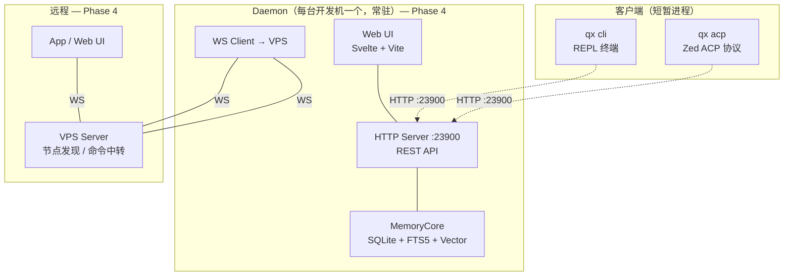
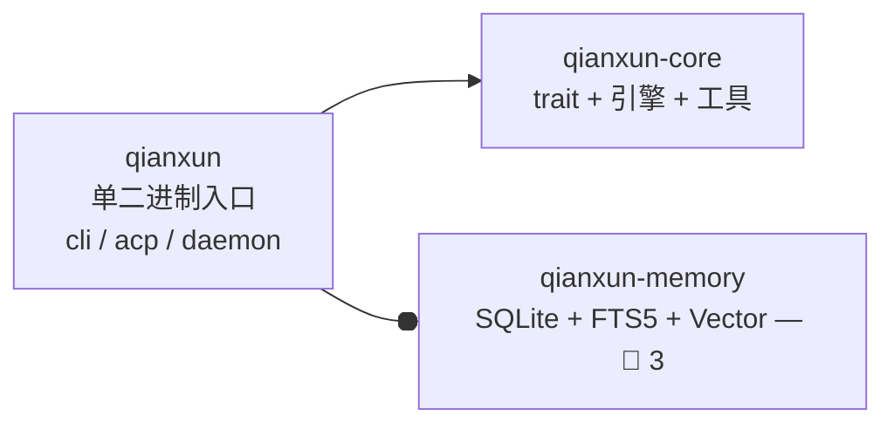
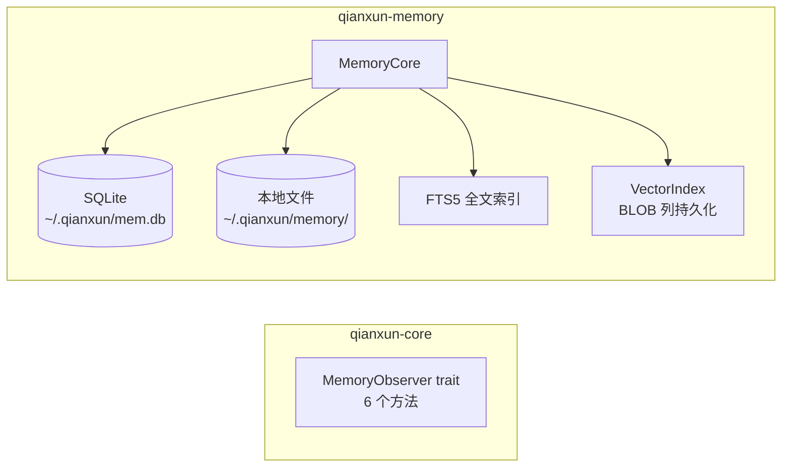

# 千寻架构设计

> 版本: 0.5 | 更新: 2026-06-01 | 状态: 已实现
>
> 基于实现回溯更新：Phase 3a/3b/3c 全部实现、Daemon HTTP 骨架就绪、VPS 骨架就绪

---

## 阶段状态总览

| Phase | 描述 | 文档中的节 |
|---|---|---|
| ✅ **Phase 1-2** | Agent 引擎 + Provider + 工具 + CLI + ACP + 工作区 | CLAUDE.md 模块结构 |
| ✅ **Phase 3a** | Memory(memory crate) + MCP(ServerManager/HTTP) + Skills(skill_read) | 全部完成 |
| ✅ **Phase 3b** | Agent Patterns（AgentPattern enum + plan/reflect/workflow 模块） | 全部完成 |
| ✅ **Phase 3c** | Daemon HTTP 框架（axum 路由 + AgentLoopHost + 会话管理） | 骨架已完成 |
| 📋 **Phase 4a** | Daemon 功能完整（Memory/MCP/Skills 接入 HTTP） | `daemon-design.md` |
| 📋 **Phase 4b** | VPS Server | `vps-server-design.md` |
| 📋 **Phase 4c** | Web UI 前端 | — |

---

## 1. 概述

千寻（Qianxun）是一个个人 AI 助手系统。在本地以 CLI REPL + ACP 协议 + Daemon 三种入口运行，可选部署远程 VPS Server 实现多设备互联和远程控制。

### 运行模式（Phase 4 目标）

所有入口都依赖 Daemon 提供 AgentLoop、LLM 推理和 Memory 服务。CLI/ACP 是薄客户端，不持有 AgentLoop，不直接调 LLM。

> **Phase 3 开发期**：Daemon 尚未实现。CLI 以 standalone 模式运行，进程内链接 AgentLoop + Memory + MCP + Skills。详见 §3 Phase 3 过渡路径。

| 入口 | 适用场景 | 依赖（Phase 4） |
|---|---|---|
| **qx cli** | 终端交互 | HTTP → Daemon |
| **qx acp** | Zed 编辑器集成 | HTTP → Daemon |
| **qx daemon** | 守护进程常驻 | 自身：AgentLoop + MemoryCore + HTTP API |

**架构定位**：
- Daemon 是目标架构的唯一运行时（Phase 4）
- Phase 3 开发期：CLI 以 standalone 模式运行，进程内链接 core + memory + MCP + skills
- Phase 4 目标：CLI/ACP 是薄客户端，通过 HTTP → Daemon
- 多前端实例共享同一个 Daemon 的 token 预算和 LLM Provider 池
- CLI standalone 模式在 Phase 4 后保留，用于快速调试

---

## 2. 整体架构

### 2.1 目标架构图



### 2.2 AgentLoop 归 Daemon —— 设计论证（Phase 4 目标）

**决策**：AgentLoop 只放在 Daemon 中。CLI/ACP 不包含独立 AgentLoop。

```
Daemon 持有：
┌────────────────────────────────────────┐
│  AgentLoop（Conversation + 状态机）    │ ← 唯一
│  LlmProvider 池（API Key 集中持有）    │ ← 唯一
│  MemoryCore（SQLite + FTS5 + Vector） │ ← 唯一
│  ToolRegistry（builtin + MCP + Skill）│ ← 唯一
└────────────────────────────────────────┘
          ↕ HTTP :23900
  ┌────────┴────────┐
  │ CLI             │ ACP
  │ (终端渲染)      │ (协议转换)
  └────────────────┘
```

**为什么不保留独立 AgentLoop**：

| 方案 | 独立 AgentLoop（已否决） | 统一 AgentLoop（选定） |
|---|---|---|
| API Key 管理 | 散落在各 CLI 进程 | Daemon 集中加密持有 |
| Token 预算 | 各进程独立，无法全局控制 | 单点统一限流 |
| 对话恢复 | CLI crash → 丢失 | 重连 Daemon 即可恢复 |
| 多前端协调 | CLI/ACP 各自为政 | 共享同一个 Conversation |
| 单点风险 | 无 | Daemon 是单点（可 systemd 自愈） |
| 额外延迟 | 无 | ~0.5ms（本地 loopback） |

本地 loopback 的 0.5ms 相对于 LLM 推理的秒级延迟可以忽略。

**离线降级**：Daemon 断开 VPS 后，本地 AgentLoop 照常工作。CLI 断开 Daemon 后可尝试重连（systemd 自愈）。
> Phase 4 后 Daemon 是必需的运行时组件。Phase 3 开发期使用 CLI standalone 模式，不依赖 Daemon。

### 2.3 设计原则

**Phase 1-2 已落地：**

- **分层解耦**：core 不依赖任何 binary，OutputSink 让引擎不感知输出目标。
- **工具分三层**：builtin / skill / MCP，统一通过 ToolRegistry 调度。
- **系统提示词组装**：system_prompt.rs 统一构建，注入 memory + skills 上下文。
- **构建顺序交付**：每个 Phase 交付可运行系统，不提前实现未规划的 feature。

**Phase 4 目标：**

- **Daemon 是本地核心**：持有 AgentLoop + MemoryCore + LLM Provider 池，通过 HTTP :23900 提供服务。
- **CLI/ACP 是薄客户端**：不持有 AgentLoop，不直接调 LLM。只负责输入输出渲染。
- **多前端并发**：多个 qx 实例可同时连接同一个 Daemon，各自有独立 Conversation 但共享 MemoryCore。
- **API Key 集中管理**：所有 Provider 的 API Key 仅在 Daemon 进程中持有，加密存储（AES-GCM）。
- **VPS 只做控制面**：用户管理、节点发现、命令中转。不存代码、不存记忆、不调 LLM。
- **Web UI = Svelte + Vite**：编译为静态文件，由 Daemon HTTP Server 内嵌托管。

### 2.4 已知限制

| 限制 | 说明 | 规划 |
|---|---|---|
| **跨机记忆同步** | 多台开发机各自有独立 MemoryCore，VPS 不存记忆 | Phase 5 评估 |
| **单机单 Daemon** | 一台开发机只能运行一个 Daemon，不支持多实例 | 无计划 |
| **Session 非持久** | 当前 ACP 会话仅内存存储 | Phase 3 Memory 实现后持久化 |

---

## 3. 单二进制架构

千寻以**单二进制 + 子命令**模式交付。所有入口通过同一个 `qx` 命令调用，不同子命令对应不同运行模式。

| 子命令 | 模式 | 运行时形态 | 依赖 |
|---|---|---|---|
| `qx` | CLI REPL | 短暂进程，链接 core | HTTP → Daemon（可选 standalone） |
| `qx --acp-mode` | ACP 协议桥 | 短暂进程，链接 core + acp | 进程内（Phase 3）/ HTTP → Daemon（Phase 4） |
| `qx daemon` | 守护进程 | **常驻**，链接 core + memory + acp | 无外部依赖 |

### Phase 3 过渡路径

Phase 3 交付 Memory/Skills/MCP 时，Daemon 尚未实现。因此这些模块在 **CLI standalone 模式**下开发运行：

```
Phase 3 开发期：
  qx（standalone）
    ├─ AgentLoop（进程内）
    ├─ Memory（进程内，直接链接 qianxun-memory）
    ├─ MCP Client（进程内）
    └─ Skill Manager（进程内）

Phase 4 目标：
  qx daemon（常驻）
    ├─ AgentLoop（进程内）
    ├─ Memory（进程内）
    ├─ MCP（进程内）
    └─ Skill Manager（进程内）
  
  qx（薄客户端）→ HTTP → qx daemon
  qx --acp-mode（薄协议桥）→ HTTP → qx daemon
```

CLI standalone 模式在 Phase 4 后仍然保留，用于快速调试和开发场景。

### 3.1 Crate 划分



| Crate | 类型 | 角色 | Phase |
|---|---|---|---|
| `qianxun-core` | lib | 核心类型、Agent 引擎、Provider、工具、trait 定义 | ✅ 1 |
| `qianxun-memory` | lib | 记忆引擎（SQLite + FTS5 + Vector 索引） | 🔧 3 |
| `qianxun` | **bin** | 单二进制入口（cli / acp / daemon 子命令） | 🔧 3-4 |

**LlmError** — 统一的 LLM 错误类型:
- `NoApiKey`, `RateLimitExceeded`, `ApiError`, `AuthenticationError`, `PromptTooLarge`, `StreamEnded`

**TokenUsage** — token 消耗追踪: `input`, `output`, `cache_creation_input`, `cache_read_input`

**AgentConfig** — 代理引擎配置: `max_turns`, `max_retries`, `max_tokens`, `temperature`, `thinking`

**AgentEvent / OutputSink** — 事件通知 + 输出抽象，引擎不感知输出目标。

### 3.2 数据库选型决策

| 决策 | 结论 |
|---|---|
| **记忆存储** | SQLite (rusqlite bundled) — 见 [ADR-0001: 数据库选型](../30_决策/ADR-0001_数据库选型.md) |
| **全文搜索** | SQLite FTS5（取代自建 BM25 HashMap + 全量序列化） |
| **向量存储** | SQLite BLOB 列（取代 WAL 追加 + 启动重建） |

### 3.3 配置向后兼容

配置格式从 JSON5 改为带注释的 JSON。如果用户存在旧的 `~/.qianxun/config.json5`（Phase 1-2 使用的格式），Config 解析逻辑应自动检测并尝试解析：

```
启动时：
  1. 尝试读取 ~/.qianxun/config.json（带注释 JSON，json_comments + serde_json）
  2. 如果文件不存在 → 尝试读取 ~/.qianxun/config.json5（旧格式）
  3. 如果旧文件存在且解析成功 → 自动重命名为 config.json.bak，写入新格式
  4. 如果都不存在 → 使用内置默认配置引导用户生成
```

### 3.4 工具系统

5 个内置工具：ReadTextFileTool, WriteTextFileTool, SearchTool, GrepTool, ListDirectoryTool。

在 ACP 模式下，文件读写工具可由编辑器代理执行，通过 ACP 双向请求机制转发，失败时回退到本地。

工具分三层：builtin（核心文件/搜索）、skill（动态加载）、MCP（外部协议），统一通过 ToolRegistry 调度。

### 3.5 项目边界模型

千寻以 `.qianxun` 目录定义项目边界，遵循和 `.git` 一致的使用体验：

```
.qianxun        → 千寻项目根
.git            → git 仓库边界
```

**查找规则**：打开目录时，向上逐层查找 `.qianxun` 目录（最多 10 层，到达文件系统根为止）。

```
~/projects/
├── qianxun/.qianxun/         ← 找到 → 项目根
│   └── src/main.rs            ← 属于 qianxun 项目
│
├── work/.qianxun/            ← 找到 → 项目根
│   └── backend/               ← 属于 work 项目
│
├── personal/                  ← 无 .qianxun，继续向上
│   └── blog/.git/             ← 但也不是千寻项目
│       └── src/                ← "未在千寻项目中"
```

嵌套时取最近一层 `.qianxun`（同 git 的 `.git` 查找逻辑）。

**和项目上下文的关系**：`build_project_context()` 读取 `.qianxun/config.json` 的 `prompt_file` 设置和项目根下的 CLAUDE.md / AGENTS.md 文件，注入 system prompt。项目类型由 Agent 通过文件读取自行发现，千寻不做静态检测。

### 3.6 项目目录结构

```
.qianxun/                        # 项目根标记（对千寻有效）
├── config.json                 # 项目级配置覆写（可选）
├── node.token                   # 设备 token（Daemon 写入）
├── skills/                      # 项目级 skill（可选）
│   └── project-rules.md
├── workflows/                   # 项目级工作流（可选）
│   └── deploy.md
└── .gitignore
```

全局配置 `~/.qianxun/config.json` 和项目级 `.qianxun/config.json` 合并规则：**项目级覆写全局级同名字段**。这和 `Cargo.toml` 的 `[workspace.metadata]` 覆写逻辑一致。

## 4. VPS Server 模式

> 📋 Phase 4 规划，当前未实现。

### 4.1 架构

```
VPS（公网可达）
└─ qx server
    ├─ 用户管理（管理员注册用户）
    ├─ 设备授权（OAuth 式 Web 授权）
    ├─ WebSocket 命令中转
    ├─ Web UI（登录 / 授权 / 管理）
    └─ 数据库（用户 + 设备 + 授权码）

Windows 开发机              Linux 开发机              App / Web
└─ qx daemon                 └─ qx daemon               └─ qx app
   ├─ AgentLoop（本地）       ├─ AgentLoop（本地）       ├─ 登录
   ├─ MemoryCore（本地）      ├─ MemoryCore（本地）      ├─ 查看节点
   ├─ 文件 I/O（本地）        ├─ 文件 I/O（本地）        ├─ 发送命令
   └─ WS → VPS               └─ WS → VPS               └─ 接收结果
```

### 4.2 VPS 职责边界

| 操作 | 谁做 | VPS 不做 |
|---|---|---|
| Agent 推理 | 开发机本地 | ❌ |
| 记忆存储 | 开发机本地 | ❌ |
| 文件读写 | 开发机本地 | ❌ |
| LLM API 调用 | 开发机本地 | ❌ |
| **用户管理** | **VPS** | ✅ |
| **节点发现** | **VPS** | ✅ |
| **命令中转** | **VPS** | ✅ |

### 4.3 数据库模型

```rust
pub struct User { pub id, pub username, pub password_hash, pub role, pub created_at }
pub struct Device { pub id, pub host_id, pub user_id, pub token_hash, pub host_type,
    pub projects, pub workers, pub caps, pub status, pub last_seen, pub created_at }
pub struct AuthCode { pub code, pub device_id, pub user_id, pub expires_at, pub status }
```

### 4.4 设备授权流程

```
管理员在 Web UI 创建用户 → 用户登录 Web UI

开发机 (Daemon)              用户 (浏览器)              VPS
───────────               ──────────              ──────────
qx daemon auth
  │ POST /api/device/auth-code                    │
  │← 返回 code=xyz                                 │
  │ 打印 URL                                        │
  │                    打开 https://vps/authorize   │
  │                      ?code=xyz                  │
  │                    Web UI → [授权]               │
  │                      POST /api/device/authorize │
  │ 轮询 token                                      │
  │ GET /api/device/token?code=xyz                  │
  │← device_token                                   │
  │ WS: wss://vps/ws?token=dt_xxx                   │
```

> **注意**：上述授权流程是完整的 OAuth Device Authorization Grant 方案，适合多用户团队。
> 默认使用场景为个人单机时，可通过 `~/.qianxun/config.json` 预配置 API token 跳过此流程。
> 个人用户无需部署 VPS，Daemon 可完全离线工作。

### 4.5 WebSocket 协议

```
Daemon 连接认证:    → {"type":"auth","token":"dt_xxxxx"}
                    ← {"type":"auth_ok","device_id":"d_abc","user_id":"u_123"}

Daemon 注册能力:    → {"type":"register","projects":[...],"caps":[...]}

App → Daemon 命令:  → {"type":"command","target":"windows-pc","seq":1,
                       "payload":{"action":"read_file","path":"..."}}
                    ← {"type":"command_result","host":"windows-pc","seq":1,...}
```

### 4.6 API 清单

```
POST   /api/auth/login                 登录 → JWT
POST   /api/device/auth-code           生成授权码
POST   /api/device/authorize           确认授权
GET    /api/device/token               轮询 token

POST   /api/admin/users                创建用户（管理员）
GET    /api/admin/users                用户列表（管理员）
WS     wss://vps:23901/ws               设备/App 连接
```

---

## 5. Daemon 模式

> 📋 Phase 4 规划。当前千寻以 CLI/ACP 模式运行，Daemon 是 Phase 4 的核心交付。

### 5.1 架构

Daemon 是运行在开发机上的守护进程（`qx daemon`），是整个系统的本地核心。
它持有 AgentLoop + MemoryCore + LLM Provider，对外提供 HTTP API。

```
Daemon 进程（常驻）— Phase 4 目标：
┌─────────────────────────────────────────────────────┐
│  HTTP Server (127.0.0.1:23900)                       │
│  ├─ /v1/llm/*             LLM Provider 管理         │
│  ├─ /v1/llm/chat          LLM 推理代理（SSE 流式）  │
│  ├─ /v1/memory/*          记忆管理                   │
│  ├─ /v1/skills/*          技能管理                   │
│  ├─ /v1/mcp/*             MCP 管理                   │
│  ├─ /v1/projects/*        项目列表/状态              │
│  ├─ /v1/config/*          配置管理                   │
│  ├─ /v1/chat/*            AgentLoop 代理 / 会话管理  │
│  └─ /v1/system/*          系统状态/健康检查           │
│                                                     │
│  AgentLoop（向量化）                                 │
│  ├─ Conversation（对话状态机）                       │
│  ├─ LlmProvider（DeepSeek/OpenAI）                   │
│  ├─ ToolRegistry（builtin + MCP + Skill）            │
│  └─ MemoryObserver（记忆捕获钩子）                   │
│                                                     │
│  MemoryCore（直接链接）                               │
│  ├─ SQLite + FTS5                                   │
│  └─ VectorIndex（BLOB 列持久化）                     │
│                                                     │
│  VPS WS Client（可选）                               │
│  └─ wss://vps:23901/ws                               │
│                                                     │
│  Web UI（Svelte + Vite，内嵌）                        │
│  └─ http://127.0.0.1:23900/ui                        │
└─────────────────────────────────────────────────────┘
       ↑ HTTP :23900
       │
  ┌────┴─────┐          ┌───────────┐
  │ qx cli   │          │ qx acp    │
  │ (REPL)   │          │ (Zed)     │
  └──────────┘          └───────────┘
```

### 5.2 启动流程

```
1. 读取配置 ~/.qianxun/config.json
2. 初始化 MemoryCore（打开 SQLite + 重建向量索引 + FTS5 就绪）
3. 初始化 AgentLoop（LlmProvider + ToolRegistry）
4. 启动 HTTP Server :23900
5. 如果配置了 VPS 连接：
   a. 读取 ~/.qianxun/daemon.token
   b. 连接 wss://vps:23901/ws?token=xxx
   c. 注册能力列表和项目信息
6. 启动 Web UI（内嵌 Svelte 静态文件）
7. 等待客户端连接或远程命令
```

### 5.3 HTTP API 设计

#### 5.3.1 LLM API

```
CLI/ACP                  Daemon:23900                  LLM API (DeepSeek/OpenAI)
  │                          │                          │
  │ POST /v1/llm/chat ──────→│                          │
  │   { messages, tools }    │                          │
  │                          ├─ POST /v1/chat/completions ──→│
  │                          │←─ SSE stream ───────────────│
  │←─ SSE stream ───────────│                          │
```

API 端点：

```
POST /v1/llm/chat             LLM 推理（流式 SSE）
POST /v1/llm/embed            文本嵌入
GET  /v1/llm/providers        已配置的 Provider 列表
POST /v1/llm/providers        添加 Provider 配置
PUT  /v1/llm/providers/:name  更新 Provider 配置
DELETE /v1/llm/providers/:name 删除 Provider 配置
POST /v1/llm/providers/:name/test  测试连接
```

**API Key 存储**：仅在 Daemon 进程内存中持有。磁盘存储时加密（AES-GCM），密钥来自系统密钥链（macOS Keychain / Linux secret-tool / Windows Credential Manager）。

#### 5.3.2 Memory API

```
POST /v1/memory/observe         记录工具调用
POST /v1/memory/search          搜索记忆
POST /v1/memory/build_context   构建上下文
POST /v1/memory/remember        手动保存持久记忆
POST /v1/memory/forget          删除记忆
GET  /v1/memory/sessions        会话列表
GET  /v1/memory/sessions/:id    会话详情
GET  /v1/memory/memories        持久记忆列表
GET  /v1/memory/slots           工作记忆插槽列表
POST /v1/memory/slots/:label/append   追加插槽内容
POST /v1/memory/slots/:label/replace  替换插槽内容
POST /v1/memory/slots            创建新插槽
DELETE /v1/memory/slots/:label   删除插槽
```

#### 5.3.3 Skills / MCP / Project / Config / System API

```
GET  /v1/skills                 技能列表
POST /v1/skills/scan            扫描技能目录
POST /v1/skills/install         安装技能
POST /v1/skills/:name/enable   启用/禁用技能
DELETE /v1/skills/:name         删除技能

GET  /v1/mcp/servers            MCP 服务器列表
POST /v1/mcp/servers            添加 MCP 服务器
DELETE /v1/mcp/servers/:id      删除 MCP 服务器
POST /v1/mcp/servers/:id/test   测试连接

GET  /v1/projects               项目列表
POST /v1/projects               添加项目
DELETE /v1/projects/:name       删除项目

GET  /v1/config                 读取配置
PUT  /v1/config                 更新配置

GET  /v1/system/health          健康检查
GET  /v1/system/status          状态概览
POST /v1/system/restart         重启 Daemon
POST /v1/system/shutdown        关闭 Daemon
```

### 5.4 Web UI（Svelte + Vite）

> 📋 Phase 4 规划。技术选型待前端实现时评估确认。

Web UI 是 Daemon 的内嵌前端，通过 Daemon HTTP Server 提供 `/v1/` REST API 的浏览器界面。
编译后为纯静态文件，嵌入 `qx daemon` 二进制，通过 `/ui` 路由访问。

### 5.5 离线降级

```
有网时：Daemon → VPS（App 可见，可远程控制）
断网时：Daemon 检测 WS 断开 → 本地 AgentLoop 照常工作
       → 本地 Web UI 照常工作 → 记忆写入本地 MemoryCore
       → 网络恢复后自动重连 → 不同步离线期间的记忆（VPS 不存记忆）
```

---

## 6. 记忆子系统

> 🔧 Phase 3 设计中。完整设计见 `docs/memory-design.md`。此处仅概述 crate 边界。



```rust
#[async_trait]
pub trait MemoryObserver: Send + Sync {
    async fn observe(&self, hook_type, tool_name, tool_input, tool_output);
    async fn build_context(&self, query: &str, token_budget: u32) -> String;
    async fn remember(&self, content: &str, mem_type: &str) -> Result<String>;
    async fn search(&self, query: &str, limit: usize) -> Result<Vec<SearchResult>>;
    async fn session_start(&self, session_id, project, cwd);
    async fn session_end(&self);
}
```

---

## 7. 记忆与 AgentLoop 的运行时交互

> 🔧 Phase 3 实现目标。完整细节见 `memory-design.md`。此处仅概述关键流程。

### 阶段一：用户输入 → 构建 system prompt

```
用户输入 → build_context(query) → 混合检索（FTS5 + Vector）
  → 注入 system prompt：BASE + memory_context + skills_catalog + skill_injections
  → 发送给 LLM
```

### 阶段二：LLM 回复 + 工具执行 + 记忆捕获

```
LLM 流式返回 tool_call
  → observe(PreToolUse, name, args)           ← 记录工具即将执行
  → tools.execute_async(name, args)
  → observe(PostToolUse, name, result)        ← 捕获工具结果
    → strip_private_data() → compressor.build_synthetic()
    → BatchWriter.push() → SQLite + FTS5 + Vector（立即可搜索）
  → push tool results → 继续调 LLM
```

### 阶段三：会话结束 → 持久化

```
session_end()
  → consolidation_pipeline()
    → 获取 advisory lock（防止并发）
    → 扫描本 session 的 Observation
    → 按 concepts 集合 Jaccard > 0.5 聚类
    → 生成 Memory（avg importance > 6 或其他条件）
    → 与已有 Memory 合并（Jaccard > 0.7 版本升级）
  → 生成 SessionSummary
```

### 大量文本的处理原则

Memory **不存储原始文件内容**。原始 `tool_output` 的 150KB 代码只生成 ~200 字节的合成摘要（路径 + 类型 + 概念），压缩率 ~750:1。原始内容仅在 LLM 上下文中短暂存在。

---

## 8. 部署

> 📋 Phase 4 规划。当前千寻以 CLI/ACP 模式运行，Daemon 就绪后升级。

### 8.1 VPS 部署要求

| 项 | 要求 |
|---|---|
| CPU | 1 核（足够，不做推理） |
| 内存 | 512 MB - 1 GB |
| 磁盘 | 10 GB（只存用户+设备数据） |
| 网络 | 公网可达，开放 23901 端口 |
| 数据库 | SQLite（内嵌，无额外服务） |

### 8.2 开发机要求

| 项 | 要求 |
|---|---|
| Daemon | 完整的独立系统，AgentLoop + MemoryCore |
| 离线 | 可完全离线工作 |
| VPS 连接 | 可选，用于远程控制 |

### 8.3 跨平台服务注册

```
VPS:          qx server install → systemd / Windows Service
开发机 Daemon: qx daemon install → systemd --user / 用户级自动启动
```

---

## 9. 当前状态与已知问题

### 9.1 模块实现状态

| 模块 | 状态 | 说明 |
|---|---|---|
| 核心类型 (types/config) | ✅ 完成 | LlmError, TokenUsage, AgentConfig, Config |
| Agent 引擎 (agent/) | ✅ 完成 | Conversation, AgentLoop, system_prompt |
| LLM Provider (provider/) | ✅ 完成 | LlmProvider trait + DeepSeek 实现 |
| 输出抽象 (output.rs) | ✅ 完成 | OutputSink + CliOutputSink + AcpOutputSink |
| 内置工具 (tools/) | ✅ 完成 | 5 个工具 + ToolRegistry + ACP 转发 |
| 项目根检测 (workspace.rs) | ✅ 完成 | .qianxun/ 向上查找 + CLAUDE.md 读取 |
| ACP 协议 (qianxun/acp/) | ✅ 完成 | JSON-RPC 2.0 + session 管理 + 双向请求 |
| Memory (qianxun-memory) | 🔧 部分实现 | observe/build_context/remember 可用; search 返回空, session_start/end 空实现 |
| Skills (skills/) | ✅ 完成 | frontmatter 解析 + 自动匹配 + @引用 + 文件监听 + inject 构建 |
| MCP Client (mcp/) | ✅ 完成 | 连接/握手/list_tools/call_tool/shutdown + ServerManager 崩溃保护 |
| Daemon (qx daemon) | 🔧 骨架已完成 | AgentLoopHost 会话管理 + HTTP 路由; 未接入真实 AgentLoop/Memory/Skills/MCP |
| VPS Server (qx server) | 🔧 骨架已完成 | SQLite + 路由 + JWT; 未接 WS Hub / 命令中转 |

### 9.2 设计取舍

| 取舍 | 决策 | 理由 |
|---|---|---|
| Token 估计 | 字符长度近似 | 避免 tiktoken-rs 依赖，预算裁剪非关键路径 |
| Session 持久化 | Phase 2 不持久 | 与 Zed 的工作会话不需要跨进程持久化 |
| `execute_async` vs `execute` | 共存 | `execute` 是 `block_on` 包装，用于非 tokio 上下文 |

### 9.3 已知问题

| 严重度 | 问题 | 位置 |
|---|---|---|
| 高 | Memory search 返回空结果 | qianxun-memory/src/search.rs |
| 高 | session_start/end 空实现，FTS 写入不完整 | qianxun-memory/src/lib.rs |
| 中 | Daemon 未接入真实 AgentLoop/Memory/Skills/MCP | qianxun/src/daemon/ |
| 中 | Agent Patterns（plan/reflect/workflow）未接线 | qianxun-core/src/agent/plan.rs |
| 低 | VPS Server 缺少 WS Hub 和 Argon2 | qianxun/src/server/ |

### 9.4 构建顺序

| Phase | 交付 |
|---|---|
| 1 | 代码骨架 + 核心类型 + REPL CLI + DeepSeek Provider + AgentLoop + 5 内置工具 + 全局配置 ✅ |
| 2 | ACP 协议 + 工作空间支持 ✅ |
| 3a | Memory + MCP + Skills 实现 ✅ |
| 3b | Agent Patterns（React/Plan/Reflective/Workflow）📋 |
| 3c | Daemon HTTP 框架（与 3a/3b 并行） 🔧 |
| 4a | Daemon 功能完整（Memory/MCP/Skills 接入 HTTP） 📋 |
| 4b | VPS Server + Web UI 📋 |
