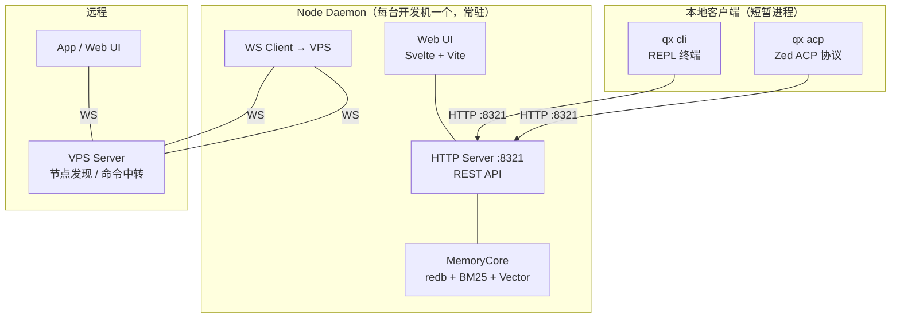
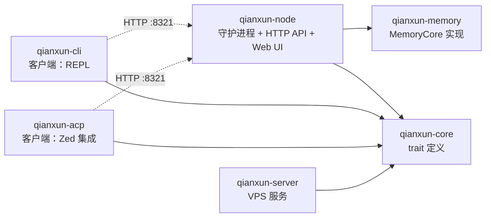
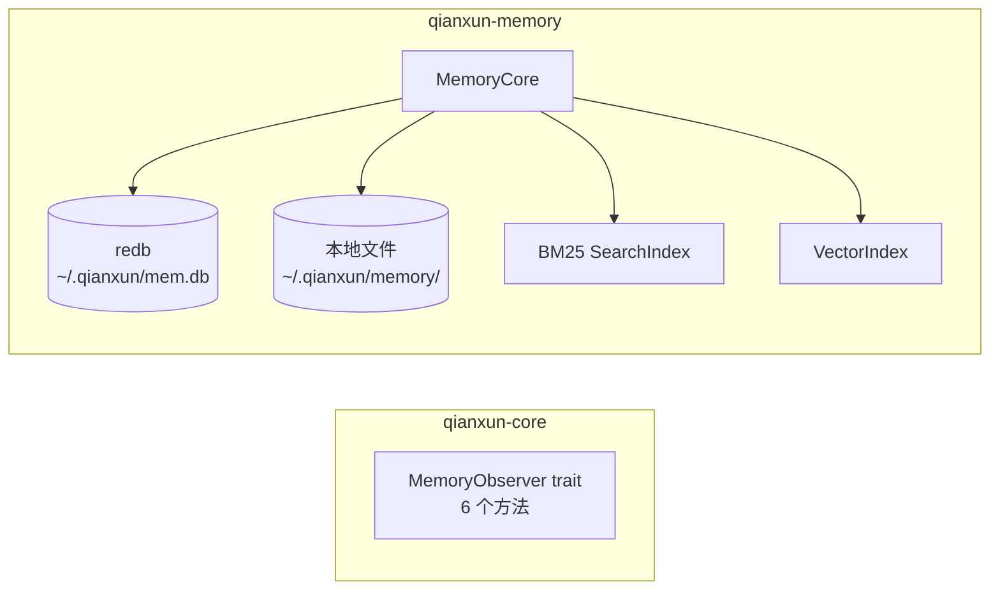

# 千寻架构设计

> 版本: 0.1 | 更新: 2026-05-29 | 状态: 草案

---

## 1. 概述

千寻（Qianxun）是一个个人 AI 助手系统，既可以作为本地编程助手（REPL + ACP），也可以部署为分布式架构（VPS Server + Node）。

### 运行模式

千寻有三种运行入口，但底层架构统一：

| 入口 | 适用场景 | AgentLoop 位置 | Memory 访问 |
|---|---|---|---|
| **qx cli** | 终端交互 | HTTP → Node daemon | 通过 Node HTTP API |
| **qx acp** | Zed 编辑器集成 | HTTP → Node daemon | 通过 Node HTTP API |
| **qx node** | 守护进程常驻 | 自身进程 | 直接 MemoryCore |

CLI 和 ACP 在架构上是等价的——都是 qx 进程，通过 HTTP 连接本地的 Node daemon。
Node daemon 是核心，它持有 MemoryCore 并提供 REST API。

当 Node daemon 未运行时，CLI 也可降级为进程内模式（直接链接 MemoryCore）。

---

## 2. 整体架构



### 2.1 设计原则

- **VPS 只做控制面**：用户管理、节点发现、命令中转。不存代码、不存记忆、不调 LLM。
- **Node 是本地核心**：持有 MemoryCore + LLM Provider 池，通过 HTTP :8321 提供服务。
- **CLI/ACP 是薄客户端**：AgentLoop 在客户端进程内运行，但 LLM 调用和 memory 都通过 HTTP 代理到 Node。
- **API Key 集中管理**：所有 Provider 的 API Key 仅在 Node 进程中持有，加密存储。CLI/ACP 不需要配置 API Key。
- **离线降级**：Node 断开 VPS 后，本地 AgentLoop 照常工作；CLI 断开 Node 后可使用进程内 memory 回退。
- **Web UI = Svelte + Vite**：编译为静态文件，由 Node HTTP Server 内嵌托管。

---

## 3. Crate 结构



| Crate | 角色 | 依赖 | 运行方式 |
|---|---|---|---|
| `qianxun-core` | 核心类型 + trait 定义 | 无特殊 | 库 |
| `qianxun-memory` | 记忆引擎（redb + BM25 + Vector） | core | 库 |
| `qianxun-cli` | 客户端：REPL 终端 | core | 短暂进程，通过 HTTP 调用 Node |
| `qianxun-acp` | 客户端：Zed 集成 | core | 短暂进程，通过 HTTP 调用 Node |
| `qianxun-server` | VPS 服务 | core | 常驻（systemd） |
| `qianxun-node` | **核心 daemon**：LLM 代理 + Memory + Web UI | core + memory + reqwest | **常驻（systemd / Windows Service）** |

`qianxun-node` 持有所有 API Key，是唯一直接调 LLM API 的运行时组件。
CLI/ACP 的 AgentLoop 仍在其进程内运行，但 LLM 调用通过 HTTP 代理到 Node。

**关键架构决策**：
- `qianxun-node` 是唯一直接链接 `qianxun-memory` 的运行时 crate
- `qianxun-cli` 和 `qianxun-acp` 都不直接链接 `qianxun-memory`——它们通过 HTTP 调用 Node
- CLI 降级模式下（无 Node），CLI 可进程内链接 memory，但不是默认路径

---

## 4. VPS Server 模式

### 4.1 架构

```
VPS（公网可达）
└─ qx server
    ├─ 用户管理（管理员注册用户）
    ├─ 设备授权（OAuth 式 Web 授权）
    ├─ WebSocket 命令中转
    ├─ Web UI（登录 / 授权 / 管理）
    └─ 数据库（用户 + 设备 + 授权码）

Windows 开发机              Linux 开发机              App / Web
└─ qx node                 └─ qx node               └─ qx app
   ├─ AgentLoop（本地）       ├─ AgentLoop（本地）       ├─ 登录
   ├─ MemoryCore（本地）      ├─ MemoryCore（本地）      ├─ 查看节点
   ├─ 文件 I/O（本地）        ├─ 文件 I/O（本地）        ├─ 发送命令
   └─ WS → VPS               └─ WS → VPS               └─ 接收结果
```

### 4.2 VPS 职责边界

| 操作 | 谁做 | VPS 不做 |
|---|---|---|
| Agent 推理 | 开发机本地 | ❌ |
| 记忆存储 | 开发机本地 | ❌ |
| 文件读写 | 开发机本地 | ❌ |
| LLM API 调用 | 开发机本地 | ❌ |
| **用户管理** | **VPS** | ✅ |
| **节点发现** | **VPS** | ✅ |
| **命令中转** | **VPS** | ✅ |

### 4.3 数据库模型

```rust
pub struct User {
    pub id: String,
    pub username: String,
    pub password_hash: String,
    pub role: UserRole,        // Admin | User
    pub created_at: DateTime<Utc>,
}

pub struct Device {
    pub id: String,
    pub host_id: String,       // "windows-pc"
    pub user_id: String,       // 所属用户
    pub token_hash: String,    // 设备 token 哈希
    pub host_type: String,     // "windows" | "linux" | "macos"
    pub projects: Vec<String>, // ["qianxun", "myblog"]
    pub workers: u32,
    pub caps: Vec<String>,     // ["read_file","terminal","git"]
    pub status: DeviceStatus,  // online | offline
    pub last_seen: DateTime<Utc>,
    pub created_at: DateTime<Utc>,
}

pub struct AuthCode {
    pub code: String,
    pub device_id: String,
    pub user_id: Option<String>,
    pub expires_at: DateTime<Utc>,
    pub status: AuthCodeStatus, // Pending | Authorized | Expired
}
```

### 4.4 设备授权流程

```
管理员在 Web UI 创建用户 → 用户登录 Web UI

开发机 (Node)              用户 (浏览器)              VPS
───────────               ──────────              ──────────
qx node auth
  │ POST /api/device/auth-code                    │
  │← 返回 code=xyz                                 │
  │ 打印 URL                                        │
  │                                                 │
  │                    打开 https://vps/authorize   │
  │                      ?code=xyz                  │
  │                                                 │
  │                    Web UI → [授权]               │
  │                      POST /api/device/authorize │
  │                                                 │
  │ 轮询 token                                      │
  │ GET /api/device/token?code=xyz                  │
  │← device_token                                   │
  │                                                 │
  │ WS: wss://vps/ws?token=dt_xxx                   │
```

| 凭证 | 有效期 | 用途 |
|---|---|---|
| 授权码 | 5 分钟 | 换取设备 token |
| 设备 token | 长期（可吊销） | WS 连接认证 |
| 用户 JWT | 24 小时 | Web UI / App 登录 |

### 4.5 多用户隔离

```
用户 A 登录 App → 只能看到自己的节点，只能给自己的节点发命令
用户 B 登录 App → 只能看到自己的节点
管理员登录 Web UI → 看到所有用户+所有节点，可创建/禁用用户
```

### 4.6 WebSocket 协议

```json
// Node 连接认证
→ {"type":"auth","token":"dt_xxxxx"}
← {"type":"auth_ok","device_id":"d_abc","user_id":"u_123"}

// Node 注册能力
→ {"type":"register","projects":["qianxun"],"caps":["read_file","terminal","git"]}
→ {"type":"status","status":"busy","workers":2}

// App 连接 → 获取节点列表
→ {"type":"auth","token":"eyJ..."}
← {"type":"node_list","nodes":[
    {"host_id":"windows-pc","projects":["qianxun"],"workers":2,"status":"online"}
  ]}

// App → Node: 命令（VPS 验证 target 属于当前用户后透传）
→ {"type":"command","target":"windows-pc","seq":1,
   "payload":{"action":"read_file","path":"C:\\dev\\README.md"}}
← {"type":"command_result","host":"windows-pc","seq":1,"data":{"content":"# qianxun\n..."}}
```

### 4.7 API 清单

```
公开:
  POST   /api/auth/login                 登录 → JWT
  POST   /api/device/auth-code           生成授权码
  POST   /api/device/authorize           确认授权
  GET    /api/device/token               轮询 token

管理员:
  POST   /api/admin/users                创建用户
  GET    /api/admin/users                用户列表
  DELETE /api/admin/users/:id            禁用用户

Web UI:
  GET    /login                          登录页
  GET    /authorize?code=xxx             授权页
  GET    /admin/users                    用户管理
  GET    /dashboard                      节点总览

WebSocket:
  wss://vps:8313/ws                      设备/App 连接
```

---

## 5. Node 模式

### 5.1 架构

Node 是运行在开发机上的守护进程（`qx node`），是整个系统的本地核心。
它持有 MemoryCore 并对外提供 HTTP API，供 CLI/ACP 进程和 Web UI 调用。

```
Node 进程（常驻）：
┌─────────────────────────────────────────────────────┐
│  HTTP Server (127.0.0.1:8321)                       │
│  ├─ /v1/llm/*             LLM Provider 管理         │
│  ├─ /v1/llm/chat          LLM 推理代理              │
│  ├─ /v1/memory/*          记忆管理                   │
│  ├─ /v1/skills/*          技能管理                   │
│  ├─ /v1/mcp/*             MCP 管理                   │
│  ├─ /v1/projects/*        项目列表/状态              │
│  ├─ /v1/config/*          配置管理                   │
│  ├─ /v1/agent/*           Agent 实例管理             │
│  └─ /v1/system/*          系统状态/健康检查           │
│                                                     │
│  MemoryCore（直接链接）                               │
│  ├─ redb + 本地文件                                 │
│  ├─ BM25 SearchIndex                                │
│  └─ VectorIndex                                     │
│                                                     │
│  VPS WS Client（可选）                               │
│  └─ wss://vps:8313/ws                               │
│                                                     │
│  Web UI（Svelte + Vite，内嵌）                        │
│  └─ http://127.0.0.1:8321/_ui                       │
└─────────────────────────────────────────────────────┘
       ↑ HTTP :8321           ↑ stdio
       │                      │
  ┌────┴─────┐          ┌────┴─────┐
  │ qx cli   │          │ qx acp   │
  │ (REPL)   │          │ (Zed)    │
  └──────────┘          └──────────┘
```

### 5.2 启动流程

```
1. 读取配置 ~/.qx/config.yaml
2. 初始化 MemoryCore（打开 redb + 重建索引）
3. 启动 HTTP Server :8321
4. 如果配置了 VPS 连接：
   a. 读取 ~/.qx/node.token
   b. 连接 wss://vps:8313/ws?token=xxx
   c. 注册能力列表和项目信息
5. 启动 Web UI（内嵌 Svelte 静态文件）
6. 等待客户端连接或远程命令
```

### 5.3 HTTP API 设计

#### 5.3.1 LLM API

LLM 管理是 Node 的核心能力之一。Node 持有所有 Provider 的 API Key，
CLI/ACP 不直接调 LLM，而是通过 Node 代理：

```
CLI/ACP                    Node:8321                  LLM API（DeepSeek/OpenAI）
  │                          │                          │
  ├─ POST /v1/llm/chat ─────→│                          │
  │   { messages, tools }    │                          │
  │                          ├─ POST /v1/chat/completions ──→│
  │                          │←─ SSE stream ───────────────│
  │←─ SSE stream ────────────│                          │
```

```
POST /v1/llm/chat             LLM 推理（流式返回 SSE）
  Body: { provider, model, messages, tools, temperature, max_tokens }
  Response: SSE stream（text + tool_call + usage）

POST /v1/llm/embed            文本嵌入
  Body: { provider, model, input }
  Response: { embedding: [f32] }

GET  /v1/llm/providers        已配置的 Provider 列表
POST /v1/llm/providers        添加 Provider 配置
PUT  /v1/llm/providers/:name  更新 Provider 配置
DELETE /v1/llm/providers/:name 删除 Provider 配置
POST /v1/llm/providers/:name/test  测试连接
```

Provider 配置示例：

```json
{
  "name": "deepseek",
  "api_base": "https://api.deepseek.com/anthropic/v1",
  "api_key": "sk-xxx",
  "default_model": "deepseek-v4-flash",
  "models": [
    { "id": "deepseek-v4-flash", "max_tokens": 128000 },
    { "id": "deepseek-v4", "max_tokens": 128000 }
  ],
  "caps": ["chat", "streaming", "thinking"]
}
```

**API Key 存储**：API Key 仅在 Node 进程中持有内存，
磁盘存储时加密（AES-GCM），密钥来自系统密钥链（macOS Keychain / Linux secret-tool / Windows Credential Manager）。

#### 5.3.2 Memory API

```
POST /v1/memory/observe         记录工具调用
POST /v1/memory/search          搜索记忆
POST /v1/memory/build_context   构建上下文（给 CLI/ACP 用）
POST /v1/memory/remember        手动保存持久记忆
POST /v1/memory/forget          删除记忆
GET  /v1/memory/sessions        会话列表
GET  /v1/memory/sessions/:id    会话详情
GET  /v1/memory/memories        持久记忆列表
GET  /v1/memory/slots           工作记忆插槽列表
POST /v1/memory/slots/:label/append   追加插槽内容
POST /v1/memory/slots/:label/replace  替换插槽内容
POST /v1/memory/slots            创建新插槽
DELETE /v1/memory/slots/:label   删除插槽
```

所有 memory API 转发到 MemoryCore。CLI/ACP 进程不直接链接 qianxun-memory crate，
只通过 HTTP 调用。

#### 5.3.3 Skills API

```
GET  /v1/skills                 技能列表
POST /v1/skills/scan            扫描技能目录
POST /v1/skills/install         安装技能（从 Git 或目录）
POST /v1/skills/:name/enable   启用技能
POST /v1/skills/:name/disable  禁用技能
DELETE /v1/skills/:name         删除技能
GET  /v1/skills/:name           技能详情
PUT  /v1/skills/:name           更新技能配置
```

#### 5.3.4 MCP API

```
GET  /v1/mcp/servers            已配置的 MCP 服务器列表
POST /v1/mcp/servers            添加 MCP 服务器
DELETE /v1/mcp/servers/:id      删除 MCP 服务器
POST /v1/mcp/servers/:id/test   测试连接
GET  /v1/mcp/servers/:id/tools  工具列表
```

#### 5.3.5 Project API

```
GET  /v1/projects               项目列表（带活跃 worker 数）
POST /v1/projects               添加项目
GET  /v1/projects/:name         项目详情
DELETE /v1/projects/:name       删除项目
POST /v1/projects/:name/start   启动项目（创建 worker）
POST /v1/projects/:name/stop    停止项目（关闭所有 worker）
```

#### 5.3.6 Config API

```
GET  /v1/config                 读取配置
PUT  /v1/config                 更新配置
GET  /v1/config/provider        查看 LLM Provider 配置
PUT  /v1/config/provider        更新 LLM Provider 配置
GET  /v1/config/agent           查看 Agent 默认配置
PUT  /v1/config/agent           更新 Agent 默认配置
```

#### 5.3.7 System API

```
GET  /v1/system/health          健康检查
GET  /v1/system/status          状态概览（内存/CPU/uptime）
GET  /v1/system/logs            实时日志流
POST /v1/system/restart         重启 Node
POST /v1/system/shutdown        关闭 Node
```

### 5.4 Web UI（Svelte + Vite）

```
Web UI 是 Node 的内嵌前端，通过 Node 的 HTTP Server 提供服务。

技术选型：
  - Svelte 5 + Vite（构建工具）
  - TypeScript
  - 编译后为纯静态文件，嵌入 qx node 二进制
  - 通过 Node HTTP Server 的 /_ui 路由提供访问

页面结构：
  /_ui/
  ├── /                        仪表盘（节点总览）
  ├── /llm                     LLM 管理
  │   ├── /providers           Provider 列表/配置
  │   ├── /providers/:name     Provider 详情
  │   └── /chat                Playground（测试对话）
  ├── /memory                  记忆管理器
  │   ├── /sessions            会话列表
  │   ├── /sessions/:id        会话详情
  │   ├── /memories            持久记忆
  │   ├── /search              记忆搜索
  │   └── /slots               工作记忆插槽
  ├── /skills                  技能管理
  ├── /mcp                     MCP 服务器管理
  ├── /projects                项目管理
  ├── /config                  配置管理
  └── /system                  系统状态

构建流程：
  pnpm build:web → dist/web/
  构建产物被 qx node 编译时 embed 到二进制中
  或作为独立目录跟随 Node 一起部署
```

### 5.5 离线降级

```
有网时：
  Node → VPS（App 可见，可远程控制）

断网时：
  Node 检测 WS 断开
  → 本地 AgentLoop（CLI/ACP）正常工作
  → 本地 Web UI 正常工作
  → 记忆写入本地 MemoryCore
  → 网络恢复后自动重连
  → 不尝试同步离线期间的记忆（VPS 不存记忆）
```

---

## 6. 记忆子系统

记忆子系统的完整设计见 [`docs/memory-design.md`](./memory-design.md)。这里仅概述 crate 边界。



AgentLoop 通过 `Option<Box<dyn MemoryObserver>>` 持有记忆能力，不依赖具体实现。

```rust
#[async_trait]
pub trait MemoryObserver: Send + Sync {
    async fn observe(&self, hook_type: HookType, tool_name: &str,
        tool_input: Option<Value>, tool_output: Option<&str>);
    async fn build_context(&self, query: &str, token_budget: u32) -> String;
    async fn remember(&self, content: &str, mem_type: &str) -> Result<String>;
    async fn search(&self, query: &str, limit: usize) -> Result<Vec<SearchResult>>;
    async fn session_start(&self, session_id: &str, project: &str, cwd: &str);
    async fn session_end(&self);
}
```

---

## 7. 记忆与 AgentLoop 的运行时交互

本章描述一次完整的用户交互中，记忆子系统在 AgentLoop 中的调用时序。

### 7.1 完整调用链

#### 阶段一：用户输入 → 构建 system prompt

```
用户输入 "帮我在 src/auth.rs 加一个 JWT 中间件"
  │
  ▼
handle_message()
  │
  ├─ memory_core.build_context(query, token_budget=4000)
  │   │
  │   ├─ 读取 pinned slots（始终注入）
  │   ├─ hybrid_search(query, filter=project) → 查找相关历史
  │   │   ├─ bm25.read().search("JWT 中间件 auth.rs")
  │   │   └─（可选）vector 搜索
  │   └─ 格式化 → "上次你用了 jose 库..."
  │
  ├─ push_user_message("帮我在 src/auth.rs 加一个 JWT 中间件")
  │
  └─ handle_user_message(memory_context="上次你用了 jose 库...", ...)
       │
       ▼
     build_request()
       │ system_prompt(BASE)
       │ + "\n\n" + memory_context        ← 记忆上下文在此注入
       │ + "\n\n" + skills_catalog
       │ + "\n\n" + skill_injections
       │
       ▼
     发送给 LLM
       system: """
         你是千寻...
         ## 记忆上下文（自动注入的上次会话记忆）
         [FileEdit] 编辑 src/auth.ts: 添加 JWT 验证
         — 使用了 jose 库
         (---memory end---)
       """
       messages: [{ role: "user", content: "加一个 JWT 中间件" }]
```

#### 阶段二：LLM 回复 + 工具执行 + 记忆捕获（循环）

```
LLM 流式返回 tool_call(edit_file, { path: "src/auth.rs", ... })
  │
  ▼
handle_user_message() 检测到 StopReason::ToolUse
  │
  ├─ 保存 assistant 消息到 conversation
  │
  ├─ for each tool_call:
  │     │
  │     ├─ observe(PreToolUse, name, args)        ← 读：记录工具即将执行
  │     │
  │     ├─ tools.execute_async(name, args)
  │     │    → 读取 src/auth.rs（返回数千行代码）
  │     │    → LLM 改写
  │     │    → 写入新内容（返回 diff 或确认）
  │     │
  │     ├─ observe(PostToolUse, name, None, result)  ← 写：捕获工具结果
  │     │    │
  │     │    │   observe() 内部处理大量文本的策略：
  │     │    │   （详细说明见 memory-design.md 第 5.4 节）
  │     │    │
  │     │    │   1. strip_private_data(result)     ← 脱敏
  │     │    │   2. compressor.build_synthetic()   ← 压缩
  │     │    │      从数万字符的 tool_output 中提取：
  │     │    │        title: "编辑 src/auth.rs: 添加 JWT 中间件"
  │     │    │        type: FileEdit
  │     │    │        facts: ["使用了 jose 库"]
  │     │    │        narrative: "在 auth.rs 中添加了 JWT 验证中间件，
  │     │    │                    使用 jose 库处理 token 解析"
  │     │    │        importance: 6
  │     │    │      原始文件内容 **不存储**，只有摘要
  │     │    │
  │     │    │   3. db.upsert_observation()          ← spawn_blocking
  │     │    │   4. bm25.write().add(&obs)            ← 0.01ms
  │     │    │   5. vector.write().add(id, vec)       ← 0.01ms
  │     │    │   6. db.append_vector_wal(id, vec)     ← spawn_blocking
  │     │    │
  │     │    └─ ✅ 此条记忆立即可被搜索
  │     │
  │     └─ push tool result
  │
  ├─ push_message(tool_results) → 继续调 LLM
  │
  └─ break → 回到外循环
```

#### 阶段三：会话结束 → 持久化

```
LLM 返回 EndTurn
  │
  ▼
handle_message() 返回
  │
  └─ memory_core.session_end()
       │
       ├─ consolidation_pipeline()
       │   ├─ 扫描本 session 的 Observation
       │   ├─ 按 concepts 聚类
       │   ├─ 生成 Memory（avg importance > 6）
       │   └─ 更新索引
       │
       └─ 生成 SessionSummary
```

### 7.2 记忆的读写时机汇总

| 阶段 | 操作 | 调用点 | 数据量 |
|---|---|---|---|
| 用户输入后 | **读** build_context() | cli.rs → MemoryCore | 小（摘要） |
| 工具执行前 | **写** observe(PreToolUse) | engine.rs 循环 | 小（工具名 + 参数） |
| 工具执行后 | **写** observe(PostToolUse) | engine.rs 循环 | **大 → 压缩后小** |
| 任何时间 | **读** search() 或 memory_recall | Agent 主动调 / 用户 | 小（摘要） |
| 会话结束时 | **写** consolidation | cli.rs → MemoryCore | 小（Memory 摘要） |

### 7.3 大量文本的处理原则

当工具调用涉及大量文本读写时（如 `read_file` 返回 5000 行代码），memory **不存储原始内容**：

```
原始 tool_result（数千行代码）：
  ┌──────────────────────────────────────────────┐
  │ fn verify_token(token: &str) -> Result<...> { │
  │     let decoder = Decoder::new();            │
  │     let payload = decoder.decode(token);     │
  │     if payload.exp < now { return Err(...) } │
  │     Ok(payload.claims)                       │
  │ }                                            │
  │ ... 数百行 ...                               │
  └──────────────────────────────────────────────┘
                       ↓
  合成压缩后存储的 Observation：
  ┌──────────────────────────────────────────────┐
  │ title: "编辑 src/auth.rs: 添加 verify_token"  │
  │ type: FileEdit                                │
  │ importance: 6                                 │
  │ facts: ["函数 verify_token 用于 JWT 验证"]    │
  │ narrative: "在 auth.rs 中添加了 JWT token      │
  │             验证函数"                          │
  │ files: ["src/auth.rs"]                        │
  │ concepts: ["JWT", "verify_token", "auth"]    │
  └──────────────────────────────────────────────┘
```

原始文件内容仅在 LLM 上下文中短暂存在，不会被写入 memory 数据库。

---

## 8. 部署

### 8.1 VPS 部署要求

| 项 | 要求 |
|---|---|
| CPU | 1 核（足够，不做推理） |
| 内存 | 512 MB - 1 GB |
| 磁盘 | 10 GB（只存用户+设备数据） |
| 网络 | 公网可达，开放 8313 端口 |
| 数据库 | SQLite（内嵌，无额外服务） |
| 域名（可选） | 用于 TLS 证书 |

### 8.2 开发机要求

| 项 | 要求 |
|---|---|
| Node | 完整的独立系统，AgentLoop + MemoryCore |
| 离线 | 可完全离线工作 |
| VPS 连接 | 可选，用于远程控制 |

### 8.3 跨平台服务注册

```
VPS:
  Linux:   qx server install → systemd service
  Windows: qx server install → Windows Service (via rust)

开发机 Node:
  Linux:   qx node install → systemd --user
  Windows: qx node install → 用户级自动启动
```
