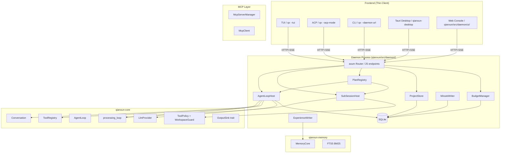

# 千寻 Daemon 设计文档 v1.0

> 状态: v1.0 (2026-06-07, 跟 chat-first-redesign 对齐) · 起草: Mavis + maxu
>
> 适用范围: `qianxun/src/daemon/`, `qianxun-core/src/agent/`, `qianxun-core/src/db/`
>
> **取代**:
> - `docs/daemon-design.md` v0.2 (2026-06-01) → 已归档 `docs/90_历史/2026-06-07-daemon-design-v0.2-被覆盖.md`
> - `docs/30_子项目规划/01-daemon.md` v1.1 (2026-06-02, Track A 详细设计) → 已归档 `docs/90_历史/2026-06-07-01-daemon-v1.1-被覆盖.md`
>
> **设计基线**: `chat-first-redesign.md` v1 + `ADR-0002_daemon_design_chat_first.md`
>
> **关联**: `01b-daemon-web-console.md` (Web Console, Stage 7a/b/c 详化)

---

## 0. 阅读指引

| 读者 | 建议路径 | 时间 |
|---|---|---|
| 第一次看 daemon | §1 → §2 → §3 → §4 → §5 | 15 min |
| 落地后端实现 | §4 → §5 → §6 → §7 → §9 → §10 → §14 | 60 min |
| 落地前端集成 | §3 (路由 + SSE 事件) + `chat-first-redesign.md` 数据模型 | 20 min |
| 调优 / 排查 | §9 (错误) + §10 (可观测性) + §11 (systemd / 优雅关闭) | 15 min |

**核心心智**: Daemon 是千寻本机唯一持有 AgentLoop / API Key / Memory / Tools / Skills / Projects / Plans / SubSessions / Experience 的进程. TUI / ACP / Tauri 桌面 / 浏览器 / 未来 Flutter 移动端, 都是它的薄前端, 走 HTTP + SSE 通信.

---

## 1. 设计目标

### 1.1 核心理念

> **一个进程, 一种状态, 一份真相.**

| 目标 | 说明 | 现状 (2026-06) | 目标 (本 v1.0) |
|---|---|---|---|
| **统一 AgentLoop** | 所有 AgentLoop 状态在 Daemon 进程, 前端不持有 | 部分实现 (CLI/ACP 内嵌) | Daemon 独占, 5 实体 (Project/Session/Plan/SubSession/Experience) 全在内存 + SQLite |
| **集中密钥管理** | 全部 API Key 在 Daemon 加密持有 | 部分 (env var 优先) | keyring 加密, 启动注入, 前端零知识 |
| **全局预算** | Token 用量跨会话/跨 plan 统一追踪 | 进程级 | 全局 AtomicU64 + SQLite 持久化, 跨重启 |
| **会话持久化** | Session / Plan / SubSession 可从 SQLite 恢复 | 部分 (snapshot) | 完整 SQLite schema (7 表), 启动恢复 |
| **多前端透明** | 6+ 端共享同一 AgentLoop | 各端独立 | 经 HTTP/SSE 访问, 强契约 (ADR-0002 §3.4 路由) |
| **健康自愈** | systemd / Windows Service / macOS launchd | 仅 SIGINT | 完整 graceful shutdown + 5 个后台任务 |

### 1.2 非目标

- 多机分布式 AgentLoop (VPS 端承载, 不在本机 daemon)
- Daemon 集群 / 高可用 (单机单实例, 千寻是个人项目)
- 实时多人协作 (multi-user session sharing)
- 跨用户认证 (假设仅 `127.0.0.1` 监听)
- **git 集成** (千寻不做分支/branch 选择, 上下文只有 folder + model)

---

## 2. 架构

### 2.1 进程结构

```
┌────────────────────────────────────────────────────────────────┐
│  qx daemon (axum, 127.0.0.1:23900)                            │
│                                                                │
│  ┌─────────────────────────────────────────────────────────┐   │
│  │  HTTP Server (axum 0.8)                                │   │
│  │  ├─ /v1/projects/*      Project CRUD + 经验              │   │
│  │  ├─ /v1/sessions/*      主会话 CRUD + messages + minutes│   │
│  │  ├─ /v1/plans/*         Plan 生命周期                    │   │
│  │  ├─ /v1/sub_sessions/*  子会话独立上下文                  │   │
│  │  ├─ /v1/llm/*           LLM Provider 管理               │   │
│  │  ├─ /v1/memory/*        记忆管理 (qianxun-memory)       │   │
│  │  ├─ /v1/tools/*         工具执行                         │   │
│  │  ├─ /v1/skills/*        技能管理                         │   │
│  │  ├─ /v1/mcp/*           MCP 管理                         │   │
│  │  ├─ /v1/config/*        配置管理                         │   │
│  │  ├─ /v1/system/*        健康检查 + 状态                  │   │
│  │  └─ /_ui/*              Web UI 静态文件 (Stage 7a)     │   │
│  └─────────────────────────────────────────────────────────┘   │
│                                                                │
│  ┌─────────────────────────────────────────────────────────┐   │
│  │  核心子系统 (Rust)                                       │   │
│  │  ├─ ProjectStore        项目持久化 (SQLite)              │   │
│  │  ├─ SessionStore        主会话 + 消息 + 纪要             │   │
│  │  ├─ PlanRegistry        Plan 生命周期 + 子任务派发        │   │
│  │  ├─ SubSessionHost      子 Agent 池 (独立 Context)       │   │
│  │  ├─ ExperienceWriter    经验写入 (走 qianxun-memory)      │   │
│  │  ├─ MinuteWriter        纪要增量 (后台任务)              │   │
│  │  ├─ AgentLoopHost       SessionRuntime 池              │   │
│  │  ├─ BudgetManager       Token 预算 + 限流                 │   │
│  │  ├─ LlmProviderPool     多 Provider 健康管理              │   │
│  │  ├─ ToolRegistry        builtin + MCP + skill           │   │
│  │  ├─ MemoryCore          (qianxun-memory)                │   │
│  │  └─ VpsWsClient (可选)  远端 VPS 桥接                     │   │
│  └─────────────────────────────────────────────────────────┘   │
│                                                                │
│  ┌─────────────────────────────────────────────────────────┐   │
│  │  后台任务 (5 个)                                          │   │
│  │  ├─ 会话过期清理 (60s tick)                                │   │
│  │  ├─ Plan 状态监控 (5s tick)                                │   │
│  │  ├─ Session Minute 增量 (每 N 轮)                          │   │
│  │  ├─ Project Experience 索引同步 (跟 qianxun-memory)         │   │
│  │  └─ Provider 健康检查 (60s tick)                           │   │
│  └─────────────────────────────────────────────────────────┘   │
└────────────────────────────────────────────────────────────────┘
```

### 2.2 chat-first 5 实体 (v1.0 核心抽象)

> 设计基线见 `chat-first-redesign.md` §2, 这里只列 daemon 端需要持久化的字段.

```rust
// === qianxun-core/src/types/plan.rs ===

pub struct Project {
    pub id: String,                  // "proj_xxx"
    pub name: String,
    pub folder: Option<String>,      // "E:/git/maxu/qianxun/qianxun-desktop"
    pub provider: String,            // "deepseek"
    pub default_model: String,
    pub created_at: DateTime<Utc>,
    pub last_active_at: DateTime<Utc>,
}

pub struct Session {
    pub id: String,                  // "sess_20260607_220000_123456"
    pub project_id: Option<String>,  // FK → projects; None = "Chat" 分类
    pub title: String,               // 首条消息摘要生成
    pub provider: String,
    pub model: String,
    pub status: SessionStatus,       // Active | Idle | Archived
    pub message_count: u32,
    pub created_at: DateTime<Utc>,
    pub last_active_at: DateTime<Utc>,
}

pub enum SessionStatus { Active, Idle, Archived }

pub struct Plan {
    pub id: String,                  // "plan_xxx"
    pub session_id: String,          // 归属的主会话
    pub contract: PlanContract,      // mavis-team task schema 子集
    pub status: PlanStatus,          // Pending | Running | Done | Failed | Aborted
    pub started_at: Option<DateTime<Utc>>,
    pub ended_at: Option<DateTime<Utc>>,
    pub result: Option<PlanResult>,
    pub attachments: Vec<Attachment>,
}

pub enum PlanStatus { Pending, Running, Done, Failed, Aborted }

pub struct PlanContract {
    pub name: String,
    pub description: String,
    pub tasks: Vec<PlanTaskSpec>,    // 1+ 个子任务
    pub timeout_ms: u32,             // 默认 1800000 (30 min)
}

pub struct PlanTaskSpec {
    pub id: String,
    pub title: String,
    pub prompt: String,
    pub assigned_to: String,         // "coder" / "tester" / "researcher"
    pub verified_by: Option<String>, // "verifier" / null (skip 必须有 reason)
    pub verify_prompt: Option<String>,
    pub depends_on: Vec<String>,
    pub timeout_ms: u32,
    pub output: Option<OutputSpec>,
}

pub struct SubSession {
    pub id: String,                  // "sub_xxx"
    pub plan_id: String,
    pub plan_task_id: String,        // 1 个 SubSession = 1 个 PlanTask
    pub parent_session_id: String,   // 归属主会话
    pub role: String,                // 跟 assigned_to 一致
    pub status: SubSessionStatus,    // Active | Done | Failed | Aborted | ReadOnly
    pub messages: Vec<Message>,      // 独立上下文
    pub output: Option<serde_json::Value>,
    pub started_at: DateTime<Utc>,
    pub ended_at: Option<DateTime<Utc>>,
}

pub enum SubSessionStatus { Active, Done, Failed, Aborted, ReadOnly }

pub struct ProjectExperience {
    pub id: String,
    pub project_id: String,
    pub content: String,
    pub source_session_id: Option<String>,
    pub source_plan_id: Option<String>,
    pub tags: Vec<String>,
    pub created_at: DateTime<Utc>,
    // 物理存储走 qianxun-memory (SQLite + FTS5), 见 §4.3
}

pub struct SessionMinute {
    pub id: String,
    pub session_id: String,
    pub content: String,             // 50-100 字摘要
    pub message_count_at_minute: u32,
    pub created_at: DateTime<Utc>,
}
```

### 2.3 关键数据结构 (跟 v0.2 相比, SessionRuntime 字段 + ProjectStore / PlanRegistry / SubSessionHost 新增)

```rust
// === qianxun/src/daemon/mod.rs ===

pub struct AppState {
    pub agent_host: AgentLoopHost,                  // 主会话池
    pub sub_session_host: SubSessionHost,           // 子会话池 (新)
    pub plan_registry: PlanRegistry,                // Plan 生命周期 (新)
    pub project_store: ProjectStore,                // Project 持久化 (新)
    pub experience_writer: ExperienceWriter,        // 经验写入 (新)
    pub minute_writer: MinuteWriter,                // 纪要追加 (新)
    pub shutdown_tx: watch::Sender<()>,
    pub provider_pool: Arc<LlmProviderPool>,
    pub tool_registry: Arc<ToolRegistry>,
    pub memory: Arc<MemoryCore>,
    pub skills: Arc<SkillManager>,
    pub mcp: Arc<McpServerManager>,
    pub budget: Arc<BudgetManager>,
    pub vps_client: Option<Arc<VpsWsClient>>,
    pub config: Arc<ResolvedConfig>,
    pub session_store: Arc<SessionStore>,           // 跟 ProjectStore 同 SQLite
    pub started_at: Instant,                        // 用于 uptime
}

// === qianxun/src/daemon/agent_host.rs ===

pub struct AgentLoopHost {
    sessions: Arc<RwLock<HashMap<SessionId, Arc<SessionRuntime>>>>,
    max_sessions: usize,
    state: Arc<AppState>,
    reap_handle: Option<JoinHandle<()>>,
}

pub struct SessionRuntime {
    pub id: SessionId,
    pub created_at: Instant,
    pub last_active: RwLock<Instant>,
    pub status: RwLock<SessionStatus>,
    pub cancel_flag: Arc<AtomicBool>,
    pub project_id: Option<String>,                 // 新: 关联 Project
    
    // 核心状态
    pub agent: Mutex<AgentLoop>,
    pub conversation: Mutex<Conversation>,
    
    // 共享资源 (来自 AppState, Arc 引用)
    pub provider: Arc<dyn LlmProvider>,
    pub tools: Arc<ToolRegistry>,
    pub memory: Arc<MemoryCore>,
    pub skills: Arc<SkillManager>,
    pub folder: Option<PathBuf>,                    // 新: 绑定的文件夹 (来自 project.folder)
    pub config: AgentConfig,
}
```

### 2.4 模块依赖图



### 2.5 跟现有代码对应

| 概念 | v1.0 新位置 | v0.2 位置 | 备注 |
|---|---|---|---|
| `AppState` | `qianxun/src/daemon/mod.rs` | 同 (字段扩展) | 加 5 个新字段 |
| `AgentLoopHost` | `qianxun/src/daemon/agent_host.rs` | 同 | 字段不变, 行为不变 |
| `SessionRuntime` | 同 (扩字段) | 同 (扩字段) | 加 project_id / folder |
| `processing_loop::handle_user_message` | `qianxun-core/src/agent/engine.rs` | 同 | **核心不变**, CLI 跟 Daemon 共用 |
| `Conversation` | `qianxun-core/src/agent/conversation.rs` | 同 | 加 `tool_calls` / `plan_ref` 字段 |
| `LlmProvider` | `qianxun-core/src/provider/` | 同 | 不变 |
| `ToolRegistry` | `qianxun-core/src/tools/` | 同 | 加 `WorkspaceGuard` 注入 (新) |
| `MemoryCore` | `qianxun-memory/src/lib.rs` | 同 | 不变, ExperienceWriter 调它 |

---

## 3. HTTP 框架

### 3.1 框架选型

**axum 0.8** (跟 v0.2 一致, 理由不变):
- tokio 原生, tower 中间件生态
- 千寻整个异步栈基于 tokio
- 社区主流, 文档齐全

### 3.2 中间件栈

```
Request
  │
  ├─ TowerLayer::Timeout(30s)         ← 请求级别超时
  ├─ TowerLayer::Trace               ← tracing 请求追踪
  ├─ TowerLayer::Cors                ← 本地开发 CORS (/_ui 用)
  │
  ├─ 路由匹配
  │   ├─ /v1/* → ApiRouter
  │   │   ├─ RateLimit (按 IP 限流)
  │   │   └─ Auth (除 /v1/system/health 外全部需要)
  │   │
  │   └─ /_ui/* → StaticFileRouter (Web UI)
  │
  └─ Response
```

### 3.3 认证

Daemon 监听 `127.0.0.1:23900` (仅本地), 不需要 TLS. 简单 Token 认证:

- 启动时若 `daemon.access_token` 未设置, 自动生成 UUID 写入 `~/.qianxun/daemon.token`
- CLI/Tauri/ACP 读 token 自动附加 `Authorization: Bearer <token>`
- Web Console 见 01b §6.1 单独的密码框 + JWT 机制

### 3.4 路由表 (完整)

#### 3.4.1 既有路由 (v0.2 保留, 路径改 `/v1/sessions`)

| 端点 | 方法 | 用途 | 备注 |
|---|---|---|---|
| `/v1/system/health` | GET | 公开健康检查 | 公开 |
| `/v1/system/status` | GET | 状态概览 | 公开 (Stage 7b 加 auth) |
| `/v1/system/restart` | POST | 重启 daemon | Stage 7b |
| `/v1/system/shutdown` | POST | 关闭 daemon | Stage 7b |
| `/v1/llm/chat` | POST | 直调 LLM (不走 LLM) | Stage 7a |
| `/v1/llm/embed` | POST | 嵌入向量 | Stage 7a |
| `/v1/llm/providers` | GET, POST | Provider 列表 / 新增 | Stage 7a |
| `/v1/llm/providers/:name` | PUT, DELETE | 改 / 删 provider | Stage 7a |
| `/v1/llm/providers/:name/test` | POST | 测试连接 | Stage 7a |
| `/v1/llm/providers/:name/activate` | POST | 切 active | Stage 7a |
| `/v1/tools` | GET | 工具列表 | 不变 |
| `/v1/tools/:name/invoke` | POST | 试用工具 (Web Console 测试用) | Stage 7a |
| `/v1/memory/*` | (多) | 记忆管理 (走 qianxun-memory) | 不变 |
| `/v1/mcp/servers` | GET, POST | MCP 列表 / 新增 | 不变 |
| `/v1/mcp/servers/:id` | DELETE | 删 MCP | Stage 7a |
| `/v1/mcp/servers/:id/test` | POST | 测试 MCP 连接 | Stage 7a |
| `/v1/skills` | GET, POST | 技能列表 / 重新加载 | Stage 7a 加 POST |
| `/v1/skills/:name/toggle` | POST | 启/停 skill | Stage 7a |
| `/v1/config` | GET, PUT | 读 / 写 config (含 hot-reload) | Stage 7b 加 PUT |
| `/_ui/*` | GET | Web UI 静态文件 (SPA + fallback) | Stage 7a |

#### 3.4.2 chat-first 新增路由 (v1.0)

| 端点 | 方法 | 用途 | 来源 |
|---|---|---|---|
| `/v1/projects` | GET, POST | 项目列表 / 新建 | chat-first §3.1 |
| `/v1/projects/:id` | GET, PUT, DELETE | 项目详情 / 改 / 删 | chat-first §3.1 |
| `/v1/projects/:id/experience` | GET, POST | 经验列表 / 追加 | chat-first §3.1 |
| `/v1/sessions` | GET | 会话列表 (支持 project_id / status filter) | chat-first §3.1 |
| `/v1/sessions` | POST | 创建会话 (改名自旧 /v1/chat/session) | chat-first §3.1 |
| `/v1/sessions/:id` | GET, PUT, DELETE | 会话详情 / 改 / 删 | chat-first §3.1 |
| `/v1/sessions/:id/prompt` | POST | SSE 流式 prompt (改名) | chat-first §3.1 |
| `/v1/sessions/:id/cancel` | POST | 取消正在跑的 prompt | v0.2 保留 |
| `/v1/sessions/:id/messages` | GET, POST | 消息历史 / 追加 | chat-first §3.1 |
| `/v1/sessions/:id/minutes` | GET | 纪要列表 | chat-first §3.1 |
| `/v1/plans` | POST | 发起 plan (主 Agent 调) | chat-first §3.1 |
| `/v1/plans` | GET | plan 列表 (按 session_id filter) | chat-first §3.1 |
| `/v1/plans/:id` | GET, DELETE | plan 详情 / abort | chat-first §3.1 |
| `/v1/plans/:id/tasks` | GET | plan 下的子任务 | chat-first §3.1 |
| `/v1/sub_sessions/:id/messages` | GET, POST | 子会话消息 (独立上下文) | chat-first §3.1 |
| `/v1/sub_sessions/:id` | GET | 子会话详情 | chat-first §3.1 |

**总 endpoint 数**: 25 (v0.2 是 11, 净增 14 个)

### 3.5 SSE 流式响应 (12 事件)

> 比 v0.2 的 6 事件扩展 1 倍, 跟 chat-first 1:1 对齐.

**端点**: `POST /v1/sessions/:id/prompt` (跟 `POST /v1/sub_sessions/:id/messages` 共享事件 schema)

#### 3.5.1 12 个事件类型

| # | event | 触发 | data 字段 | 备注 |
|---|---|---|---|---|
| 1 | `message_start` | prompt 接收 | `{session_id, message_id}` | 首帧 |
| 2 | `text` | LLM 输出文本块 | `{text: string}` | **delta 字段, 客户端追加** |
| 3 | `thinking` | LLM 思考块 | `{text: string}` | DeepSeek 特有 |
| 4 | `tool_call` | LLM 请求调工具 | `{id, name, arguments, plan_ref?}` | `plan_ref` 是 chat-first 新加 |
| 5 | `tool_result` | 工具执行完成 | `{id, name, content, is_error?}` | 失败带 is_error=true |
| 6 | `plan_update` | Plan 状态变化 | `{plan_id, status, task_id?, progress: {done, total}}` | **chat-first 新加** |
| 7 | `sub_session_event` | 子 Agent 事件 (转发) | `{sub_session_id, event: <子事件原文>}` | **chat-first 新加** |
| 8 | `experience_suggest` | 主 Agent 建议沉淀经验 | `{items: [{content, source_session_id, source_plan_id?}]}` | **chat-first 新加** |
| 9 | `status` | 状态消息 (如 retry 中) | `{message: string, level: "info" \| "warn"}` | 不阻塞 |
| 10 | `error` | 发生错误 | `{code: "rate_limit" \| "auth" \| "internal" \| "cancelled"`, message}` | 4 种 code (跟 v0.2 一致) |
| 11 | `turn_finished` | 一轮 LLM 调用结束 | `{reason: "end_turn" \| "tool_use" \| "max_tokens" \| "stop", usage: {input, output, cost_usd}}` | 末帧必发 |
| 12 | `message_stop` | 整个响应结束 | `{}` | 末帧 |

#### 3.5.2 `SseOutputSink` 实现要点

```rust
// === qianxun-core/src/output/sse_sink.rs ===

pub struct SseOutputSink {
    tx: mpsc::Sender<SseEvent>,
}

#[async_trait]
impl OutputSink for SseOutputSink {
    async fn on_text(&self, text: &str) {
        let _ = self.tx.send(SseEvent::Text { text: text.to_string() }).await;
    }
    async fn on_tool_call(&self, id: &str, name: &str, args: &serde_json::Value, plan_ref: Option<&str>) {
        let _ = self.tx.send(SseEvent::ToolCall { id: id.to_string(), name: name.to_string(), arguments: args.clone(), plan_ref: plan_ref.map(String::from) }).await;
    }
    // ... 其他事件类似
}
```

axum 侧把 mpsc → SSE 帧:
```rust
async fn prompt_handler(
    State(state): State<Arc<AppState>>,
    Path(session_id): Path<String>,
    Json(body): Json<PromptBody>,
) -> Sse<impl Stream<Item = Result<Event, Infallible>>> {
    let (tx, rx) = mpsc::channel(64);
    let sink = SseOutputSink::new(tx);
    let session = state.agent_host.get_session(&session_id)?;
    
    // 后台跑 prompt loop
    tokio::spawn(async move {
        processing_loop::handle_user_message(&mut session.conversation, &body.prompt, sink).await;
    });
    
    // 转发 mpsc → SSE
    Sse::new(ReceiverStream::new(rx).map(|event| {
        Ok(Event::default()
            .event(event.event_name())
            .data(serde_json::to_string(&event).unwrap_or_default()))
    }))
}
```

#### 3.5.3 客户端断开处理 (Stream Cancellation)

```rust
// 在 SseOutputSink 里加 cancel_flag
pub struct SseOutputSink {
    tx: mpsc::Sender<SseEvent>,
    cancel_flag: Arc<AtomicBool>,
}

#[async_trait]
impl OutputSink for SseOutputSink {
    async fn on_text(&self, text: &str) {
        if self.cancel_flag.load(Ordering::Relaxed) {
            return;  // 客户端断了, 不再发
        }
        let _ = self.tx.send(...).await;
    }
}
```

SSE handler 用 `axum::body::Body::with_stream` + `tokio::select!` 监听 client disconnect:
```rust
tokio::select! {
    _ = stream_closed_signal() => {
        cancel_flag.store(true, Ordering::Relaxed);
        info!("client disconnected, cancelling prompt");
    }
    _ = run_prompt(...) => {}
}
```

#### 3.5.4 错误事件分类 (4 种 code)

```rust
// === qianxun-core/src/types/sse.rs ===

pub enum ErrorCode {
    RateLimit,        // 触发 retry, 客户端展示 retry_after
    Auth,             // API key 错, 让用户检查配置
    Internal,         // 程序 bug, 客户端展示 "出错了"
    Cancelled,        // 用户主动取消, 客户端不重试
}
```

### 3.6 流量控制 (Backpressure)

mpsc channel size = 64. 满了 backpressure → `tx.send().await` 自动 yield. 不会丢消息 (mpsc 阻塞 send 等消费).

```rust
// SseOutputSink::new 默认 64, 必要时调大 (1MB 长文本场景)
pub fn new(tx: mpsc::Sender<SseEvent>) -> Self { ... }
```

---

## 4. 数据模型 + SQLite Schema

### 4.1 跟 v0.2 的差异

| 表 | v0.2 (会话持久化 §6.2) | v1.0 (本设计) | 备注 |
|---|---|---|---|
| `daemon_sessions` | ✓ | 改名 `sessions` | 字段扩展 (project_id, status, message_count) |
| `daemon_conversation_snapshots` | ✓ | 改名 `messages` | 改为追加式, 不用 snapshot |
| `daemon_event_log` | ✓ | 改名 `plan_events` | 只存 plan 生命周期事件 |
| — | — | 新增 `projects` | |
| — | — | 新增 `plans` | |
| — | — | 新增 `plan_tasks` | |
| — | — | 新增 `sub_sessions` | |
| — | — | 新增 `session_minutes` | |
| `qianxun-memory.*` | (走 memory 库) | 不变 (ProjectExperience 走这里) | |

### 4.2 SQLite Schema (完整, 7 张新表)

> 跟 `qianxun-memory` 8 张表共存于同一 SQLite 文件 (不同表名空间). FK 关联通过 `session_id` 跨表.

```sql
-- === 1. projects ===
CREATE TABLE projects (
  id            TEXT PRIMARY KEY,
  name          TEXT NOT NULL,
  folder        TEXT,
  provider      TEXT NOT NULL,
  default_model TEXT NOT NULL,
  created_at    TEXT NOT NULL,
  last_active_at TEXT NOT NULL
);
CREATE INDEX idx_projects_folder ON projects(folder);

-- === 2. sessions ===
CREATE TABLE sessions (
  id            TEXT PRIMARY KEY,
  project_id    TEXT REFERENCES projects(id) ON DELETE SET NULL,  -- NULL = "Chat" 分类
  title         TEXT NOT NULL,
  provider      TEXT NOT NULL,
  model         TEXT NOT NULL,
  status        TEXT NOT NULL,           -- 'active' | 'idle' | 'archived'
  message_count INTEGER NOT NULL DEFAULT 0,
  created_at    TEXT NOT NULL,
  last_active_at TEXT NOT NULL
);
CREATE INDEX idx_sessions_project ON sessions(project_id, last_active_at DESC);
CREATE INDEX idx_sessions_status  ON sessions(status, last_active_at DESC);

-- === 3. plans ===
CREATE TABLE plans (
  id          TEXT PRIMARY KEY,
  session_id  TEXT NOT NULL REFERENCES sessions(id) ON DELETE CASCADE,
  contract    TEXT NOT NULL,             -- JSON: PlanContract
  status      TEXT NOT NULL,             -- 'pending' | 'running' | 'done' | 'failed' | 'aborted'
  started_at  TEXT,
  ended_at    TEXT,
  result      TEXT,                      -- JSON: PlanResult
  attachments TEXT                       -- JSON array
);
CREATE INDEX idx_plans_session ON plans(session_id, started_at DESC);
CREATE INDEX idx_plans_status  ON plans(status);

-- === 4. plan_tasks (1 Plan = N PlanTask, 跟 mavis-team 1:1) ===
CREATE TABLE plan_tasks (
  id            TEXT PRIMARY KEY,
  plan_id       TEXT NOT NULL REFERENCES plans(id) ON DELETE CASCADE,
  title         TEXT NOT NULL,
  prompt        TEXT NOT NULL,
  assigned_to   TEXT NOT NULL,
  verified_by   TEXT,
  verify_prompt TEXT,
  depends_on    TEXT NOT NULL DEFAULT '[]', -- JSON array
  status        TEXT NOT NULL,           -- 同 plan
  output        TEXT,                    -- JSON
  started_at    TEXT,
  ended_at      TEXT
);
CREATE INDEX idx_plan_tasks_plan ON plan_tasks(plan_id);

-- === 5. sub_sessions (1 SubSession = 1 PlanTask) ===
CREATE TABLE sub_sessions (
  id                TEXT PRIMARY KEY,
  plan_id           TEXT NOT NULL REFERENCES plans(id) ON DELETE CASCADE,
  plan_task_id      TEXT NOT NULL REFERENCES plan_tasks(id) ON DELETE CASCADE,
  parent_session_id TEXT NOT NULL REFERENCES sessions(id) ON DELETE CASCADE,
  role              TEXT NOT NULL,
  status            TEXT NOT NULL,       -- 'active' | 'done' | 'failed' | 'aborted' | 'readonly'
  output            TEXT,                -- JSON
  started_at        TEXT NOT NULL,
  ended_at          TEXT
);
CREATE INDEX idx_sub_sessions_plan    ON sub_sessions(plan_id, plan_task_id);
CREATE INDEX idx_sub_sessions_parent  ON sub_sessions(parent_session_id);

-- === 6. messages (主会话 跟 子会话 共享, 靠 session_id / sub_session_id 二选一) ===
CREATE TABLE messages (
  id            TEXT PRIMARY KEY,
  session_id    TEXT REFERENCES sessions(id) ON DELETE CASCADE,
  sub_session_id TEXT REFERENCES sub_sessions(id) ON DELETE CASCADE,
  role          TEXT NOT NULL,            -- 'user' | 'assistant' | 'system'
  content       TEXT NOT NULL,
  tool_calls    TEXT,                     -- JSON array
  plan_ref      TEXT REFERENCES plans(id) ON DELETE SET NULL,
  created_at    TEXT NOT NULL,
  CHECK ((session_id IS NOT NULL) OR (sub_session_id IS NOT NULL))
);
CREATE INDEX idx_messages_session     ON messages(session_id, created_at);
CREATE INDEX idx_messages_sub_session ON messages(sub_session_id, created_at);
CREATE INDEX idx_messages_plan_ref    ON messages(plan_ref);

-- === 7. session_minutes (会话纪要, 增量追加) ===
CREATE TABLE session_minutes (
  id            TEXT PRIMARY KEY,
  session_id    TEXT NOT NULL REFERENCES sessions(id) ON DELETE CASCADE,
  content       TEXT NOT NULL,
  message_count INTEGER NOT NULL,
  created_at    TEXT NOT NULL
);
CREATE INDEX idx_minutes_session ON session_minutes(session_id, created_at);
```

### 4.3 跟 qianxun-memory 共存

- `qianxun-memory` 8 张表 (observations / sessions / memories / tags / obs_fts ...) 不变
- ProjectExperience **走 qianxun-memory**, 不在 daemon 这 7 张表里:
  ```sql
  -- 在 qianxun-memory 里加一种 memory_kind = 'project_experience'
  -- content 字段存经验内容, source_session_id / source_plan_id 存引用
  ```
- SessionMinutes 是 daemon 自己的 (跟 memory 域不同, 不混)

### 4.4 三层保存策略 (从 v0.2 §6.3 借鉴)

| 时机 | 写 sessions | 写 messages | 写 session_minutes | 写 project_experience |
|---|---|---|---|---|
| Session 创建 | ✅ | ✅ (system prompt) | ❌ | ❌ |
| 每个 turn 结束 | ✅ (last_active) | ✅ (追加) | ✅ (每 N 轮) | 仅 Plan 完成时 |
| 优雅关闭 | ✅ (status=idle) | ✅ (finalize) | ✅ (final) | ❌ |
| Daemon 崩溃 | ❌ | ❌ (未落盘消息丢) | ❌ | ❌ |

---

## 5. 核心子系统 (5 个新增 + 4 个保留)

### 5.1 AgentLoopHost (主会话池) — 保留 v0.2

不变, 详见 `qianxun/src/daemon/agent_host.rs`. 字段级伪代码见 §2.3.

#### 5.1.1 并发安全 (从 v0.2 §4.3 提炼)

| 资源 | 锁类型 | 理由 |
|---|---|---|
| `sessions: HashMap` | `RwLock` | 读多写少 (查 session_id) |
| `SessionRuntime.status` | `RwLock` | status 查询频繁 (UI 轮询) |
| `SessionRuntime.last_active` | `RwLock` | 每次 prompt 都更新 |
| `SessionRuntime.agent` | `Mutex` | 处理 LLM 流时独占 |
| `SessionRuntime.conversation` | `Mutex` | 同上, append-only |
| `cancel_flag` | `AtomicBool` | 跨任务取消信号, 无锁 |

#### 5.1.2 取消语义 (从 v0.2 §4.5 提炼)

```rust
// SessionRuntime.cancel_flag: Arc<AtomicBool>
// 客户端断开 → SseOutputSink 设 cancel_flag = true
// processing_loop 每 chunk 检查 cancel_flag, true 则 return
// 工具调用 cancel 时, 传给具体 tool (execute_command 杀子进程, edit_file 中止)
```

#### 5.1.3 max_sessions 限流

```rust
impl AgentLoopHost {
    pub async fn create_session(&self, config: SessionConfig) -> Result<SessionId> {
        if self.sessions.read().await.len() >= self.max_sessions {
            return Err(DaemonError::MaxSessionsReached);
        }
        // ...
    }
}
```

后台清理 (1 小时无活动 reap):
```rust
pub async fn reap_stale_sessions(&self) {
    let mut interval = tokio::time::interval(Duration::from_secs(60));
    loop {
        interval.tick().await;
        let timeout = Duration::from_secs(60 * 60);
        self.sessions.write().await.retain(|_, h| h.last_active.elapsed() < timeout);
    }
}
```

### 5.2 SubSessionHost (子会话池) — 新增

> 1 个 SubSession = 1 个 PlanTask, 独立 Conversation, 独立 messages 存储.

```rust
// === qianxun/src/daemon/sub_session_host.rs ===

pub struct SubSessionHost {
    sub_sessions: Arc<RwLock<HashMap<SubSessionId, Arc<SubSessionRuntime>>>>,
    max_sub_sessions_per_session: usize,  // 默认 5
    state: Arc<AppState>,
}

pub struct SubSessionRuntime {
    pub id: SubSessionId,
    pub plan_id: PlanId,
    pub plan_task_id: String,
    pub parent_session_id: SessionId,
    pub role: String,
    pub status: RwLock<SubSessionStatus>,
    pub cancel_flag: Arc<AtomicBool>,
    
    pub agent: Mutex<AgentLoop>,            // 独立 AgentLoop
    pub conversation: Mutex<Conversation>,  // 独立 messages
    pub tools: Arc<ToolRegistry>,          // 跟主会话共享 (sandboxed)
    
    pub started_at: Instant,
    pub ended_at: RwLock<Option<Instant>>,
}

impl SubSessionHost {
    /// Plan 派发时调, 1 个 SubSession 跟 1 个 PlanTask 绑定
    pub async fn spawn(
        &self,
        plan_id: PlanId,
        plan_task_id: String,
        parent_session_id: SessionId,
        role: String,
        prompt: String,
    ) -> Result<SubSessionId> {
        // 1. 校验 parent session 的 active sub_sessions < max_sub_sessions_per_session
        // 2. 校验 role 在 AgentRoleRegistry 里 (有对应 system prompt + tool filter)
        // 3. 创建 SubSessionRuntime, 状态 active
        // 4. 启动后台任务: handle_user_message (跟主会话共用 processing_loop)
        // 5. 返回 sub_session_id
    }
    
    /// 用户在主会话问 "那个 test 跑得怎么样", 触发此查询
    pub async fn get_messages(&self, sub_id: SubSessionId) -> Result<Vec<Message>> {
        // 拉 sub_session 的完整消息历史 (read-only)
    }
    
    /// 终止 (用户主动 abort / 超时 / verifier 拒)
    pub async fn terminate(&self, sub_id: SubSessionId, status: SubSessionStatus) -> Result<()> {
        // 1. cancel_flag = true
        // 2. 等 LLM stream 收尾 (max 5s)
        // 3. status → Done / Failed / Aborted
        // 4. ended_at = now
        // 5. 持久化 messages + output 到 SQLite
    }
}
```

**关键设计**:
- **只读保护**: `terminate` 后, 任何 `get_messages` 之外的操作 (e.g. POST 新消息) 返 410 Gone
- **追问回主会话**: 用户想继续问 sub_agent 必须在主会话里问, sub_session 自身不接受新 prompt
- **verifier 独立验证**: plan_task 完成后, `verified_by` 角色可独立跑一次 (也是通过 sub_session), 写 `plan_tasks.output.verifier_result`

### 5.3 PlanRegistry (Plan 生命周期) — 新增

```rust
// === qianxun/src/daemon/plan_registry.rs ===

pub struct PlanRegistry {
    plans: Arc<RwLock<HashMap<PlanId, Arc<PlanHandle>>>>,
    state: Arc<AppState>,
    sub_host: Arc<SubSessionHost>,
}

pub struct PlanHandle {
    pub id: PlanId,
    pub session_id: SessionId,
    pub contract: PlanContract,
    pub status: RwLock<PlanStatus>,
    pub tasks: Vec<PlanTaskSpec>,
    pub task_statuses: RwLock<HashMap<String, PlanStatus>>,
    pub started_at: Instant,
    pub ended_at: RwLock<Option<Instant>>,
    pub cancel_flag: Arc<AtomicBool>,
}

impl PlanRegistry {
    /// 主 Agent 调: 创建一个 Plan
    pub async fn create(&self, session_id: SessionId, contract: PlanContract) -> Result<PlanId> {
        // 1. 持久化 plans + plan_tasks 到 SQLite
        // 2. 创建 PlanHandle, status = Pending
        // 3. 启动后台任务: 跑调度
        // 4. 返回 plan_id
    }
    
    /// 调度循环 (后台任务, 5s tick):
    ///   - 找 ready 的 task (depends_on 全部 done)
    ///   - 给 sub_host.spawn() 派发
    ///   - sub_session 终止 → 更新 task_statuses
    ///   - 全部 task done → plan status = Done, 写 result + attachments
    ///   - 任一 task failed → 决定 plan 继续 / abort (看 contract.policy)
    pub async fn run_dispatcher(&self, plan_id: PlanId) {
        // 后台任务, 见 §7.2
    }
    
    pub async fn abort(&self, plan_id: PlanId) -> Result<()> {
        // 1. cancel_flag = true
        // 2. 终止所有 active sub_sessions
        // 3. plan status = Aborted
        // 4. 写回 SQLite
    }
}
```

**关键设计**:
- 调度循环是**后台任务**, 不是每次 prompt 触发
- **depends_on 解析**: 用简单拓扑排序, 循环依赖在 create() 时报错
- **失败策略**: 默认 "any failed → plan aborted" (跟 mavis-team 一致); 高级用户可在 contract 里指定 "ignore failed" / "min N tasks success"

### 5.4 ProjectStore (项目持久化) — 新增

```rust
// === qianxun/src/daemon/project_store.rs ===

pub struct ProjectStore {
    db: Arc<Database>,
}

impl ProjectStore {
    pub async fn list(&self) -> Result<Vec<Project>> { /* SELECT * FROM projects ORDER BY last_active_at DESC */ }
    pub async fn get(&self, id: &str) -> Result<Option<Project>> { /* SELECT * WHERE id = ? */ }
    pub async fn create(&self, project: Project) -> Result<()> { /* INSERT */ }
    pub async fn update(&self, project: Project) -> Result<()> { /* UPDATE */ }
    pub async fn delete(&self, id: &str) -> Result<()> { /* DELETE; ON DELETE SET NULL 保留 sessions */ }
    pub async fn get_experience(&self, project_id: &str) -> Result<Vec<ProjectExperience>> { /* 走 qianxun-memory */ }
    pub async fn add_experience(&self, exp: ProjectExperience) -> Result<()> { /* INSERT INTO memory */ }
}
```

### 5.5 ExperienceWriter (经验沉淀) — 新增

```rust
// === qianxun/src/daemon/experience_writer.rs ===

pub struct ExperienceWriter {
    memory: Arc<MemoryCore>,
    project_store: Arc<ProjectStore>,
}

impl ExperienceWriter {
    /// Plan 完成后主 Agent 调用, 写入经验
    pub async fn suggest(&self, project_id: &str, items: Vec<ExperienceItem>) -> Result<Vec<ProjectExperience>> {
        // 1. 主 Agent 通过 SSE experience_suggest 事件推 items
        // 2. UI 弹气泡 "建议沉淀 N 条经验"
        // 3. 用户确认 → 写入 qianxun-memory (kind=project_experience)
        // 4. 写完返回 ids
    }
    
    /// 自动学习: Plan 完成后, 跟对话内容 LLM 提取 1-3 条经验 (system prompt 引导)
    pub async fn auto_extract(&self, plan_id: PlanId) -> Result<Vec<ExperienceItem>> {
        // 1. 取 plan 涉及的所有 messages (主 + sub_sessions)
        // 2. 调 LLM: "从这些对话中提取 1-3 条值得沉淀的项目经验"
        // 3. 返回 items (待用户确认)
    }
}
```

**关键设计**:
- **不自动写入**: 自动提取是 suggestions, 必须用户确认才入库 (跟 chat-first §1.3 决策一致)
- **下一次 session 自动注入**: 新 session 创建时, `top-5 相关经验` 注入 system prompt

### 5.6 MinuteWriter (纪要增量) — 新增

```rust
// === qianxun/src/daemon/minute_writer.rs ===

pub struct MinuteWriter {
    db: Arc<Database>,
    llm: Arc<LlmProviderPool>,
}

impl MinuteWriter {
    /// 后台任务, 每 N 轮 assistant 消息后追加一条纪要
    pub async fn maybe_write(&self, session_id: &str) -> Result<()> {
        // 1. 取上次纪要之后的 messages
        // 2. 调 LLM 生成 50-100 字摘要 (轻量, 用 fast model)
        // 3. 写入 session_minutes
    }
}
```

**关键设计**:
- **后台异步**, 不阻塞 Chat
- **频率**: `project.session_minute_interval` (默认 3, 即每 3 轮 assistant 消息追加 1 条)
- **用于**: 长 session 切回时不丢上下文, session 标题自动生成

### 5.7 其他子系统 (保留 v0.2)

- **LlmProviderPool** — 不变 (§5)
- **ToolRegistry** — 不变 (但加 `WorkspaceGuard` 注入, 见 §8.1)
- **MemoryCore** — 不变 (qianxun-memory crate)
- **McpServerManager** — 不变
- **SkillManager** — 不变
- **BudgetManager** — 扩 plan 级预算 (见 §7)

---

## 6. API Key 管理

> 跟 v0.2 §5 几乎一致, 简化为最终版.

### 6.1 keyring 集成

```rust
use keyring::Entry;

// 存储
let entry = Entry::new("qianxun", "deepseek_api_key")?;
entry.set_password("sk-xxxx")?;

// 读取
let key = entry.get_password()?;
```

平台实现:
| 平台 | 实现 | crate |
|---|---|---|
| macOS | macOS Keychain | `security-framework` (keyring 自动) |
| Linux | secret-tool (libsecret) | `secret-service` (keyring 自动) |
| Windows | Credential Manager | `winapi` (keyring 自动) |

**fallback**: 密钥链不可用时 → 退回 `DEEPSEEK_API_KEY` 环境变量 (env 缺失 → 该 provider 标记为 key missing).

### 6.2 启动时的 API Key 解析

```
Daemon 启动
  ├─ 读取 providers 配置 (不含 api_key)
  ├─ for each provider:
  │     ├─ keyring::Entry::new("qianxun", "{name}_api_key")
  │     ├─ 失败 → env var DEEPSEEK_<NAME>_API_KEY
  │     └─ 都失败 → provider 注册但运行时无 key
  └─ 所有 provider 就绪 (或标记 key missing)
```

### 6.3 API Key 设置流程

```
CLI: qx daemon config set-provider-key deepseek sk-xxxx
  ↓
POST /v1/llm/providers/deepseek/key
  Body: { "api_key": "sk-xxxx" }
  ↓
Daemon:
  1. 验证 (调一次 /models API)
  2. 验证通过 → keyring.set_password()
  3. 失败 → 返 401, 不保存
  ↓
成功 → provider 立即可用 (LlmProviderPool 热更新)
```

---

## 7. Token 预算和限流

### 7.1 BudgetManager (扩 plan 级)

```rust
// === qianxun/src/daemon/budget.rs ===

pub struct BudgetManager {
    daily_spent: Arc<AtomicU64>,
    daily_reset: Instant,
    max_daily_cost: f64,                 // USD
    
    concurrent_requests: Arc<AtomicU32>,
    max_concurrent: u32,                 // 默认 5
    
    // 新增: Plan 级 token 预算
    plan_budgets: Arc<DashMap<PlanId, AtomicU64>>,
    plan_max_tokens: u64,                // 默认 500K
}

impl BudgetManager {
    pub fn try_acquire(&self, plan_id: Option<PlanId>, estimated: u32) -> Result<(), BudgetError> {
        // 全局并发
        if self.concurrent_requests.load(Ordering::Relaxed) >= self.max_concurrent {
            return Err(BudgetError::TooManyConcurrent);
        }
        // 全局日预算
        let cost = estimated as f64 * 0.000002;
        if self.daily_spent.load(Ordering::Relaxed) as f64 + cost > self.max_daily_cost {
            return Err(BudgetError::DailyBudgetExceeded);
        }
        // Plan 级预算 (新)
        if let Some(pid) = plan_id {
            let spent = self.plan_budgets.entry(pid).or_insert(AtomicU64::new(0));
            if spent.load(Ordering::Relaxed) + estimated as u64 > self.plan_max_tokens {
                return Err(BudgetError::PlanBudgetExceeded);
            }
        }
        self.concurrent_requests.fetch_add(1, Ordering::Relaxed);
        Ok(())
    }
    
    pub fn release(&self, plan_id: Option<PlanId>, tokens: u32) {
        self.concurrent_requests.fetch_sub(1, Ordering::Relaxed);
        self.daily_spent.fetch_add(tokens as u64, Ordering::Relaxed);
        if let Some(pid) = plan_id {
            if let Some(spent) = self.plan_budgets.get(&pid) {
                spent.fetch_add(tokens as u64, Ordering::Relaxed);
            }
        }
    }
}
```

### 7.2 限流策略

| 维度 | 限制 | 行为 |
|---|---|---|
| 全局并发 | 最大 5 个 | 超出返 429 |
| 日预算 | `budget.max_daily_cost` | 超出返 429, SSE `error.code=rate_limit` |
| 单 plan token | `plan_max_tokens` (500K) | 超出 → plan abort, 通知用户 |
| 单请求 max_tokens | `agent.max_tokens` (4096) | LLM 侧限制 |
| Provider 速率限制 | 由各 Provider 错误处理 | 自动退避重试 (见 §10) |

---

## 8. ToolPolicy 与安全边界

> **v0.2 没有, v1.0 新增**. 从 01-daemon v1.1 §8 提炼.

### 8.1 Workspace 边界 (WorkspaceGuard)

**设计原则**: session 创建时绑定 `folder: PathBuf`, 所有文件操作**相对** folder 解析, 不允许逃逸.

```rust
// === qianxun-core/src/tools/workspace_guard.rs (新增) ===

use std::path::{Path, PathBuf};

pub struct WorkspaceGuard {
    root: PathBuf,  // 规范化后的绝对路径
}

impl WorkspaceGuard {
    pub fn new(root: PathBuf) -> Self {
        let canonical = std::fs::canonicalize(&root).unwrap_or(root);
        Self { root: canonical }
    }
    
    /// 解析相对路径, 确保不逃逸 root
    pub fn resolve(&self, relative: &str) -> Result<PathBuf, ToolError> {
        let candidate = self.root.join(relative);
        let canonical = std::fs::canonicalize(&candidate)
            .or_else(|_| {
                // 文件不存在, 父目录规范化
                if let Some(parent) = candidate.parent() {
                    std::fs::canonicalize(parent).map(|p| p.join(candidate.file_name().unwrap()))
                } else {
                    Err(std::io::Error::new(std::io::ErrorKind::NotFound, "parent not found"))
                }
            })?;
        
        if !canonical.starts_with(&self.root) {
            return Err(ToolError::ExecutionFailed(
                format!("path '{}' escapes workspace {}", relative, self.root.display())
            ));
        }
        Ok(canonical)
    }
}
```

**集成**: `read_text_file` / `write_text_file` / `list_directory` / `search` 接受 `workspace: &WorkspaceGuard` 构造参数, 调用前 `workspace.resolve(path)`.

**execute_command 例外**: 命令执行天然无 workspace 概念, 单独约束 (见 §8.4).

### 8.2 Tool Risk Level + 审批

| 风险等级 | 工具示例 | 默认行为 | 可配置 |
|---|---|---|---|
| **R0 (read-only)** | `read_text_file`, `search`, `grep`, `list_directory`, `skill_read` | 总是允许 | 不可禁用 |
| **R1 (low write)** | `write_text_file` (新文件), `edit_file` | 允许, 仅记 audit log | `tool_policy.write_require_approval` |
| **R2 (high write)** | `write_text_file` (覆盖 >1MB), 删除文件 | 需用户审批 | 默认 `true` |
| **R3 (terminal)** | `execute_command` | 需用户审批 + 白名单 | `tool_policy.terminal_whitelist` |
| **R4 (network)** | MCP Network 工具 | 需用户审批 + 默认禁用 | `tool_policy.mcp_network_enabled` |

**审批流程** (Daemon 端):

```rust
// === qianxun/src/daemon/approval.rs (新增) ===

pub enum ApprovalRequest {
    FileWrite { path: PathBuf, content_hash: String, size_bytes: u64 },
    CommandExec { command: String, args: Vec<String> },
    NetworkCall { tool: String, url: Option<String> },
}

pub enum ApprovalResponse {
    Approved { remember: bool },       // remember = 这次 session 都允许
    Denied { reason: Option<String> },
}
```

**审批通道** (跟 chat-first §4.4 决策一致):
- 主会话 Chat 流: 弹气泡, 用户点 [批准] / [拒绝]
- ACP / TUI: 终端交互
- Web Console: 模态对话框

**memory 注入**: R2-R4 工具的"始终授权"由用户**显式**操作, 不记忆 (避免 prompt injection 复用)

### 8.3 execute_command 沙箱

```rust
// === qianxun-core/src/tools/builtin/execute_command.rs ===

pub fn execute_command(
    cmd: &str,
    args: &[String],
    workspace: &WorkspaceGuard,
    policy: &ToolPolicy,
    cancel_flag: Arc<AtomicBool>,
) -> Result<CommandOutput> {
    // 1. 白名单校验 (policy.terminal_whitelist)
    if !policy.is_whitelisted(cmd) {
        return Err(ToolError::ExecutionFailed(format!("command '{}' not in whitelist", cmd)));
    }
    
    // 2. 路径参数校验: 把 args 里疑似路径的全过 workspace.resolve()
    for arg in args {
        if arg.starts_with('/') || arg.starts_with('~') || arg.contains("..") {
            workspace.resolve(arg)?;
        }
    }
    
    // 3. 工作目录设到 workspace.root
    // 4. 启动子进程, tokio::process::Command
    // 5. 监听 cancel_flag, true 时 tokio::process::Child::kill()
}
```

### 8.4 MCP capabilities 校验

```rust
// === qianxun/src/daemon/mcp_capability.rs (新增) ===

pub fn validate_mcp_capability(tool: &str, args: &Value, policy: &ToolPolicy) -> Result<()> {
    // 1. 检查 tool 在 policy.allowed_mcp_tools
    // 2. 检查 tool 的 capability 不超出 policy (e.g. Network 工具需 R4 审批)
    // 3. 路径参数过 workspace.resolve()
}
```

### 8.5 ToolPolicy 配置

```json
// ~/.qianxun/config.json
{
  "tool_policy": {
    "write_require_approval": false,    // R1 工具也审批 (默认仅 R2+)
    "terminal_whitelist": ["git", "cargo", "pnpm", "npm", "node", "python", "ls", "cat", "grep", "find", "echo", "mkdir", "rm", "mv", "cp"],
    "terminal_blacklist": ["sudo", "rm -rf /", "dd"],
    "mcp_network_enabled": false,
    "mcp_allowed_tools": ["github.*", "filesystem.*"]
  }
}
```

---

## 9. 错误处理与重试

> **v0.2 §6 是简版, v1.0 从 01-daemon v1.1 §9 扩展完整版**.

### 9.1 Provider 错误分类

`qianxun-core/src/types.rs` 已定义 6 种 `LlmError`:

| 错误 | 可重试? | 退避 | 上限 |
|---|---|---|---|
| `NoApiKey` | ❌ | — | — |
| `AuthenticationError` | ❌ | — | — |
| `RateLimitExceeded` | ✅ | `retry_after` (服务端返回) | 3 次 |
| `ApiError { status: 5xx }` | ✅ | exponential + jitter | 3 次 |
| `ApiError { status: 429 }` | ✅ | exponential + jitter | 3 次 |
| `ApiError { status: 4xx (非 429) }` | ❌ | — | — |
| `PromptTooLarge` | ❌ (触发 conversation 压缩后由调用方重试) | — | — |
| `StreamEnded` | ✅ | exponential | 2 次 |
| 其他 (panic 等) | ❌ | — | — |

### 9.2 退避策略

```rust
// === qianxun-core/src/agent/engine.rs (扩展) ===

let mut stream = loop {
    match provider.stream_completion(request.clone()).await {
        Ok(s) => break s,
        Err(e) => {
            let should_retry = matches!(&e,
                LlmError::RateLimitExceeded { .. }
                | LlmError::StreamEnded
                | LlmError::ApiError { status, .. } if *status >= 500 || *status == 429
            );
            
            if !should_retry || agent.retry_count >= agent.config.max_retries {
                tracing::error!("LLM stream start failed (no retry): {e}");
                sink.on_error(&e).await;
                agent.state = AgentState::Error(e.to_string());
                return;
            }
            
            agent.retry_count += 1;
            
            // 计算 wait
            let wait = if let LlmError::RateLimitExceeded { retry_after, .. } = &e {
                retry_after.unwrap_or(Duration::from_secs(5))
            } else {
                let base = 1u64 << agent.retry_count.min(6);  // 2, 4, 8, 16, 32, 64, 128s
                let jitter = (std::time::SystemTime::now()
                    .duration_since(std::time::UNIX_EPOCH)
                    .map(|d| d.subsec_nanos() as u64)
                    .unwrap_or(0)) % (base / 2 + 1);
                Duration::from_secs(base + jitter)
            };
            
            sink.on_status(&format!(
                "Provider 错误，{}s 后重试 ({}/{})",
                wait.as_secs(), agent.retry_count, agent.config.max_retries
            )).await;
            tokio::time::sleep(wait).await;
        }
    }
};
```

**对 SSE 的影响**: `retry` 期间不阻塞, 客户端在 `message_start` 之前看到 `status` 事件 (不通过 SSE 发送, 走 on_status). 失败最终发 `error`.

### 9.3 Circuit Breaker

```rust
// === qianxun-core/src/provider/circuit_breaker.rs (新增) ===

pub struct CircuitBreaker {
    state: Arc<RwLock<BreakerState>>,
    failure_threshold: u32,         // 默认 5
    reset_timeout: Duration,        // 默认 60s
}

pub enum BreakerState {
    Closed,       // 正常
    Open,         // 熔断, 直接返错误
    HalfOpen,     // 探测: 允许 1 个请求试水
}

impl CircuitBreaker {
    pub fn try_call<F, T>(&self, f: F) -> Result<T, BreakerError>
    where F: Future<Output = Result<T, LlmError>>
    {
        let state = *self.state.read().await;
        match state {
            BreakerState::Open => {
                if self.last_failure.elapsed() > self.reset_timeout {
                    *self.state.write().await = BreakerState::HalfOpen;
                } else {
                    return Err(BreakerError::Open);
                }
            }
            _ => {}
        }
        
        match f.await {
            Ok(t) => {
                *self.state.write().await = BreakerState::Closed;
                self.failure_count.store(0, Ordering::Relaxed);
                Ok(t)
            }
            Err(e) => {
                let count = self.failure_count.fetch_add(1, Ordering::Relaxed) + 1;
                if count >= self.failure_threshold {
                    *self.state.write().await = BreakerState::Open;
                }
                Err(BreakerError::Inner(e))
            }
        }
    }
}
```

### 9.4 客户端断连 → server-side cleanup

```
客户端断开 (TCP 关闭)
  ↓
SSE handler 收到 stream closed signal
  ↓
设 session.cancel_flag = true
  ↓
processing_loop 下次 chunk 检查, return
  ↓
session 状态 → idle (不删, 留待用户重连)
  ↓
LLM 资源释放 (流被 drop)
```

### 9.5 Panic 恢复

```rust
// === 每个 prompt handler 用 tokio::spawn + catch_unwind ===

let join_handle = tokio::spawn(async move {
    let result = AssertUnwindSafe(process_prompt(...))
        .catch_unwind()
        .await;
    
    match result {
        Ok(Ok(_)) => { /* 正常完成 */ }
        Ok(Err(e)) => { sink.on_error(&LlmError::Internal(e.to_string())).await; }
        Err(panic) => {
            tracing::error!("prompt handler panicked: {:?}", panic);
            sink.on_error(&LlmError::Internal("internal panic".into())).await;
        }
    }
});
```

---

## 10. 健康检查与可观测性

### 10.1 `/v1/system/health` 真实字段

```json
{
  "status": "ok",                  // "ok" | "degraded" | "down"
  "version": "1.0.0",
  "uptime_seconds": 12345,
  "started_at": "2026-06-07T10:00:00Z",
  "build": { "rustc": "...", "commit": "..." }
}
```

**不健康判定**: 任一关键子系统 unhealthy → `"degraded"`. 所有 unhealthy → `"down"`.

```rust
async fn health_handler(State(state): State<Arc<AppState>>) -> Json<HealthResponse> {
    let uptime = state.started_at.elapsed().as_secs();
    let status = if state.memory.is_healthy()
        && state.provider_pool.is_healthy()
        && state.tool_registry.is_healthy() {
        "ok"
    } else {
        "degraded"
    };
    Json(HealthResponse {
        status, uptime_seconds: uptime,
        version: env!("CARGO_PKG_VERSION").into(),
        started_at: state.started_at_iso.clone(),
    })
}
```

**HTTP status code**: 健康 = 200, degraded = 200 (load balancer 仍路由), down = 503.

### 10.2 `/v1/system/status` 扩展

```json
{
  "status": "ok",
  "version": "1.0.0",
  "uptime_seconds": 12345,
  
  "projects": {
    "total": 5,
    "active_last_24h": 3
  },
  
  "sessions": {
    "total": 12,
    "active": 2,             // 正在处理 prompt
    "idle": 9,
    "archived": 1,
    "max": 10
  },
  
  "plans": {
    "running": 1,
    "done_24h": 5,
    "failed_24h": 0,
    "aborted_24h": 0
  },
  
  "sub_sessions": {
    "active": 3,
    "readonly": 7
  },
  
  "providers": {
    "active": "deepseek",
    "deepseek": { "healthy": true, "last_check": "...", "circuit_breaker": "closed" },
    "MiniMax": { "healthy": false, "last_error": "..." }
  },
  
  "mcp": {
    "servers": { "filesystem": { "status": "running", "tools": 5 }, "github": { "status": "stopped" } }
  },
  
  "budget": {
    "daily_spent_usd": 0.42,
    "daily_max_usd": 1.0,
    "concurrent_requests": 2,
    "max_concurrent": 5
  },
  
  "memory": {
    "observations": 1234,
    "memories": 56,
    "db_size_bytes": 4194304
  }
}
```

### 10.3 关键 tracing Span

```rust
// 整个 prompt 处理流程
#[tracing::instrument(skip(state, body), fields(session_id, message_id))]
async fn prompt_handler(...) { ... }

// 每个 LLM 调用
#[tracing::instrument(skip(request), fields(plan_id, task_id, model, estimated_tokens))]
async fn call_llm(state: &AppState, request: CompletionRequest) -> Result<Stream> { ... }

// Plan 调度
#[tracing::instrument(skip(plan), fields(plan_id, task_count))]
async fn run_dispatcher(plan: Arc<PlanHandle>) { ... }

// SubSession 生命周期
#[tracing::instrument(skip(sub), fields(sub_session_id, role, parent_session_id))]
async fn sub_session_lifecycle(sub: Arc<SubSessionRuntime>) { ... }
```

### 10.4 关键 Metric (Prometheus / tracing-subscriber)

| Metric | 类型 | 用途 |
|---|---|---|
| `daemon_sessions_total` | gauge | 当前 session 数 (按 status 分桶) |
| `daemon_plans_running` | gauge | 正在跑的 plan 数 |
| `daemon_sub_sessions_active` | gauge | 活跃 sub_session 数 |
| `daemon_tokens_spent_usd` | counter | 累计 token 花费 |
| `daemon_llm_request_duration_seconds` | histogram | LLM 请求耗时 |
| `daemon_tool_call_duration_seconds` | histogram | 工具调用耗时 |
| `daemon_provider_circuit_breaker_state` | gauge | Circuit breaker 状态 (0/1/2) |

### 10.5 健康自愈

```rust
// === 后台任务: 60s tick ===
pub async fn health_watchdog(state: Arc<AppState>) {
    let mut interval = tokio::time::interval(Duration::from_secs(60));
    loop {
        interval.tick().await;
        
        // 1. Provider 健康检查
        for provider in state.provider_pool.iter() {
            if let Err(e) = provider.health_check().await {
                tracing::warn!(provider = provider.name(), "provider unhealthy: {e}");
                provider_pool.mark_unhealthy(provider.name());
            }
        }
        
        // 2. MCP 子进程存活检查
        for server in state.mcp.servers() {
            if !server.is_alive() {
                tracing::warn!(server = server.name(), "MCP server dead, restarting");
                if let Err(e) = server.restart().await {
                    tracing::error!("MCP restart failed: {e}");
                }
            }
        }
        
        // 3. 内存 / DB 健康
        if !state.memory.is_healthy() {
            tracing::error!("memory unhealthy, attempting reconnect");
            // 触发 memory_core reconnect
        }
    }
}
```

---

## 11. 系统服务注册

> 跟 v0.2 §8 几乎一致, 加 macOS launchd 跟 install/uninstall CLI.

### 11.1 Linux (systemd --user)

```ini
# ~/.config/systemd/user/qx-daemon.service
[Unit]
Description=千寻 Daemon - Personal AI Assistant
After=network-online.target

[Service]
Type=simple
ExecStart=%h/.cargo/bin/qx daemon
Restart=on-failure
RestartSec=5
Environment=RUST_LOG=info

[Install]
WantedBy=default.target
```

安装: `qx daemon install` → 写入 service 文件 → `systemctl --user daemon-reload && systemctl --user enable --now qx-daemon`

### 11.2 Windows (Windows Service)

```rust
use windows_service::{
    service::{ServiceAccess, ServiceErrorControl, ServiceStartType, ServiceType},
    service_manager::{ServiceManager, ServiceManagerAccess},
};

fn install_windows_service() -> Result<()> {
    let manager = ServiceManager::new(None, ServiceManagerAccess::CONNECT | ServiceManagerAccess::CREATE_SERVICE)?;
    let service = manager.create_service(
        "qianxun-daemon",
        ServiceAccess::CHANGE_CONFIG | ServiceAccess::START,
        ServiceType::OWN_PROCESS,
        ServiceStartType::AutoStart,
        ServiceErrorControl::Normal,
        std::env::current_exe()?.to_str().unwrap(),
        None, None,
        "千寻 Daemon - Personal AI Assistant",
    )?;
    service.start()?;
    Ok(())
}
```

### 11.3 macOS (launchd)

```xml
<!-- ~/Library/LaunchAgents/com.qianxun.daemon.plist -->
<?xml version="1.0" encoding="UTF-8"?>
<!DOCTYPE plist PUBLIC "-//Apple//DTD PLIST 1.0//EN" "http://www.apple.com/DTDs/PropertyList-1.0.dtd">
<plist version="1.0">
<dict>
    <key>Label</key>
    <string>com.qianxun.daemon</string>
    <key>ProgramArguments</key>
    <array>
        <string>/usr/local/bin/qx</string>
        <string>daemon</string>
    </array>
    <key>RunAtLoad</key>
    <true/>
    <key>KeepAlive</key>
    <true/>
    <key>StandardOutPath</key>
    <string>/tmp/qx-daemon.log</string>
    <key>StandardErrorPath</key>
    <string>/tmp/qx-daemon.err</string>
</dict>
</plist>
```

安装: `qx daemon install` → 写入 plist → `launchctl load ~/Library/LaunchAgents/com.qianxun.daemon.plist`

### 11.4 install / uninstall / status 命令

```bash
qx daemon install    # 装系统服务 (systemd / Windows Service / launchd)
qx daemon uninstall  # 卸
qx daemon status     # 查 (running / stopped / not installed)
```

---

## 12. 配置扩展

### 12.1 `~/.qianxun/config.json` (完整 daemon 部分)

```json
{
  "daemon": {
    "host": "127.0.0.1",
    "port": 23900,
    "max_sessions": 10,
    "session_timeout_min": 60,
    "access_token": "auto-generated-uuid"
  },
  
  "providers": [
    {
      "name": "deepseek",
      "api_base": "https://api.deepseek.com/anthropic/v1",
      "default_model": "deepseek-v4-flash",
      "models": [
        { "id": "deepseek-v4-flash", "max_tokens": 128000 },
        { "id": "deepseek-v4", "max_tokens": 128000 }
      ],
      "caps": ["chat", "streaming", "thinking"]
    }
  ],
  
  "agent": {
    "max_turns": 50,
    "max_retries": 3,
    "max_tokens": 4096,
    "temperature": 0.0
  },
  
  "budget": {
    "max_input_tokens": 128000,
    "max_output_tokens": 128000,
    "max_daily_cost": 1.0,
    "max_concurrent": 5,
    "plan_max_tokens": 500000
  },
  
  "project": {
    "max_sessions_per_project": 100,
    "max_active_plans_per_session": 5,
    "session_minute_interval": 3
  },
  
  "plan": {
    "default_task_timeout_ms": 1800000,
    "default_plan_timeout_ms": 1800000,
    "require_verifier": true,
    "on_task_failed": "abort_plan"
  },
  
  "tool_policy": {
    "write_require_approval": false,
    "terminal_whitelist": ["git", "cargo", "pnpm", "npm", "node", "python", "ls", "cat", "grep", "find", "echo", "mkdir", "rm", "mv", "cp"],
    "terminal_blacklist": ["sudo", "rm -rf /", "dd"],
    "mcp_network_enabled": false,
    "mcp_allowed_tools": ["github.*", "filesystem.*"]
  },
  
  "memory": { /* 走 qianxun-memory, 见 memory-design.md */ },
  "mcp_servers": [ /* 走 mcp-design.md */ ],
  "skills": { /* 走 skills-design.md */ }
}
```

### 12.2 `--daemon` CLI flag 增强

```rust
#[derive(Parser)]
struct DaemonArgs {
    #[arg(long, default_value = "127.0.0.1")]
    host: String,
    
    #[arg(long, default_value = "23900")]
    port: u16,
    
    #[arg(long)]
    config: Option<PathBuf>,
    
    #[arg(long)]
    access_token: Option<String>,    // 覆盖 config 里的
    
    #[arg(long)]
    install: bool,                    // 装系统服务
    
    #[arg(long)]
    uninstall: bool,
    
    #[arg(long)]
    status: bool,
    
    #[arg(short, long)]
    verbose: bool,
}
```

### 12.3 密钥管理

- `daemon.access_token`: 自动生成, 写入 `~/.qianxun/daemon.token` (chmod 600)
- LLM API Key: keyring (macOS Keychain / Linux secret-tool / Windows Credential Manager)
- **不**写入 `config.json`

---

## 13. ACP 协议关系

### 13.1 当前 ACP 模式

```
Zed 编辑器
   │  stdio JSON-RPC 2.0
   ↓
qx --acp-mode
   │  ACP Server (stdio 桥)
   ↓
HTTP / SSE → Daemon
```

**v1.0 改造**: `qx acp` 变无状态薄代理, 接收 Zed 的 JSON-RPC 请求, 转换为 HTTP 请求转发到 Daemon, 再将 SSE 流式响应转换为 ACP session/update 通知.

**不做的事**:
- ACP **不做 chat 入口** (那是 Tauri 桌面 / TUI / Web Console 的事)
- ACP **不做 kanban** (已废弃)
- ACP **不做项目管理** (项目归 Tauri 桌面管)

### 13.2 ACP 转发逻辑

```rust
// === qianxun/src/acp/bridge.rs ===

async fn handle_prompt(req: PromptRequest) -> Result<()> {
    // 1. 创建 Daemon session
    let session = http_client
        .post("http://127.0.0.1:23900/v1/sessions")
        .json(&CreateSessionRequest { project_id: req.project_id, folder: req.folder })
        .send().await?;
    
    // 2. 转发 prompt (SSE 流)
    let mut stream = http_client
        .post(format!("http://127.0.0.1:23900/v1/sessions/{}/prompt", session.id))
        .json(&PromptBody { messages: req.messages, tools: req.tools })
        .send().await?
        .bytes_stream();
    
    // 3. SSE → ACP notification 转换
    while let Some(chunk) = stream.next().await {
        let event = parse_sse_event(chunk?);
        send_acp_notification(event).await?;
    }
}
```

---

## 14. 启动流程

```
qx daemon
  │
  ├─ 1. 解析 CLI 参数 → config 路径
  │
  ├─ 2. 读取 ~/.qianxun/config.json
  │
  ├─ 3. 初始化日志 (tracing-subscriber)
  │
  ├─ 4. 初始化密钥链 + 加载所有 Provider API Key
  │
  ├─ 5. 初始化 MemoryCore (qianxun-memory)
  │     ├─ 打开 SQLite
  │     ├─ 重建向量索引
  │     └─ FTS5 就绪
  │
  ├─ 6. 初始化 ProjectStore (新)
  │     └─ 打开 SQLite projects / sessions / plans / plan_tasks / sub_sessions / messages / session_minutes 表
  │
  ├─ 7. 初始化 ToolRegistry
  │     ├─ 注册 8 个 builtin 工具 (含 WorkspaceGuard 注入)
  │     └─ 启动 auto_start=true 的 MCP
  │
  ├─ 8. 初始化 SkillManager
  │     └─ load_all() + DAG 验证
  │
  ├─ 9. 初始化 BudgetManager (含 plan 级预算)
  │
  ├─ 10. 初始化 AgentLoopHost (主会话池)
  │      └─ 启动 reap_stale_sessions 后台任务
  │
  ├─ 11. 初始化 SubSessionHost (新, 子会话池)
  │
  ├─ 12. 初始化 PlanRegistry (新, 调度循环)
  │
  ├─ 13. 初始化 ExperienceWriter (新, 连 qianxun-memory)
  │
  ├─ 14. 初始化 MinuteWriter (新, 后台任务)
  │
  ├─ 15. 启动 HTTP Server (axum)
  │
  ├─ 16. 可选: 连接 VPS
  │
  ├─ 17. 启动后台任务 (5 个)
  │      ├─ 会话过期清理 (60s tick)
  │      ├─ Plan 状态监控 (5s tick)
  │      ├─ Session Minute 增量 (每 N 轮)
  │      ├─ Provider 健康检查 (60s tick)
  │      └─ 健康自愈 watchdog (60s tick)
  │
  └─ 18. 等待信号 (SIGTERM/Ctrl+C)
        └─ 优雅关闭 (见 §15)
```

---

## 15. 优雅关闭

```
Daemon 收到 SIGTERM / Ctrl+C
  │
  ├─ 1. HTTP Server 停止接受新连接 (graceful_shutdown)
  │
  ├─ 2. 通知所有活跃 sessions:
  │     ├─ SSE 发送 shutdown 事件
  │     ├─ 等正在执行的 tool 完成 (最多 5s)
  │     └─ 未完成的 LLM 请求丢弃
  │
  ├─ 3. 持久化活跃 session 状态
  │     ├─ sessions.last_active_at = now
  │     ├─ sessions.status = 'idle'
  │     └─ 追加未落盘 messages
  │
  ├─ 4. 关闭所有 active plans (新)
  │     ├─ 通知 plan 内的 sub_sessions 收尾
  │     ├─ plan.status = 'aborted'
  │     └─ plan_tasks.status = 'aborted'
  │
  ├─ 5. 关闭所有 active sub_sessions (新)
  │     ├─ cancel_flag = true
  │     └─ sub_session.status = 'aborted'
  │
  ├─ 6. 关闭 MCP 子进程
  │     ├─ SIGTERM
  │     └─ 等 3s → SIGKILL
  │
  ├─ 7. 关闭 MemoryCore
  │     └─ SQLite checkpoint + close
  │
  └─ 8. 退出 (exit 0)
```

---

## 16. 依赖清单

```toml
# qianxun/Cargo.toml
[dependencies]
qianxun-core = { path = "../qianxun-core" }
qianxun-memory = { path = "../qianxun-memory" }

# HTTP + 异步
axum = "0.8"
tower = "0.5"
tower-http = { version = "0.6", features = ["cors", "trace", "timeout", "fs"] }
tokio = { workspace = true, features = ["full"] }
reqwest = { workspace = true }

# 序列化 + 工具
serde = { workspace = true, features = ["derive"] }
serde_json = { workspace = true }
chrono = { workspace = true }
uuid = { version = "1", features = ["v4"] }       # 新: Session/Plan/SubSession id
dashmap = "6"                                       # 新: Plan 池并发索引

# 密钥链
keyring = "3"

# 可观测性
tracing = { workspace = true }
tracing-subscriber = { workspace = true, features = ["env-filter", "json"] }

# 错误处理
anyhow = { workspace = true }
thiserror = { workspace = true }

# 信号处理 (tokio 自带)
```

---

## 17. 测试策略

| 测试类型 | 覆盖 |
|---|---|
| 单元测试 | BudgetManager 预算计算 + Plan 级预算 |
| 单元测试 | WorkspaceGuard path 逃逸防护 (各种边界 case) |
| 单元测试 | Plan 调度器 depends_on 拓扑排序 |
| 单元测试 | CircuitBreaker 状态转移 |
| 集成测试 | 完整流程: `POST /v1/projects` → `POST /v1/sessions` → `POST /v1/sessions/:id/prompt` (SSE) |
| 集成测试 | Plan 生命周期: `POST /v1/plans` → 3 个 sub_session 启动 → verifier → 写 output |
| 集成测试 | SubSession 终止后 `POST /v1/sub_sessions/:id/messages` → 410 Gone (只读保护) |
| 集成测试 | Session Minute 自动追加 (跑 5 轮 assistant, 验证 session_minutes >= 1 条) |
| 集成测试 | Plan 中断 (kill sub_session, plan 状态变 aborted) |
| 集成测试 | 优雅关闭 (active plan 全部 abort, sessions 状态变 idle) |
| 集成测试 | 客户端断连 (SSE handler 检测, cancel_flag 设 true) |
| 容错测试 | Provider 不可用 → circuit breaker 打开 → fallback |
| 容错测试 | LLM rate limit → 退避重试 (SSE status 事件) |
| 容错测试 | Workspace path 逃逸 → ToolError, 不执行 |
| 容错测试 | MCP 子进程 crash → watchdog 重启 |
| 系统测试 | 端到端: 启动 daemon + TUI 连 + 真实 LLM 跑 (mock provider) |
| 系统测试 | 端到端: 启动 daemon + Tauri 连 + Plan 真实跑 (mock sub_session) |

---

## 18. 里程碑建议

| 阶段 | 任务 | 预估 | 备注 |
|---|---|---|---|
| **1. 数据模型 + 5 实体** | qianxun-core/types/plan.rs + SQLite migration 0007 + ProjectStore / PlanRegistry / SubSessionHost / ExperienceWriter / MinuteWriter 骨架 | 2 天 | 优先做, 后续都依赖 |
| **2. SSE 12 事件扩展** | 6 事件 → 12 事件 (plan_update / sub_session_event / experience_suggest / status / message_start / message_stop) | 1 天 | 前端集成依赖 |
| **3. chat-first 9 个新路由** | projects / sessions / plans / sub_sessions / minutes / experience | 1.5 天 | |
| **4. ToolPolicy** | WorkspaceGuard + Risk Level + 审批通道 + execute_command 沙箱 + MCP capabilities | 2 天 | 核心安全模块 |
| **5. 错误处理** | Provider 错误分类 + 退避 + Circuit Breaker | 1 天 | |
| **6. 可观测性** | /health /status 真实字段 + tracing Span + Metric + health watchdog | 1 天 | |
| **7. 端到端测试** | 启动 daemon + 真实 LLM 跑通 chat → plan → 沉淀经验 (mock provider) | 1.5 天 | |
| **合计** | | **~10 天** | (原 v0.2 §13 是 13 天, v1.1 拆 6 阶段也是 ~10 天, 此次合并) |

---

## 19. 风险与开放问题

### 19.1 风险

| 风险 | 等级 | 缓解 |
|---|---|---|
| SQLite 多表 + qianxun-memory 共享同一文件, 锁竞争 | 中 | WAL 模式 + 单写多读, 监控锁等待时间 |
| Plan 调度器死锁 (循环依赖) | 中 | create() 时做拓扑排序, 循环依赖直接报错 |
| SubSession 数量爆炸 | 中 | max_sub_sessions_per_session = 5 上限 + 上报 |
| Experience 库噪音 | 中 | 自动提取后必须用户确认, 不自动入库 |
| 30 分钟硬超时太长 | 低 | plan 跟 task 各自独立超时, 失败可 abort |
| 千寻是单机部署, 不支持多用户 session 共享 | 低 | 不在范围, VPS 端承载 |

### 19.2 开放问题

| 问题 | 决策点 | 建议 |
|---|---|---|
| Plan 失败策略 (any failed → abort vs min N success) | 默认哪个? | **默认 abort**, 高级用户在 contract 里覆盖 |
| Project 改名 / 移动 | 文件夹改了怎么处理? | 旧 session 保留 folder 旧值, 新 session 用新值 |
| 经验库搜索的索引 | 走 qianxun-memory FTS5 还是独立表? | **FTS5**, 跟 memory 复用 |
| Plan 完成后多久清理 messages? | 永久保留 vs 滚动 30 天 | **永久保留**, 千寻是个人项目, 存储不是问题 |
| 跨项目经验共享 | 千寻桌面端经验能给千寻 daemon 项目用吗? | **不共享**, 经验是项目级 scope |
| 移动端 Flutter (Stage 8) 怎么调 daemon? | 跟 Tauri 一样的 HTTP/SSE | **一致**, 复用同 API |
| Web Console 是否做 Chat 视图? | 跟 Tauri 桌面重叠 | **不做**, 留给 Tauri 桌面 |
| 01-daemon-web-console.md 何时更新? | 范围缩了 (Stage 7a/b/c 仍要) | 跟 v1.0 落地时同步 |

### 19.3 跟其他文档的关系

- `chat-first-redesign.md` v1: 用户面 / 数据模型 / UI 设计的基线
- `01b-daemon-web-console.md`: Web Console (Stage 7a/b/c) 详细设计, 跟本文件**互引**
- `_shared-contract.md`: 跨项目数据模型, **需更新**加 Project / Plan / SubSession
- `docs/90_历史/2026-06-07-04-kanban-design-废弃.md`: 整段已并入本文件 + chat-first, 不再引

---

**下一步**: 写 `_shared-contract.md` 增量更新 (加 Project / Plan / SubSession / PlanTask), 跟 01b 协调 Web Console 范围, 然后开 Phase 1 milestone.
